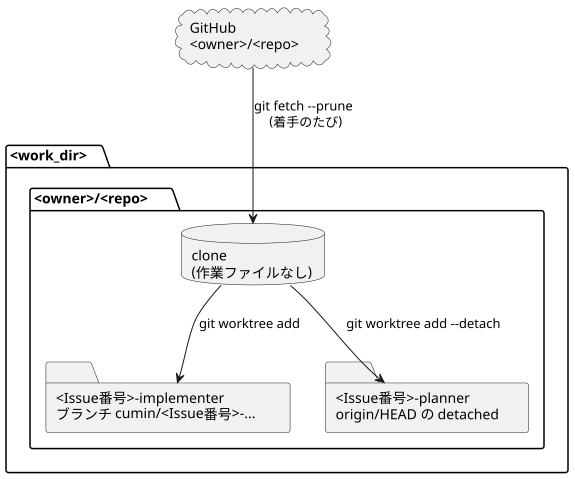
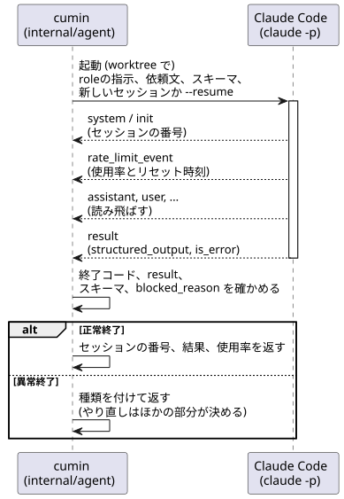

# Agentの実行の設計

- 状態: Approved
- 要件: [cumin本体の要件](../requirements/cumin-core.md) の「Agentの起動」、[Agentに共通の要件](../requirements/agents/common.md) の「指示の渡し方」と「プロセスとセッション」
- 事実の出どころ: [調査・実測で確定した制約](../requirements/evidence/measured-constraints.md) の行の番号 (「実測 N」と書く) か、公式ドキュメントのページの名前 (git、Claude Code) で示す。

Agentを1回起動して結果を受け取るまでの、Host側の設計をまとめる。作業場所の用意と片付け、CLIの起動、出力の読み取り、実行時間の上限が対象である。Agentの実行を必要とする処理 (定期確認と判定の `internal/workflow`、利用枠の `internal/quota`、組み立ての `cmd/cumin`。以下、呼び出し処理と書く) は、この設計で決めた入口を通してだけAgentに触れる。

## 範囲

扱うこと:

- 1回の依頼を、起動から結果までのひとつながりの手順として扱うために決めること。Agentを動かすCLIに固有の事情は `internal/agent` の接続部分に閉じ込め、呼び出し処理からは、起動、セッションの番号、結果、使用率、異常終了だけが見えるようにする。

扱わないこと:

- どの条件でAgentを起動するか。[Issueのラベルと状態遷移](../requirements/workflow/issue-states.md) にある。
- 着手の直前に使用率を読むこと。[cumin本体の設計メモ](cumin-core.md) の「起動前の使用率の確認」にある。
- roleごとの指示の内容。各roleの要件文書と `roles/` にある。

## 設計

### 作業場所

図の元ファイル: [agent-run-layout.puml](agent-run-layout.puml)

- 対象のリポジトリごとに、`<work_dir>/<owner>/<repo>/clone` にcloneを1つ置く。`git clone --no-checkout` で作るので作業ファイルは置かれず、worktreeの親としてだけ使う (公式: git-clone の `--no-checkout`)。一度作ったcloneは使い回し、着手のたびに `git fetch --prune origin` で更新する。fetchでは `origin/HEAD` が動かないため、続けて `git remote set-head origin --auto` を実行し、リモートの既定のブランチを問い合わせる (公式: git-remote)。
- worktreeは、Issueとroleの組ごとに `<work_dir>/<owner>/<repo>/<Issue番号>-<role>` に1つ作る。こうしておけば、並行して進むIssueの作業が混ざらない。
- 書き込みを行うrole (Implementer) のworktreeは、cuminが名前を決めたブランチに置く。`origin/<ブランチ>` が既にあればそこから始め (続きの依頼)、なければ `origin/HEAD` から新しく作る。読むだけのrole (Chief Engineer) のworktreeは、`origin/HEAD` をdetachedで開く。
- worktreeが既にあるときは、fetchもせずにそのまま返す。異常終了後のやり直しは、同じ作業場所で続ける。再利用するのは、gitがworktreeとして認識するディレクトリだけである。用意が途中で止まって残った空のディレクトリは作り直し、ディレクトリだけが消えている場合は `git worktree prune` で登録を消してから作り直す。
- 用意と片付けは、プロセスの中で直列に実行する。同じリポジトリの2つのIssueに同時に着手しても、cloneが2つ作られることはない。
- Issueが閉じたら、`git worktree remove --force` でworktreeを消し、ローカルのブランチも消す。この片付けは、定期確認の処理が行う。
- gitは `os/exec` で呼ぶ。認証の入力待ちで止まらないように `GIT_TERMINAL_PROMPT=0` を付ける (公式: git の環境変数)。gitの出力はエラーの文章にだけ含め、infoのログには出さない。
- 採らなかった案: Issueごとにcloneする。毎回リポジトリ全体を取り直すことになり、遅いうえにディスクも使う。
- 採らなかった案: cloneにmainをチェックアウトしておく。Agentが誤ってそこで作業しかねない。同じブランチを2か所でチェックアウトすることはできないので、worktreeの邪魔にもなる。
- 採らなかった案: bare clone。remote-tracking branchとその設定が作られないため (公式: git-clone の `--bare`)、fetchの設定を自分で足すことになる。

### Claude Codeの起動

図の元ファイル: [agent-run.puml](agent-run.puml)

- 依頼のたびに、worktreeを作業ディレクトリにして `claude -p` を起動する。標準入力はnullデバイスにつなぐ。標準入力が開いたまま何も届かないと、CLIは3秒待ってから先に進むためである (実測。Claude Code 2.1.267)。プロセスは、依頼が終わったら終了する。
- オプション (公式: Run Claude Code programmatically、CLI reference):
  - `--append-system-prompt <roleの指示>`: roleの指示はシステムプロンプトの末尾に足す。Claude Code既定のシステムプロンプト (ツールの使い方、リポジトリの `CLAUDE.md`) はそのまま活かす。
    - roleの指示は、`roles/<role>.md` に、平易な英語の決まり (`templates/writing-rules.md`) を連結したものである。全ての文章に効く決まりなので、指示に入れる。続きの依頼でも同じ指示を渡すので、依頼の種類に依存することは、指示ではなく依頼文に書く。
  - `--add-dir <skillのディレクトリ>`: 1つの行動のためのテンプレート (Pull Requestの説明、レビューの指摘への返答、Ownerに判断を求める文章) は、システムプロンプトではなくskillとして渡す。長い実装のあとにシステムプロンプトの末尾を忘れないように、行動の直前に読ませるためである。`cumin run` が起動時に、`templates/` の文面を本文にしたskill (`cumin-pull-request`、`cumin-review-reply`、`cumin-decision-request`) を、Hostの状態のディレクトリの `skills/.claude/skills/<名前>/SKILL.md` に書く。毎回上書きするので、ファイルはバイナリと一致する。Claude Codeは `--add-dir` のディレクトリの `.claude/skills/` からskillを読み、起動時には名前と説明だけを文脈に入れ、本文は呼ばれたときに読む (公式: Skills)。`--setting-sources project` でも読まれる (公式: Skills、`project` のsetting sourceに依存する)。起動の記録の確認は `skills` を見ないので、変わらない。テンプレートの文面は `templates/` にだけ置く。
  - `-p <依頼文>`: 依頼文はプロンプトの引数で渡す。
  - `--setting-sources project`: ユーザアカウントの設定と `CLAUDE.md` を読ませない (実測 6e、27)。
  - `--permission-mode bypassPermissions`: 全てのツールを許可する。headlessの実行では、許可を求められても答える人がいない。`--dangerously-skip-permissions` と同じ意味である (CLI reference)。
  - `--json-schema <結果のスキーマ>`: 結果を [共通の形式](../requirements/agents/common.md) に従わせる。スキーマの文字列は、コードの側で要件文書と同じに保つ。
  - `--output-format stream-json --verbose`: イベントを1行ずつ読む。`--json-schema` と併用できる (実測 26)。
  - `--model <モデル>`: 設定 `roles.<role>.model` が空でないときだけ付ける。
  - `--resume <セッションの番号>`: 続きの依頼のときだけ付ける (実測 31)。roleの指示と依頼文は、続きの依頼でも改めて渡す。
- 採らなかった案: `--bare`。サブスクリプションのログインが使えない (実測 6a)。
- 採らなかった案: `--allowedTools` でツールを列挙する。roleごとの制限は、GitHub Appの権限とrulesetで行う (cumin本体の要件)。
- 採らなかった案: roleの指示を依頼文に含める。続きの依頼で指示を二重に渡すことになるうえ、システムプロンプトとしても扱われない。
- 実行ファイルは設定 `roles.<role>.cli_path` で決める。受け入れテストでは、決まった出力を返すシェルスクリプトを指定する。

### 出力の読み取り

- 標準出力の1行を1つのJSONとして読み、`type` で見分ける。読むのは次の3種類だけで、ほかは読み飛ばす。
  - `system` の `init`: セッションの番号 (`session_id`) と、起動の記録の確認に使う項目 (「起動の記録の確認」)。
  - `rate_limit_event`: `rate_limit_info.unifiedWindows` の `five_hour` と `seven_day` にある `utilization` (0から1) と `resetsAt` (Unix秒) (実測 1)。1回の実行で何度も出るので、最後のものを使用率とする。
  - `result`: `session_id`、`subtype`、`is_error`、`structured_output` (実測 26)。
- 正常終了とみなすのは、終了コードが0で、`result` があり、`is_error` が偽で、`structured_output` がスキーマに合い、`blocked` なら理由が空でない場合である。呼び出し処理には、セッションの番号、結果、使用率を返す。
- `rate_limit_event` がなくても異常終了にはせず、使用率を「読めなかった」として返す。着手前の使用率の確認は、別の話題 (cumin本体の設計メモ) が受け持つ。
- 異常終了は、種類を付けて返す。種類は、プロセスの失敗 (起動できない、終了コードが0でない)、`result` がない、`is_error` が真、結果がスキーマに合わない、実行時間の上限、である。やり直すかどうかは、呼び出し処理がこの種類を見て決める。
- 使用率の数値はdebugのログにだけ出す。infoのログに出すのは、セッションの番号、結果、異常終了の種類である。標準エラー出力はdebugのログに出す。
- `rate_limit_event` の形は公式ドキュメントに載っていない (実測 2)。形が変われば、使用率は「読めなかった」になる。2026-09-20 の最小の実機実行で、3つのイベントの項目名と、`result` の `subtype: "success"` を確かめた。

### Agentの環境

- CLIプロセスの環境変数は、cuminの環境を引き継がず、決まった一覧から組み立てる。Hostから引き継ぐのは `PATH`、`HOME`、`TMPDIR`、`LANG`、`LC_ALL`、`LC_CTYPE`、`SHELL`、`USER`、`LOGNAME` だけである。Hostのユーザが持つ `SSH_AUTH_SOCK`、`GH_TOKEN`、`GITHUB_TOKEN`、`ANTHROPIC_API_KEY` は一覧にないので、Agentには届かない。`HOME` を残すのは、Claude Codeがサブスクリプションのログインとセッションの記録を `~/.claude` の下に探しに行くからである。
- 自動メモリは、環境変数 `CLAUDE_CODE_DISABLE_AUTO_MEMORY=1` で切る。`--setting-sources project` だけでは止まらない (実測 28、公式: Environment variables)。
- claude.aiアカウントのコネクタ (アカウントに結び付いたMCPサーバ) は、環境変数 `ENABLE_CLAUDEAI_MCP_SERVERS=false` で切る。ログインしているユーザには既定で読み込まれ、`--setting-sources project` では止まらない (公式: Environment variables)。2026-09-22 のsandboxでの実機実行で、このコネクタが `init` の `mcp_servers` に現れ、起動の記録の確認が実行を止めた。
- gitには、Hostのユーザとシステムの設定ファイルを読ませない。`GIT_CONFIG_GLOBAL=/dev/null` と `GIT_CONFIG_NOSYSTEM=1` を付けると、credential helperとOwnerの作者設定が見えなくなる (公式: git の環境変数)。`GIT_TERMINAL_PROMPT=0` でパスワードの入力待ちを防ぎ、`GIT_SSH_COMMAND=false` でSSH接続を必ず失敗させる。worktreeのremoteはHTTPSなので、Hostの鍵を使う経路はない。
- roleのtokenは、`GIT_CONFIG_COUNT=1`、`GIT_CONFIG_KEY_0=http.https://github.com/.extraheader`、`GIT_CONFIG_VALUE_0=Authorization: Basic <x-access-token:token のbase64>` の3つで渡す (公式: git-config の環境変数)。ファイルにも引数にも書かない。
- コミットの作者は、roleのAppのbotユーザにする。`GIT_AUTHOR_NAME` と `GIT_COMMITTER_NAME` は `<slug>[bot]`、`GIT_AUTHOR_EMAIL` と `GIT_COMMITTER_EMAIL` は `<botのuser id>+<slug>[bot]@users.noreply.github.com` とする。この形にすると、GitHubがコミットをbotユーザに結び付ける (実測 49)。作者を渡さない場合、gitはHostのユーザ名とホスト名から作者を推測してコミットしてしまう (2026-09-21に実機で確認。Apple Git 2.50.1)。
- ghには `GH_TOKEN` でroleのtokenを渡す。ghは、保存済みのログインより `GH_TOKEN` を優先する。`GH_CONFIG_DIR` には、依頼のたびに作る空のディレクトリを指定し、Hostのユーザの設定を読ませない。ディレクトリが空なら、ghは既定の設定 (`git_protocol` は `https`) で動く (2026-09-21に実機で確認。gh 2.101.0)。`GH_PROMPT_DISABLED=1` と `GH_NO_UPDATE_NOTIFIER=1` で、入力待ちと更新の通知も止める (公式: gh help environment)。このディレクトリは依頼が終わったら消す。
- この環境が防ぐのは、うっかり使ってしまうことだけである。Agentのプロセスには `HOME` があるので、意図して `~/.ssh` や `~/.claude` のファイルを読みに行くAgentは止められない。roleごとの制限は、GitHub Appの権限とrulesetで行う。
- 採らなかった案: `CLAUDE_CODE_SUBPROCESS_ENV_SCRUB`。Bashツールの環境から認証情報を取り除く機能だが、Agentはまさにそこでroleのtokenを使う。
- 採らなかった案: cuminの環境を引き継ぎ、危ない変数だけを外す。外し忘れた変数がそのままAgentに届いてしまう。
- 採らなかった案: Agent用に別のOSユーザを用意する。要求のbacklogにある。

### 起動の記録の確認

- 実行の最初に出る `init` のイベントで、Agentが作業場所の外の文脈を読み込んでいないことを確かめる。見るのは、`plugins` と `mcp_servers` (項目がない、または空でなければ異常)、`memory_paths` (項目があり、作業場所の外のパスを指すか、パスとして読み取れない形なら異常) である。項目がない場合まで異常にするのは、Claude Codeが項目の名前を変えたときに、確かめないまま通してしまわないためである。`--setting-sources project` を付けると `plugins` と `mcp_servers` は空になり (実測 27)、自動メモリを切ると `memory_paths` は項目ごと現れない (実測 28。2026-09-21 の最小の実機実行でも同じだった)。
- 異常に当たったら、実行時間の上限と同じ手順 (プロセスグループにSIGTERM、猶予のあとSIGKILL) でその場で止める。追えない指示のもとでAgentに作業を始めさせないためである。異常終了の種類は「user-level context」とし、理由には項目の名前だけを書いて、パスは書かない。
- `result` のイベントが来るまでに `init` のイベントがなければ、同じ種類の異常終了にする。起動の記録がないと、Agentが何を読んだのか分からない。
- 確かめられないこと: `init` のイベントには、読み込んだ指示ファイル (`CLAUDE.md`) の一覧がない (2026-09-21 の実機実行で確かめた項目名は `agents`、`mcp_servers`、`plugins`、`skills`、`slash_commands`、`tools` など)。作業場所の外の指示については、`--setting-sources project` に頼る (実測 6e)。`skills` は、組み込みのものとリポジトリのものを名前では区別できないので、確かめない。
- 使用率を読む最小の実行では、この確認を行わない。作業ディレクトリが空で、結果も使わないからである。
- 実機で確かめたこと (2026-09-22、Claude Code 2.1.267): sandboxのworktreeで本物のClaude Codeを起動したところ、claude.aiアカウントのコネクタが `mcp_servers` に載り、この確認が起動の直後に実行を止めた。コネクタを環境変数で切ったあとの実行は、「Agentの環境」を参照。
- 採らなかった案: 異常を見つけても実行を最後まで待ち、それから異常終了にする。利用枠を無駄にするうえ、追えない指示のもとでの作業がGitHubに残りかねない。

### 実行時間の上限

- 依頼ごとの上限は、設定 `roles.<role>.time_limit` の値である。上限を過ぎたら打ち切り、異常終了 (種類は「実行時間の上限」) として返す。呼び出し処理が依頼を取り消したときも、同じ種類にする。
- 打ち切りは2段階で行う。まずCLIのプロセスグループにSIGTERMを送る。SIGTERMを受けたCLIは終了コード143で終わり、実行中のBashコマンドのプロセスツリーも止める (公式: Run Claude Code programmatically の "Stop a run with SIGTERM"、実測 32)。猶予 (10秒) のうちに終わらなければ、プロセスグループにSIGKILLを送る。
- CLIは自分のプロセスグループで起動する (`Setpgid`)。Agentが起動したコマンドも同じグループに入るので、シグナルがそこまで届く。
- 実装にはGoの `os/exec` の `Cmd.Cancel` と `Cmd.WaitDelay` を使う。`Cancel` がSIGTERMを送り、`WaitDelay` (猶予と同じ値) を過ぎると `os/exec` がCLIを止めてパイプを閉じる。その後、cuminがグループにSIGKILLを送り、残ったものを消す。
- 標準出力は、行が届くたびに読む (`Cmd.Stdout` に書き込み先を渡す)。プロセスが終わった時点でパイプに残っていた行も、`os/exec` が読み切ってから `Wait` が返る。
- 実機で確かめたこと (2026-09-20、Claude Code 2.1.267): Bashで `sleep 600` を実行中のCLIに上限でSIGTERMを送ると、CLIは猶予を待たずに終わり、プロセスグループには何も残らなかった。手順は [Agentの実機の確認](../development/agent-live-check.md) にある。
- 採らなかった案: `--max-turns`。手元のCLIのヘルプに載っていないうえ、ターンの数は時間の上限にならない (実測 32)。
- 採らなかった案: SIGKILLだけを送る。CLIがセッションを記録し、Bashのプロセスツリーを止める機会がなくなる。

### 1回の依頼の手順

- 呼び出し処理は、1回の依頼を `internal/agent` の1つの入口 (起動) に渡すだけでよい。入口は次の順に進める。
  1. 使用率を読む (最小の実行。[cumin本体の設計メモ](cumin-core.md) の「起動前の使用率の確認」)。読めなければ、理由を付けたエラーを返してここで止める。この時点ではtokenをまだ発行していない。
  2. roleのAppのinstallation tokenを、対象のリポジトリ1つに絞って発行する。tokenは依頼のたびに新しく発行し、使い回さない。実行は最長55分続くのに対し、tokenは発行から1時間で失効するからである (cumin-coreのtokenの使い回しとは別の話である)。
  3. botの身元を読む。`GET /app` でAppのslugを、`GET /users/<slug>[bot]` でbotユーザのidを読み、作者の名前とメールアドレスを組み立てる (「Agentの環境」)。読むのはroleごとに1回だけで、以後はメモリに持つ。変わらない値なので、失っても読み直せばよい。
  4. worktreeでCLIを起動する (「Claude Codeの起動」)。tokenと身元は実行の環境変数にだけ入れ、ログにも戻り値にも手元の状態にも入れない。
- しきい値の判定 (Q1) は、1と2の間に入る。利用枠の要求Issueが足す。
- roleごとの設定 (CLI、実行ファイル、モデル、時間の上限) と、リポジトリの持ち主とroleの組ごとのAppの認証情報 (設定 `github_apps.<organization>.<role>`) は、起動時に入口へ渡す。設定を読むのは `cmd/cumin` の役目である。身元も、持ち主とroleの組ごとに持つ。
- CLIが無視できないグローバルな指示ファイルへの備え: 入口は、roleのCLIごとに「そのCLIが読んでしまうユーザアカウントの指示ファイル」の一覧を持ち、実際にあるものを警告として返す。`cumin run` が起動時にこれをログに出す。Claude Codeでは一覧は空である (`--setting-sources project` と自動メモリの環境変数で、全て無視できる。実測 6e、28)。別のCLIを足すときに、そのCLIの一覧を書く。
- 採らなかった案: tokenの発行を、定期確認で使うtokenの使い回しに乗せる。使い回したtokenは、実行の途中で失効しかねない。
- 採らなかった案: 身元を設定ファイルに書く。slugとidはGitHubが決める値なので、書き写すと食い違いが生じる。

## まだ決めていないこと

| 決める、または確かめること | どこで |
|---|---|
| Reviewerの作業場所。Pull Requestのブランチを、同じIssueのImplementerのworktreeと同時に開けるか | Reviewerへの依頼を作る要求Issue |

## 後回しにしたこと

- privateリポジトリのcloneとfetchに使う認証情報。v0.1では、認証なしのHTTPSでcloneする。きっかけ: 対象にprivateリポジトリが加わったとき。
