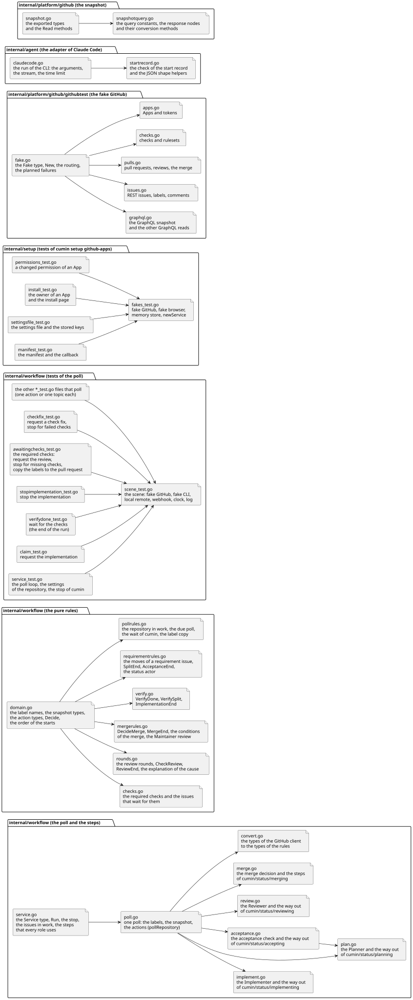

# コードの構成の設計

- 状態: Approved
- 要件: `CLAUDE.md` の「Code」の節 (層の分け方と、共有するコードの置き場所)
- 事実の出どころ: コードそのもの。ファイルを足すか、役目を変えるPull Requestで、この文書を直す。

パッケージとファイルの受け持ちを一覧にする。レビューのときに、変えられたファイルがどこまでを受け持つかを、コードを追わずに分かるようにするためである。機能ごとの設計は、[cumin本体の設計メモ](cumin-core.md)、[定期確認の設計](poll.md)、[Agentの実行の設計](agent-run.md) にある。

## 範囲

扱うこと:

- パッケージとファイルの受け持ちと、依存の向き。

扱わないこと:

- 機能の設計。各設計メモにある。
- 設定のキー。[設定の一覧](../development/configuration.md) にある。

## 設計

### 依存の向き

- `cmd/cumin` が全てを組み立てる。`internal/workflow` は `internal/agent`、`internal/quota`、`internal/notify`、`internal/platform/github`、`internal/core/config`、`internal/core/state` を使う。`internal/agent` は `roles`、`disciplines`、`templates`、`internal/platform/github`、`internal/core/config` を使う。`internal/platform/*` は `internal/core/*` を使ってよく、逆はない。`internal/quota` は `internal/core/config` と `internal/core/state` だけを使う。`internal/core/config` は、riskの基準の初期値のために `disciplines` を使う。`disciplines` と `templates` は標準ライブラリだけを使い、`roles` は `internal/core/config` をroleの名前のために使う。
- Agentが受け取る文章を持つ3つのパッケージ (`roles`、`disciplines`、`templates`) は、どれも自分のMarkdownを読むだけで、互いを知らない。指示に組み立てるのは `internal/agent/instruction.go` だけである。どの部分がどこから来るかを1か所に集めておくと、外から差し替えられる段が増えても、変わるのはそこだけになる。
- `internal/notify` は標準ライブラリだけを使う。通知の手段は、文章を受け取る `Sender` として外から差す。`internal/platform/discord` はその実装で、`internal/notify` をimportしない。`cmd/cumin` が2つをつなぐ ([cumin本体の設計メモ](cumin-core.md) の「通知」)。
- 純粋なファイル (`domain.go`、`action.go`、`request.go`、下の表が「純粋」と書くファイル) は標準ライブラリだけを読む。HTTPのクライアント、`os/exec`、GitHubの型を持ち込まない。判定の表形式のテストが、I/Oなしで書けるようにするためである。
- GitHubの型 (RESTの本文、GraphQLの応答) は `internal/platform/github` で止める。他のパッケージには、cuminの型 (`RepositorySnapshot`、`Label`、`User` など) だけを渡す。

### パッケージとファイル

| パッケージ | ファイル | 受け持ち |
|---|---|---|
| `cmd/cumin` | `main.go` | サブコマンドの一覧と振り分け。終了コード |
| | `run.go` | `cumin run`。設定と4つのAppの鍵を読み、skillを書き、Hostの状態ファイルを開き、`agent.Service` と `workflow.Service` を組み立てて動かす。モニターファイルのパス (状態のディレクトリの `monitor.json`) を渡す |
| | `setup.go` | `cumin setup github-apps` と `cumin setup launchd` の引数と起動 |
| | `status.go` | `cumin status` (GitHubのラベル、最新の使用率、今の上限、止める予約の表示) と `cumin --version` (Goのビルド情報)。表示の中身は `writeStatus` にまとめ、Keychainなしでテストする |
| | `quota.go` | `cumin quota allow` (「resume agent starts」)。状態ファイルの最新の5h枠のリセット時刻を、許可のファイルに書く |
| | `stop.go` | `cumin stop --after-current-runs`。止める予約のファイルを書く |
| | `live_e2e_test.go` | 実機の場面 E2E-1。launchd で動く cumin を外から確かめるので、組み立てたバイナリの隣に置く。Maintainer の操作は `gh` で行う |
| `internal/core/config` | `config.go` | Hostの設定ファイル (TOML) の読み込み、初期値、制限、既定のパス |
| | `repository.go` | 対象のリポジトリの `.cumin/config.toml` を、Hostの設定に重ねる |
| | `riskcriteria.go` | riskの基準の文章を、リポジトリ、Host、初期値の順で決める。初期値は `disciplines` から読む |
| | `githubapps.go` | `github_apps` の表の読み書き (`cumin setup` が書く) |
| | `quota.go` | 利用枠の設定 (5h枠のしきい値と時間帯、weekly枠の目標と前倒し) の読み込み |
| `internal/core/state` | `state.go` | Hostの状態ファイル (`state.json`)。Issueごとのセッションの番号とcheckの修正の回数、受け入れの確認を依頼し直した回数、分割を依頼し直した回数、実装を依頼し直した回数と依頼が衝突の解消かどうか、レビューを依頼し直した回数と原因の整理を依頼した回数と依頼した先頭のコミット、最新の使用率 (「resume agent starts」)。書くのは `cumin run` だけ |
| | `allowance.go` | 許可のファイル (`quota-allowance.json`)。書くのは `cumin quota allow` だけで、`cumin run` は読むだけ (「resume agent starts」) |
| | `stoprequest.go` | 止める予約のファイル (`stop-request.json`)。`cumin stop --after-current-runs` が書き、`cumin run` が読んで消す |
| | `monitorfile.go` | モニターファイル (`monitor.json`) の形と書き込み。書くのは `cumin run` だけで、cuminのコードは読まない ([モニターファイルとメニューバーのアプリの設計](status-menu-bar.md)) |
| `internal/core/testenv` | `testenv.go` | テストだけが使う。マシンに足りないもの (`gh`、rootでないユーザー、ディレクトリのmode) があるテストを、手元ではskipし、CI (環境変数 `CI` が `true`) では失敗させる `SkipOrFail` ([cumin本体の設計メモ](cumin-core.md) の「テストの2層」)。標準ライブラリだけを使う |
| `internal/platform/github` | `appauth.go` | `AppClient`。JWTの署名、installation tokenの発行、要求の共通部分 |
| | `retry.go` | 一時的な失敗 (ネットワークの誤り、5xxの応答) をした読み取りのやり直し。`TemporaryError` と `IsTemporary` |
| | `ratelimit.go` | 一次のレート制限の使い切りと二次のレート制限の見分けと、リセットの時刻 (二次は待ちの終わりの時刻) まで同じinstallationの呼び出しを送らないこと。`RateLimitError` |
| | `tokensource.go` | cumin-coreのtokenの使い回し (期限の5分前まで) と、そのbotのlogin |
| | `roles.go` | AppごとのGitHubの権限の表 |
| | `installations.go` | Appの情報とインストールの確認 (`GET /app` など) |
| | `manifest.go` | GitHub App Manifest flowの応答 |
| | `users.go` | botのユーザの読み取り (`GET /users/{login}`) |
| | `labels.go` | ラベルの一覧、作成、Issueのラベルの付け替え |
| | `comments.go` | Issueへのコメントの投稿 |
| | `issuecomments.go` | IssueかPull Requestの最新のコメントの読み取り (受け入れの確認のコメント、原因の説明のコメントを探す) |
| | `labeltimes.go` | 要求Issueとsub-issueに、ラベルが付いた時刻の読み取り (「mark the requirement as in work」: sub-issueに `cumin/status/ready` が付いたか) |
| | `labelactor.go` | Issueにラベルを付けたアカウントの読み取り。答えるイベントの決まりは `labeltimes.go` の `puttingLabelEvents` にある。Issueにイベントがなければsub-issueから読む (「request the split」と「request the implementation」のMaintainerのreadyの確認、起動の依頼の事実: Issue Ownerのログイン名) |
| | `closer.go` | Issueに結び付いたPull Requestの一覧と、1つのPull Requestの説明とレビューのスレッドの読み取り (「write the follow-up note」) |
| | `snapshot.go` | 定期確認の読み取り (`Read...`) と、その結果の型。既定のブランチの `.cumin/` のファイルも読む。実行終了のあとに1つのIssueだけを読む読み取りも持つ |
| | `snapshotquery.go` | `snapshot.go` が送るGraphQLの問い合わせの文と、応答のノードの型。ノードを結果の型に変える。1つのIssueだけを読む問い合わせも、同じ項目で持つ |
| | `checks.go` | 必須のcheckの一覧の読み取り (`rules/branches`) |
| | `closinglink.go` | ブランチの開いているPull Requestの一覧と、閉じるリンクの追加 (「wait for the checks」) |
| | `permission.go` | アカウントのリポジトリでの権限と種類の読み取り (「start the merge」のMaintainerの判定、起動の依頼のIssue Ownerのログイン名) |
| | `merge.go` | Pull Requestのmerge (衝突、先頭のコミットの移動、既定のブランチの変更の見分け)、mergeが済んだかの読み取り、Issueの開閉の読み取りと、完了として閉じること (「start the merge」) |
| | `reviewrequest.go` | Pull RequestへのIssue Ownerのレビューの依頼 (「ask for the merge decision」。`POST .../pulls/{n}/requested_reviewers`) |
| | `failedcheck.go` | 失敗したcheckの内容の読み取り (check runのannotationと、jobのログの終わり) |
| | `githubtest/fake.go` | 受け入れテストの偽GitHub。テストが使うendpointだけを持つ。このファイルは、`Fake` の型、`New`、リポジトリとそのファイル、要求の振り分け、決めた失敗を持つ。要求を、決めた回数だけ失敗させられる (status、接続の切断、応答なし、一次のレート制限の使い切り、書き込みを処理してから答えを落とす)。`internal/workflow` と `internal/agent` の受け入れテストが使う |
| | `githubtest/graphql.go` | 偽GitHubのGraphQL。定期確認のsnapshotと、他の読み取り (1つのIssue、sub-issueのページ、Pull Requestの追記、Issueのコメント、ラベルの時刻)、閉じるリンクの追加 |
| | `githubtest/issues.go` | 偽GitHubのRESTのIssue、ラベル、コメント。その型と、テストが状態を置く関数、読む関数 |
| | `githubtest/pulls.go` | 偽GitHubのPull Request、レビュー、レビューの依頼、merge。その型と、テストが状態を置く関数、読む関数 |
| | `githubtest/checks.go` | 偽GitHubのcheck run、annotation、jobのログ、ブランチのruleset |
| | `githubtest/apps.go` | 偽GitHubのApp、installation、installation token、ユーザー、リポジトリでの権限 |
| `internal/platform/discord` | `webhook.go` | Discordのwebhookの実行。アドレス、JSONの本文、応答、メッセージの上限 |
| `internal/platform/keychain` | `keychain.go` | macOSの `security` コマンドで秘密の値を読み書きする |
| | `items.go` | cuminが使うKeychainの項目の名前 (Appの秘密鍵、Discordのwebhookのアドレス) |
| `internal/notify` | `domain.go` | 純粋。通知の内容と、その文章 |
| | `notify.go` | 通知を送る入口 `Notifier` と、手段を表す `Sender` |
| `internal/workflow` | `domain.go` | 純粋。ラベルの名前、スナップショットの型、動作の型、定期確認の判定 (`Decide`)、着手の順番 (優先度のラベル、Issueの番号) と着手の候補 (「request the implementation」)、Agentの起動の前の1つの確認 (`PermitStart`) |
| | `checks.go` | 純粋。必須のcheckの判定 (`ChecksOf`、`FailedChecks`、`UnreportedChecks`) と、checkを待つIssueの判定 (「request the review」、「request a check fix」、「stop for missing checks」)、checkまたはMaintainerの判断を待つ間の衝突の判定 (「request a conflict resolution」) |
| | `rounds.go` | 純粋。レビューのラウンドの数え方、Reviewerの実行のあとの結果 (`CheckReview`)、`cumin/status/reviewing` の出口の判定 (`ReviewEnd`)、原因の説明の読み取り |
| | `mergerules.go` | 純粋。承認のあとの判定 (`DecideMerge`。「start the merge」、「ask for the merge decision」)、`cumin/status/merging` の中の手順の判定 (`MergeEnd`)、mergeの条件 (`MergeConditionsHold`)、Maintainerの承認の判定 (「start the merge」)、Maintainerの差し戻しの判定 (「send back for changes」) |
| | `verify.go` | 純粋。Agentが `done` を返したあとの確認。Pull Requestの確認 (`VerifyDone`)、分割の確認 (`VerifySplit`)、`cumin/status/implementing` の出口の判定 (`ImplementationEnd`。「wait for the checks」、「stop the implementation」) |
| | `requirementrules.go` | 純粋。要求Issueの判定。要求Issueのラベルの付け替え (「mark the requirement as in work」、「ask about the remaining sub-issues」)、分割の候補 (「request the split」) と受け入れの確認の候補 (「request the acceptance check」)、`cumin/status/planning` の出口 (`SplitEnd`) と `cumin/status/accepting` の出口 (`AcceptanceEnd`) の判定、ステータスのラベルを付けたアカウントの判定 |
| | `pollrules.go` | 純粋。リポジトリ全体についての定期確認の判定。リポジトリが作業中か、定期確認の番か (`PollIsDue`)、cuminがMaintainerなしで次に進めるIssueがあるか (「tell that cumin waits」)、片付けるIssue、ラベルのPull Requestへのコピー (「copy the labels to the pull request」) |
| | `action.go` | 純粋。cuminの動作の名前の一覧。`issue-states.md` の表の「名前」の列の遷移1つにつき、定数が1つある。ログ、通知、停止のノートが、動作をこの名前で指す |
| | `request.go` | 純粋。ブランチの名前と、Agentへの依頼文 |
| | `labels.go` | cuminが対象のリポジトリに作るラベルの一覧。初期値の優先度のラベルは、設定が名前を決めていないリポジトリにだけ作る |
| | `service.go` | `Service` の型、定期確認のループ (`Run`)、cuminの停止、Agentが実行中のIssueの集まり。どの役割も使う手順も持つ: ラベルの付け替え (`moveIssue`)、Agentの起動の許可を取る関数、Agentを起動するただ1つの関数 (`startAgent`)、役割の起動の依頼を組み立てる関数 (`startRequest`)、1つの依頼を実行してその終わりを返す関数 (`runRequest`)。どの役割の依頼も、この2つを通る。実行のセッションをHostの状態に残す。止める合図を受けたら、実行中の依頼を取り消して終わる (I/O) |
| | `poll.go` | 1回の定期確認。足りないラベルを作り、リポジトリを読む番かを決め、スナップショットと必須のcheckを読み、判定を適用する (`pollRepository`)。リポジトリごとの最後の定期確認の記録も持つ (I/O) |
| | `implement.go` | Implementerの依頼と、`cumin/status/implementing` の出口。着手 (「request the implementation」)、checkの修正の依頼 (「request a check fix」)、必須のcheckが待ち時間を過ぎても結果を返さないIssueをMaintainerに戻すこと (「stop for missing checks」)、ラベルのPull Requestへのコピー、Implementerの実行、実行終了の事実の読み取りと適用 (「wait for the checks」、「stop the implementation」、「request the implementation again」) |
| | `convert.go` | `internal/platform/github` の型から、純粋な判定の型への変換 (`to...` の関数) |
| | `stopafterruns.go` | 実行を待ってから止める。止める予約を読み、起動時と終わるときに消す |
| | `monitorfile.go` | モニターファイルの中身を、定期確認が既に持っている事実 (最後の定期確認の時刻とエラー、止める予約、利用枠の状態、実行中のAgentの実行、Maintainerの対応を待つIssue) から作る純粋関数と、スナップショットから待つIssueを選ぶ純粋関数と、定期確認の1回りの終わりとAgentの実行の終わりの書き込み。書き込みの失敗は警告のログだけにする |
| | `plan.go` | Plannerの依頼と実行の終わり。分割の開始 (「request the split」)、`cumin/status/planning` の出口 (「ask for the plan review」、「request the acceptance check」、依頼し直し、「stop the split」)。分割と受け入れの確認が共に使うもの (Plannerの依頼、Plannerの実行、実行の終わりの要求Issueの読み取り) も持つ |
| | `acceptance.go` | 受け入れの確認。その依頼 (「request the acceptance check」)、確認の実行、`cumin/status/accepting` の出口 (「ask for the acceptance」、依頼し直し、Maintainerに戻すこと)、受け入れの確認のコメントの読み取り |
| | `requirement.go` | 要求Issueのラベルの付け替え。sub-issueの着手で `cumin/status/implementing` に移す (「mark the requirement as in work」)、残りのsub-issueの確認を求める (「ask about the remaining sub-issues」)。「mark the requirement as in work」と、checkを待つsub-issueと、Maintainerのレビューへの対応 (「send back for changes」) のための、ラベルの時刻の読み取り。「request the split」と「request the implementation」のための、Maintainerのreadyの確認と、Maintainerでないreadyのログと通知。状態から決める要求Issueのための、状態ラベルを付けたアカウントの確認と、数えないラベルのログと通知 |
| | `review.go` | Reviewerの依頼と、`cumin/status/reviewing` の出口。レビューの開始 (「request the review」)、出口の事実の読み取りと適用 (定期確認と実行の終わりが共に使う)、指摘の修正の依頼 (「request a review fix」)、レビューの依頼し直し、原因の説明の依頼 (「request the cause」)、`blocked` (「stop the review」) |
| | `stop.go` | Maintainerに戻す1か所の手順 (コメント、ラベル、通知。`blocked` のあとは、ラベル、コメント、通知) と、通知の送り出し |
| | `stopnote.go` | 純粋。停止のノートの文章 (`templates/stop-note.md` の形) と、Maintainerに戻す動作ごとの理由の文章。`stop.go` がこの文章を書き込む |
| | `merge.go` | Maintainerにmergeの判断を求めること (「ask for the merge decision」。ラベル、Issue Ownerのレビューの依頼、通知)、Maintainerの承認のあとのmergeの開始 (「start the merge」)、`cumin/status/merging` の中の手順 (mergeを送る、閉じる、checkに戻る、衝突の解消の依頼、Maintainerに戻す)、Maintainerのレビューへの対応の依頼 (「send back for changes」)、checkまたはMaintainerの判断を待つ間の衝突の解消の依頼 (「request a conflict resolution」) |
| | `cleanup.go` | 閉じたsub-issueの片付け (worktree、ローカルのブランチ、状態ファイルの項目) |
| | `followup.go` | 純粋。フォローアップノートを読むsub-issue、拾うもの、ノートの文章と目印 (「write the follow-up note」) |
| | `followupnote.go` | フォローアップノートの読み取りと書き込み (「write the follow-up note」) |
| | `pollfailure.go` | 定期確認が続けて失敗した回数を数え、3回目に1回だけ知らせる |
| | `unreadissue.go` | 全部を読めないIssueを、Issueと上限の組ごとに1回だけ知らせる |
| | `waiting.go` | Maintainerが動かなければ何も進まないときの1回だけの通知 (「tell that cumin waits」)。動作も実行中のAgentもなく、Agentの起動が利用枠だけで待っているIssueも、cuminがMaintainerなしで次に進めるIssueもないとき。利用枠だけで待っている起動の記録 |
| | `quota.go` | Agentの起動の前の使用率の確認と、実行の終わりの確認 (「stop agent starts」)。枠ごとに1回だけ知らせる。使用率を状態ファイルに残し、読んだばかりの使用率があれば最小の実行をせずに判定する。止めている間は次に試す時刻まで読まない (「resume agent starts」) |
| | `quotanote.go` | 純粋。「stop agent starts」の通知の理由の文章。標準ライブラリのほかに、`internal/quota` の枠の名前の型だけを使う |
| | `settings.go` | リポジトリごとの設定。Hostの設定に `.cumin/config.toml` を重ね、riskの基準と、保護されたパスの一覧を決める。blobのoidが変わるまで結果を持つ |
| `internal/quota` | `domain.go` | 純粋。weekly枠のペースの上限、5h枠の時間帯のしきい値、枠ごとに着手を止めるかの判定、次に試す時刻 (「resume agent starts」)、残した使用率が読んだばかりかどうか |
| | `stored.go` | 純粋。判定に使う使用率と、状態ファイルに残す使用率の間の変換。`internal/workflow` と `cmd/cumin` が使う |
| `internal/agent` | `domain.go` | cuminの他の部分から見える型: 依頼、結果とそのスキーマ、使用率、実行、異常終了 |
| | `instruction.go` | roleの指示の合成 (roleのファイル、disciplineのファイル、平易な英語の決まり、riskの基準の順) |
| | `facts.go` | 純粋。依頼文の先頭に置く、実行の事実のかたまり (扱うIssueの番号と種類、Issue Ownerのログイン名、保護されたパスと照合の決まり、実行時間の上限、実行が終わる時刻。Plannerには、ImplementerとReviewerの時間の上限も) |
| | `skills.go` | テンプレートを、roleごとのディレクトリにskillとして書き出す |
| | `service.go` | 1回の依頼の入口 `Start` (指示の合成、token、身元、実行)、使用率の読み取りの入口 `ReadQuota`、Hostの警告 |
| | `claudecode.go` | Claude Codeの接続部分。引数、出力の読み取り、時間の上限 |
| | `startrecord.go` | 起動の記録の確認 (作業ディレクトリの外のコンテキスト、cuminのskill) と、JSONの形を値なしで表す補助の関数 |
| | `env.go` | CLIのプロセスの環境変数と、roleのtokenと作者の渡し方 |
| | `quota.go` | 使用率を読む最小の実行 |
| | `worktree.go` | `Workspace`。cloneとworktreeの用意と片付け (閉じたIssueのものも)、先頭のコミットの読み取り |
| `internal/setup` | `domain.go`、`page.go`、`service.go` | `cumin setup github-apps`。Manifest flowの手元のページと、登録の手順 |
| | `permissions.go` | 登録済みのAppの権限の変更の案内。権限の表とAppの権限を比べ、Appの権限の画面とインストールの画面を開き、変わるまで待つ |
| | `notify.go` | `cumin setup notify`。通知のアドレスの確認とKeychainへの保存 |
| | `launchd.go` | `cumin setup launchd`。LaunchAgentのplistの組み立て、書き出しと削除、`launchctl` のコマンドの表示 |
| `roles` | `roles.go` | roleのファイルの読み出し。自分のMarkdownだけを読む |
| | `<role>.md` | roleごとの指示の本文。cuminとAgentの約束 |
| `disciplines` | `embed.go` | disciplineのファイルの読み出し (roleのファイル、riskの基準)。disciplineの名前を引数に取る。既定のdisciplineの名前を書く、コードで唯一の場所 |
| | `software-engineering/<role>.md` | roleごとの、ソフトウェア開発の基準。roleのファイルの次に指示に入る |
| | `software-engineering/risk-criteria.md` | riskの基準の初期値。cuminは読まず、指示にそのまま入れる |
| `templates` | `embed.go`、`*.md` | GitHubに書く文章のテンプレート。平易な英語の決まりは指示に入り、1つの行動のためのテンプレートはskillになる。どちらも `internal/agent` が読む。cuminが自分で書くもの (`follow-up-note.md`、`stop-note.md`) は、Agentには渡らず、テストが文面との一致を確かめる |
| `scripts` | `render-diagrams.sh` | `.puml` をSVGに書き出す |
| | `setup-repo.sh`、`setup-repo/` | 対象のリポジトリの準備 (ラベル、ruleset、保護されたパスのcheck) |
| | `install.sh` | cuminをビルドしてHostに置き、LaunchAgentを新しいバイナリに入れ替える |
| `tools/status-bar` | `Package.swift` | メニューバーのアプリのSwiftのpackage。Goのモジュールとは別で、`swift build` と `swift test` で作って試す ([モニターファイルとメニューバーのアプリの設計](status-menu-bar.md)) |
| | `Sources/CuminStatusBar/MonitorFile.swift` | 純粋。モニターファイルの形と読み取り。知らないフィールドを読み飛ばし、新しすぎる `version` を見分ける |
| | `Sources/CuminStatusBar/MonitorModel.swift` | 純粋。ファイルのバイト列と今の時刻から、メニューバーの区画、メニューの行、状態の行、止まったと表示する理由を決める |
| | `Sources/CuminStatusBar/Config.swift` | アプリの設定 (`status-bar.json`) の形と読み取り。ないキーと、ないファイルは、初期値にする |
| | `Sources/CuminStatusBar/AlertModel.swift` | 純粋。ファイルのバイト列、設定、今の時刻、前に見た項目から、新しい項目、鳴らす音、点滅する区画を決める |
| | `Sources/CuminStatusBar/main.swift` | アプリの入口。AppKitを使う唯一のファイル。5秒ごとにモニターファイルと設定を読み、区画の画像とメニューを作り、音を鳴らし、区画を点滅させ、行のURLをブラウザで開く。ファイルを書かず、ネットワークを使わない |
| | `Tests/CuminStatusBarTests/` | 純粋な型のテスト (XCTest)。Goの受け入れテストのgolden file (`internal/workflow/testdata/monitor-file.json`) も読む |
| | `dev.cloveclove.cumin-status-bar.plist` | アプリをログインのときに起動するLaunchAgentのplistのテンプレート。`__REPO__` をcheckoutのパスに置き換えて使う ([メニューバーのアプリを作って起動する](../guides/status-menu-bar.md)) |
| `.claude-plugin` | `marketplace.json` | このリポジトリを、Claude Codeのpluginのmarketplace (`cumin-works`) にする。pluginの場所を相対パスで持つ ([Maintainerのセッションにskillを入れる](../guides/maintainer-skills.md)) |
| `plugins/cumin-maintainer` | `.claude-plugin/plugin.json` | MaintainerやOperatorのClaude Codeのセッションのためのplugin。cuminのバイナリには入らず、cuminのコードは読まない。1つのOrganizationの事実を持たない |
| | `rules.md` | セッションの決まり。全てのskillが、同じ文面を `## Rules of the session` の節に持つ |
| | `skills/<skill>/SKILL.md` | 1つのskill。front matter、手順、セッションの決まり、実行するコマンドの一覧 (`## Commands`) |
| | `plugin_test.go` | pluginの形のテスト。marketplaceのファイル、全てのskillのfront matterと2つの節、Organizationの事実がないことを確かめる。このパッケージのGoのファイルは、これだけである |

### テストのファイル

テストは、動作か話題ごとに1つのファイルに置く。上の表は、テストのファイルを、置き場所に理由があるものだけ載せる。`internal/workflow` の定期確認のテストと、`internal/setup` の `cumin setup github-apps` のテストは、次の図のように分かれる。図は、偽GitHub (`githubtest`) のファイルも示す。

図の元ファイル: [code-layout-files.puml](code-layout-files.puml)

矢印は「使う」を表す。`scene_test.go` と `fakes_test.go` は、テストを持たず、他のファイルが使う偽物と補助の関数だけを持つ。`internal/workflow` の新しいテストは、その動作のファイルに足す。動作のファイルがなければ、新しいファイルを作る。`service_test.go` には、定期確認のループのテストだけを置く。

偽GitHubは、endpointのグループごとに1つのファイルを持つ。`fake.go` が要求を振り分け、他のファイルが答える。新しいendpointは、そのグループのファイルに足し、`fake.go` の振り分けに1行を足す。

同じ図は、`internal/workflow` の定期確認と手順のファイルも示す。`service.go` のループが `poll.go` の1回の定期確認を呼び、`poll.go` が役割ごとのファイル (`implement.go`、`plan.go`、`acceptance.go`、`review.go`、`merge.go`) の動作を適用し、`convert.go` でGitHubの型を変換する。役割ごとのファイルは、どれも `service.go` の共通の手順を使う。図は、この矢印を省く。

同じ図は、`internal/workflow` の純粋な判定のファイルも示す。`domain.go` の `Decide` が、話題ごとのファイル (`checks.go`、`rounds.go`、`mergerules.go`、`verify.go`、`requirementrules.go`、`pollrules.go`) の判定を集める。どのファイルも、`domain.go` の型を使い、標準ライブラリだけを使う。図は、型を使う矢印を省く。

同じ図は、2つに分けた接続部分のファイルも示す。`claudecode.go` はCLIを実行し、`startrecord.go` の確認を呼ぶ。`snapshot.go` は読み取りを持ち、`snapshotquery.go` の問い合わせの文と応答のノードを使う。

## まだ決めていないこと

なし

## 後回しにしたこと

なし
