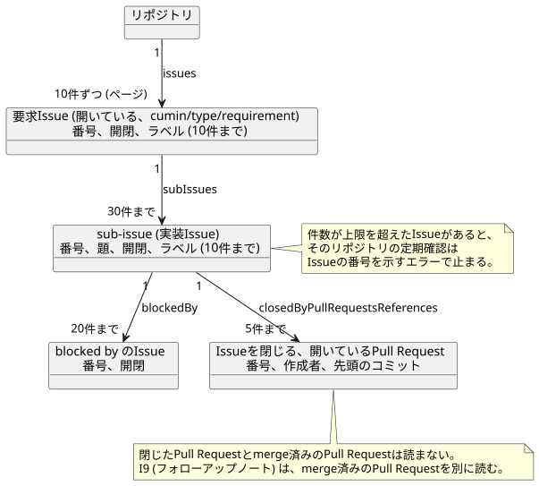
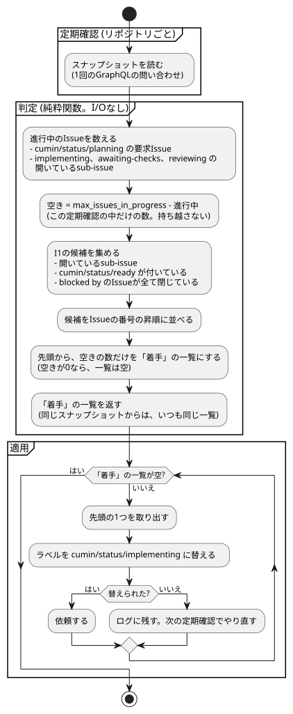

# cumin本体の設計メモ

- 状態: Approved
- 要件: [cumin本体の要件](../requirements/cumin-core.md)、[Issueのラベルと状態遷移](../requirements/workflow/issue-states.md)
- 事実の出どころ: [調査・実測で確定した制約](../requirements/evidence/measured-constraints.md) の行の番号 (「実測 N」と書く) か、公式ドキュメントのページの名前で示す。

上の2つの要件を実装するときに、複数の要求Issueが共有する設計上の決定を書く。

## 範囲

扱うこと:

- 複数の要求Issueが共有する設計上の決定。

扱わないこと:

- 何をするか。要件文書にあり、ここでは繰り返さない。
- 設定のキー。この文書では決めない。[設定の一覧](../development/configuration.md) にある。

## 設計

### Hostに置くファイル

| ファイル | 場所 | 書く人 |
|---|---|---|
| 設定 | `~/.config/cumin/config.toml`。`--config` で変えられる | Owner と `cumin setup` |
| riskの基準 (任意) | 設定ファイルと同じディレクトリの `risk-criteria.md`。決まりは cumin本体の要件にある | Owner |
| 手元の状態 | `~/.local/state/cumin/state.json` | `cumin run` だけ |
| 使い切りの許可 | `~/.local/state/cumin/quota-allowance.json` | `cumin quota allow` だけ |
| Agentのskill | `~/.local/state/cumin/skills/.claude/skills/<名前>/SKILL.md`。起動時に毎回上書きする ([Agentの実行の設計](agent-run.md) の「Claude Codeの起動」) | `cumin run` だけ |

- 人が編集するファイルは `~/.config`、cuminが書くファイルは `~/.local/state` に分ける。
- 手元の状態に入れるのは、要件が認めたものだけである: Issueごとの Agent のセッションの番号と check の修正を依頼した回数、枠ごとの最新の使用率とリセット時刻。使い切りの許可のファイルには、許可した5h枠のリセット時刻だけを入れる。
- 形式はJSONで、先頭に `version` を持つ。書くときは、同じディレクトリの一時ファイルに書いてから rename する。途中で止まっても、壊れたファイルが残らない。
- 1つのファイルを書くプロセスは1つだけにする。`cumin quota allow` と `cumin status` は `cumin run` とは別のプロセスなので、ファイルを介してやりとりする。書く人を分ければ、ロックが要らない。`cumin run` は、定期確認のたびに許可のファイルを読む。
- ファイルを失っても、作業は失われない。セッションは新しく始まり、回数は0に戻り、使用率は次の着手の前に読み直す。使い切りの許可は、Ownerがもう一度出す。読めないファイルは、ないものとして扱い、警告をログに出す。
- 採らなかった案: データベース。持つものが少なく、失ってもよいためである。

### Keychainの項目

秘密の値は、macOS の Keychain の generic password に置く。

| 値 | service | account |
|---|---|---|
| GitHub App の秘密鍵 | `cumin-works` | `github-app-private-key/<AppのClient ID>` |
| Discord の webhook のアドレス | `cumin-works` | `discord-webhook-url` |

- 秘密鍵の項目を Client ID で引くのは、設定ファイルにある値だけで項目が決まり、App の名前や Organization の名前をコードに埋め込まずに済むためである。
- 秘密鍵の値は、PEMをbase64で1行にしたものにする。改行を含む値を `security` の `-w` で読むと、16進の文字列で返るためである。base64で1行にした値は、そのままの形で返る (2026-09-20に実機で確かめた)。
- 読み書きと削除の全てで、keychainのファイルのパスを指定する。既定のkeychainのパスは、`security default-keychain` で求める。パスを指定しないと、読み取りと削除は検索リストの全体を探すので、別のkeychainにある同じ名前の項目に届くことがある (`man security`)。
- 書くときは、値を `security -i` の標準入力で渡す。プロセスの引数は誰でも読めるので、値を引数に入れない。
- keychainのファイルのパスを指定して書くときは、先にファイルがあることを確かめる。ファイルがないと、`security add-generic-password` はエラーにならずに、既定のkeychainに書き込む (2026-09-20に実機で確かめた)。
- launchd が起動したプロセス (ログイン中のユーザの LaunchAgent) は、`security` で作った項目を、確認の画面なしで `security` から読める (2026-09-20に実機で確かめた)。login keychain が開いていることが前提である。ログインしていない状態や、他のアプリが作った項目では、確かめていない。
- 読むときは、`/usr/bin/security find-generic-password -s <service> -a <account> -w` を `os/exec` で呼ぶ (`man security`)。cgoも、追加の依存も要らない。
- 要件のとおり、`cumin run` の起動時に読み、メモリにだけ持つ。値をログ、エラーの文章、手元の状態に入れない。
- Keychain に触れるコードは `internal/platform/keychain` に閉じ込める。

### テストの2層

| 層 | 走らせ方 | 使うもの |
|---|---|---|
| 受け入れテスト | `go test ./...`。CIでも走る。ネットワークも利用枠も使わない | 偽GitHub (`httptest`) と、偽CLI (テストが用意する実行ファイル) |
| 実機の場面 | 環境変数 `CUMIN_LIVE=1` を付けたときだけ走る。Ownerが同意したときだけ行う | sandbox のリポジトリ、本物の GitHub App、本物の Claude Code |

- 受け入れテストは、各要件文書の「上位要件のテスト」の行から作り、`TestCore01_...` のように行の番号を名前に入れる。
- 本物のGitHubクライアントを、偽GitHubに向けて動かす。クライアントの要求の組み立て方の間違いも、受け入れテストで見つけるためである。偽GitHubは、テストが使うendpointだけを持つ。
- 偽CLIは、決まった `stream-json` の出力を返すだけの実行ファイルである。打ち切りの場面では、終わらないものを使う。
- 判定のロジックは、GitHubの事実のスナップショットから動作への純粋な関数にする。細かい分岐は、この関数の表形式のテストで確かめる。
- 実機の場面の記録には、使用率の数値を書かない。

### GitHubクライアント

- cuminは、GitHub App としてだけ認証する。GitHubへの操作には installation token を使う。installation token の発行にだけ、Appの秘密鍵で署名したJWTを使う (公式: Generating an installation access token for a GitHub App)。Ownerの認証情報と、リポジトリの管理者の権限 (Administration) は使わない。
- 標準ライブラリ (`net/http`、`encoding/json`、`crypto/rsa`) だけで書く。
- installation token は、期限 (発行から1時間) の5分前まで使い回す。定期確認は60秒ごとなので、1つのtokenで50回以上の定期確認をまかなえる。発行のたびにJWTの署名と2回の要求が要るので、毎回発行すると無駄が大きい。5分の余裕は、定期確認1回分と時計のずれを見込んだ値で、設定にはしない。Agentに渡すtokenは、実行が55分まで続くので、依頼のたびに発行する。
- 採らなかった案: SDK。使うendpointが少なく、依存を増やす理由がない。
- 読み取りは、定期確認の1回分を、リポジトリごとに1つのGraphQLの問い合わせで読む。Issue、sub-issue、ラベル、blocked by、Pull Request、レビュー、checkは入れ子の関係にあり、RESTだとIssueの数に比例して要求が増えるためである。1回で読めば、判定に使うスナップショットの時点も揃う。
- 同じ問い合わせを、Agentの実行が終わった直後にも行う。実行終了をきっかけにする判定 (R2、I2、I5〜I8、I10) は、前の定期確認の結果ではなく、この読み直しの結果で行う。Agentが終了の直前に作ったPull Requestやレビューを、見落とさないためである。
- 書き込みは、全てRESTで行う。ラベル、コメント、merge、sub-issue、tokenの発行がこれに当たる。GitHub App に要る権限が、RESTのendpointごとに公式ドキュメントに書かれているためである (実測 10、33)。
- 例外として、必須のcheckの一覧はRESTで読む (`GET /repos/{owner}/{repo}/rules/branches/{branch}`、実測 34)。
- 上限: GraphQLは、installation token ごとに毎時5,000ポイントで、`first` と `last` は1〜100である (公式: Rate limits and node limits for the GraphQL API)。1回の問い合わせのポイントは、入れ子になった接続の `first` の積を100で割った値なので、sub-issueごとに読む項目 (ラベル、blocked by) の `first` は小さくする。定期確認の問い合わせは、要求Issueを10件ずつページで読み、sub-issueは30件、ラベルは10件、blocked by のIssueは20件、Issueを閉じるPull Requestは5件までを1回で読む。1回の問い合わせは9ポイントである (2026-09-22 に実測。Pull Requestを読む前は6ポイントだった。Pull Requestの件数を3にしても、閉じたPull Requestを含めても、9で変わらない)。sub-issue、ラベル、blocked by、Pull Requestが上限を超えたIssueがあれば、そのリポジトリの定期確認は、Issueの番号を示すエラーで止まる。分割基準の上限 (12個) の中では起きない。
- 採らなかった案: 全ての接続を100件ずつ読み、超えたら続きを読む。sub-issueの下の接続まで100件にすると、1回の問い合わせが約2,000ポイントになり、1時間の枠が2〜3回で尽きる。
- この上限は、同じinstallation (Organization) にある対象のリポジトリの全てで分け合う。1時間に使うポイントは、リポジトリの数、1時間の問い合わせの回数、1回のコストの積になる。60秒の間隔なら、対象が数個のうちは十分に収まる。cuminは、応答の `rateLimit` の `cost` と `remaining` をログに出す (GraphQLのスキーマで確かめた)。足りなくなったときの対応は、「後回しにしたこと」にある。
- installation token でGraphQLの項目を読めない場合は、RESTで読む (実測 37)。そのときは、理由をこの話題に書く。
- GitHubの型 (GraphQLの応答、RESTのDTO) は `internal/platform/github` で止める。判定のロジックには、cuminの型のスナップショットだけを渡す。

### 定期確認で読む内容

対象のリポジトリごとに、開いていて `cumin/type/requirement` の付いたIssueを起点にして、次を読む。項目の名前は、GraphQLのスキーマで確かめた (実測 36 と、2026-09-20 の introspection)。

| 読むもの | 項目 | 使う行 |
|---|---|---|
| 要求Issueと、そのsub-issue。番号、id、開閉、今のラベル | `Issue.subIssues`、`labels` | R1〜R6、I1 |
| sub-issueの題。依頼のブランチの名前に使う | `Issue.title` | I1 |
| 状態ラベルが付いた時刻 | `timelineItems(itemTypes: [LABELED_EVENT])` の `createdAt` と `label` | R3、レビューのラウンド |
| blocked by のIssueの開閉 | `Issue.blockedBy` | I1 |
| Issueを閉じる、開いているPull Request。番号、作成者、先頭のコミット | `Issue.closedByPullRequestsReferences`、`author { __typename login }`、`headRefOid` | I2、I6、I7、I11 |
| 開いているPull Requestの、今のラベル | `PullRequest.labels` | I11 |
| レビュー。出した人、結果、対象のコミット、時刻 | `PullRequest.reviews` の `author`、`state`、`commit`、`submittedAt` | I5〜I8、レビューのラウンド |
| 先頭のコミットのcheckの結果 | `PullRequest.statusCheckRollup` | I3、I4 |
| 既定のブランチと、その先頭のコミット | `Repository.defaultBranchRef` の `name` と `target.oid` | リポジトリの設定 |
| リポジトリの設定とriskの基準 | `Repository.object(expression: "HEAD:.cumin/config.toml")` と同 `.cumin/risk-criteria.md` の `Blob` の `oid`、`text`、`byteSize`、`isBinary`、`isTruncated` | リポジトリの設定 |

図の元ファイル: [cumin-core-snapshot.puml](cumin-core-snapshot.puml)

Pull Requestの読み方:

- 読むのは、開いているPull Requestだけである (`includeClosedPrs` を付けない)。定期確認の判定でPull Requestを見る行は、どれも開いているPull Requestを対象にする。閉じたPull RequestはI2に通らず、merge済みのPull RequestはIssueを閉じるので、判定の対象にならない。閉じたPull Requestまで読むと、Ownerの対応待ちや閉じたIssueに溜まった古いPull Requestが1つのIssueで上限 (5件) に達し、そのリポジトリの定期確認が止まりうる。開いているものだけなら、通常は1つのIssueに1件で、上限には届かない。
- merge済みのPull Requestが要るのはフォローアップノート (I9) だけで、下に書いたとおり別に読む。

- GraphQLの `author` は、GitHub Appが作ったPull Requestでは `Bot` 型で、`login` に `[bot]` が付かない (2026-09-22 にsandboxで実測)。RESTの `user.login` と、Agentがコミットに使う身元は `<slug>[bot]` である。GitHubクライアントが `Bot` の `login` に `[bot]` を足して、判定には `<slug>[bot]` の形だけを渡す。
- 作成者のアカウントが消えていると `author` は null になる。判定には空の作成者として渡す。

ラベルが付いた時刻の使い方:

- R3は、sub-issueに `cumin/status/ready` が付いた時刻が、要求Issueに `cumin/status/awaiting-owner-review` が付いた時刻よりあとかどうかで判定する。
- レビューのラウンドは、実装Issueに最後に `cumin/status/ready` が付いた時刻と、`cumin-reviewer` の最後の `APPROVE` の時刻の、新しいほうよりあとに出たレビューを数える。
- 同じラベルが何度も付くので、ラベルごとに、いちばん新しい `LabeledEvent` を使う。今付いているかどうかは、`labels` で見る。

閉じた要求Issueと、そのsub-issueは読まない。cuminは、閉じた要求Issueには何もしないためである (Issueのラベルと状態遷移の原則6)。

Pull Requestのラベルは、I11でIssueのラベルと比べるためだけに読む。判定には使わない (原則5)。

フォローアップノート (I9) で使うものは、mergeされたPull Requestについてだけ、別に読む。Pull Requestの説明、レビューのコメント、要求Issueのコメントである。要求Issueのコメントを読むのは、フォローアップノートの目印を探して、再起動のあとも同じノートを二重に書かないためである。

### リポジトリの設定の読み取り

対象のリポジトリの `.cumin/config.toml` と `.cumin/risk-criteria.md` は、定期確認の問い合わせで一緒に読む。何を上書きできるかと、優先順位は要件にあり、キーの一覧は [設定の一覧](../development/configuration.md) にある。ここでは、どう読むかだけを決める。

- 読む場所は `HEAD:` である。GraphQL の `expression` の `HEAD` はそのリポジトリの既定のブランチを指すので、Pull Requestのブランチの内容は入らない。要件のとおり、`.cumin/` の変更はOwnerがmergeしたものだけが効く。
- 読む頻度は、定期確認のたびである。要求Issueのページが複数になるときは、1ページめだけで読む (変数 `$repositoryFiles` と `@include`)。1回の定期確認が読むのは1組でよいためである。
- 追加のコストはない。`object` と `defaultBranchRef` は接続 (connection) ではないので、問い合わせのポイントは変わらない。2026-09-22に実測し、足す前と足したあとのどちらも `cost` は6だった。
- `text` を解析するのは `internal/workflow` の側である。同じ内容を毎回解析しないように、`Blob` の `oid` を一緒に返す。oid はgitのblobのハッシュなので、内容が変われば変わる。
- ファイルがなければ、`object` は `null` を返す。これはエラーではなく、Hostの設定がそのまま効く。
- `isBinary` が真、`text` が `null`、`isTruncated` が真のいずれかなら、そのリポジトリの読み取りをパスの名前を添えたエラーにする。ルールが、ファイルの一部だけを見て動くことを防ぐ。1MiB を超えるファイルは `isTruncated` になる。
- 採らなかった案: REST の `GET /repos/{owner}/{repo}/contents/{path}?ref=<既定のブランチ>`。どちらも `Contents` の read で呼べる (公式: Permissions required for GitHub Apps) が、RESTだとリポジトリごとに1回の定期確認で2回の要求が増え、Issueの事実とファイルの時点がずれる。

### 定期確認の判定

図の元ファイル: [cumin-core-decide.puml](cumin-core-decide.puml)

- 判定は `internal/workflow` の純粋関数である。スナップショットと、設定 (リポジトリごとに同時に進めるIssueの数) だけから、着手リストを返す。I/Oをしない。同じスナップショットからは、Issueの並び順によらず、同じ着手リストを返す。着手可能なIssue数は、定期確認のたびにラベルから数え直す。ファイルにもメモリにも持ち越さない。
- 進行中として数えるのは、`cumin/status/planning` の要求Issueと、`cumin/status/implementing`、`cumin/status/awaiting-checks`、`cumin/status/reviewing` の開いているsub-issueである。`cumin/status/implementing` の要求Issue (R3) は、Agentが動いていないので数えない。数えると、初期値の上限 (1) では、どのsub-issueにも着手できなくなる。
- 動作の適用は、判定とは別の部分が行う。着手では、ラベルを替えてから依頼する (Issueのラベルと状態遷移の原則3)。ラベルを替えられなければ依頼せず、次の定期確認でやり直す。
- 今の判定はI1だけである。あとの行 (R1〜R7、I2〜I11) は、同じ関数に分岐を足す。
- 採らなかった案: 定期確認の中で、GitHubを読みながら判定する。判定の途中で事実が変わりうるうえ、表形式のテストができない。

### 起動前の使用率の確認

- `claude -p "/usage"` は利用枠を使わないが、人間向けの文章しか返さない。機械可読の使用率は、モデルを呼ぶ実行の `rate_limit_event` にだけ出る (実測 1、29)。使用率を返すサブコマンドや、非対話で使えるAPIは、公式ドキュメントにない (2026-09-21 に CLI reference、headless、statusline、hooks、Agent SDK の文書を確かめた)。
- そこで、着手 (R1、I1) の直前に、最小の実行を1回行う。`--system-prompt` で短い指示に置き換え、1語だけ答えさせ、`--output-format stream-json --verbose` で `rate_limit_event` を読む (実測 30)。最後のイベントの値を使用率とする。実行は数秒で終わり、使う利用枠は小さい。
- 最小の実行のオプション (公式: CLI reference、Model configuration): `--model haiku` (最も小さいモデルの別名)、`--tools ""` (ツールを使わせない)、`--setting-sources project` (Agentの起動と同じ)、`--no-session-persistence` (使い捨ての実行なので、セッションの記録をHostに残さない)。`--json-schema` と `--permission-mode` は付けない。
- 作業ディレクトリは、実行のたびに作る空の一時ディレクトリにする。リポジトリの `CLAUDE.md` を読ませないためである。環境変数は、Agentの環境 ([Agentの実行の設計](agent-run.md) の「Agentの環境」) の土台と同じで、tokenと作者は入れない。時間の上限は60秒で、超えたら打ち切る。
- モデル、指示、上限は接続部分の定数にする。要件の設定の表にないためである。
- 採らなかった案: `--bare` で、設定も指示も一切読まずに実行する方法。bare modeはサブスクリプションのログインを使わず、Keychainの認証情報も読まないので、`ANTHROPIC_API_KEY` が要る (公式: headless の "Start faster with bare mode"、実測 6a)。`CLAUDE_CODE_OAUTH_TOKEN` (長寿命のOAuthのtoken) で動くかは文書になく未確認で、動いてもOwnerの秘密が1つ増える。空の一時ディレクトリと `--setting-sources project` で、リポジトリの設定、MCPサーバ、skill、ユーザの設定は読まれないので、この実行では同じ結果になる。`--bare` が `-p` の既定になったとき (実測 6b) に見直す。
- 採らなかった案: `/usage` の文章を解析する方法。人間向けの形式は、予告なく変わりうる。使用率を返す内部の endpoint は、この文章を出すときにも呼ばれていて、上限に当たる報告がある。
- 採らなかった案: Claude Codeが `/usage` のために呼ぶ endpoint を、cuminが直接呼ぶ方法。公式ドキュメントになく、OwnerのOAuthのtokenをKeychainから読む必要がある。cuminはOwnerの認証情報を使わない。
- `rate_limit_event` の項目の一部は Agent SDK の文書にある (`status`、`utilization`、`resetsAt`、`rateLimitType`)。cuminが読む `unifiedWindows` は文書にない (実測 2)。イベントがない、または形が違うときは「読み取れなかった」として、理由を付けたエラーを返す。cuminのほかの部分は、着手せずにOwnerに通知する (Q1)。安全な側に倒す。
- 2026-09-21 の最小の実機実行 (Claude Code 2.1.267) では、`rate_limit_info` に `status`、`resetsAt`、`rateLimitType`、`unifiedWindows` と overage の3項目があり、`status` は `allowed` だった。枠の上限に当たったときの値は、意図して当てられないので未確認である (「まだ決めていないこと」)。
- この確認は Claude Code に固有なので、Claude Code の接続部分 (`internal/agent`) に置く。`internal/quota` が受け取るのは、枠ごとの使用率とリセット時刻だけである。

## まだ決めていないこと

| 決める、または確かめること | どこで |
|---|---|
| 枠の上限に当たったときの、headless実行の終わり方と `rate_limit_info.status` の値 (実測 6)。意図して上限に当てられないので、実際に当たったときの記録で埋める | 上限に当たった実行の記録が残ったとき |

## 後回しにしたこと

- 複数のリポジトリを、1つのGraphQLの問い合わせにまとめること。きっかけ: 対象のリポジトリが増えて、GraphQLのポイントが足りなくなったとき。
