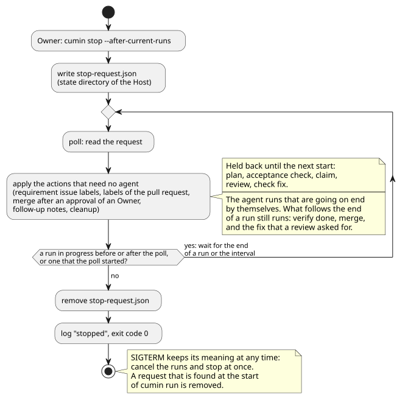
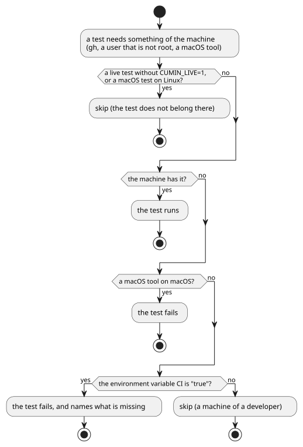
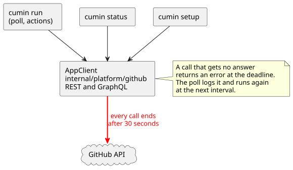

# cumin本体の設計メモ

- 状態: Approved
- 要件: [cumin本体の要件](../requirements/cumin-core.md)、[Issueのラベルと状態遷移](../requirements/workflow/issue-states.md)
- 事実の出どころ: [調査・実測で確定した制約](../evidence/measured-constraints.md) の行の番号 (「実測 N」と書く) か、公式ドキュメントのページの名前で示す。

上の2つの要件を実装するときに、プログラム全体にまたがる設計上の決定を書く。定期確認の1回分 (読む内容、判定、依頼、実行の終わり) は [定期確認の設計](poll.md) に、1回のAgentの実行は [Agentの実行の設計](agent-run.md) に、パッケージとファイルの受け持ちは [コードの構成の設計](code-layout.md) にある。

## 範囲

扱うこと:

- プログラム全体にまたがる設計上の決定。複数のパッケージが従うもの。

扱わないこと:

- 何をするか。要件文書にあり、ここでは繰り返さない。
- 設定のキー。この文書では決めない。[設定の一覧](../development/configuration.md) にある。
- 定期確認の判定と、そのきっかけで動く動作。[定期確認の設計](poll.md) にある。

## 設計

### Hostに置くファイル

| ファイル | 場所 | 書く人 |
|---|---|---|
| 設定 | `~/.config/cumin/config.toml`。`--config` で変えられる | Owner と `cumin setup` |
| riskの基準 (任意) | 設定ファイルと同じディレクトリの `risk-criteria.md`。決まりは cumin本体の要件にある | Owner |
| 手元の状態 | `~/.local/state/cumin/state.json` | `cumin run` だけ |
| 使い切りの許可 | `~/.local/state/cumin/quota-allowance.json` | `cumin quota allow` だけ |
| 止める予約 | `~/.local/state/cumin/stop-request.json` | `cumin stop --after-current-runs` が書き、`cumin run` が消す |
| ログ | `~/.local/state/cumin/cumin.log` (標準出力) と `cumin.err.log` (標準エラー出力) | launchd |
| LaunchAgent | `~/Library/LaunchAgents/dev.cloveclove.cumin.plist` | `cumin setup launchd` |
| Agentのskill | `~/.local/state/cumin/skills/.claude/skills/<名前>/SKILL.md`。起動時に毎回上書きする ([Agentの実行の設計](agent-run.md) の「Claude Codeの起動」) | `cumin run` だけ |

- 人が編集するファイルは `~/.config`、cuminが書くファイルは `~/.local/state` に分ける。
- 手元の状態に入れるのは、要件が認めたものだけである: Issueごとの Agent のセッションの番号と check の修正を依頼した回数、`cumin/status/accepting` の要求Issueごとの Planner のセッションの番号と受け入れの確認を依頼し直した回数、枠ごとの最新の使用率とリセット時刻。使い切りの許可のファイルには、許可した5h枠のリセット時刻だけを入れる。止める予約のファイルには、予約した時刻だけを入れる。
- 形式はJSONで、先頭に `version` を持つ。書くときは、同じディレクトリの一時ファイルに書いてから rename する。途中で止まっても、壊れたファイルが残らない。
- 1つのファイルを書くプロセスは1つだけにする。`cumin quota allow` と `cumin status` は `cumin run` とは別のプロセスなので、ファイルを介してやりとりする。書く人を分ければ、ロックが要らない。`cumin run` は、定期確認のたびに許可のファイルを読む。止める予約のファイルだけは、`cumin stop` が書き、`cumin run` が消す。書くのも消すのも1回の操作 (rename と unlink) なので、ここでもロックは要らない。
- ファイルを失っても、作業は失われない。セッションは新しく始まり、回数は0に戻り、使用率は次の着手の前に読み直す。使い切りの許可は、Ownerがもう一度出す。止める予約は、Ownerがもう一度コマンドを実行する。読めないファイルは、ないものとして扱い、警告をログに出す。
- 採らなかった案: データベース。持つものが少なく、失ってもよいためである。
- ログのファイルは、cuminが開くのではなく、launchdが標準出力と標準エラー出力を向ける先である。cuminは、要件のとおり標準出力にJSONを出すだけで、ターミナルから動かしたときの見え方は変わらない。入れ替え (ローテーション) は行わないので、ファイルは増え続ける。

### Keychainの項目

秘密の値は、macOS の Keychain の generic password に置く。

| 値 | service | account |
|---|---|---|
| GitHub App の秘密鍵 | `cumin-works` | `github-app-private-key/<AppのClient ID>` |
| Discord の webhook のアドレス | `cumin-works` | `discord-webhook-url` |

- 秘密鍵の項目を Client ID で引くのは、設定ファイルにある値だけで項目が決まり、App の名前や Organization の名前をコードに埋め込まずに済むためである。
- 秘密鍵の値は、PEMをbase64で1行にしたものにする。改行を含む値を `security` の `-w` で読むと、16進の文字列で返るためである。base64で1行にした値は、そのままの形で返る (2026-09-20に実機で確かめた)。
- 読み書きと削除の全てで、keychainのファイルのパスを指定する。既定のkeychainのパスは、`security default-keychain` で求める。パスを指定しないと、読み取りと削除は検索リストの全体を探すので、別のkeychainにある同じ名前の項目に届くことがある (`man security`、実測 104)。手順書の、読み取りと削除の `security` のコマンドも、同じ理由でkeychainを指定する。項目を足すコマンドは、指定しない。指定したファイルがないと、エラーにならずに既定のkeychainに書くためである ([GitHub Appの登録手順](../development/github-app-setup.md) の注意)。
- 書くときは、値を `security -i` の標準入力で渡す。プロセスの引数は誰でも読めるので、値を引数に入れない。
- keychainのファイルのパスを指定して書くときは、先にファイルがあることを確かめる。ファイルがないと、`security add-generic-password` はエラーにならずに、既定のkeychainに書き込む (2026-09-20に実機で確かめた)。
- launchd が起動したプロセス (ログイン中のユーザの LaunchAgent) は、`security` で作った項目を、確認の画面なしで `security` から読める (2026-09-20に実機で確かめた)。login keychain が開いていることが前提である。ログインしていない状態や、他のアプリが作った項目では、確かめていない。
- 読むときは、`/usr/bin/security find-generic-password -s <service> -a <account> -w` を `os/exec` で呼ぶ (`man security`)。cgoも、追加の依存も要らない。
- 要件のとおり、`cumin run` の起動時に読み、メモリにだけ持つ。値をログ、エラーの文章、手元の状態に入れない。
- Keychain に触れるコードは `internal/platform/keychain` に閉じ込める。

### Ownerへの通知

- 通知は `internal/notify` の1か所を通る。ほかのパッケージが渡すのは、行の番号 (`I2` など)、理由の1行、リポジトリ、対象 (`issue #12`)、リンクだけで、どの手段で届くかを知らない。
- 手段は `internal/platform/discord` が受け持つ。webhookのアドレス、JSONの本文、応答、1つのメッセージの上限 (2000文字。公式: Execute Webhook) は、ここで止まる。
- 境界を越える値は、文章1つである (`Send(ctx, text)`)。1行目を要約にする。構造体を `internal/notify` に置いて渡すと、`internal/platform/*` がfeatureのパッケージをimportすることになり、依存の向きに反する ([コードの構成の設計](code-layout.md))。題と本文を分けて扱う手段が要るようになったら、型を共有の場所に移す。
- 呼び出しには `wait=true` を付ける。付けないと、APIは受け取った時点で204を返し、公式ドキュメントのとおり「保存に失敗してもエラーにならない」ので、届かなかった通知を成功として扱ってしまう。
- webhookのアドレスは秘密である。`cumin setup notify --discord-webhook` が標準入力から受け取って上の表のKeychainの項目に入れ、`cumin run` が起動時に1回読み、メモリにだけ持つ。チャンネルを旗で表すのは、Discordのwebhookが通知の手段の1つだからである。ログ、エラーの文章、戻り値、手元の状態に入れない。エラーに入れるのは、状態コードとAPIの `message` だけである。
- 通知を出すかどうかは、設定 `notify.discord.enabled` で決まる。対象のリポジトリの `.cumin/config.toml` で上書きできる。リポジトリが選べるのは出すかどうかだけで、宛先はHostのもの1つである。
- Keychainに項目がなくても、`cumin run` は起動する。起動時に、項目の名前と設定のキーを警告に出す。通知を出す場面で足りなければ、そのときにerrorのログに出す。リポジトリが設定で通知を入れられる以上、起動を止めると、Discordを使わないHostが動かせなくなる。
- 通知の失敗は、errorのログに出すだけである。コメントもラベルも巻き戻さない。判定に使うのはGitHub上の事実であり、通知は「見に来てほしい」と伝えるだけだからである。
- 理由は500文字までにして、超えた分は `...` で切る。切るのは `internal/notify` の側である。手段の上限で切ると、最後の行にあるリンクが落ちて、Ownerが見に行けなくなる。通知は要約で、詳しい理由はIssueのコメントにある。手段の側の上限は、最後の備えとして残す。
- メッセージの中の `@everyone` や利用者への言及を、Discordに解釈させない (`allowed_mentions` の `parse` を空にする。公式: Allowed Mentions Object)。通知の文章にはAgentが書いた部分が入るので、そのままだとチャンネル全体を呼び出せてしまう。
- 採らなかった案: `internal/notify` からDiscordを直接呼ぶ。手段を差し替えるときに、featureのパッケージを書き換えることになる。
- 採らなかった案: Discordのbotで双方向にする。[要求のbacklog](../requirements/backlog.md) にある。

### launchd

cuminは、Hostのユーザの LaunchAgent として常駐する。plistはHostのものなので、リポジトリには置かない。`cumin setup launchd` が、実行中のプロセスから値を取って書き出す。

| キー | 値 | 理由 |
|---|---|---|
| `Label` | `dev.cloveclove.cumin` | plistの名前と、`launchctl` のサービスの指定 (`gui/<uid>/<Label>`) に使う |
| `ProgramArguments` | 実行中のcuminの絶対パス、`run`、`--config`、設定ファイル | `Program` は絶対パスでなければならない (`man launchd.plist`) |
| `RunAtLoad` | true | ログインで起動する。`KeepAlive` が含意するが、読む人のために書く |
| `KeepAlive` | `{ SuccessfulExit = false }` | 0以外で終わったときだけ起動し直す。`launchctl kill SIGTERM` で止めたcuminは0で終わるので、止めたままになる。`true` にすると、手で止めても戻ってしまう |
| `StandardOutPath`、`StandardErrorPath` | state ディレクトリの `cumin.log` と `cumin.err.log` | launchdの job には端末がない。この2つのキーが、出力を残す方法である |
| `EnvironmentVariables.PATH` | コマンドを実行したシェルの `PATH` | launchdの job のPATHは小さいので、これがないと `claude`、`git`、`gh` が見つからない |
| `ExitTimeOut` | 60 | SIGTERMからSIGKILLまでの待ち時間 (`man launchd.plist`)。`cumin run` の停止の猶予より長くする |
| `ProcessType` | `Standard` | `Standard` は `ProcessType` を書かないのと同じである。`Background` はCPUとI/Oを絞るので、cuminが起動するAgentにも効いてしまう |

- 採らなかった案: 置き換える場所を持つテンプレートをリポジトリに置く。手で置き換える値が3つあり、さらにテンプレートに書けない値が1つある (上の `PATH`)。間違えても launchd は静かに失敗する。サブコマンドなら、4つとも実行中のプロセスから取れる。
- `go run` が作った一時的なバイナリは、`Program` にできない。コマンドは、実行ファイルのパスが一時ディレクトリの下にあれば、何も書かずに止まる。
- 既にある plist が違う内容なら、差分を見せて上書きしない。`--force` で置き換える。
- Keychain は、ログイン中のユーザの LaunchAgent から、確認の画面なしで読める (実測 67)。ログインしていない間は動かないので、Hostが再起動したあとはOwnerのログインが起動のきっかけになる。

### 止め方

止め方は2つある。すぐに止める (この話題) と、実行中のAgentの実行が終わるのを待ってから止める (次の話題) である。

`cumin run` は、SIGINT と SIGTERM ですぐに止まる。launchd から止めるとき (`launchctl kill SIGTERM`、`bootout`、ログアウト) も同じ経路である。

- 合図を受けると、contextが終わる。新しい着手はしない。定期確認の途中なら、残りのリポジトリには進まない。
- 実行中の依頼は、同じcontextで動いているので、取り消しが届く。Agentの接続部分が、CLIのプロセスグループにSIGTERMを送り、猶予 (10秒) のあとにSIGKILLを送る ([Agentの実行の設計](agent-run.md) の「実行時間の上限」)。依頼が何であっても同じに動く。
- `cumin run` が待つ時間は、Agentの猶予そのものではなく、それに余裕を足した値である (`agent.Service.StopBudget`)。Agentの猶予は、SIGTERMからSIGKILLまでの時間でしかなく、そのあとに `os/exec` がCLIを終わらせ、cuminがプロセスグループにSIGKILLを送る手順が残るためである。同じ値にすると、CLIがまだ生きているうちにcuminが終わりうる。CLIは自分のプロセスグループで動くので、launchdの後始末も届かず、roleのtokenを持ったプロセスが残る。
- 待ち切れなくても、そこで終わる。プロセスが終わるところなので、残った待ちは捨てる。
- 終わるときに、`stopped` のログを1行出す。入れるのは、止まった理由、進行中だったIssueの一覧 (`<owner>/<repo>#<番号>`)、猶予の中で終わったかどうかである。
- 終了コードは0である。LaunchAgentの `KeepAlive` は `SuccessfulExit = false` なので、手で止めたcuminは起動し直されない。
- ラベルは変えない。進行中だったIssueは `cumin/status/implementing` のまま残り、Ownerが `cumin/status/ready` を付け直して再開する (Issueのラベルと状態遷移の「v0.1では実装しないこと」)。作業中のラベルのまま残ったIssueを自動で回収する機能は、v0.1では作らない。
- LaunchAgentの `ExitTimeOut` (60秒) は、この猶予より長くしてある。launchdがSIGKILLを送る前に、cuminが自分で終われる。

### 実行を待ってから止める

Ownerが `cumin stop --after-current-runs` を実行すると、動いている `cumin run` は、新しい依頼を始めずに、実行中のAgentの実行が終わるのを待ってから終わる。バイナリを入れ替える前に使う。

図の元ファイル: [cumin-stop-after-runs.puml](cumin-stop-after-runs.puml)

- コマンドは、止める予約のファイル (「Hostに置くファイル」) を書いて、すぐ終わる。`cumin run` が終わるのを待たない。予約が既にあれば、今の時刻で書き直す。前のプロセスが残した予約を、起動より前の予約として消させないためである。
- `--after-current-runs` を付けない `cumin stop` は、使い方の誤りにする。すぐに止めるのはSIGTERMで、このコマンドは送らない。
- `cumin run` は、定期確認の最初に予約を読む。反映は、最長で `poll_interval` だけ遅れる。一度読んだら、終わるまでこの止め方を続ける。
- 予約を読んだあとの定期確認は、判定の結果から、Agentに新しい依頼を出す動作 (分割、受け入れの確認、実装、レビュー、checkの修正、checkを待つ間の衝突の解消、Ownerのレビューへの対応) を落とす。落とすのは純粋関数 (`WithoutNewWork`) である。ラベルも替えない。どの動作も、Agentが動いていないラベルから始まるので、次の起動の定期確認でそのまま成り立つ。checkの修正が上限に達したときの停止も、次の起動まで待つ。checkの修正の依頼から始まる停止だからである。
- Agentの要らない動作は、続ける。要求Issueのラベルの付け替え、Pull Requestへのラベルのコピー、Ownerの承認のあとのmerge、必須のcheckが結果を返さないときの停止 (I15)、フォローアップノート、閉じたIssueの片付けである。
- 実行中の実行は、最後まで進める。実行の終わりに続く動作は、Agentへの依頼 (異常終了のあとのやり直し、指摘の修正、衝突の解消、上限での原因の整理) も含めて行う。Reviewerが修正を求めた直後には、Agentが動いていない待ちのラベルがない。そこでやめると、Issueが `cumin/status/reviewing` のまま残り、次の起動が拾えない。続く実行が終われば、Issueは待ちのラベル (`cumin/status/checking` など) に着く。そのあとのレビューは定期確認が決める依頼なので、始めない。1つのIssueで続くのは、Implementerの実行1回までである。
- 「待ち状態になった」の通知 (Q4) は出さない。依頼を落としているので、することがないのは知らせることではない。
- 終わるのは、定期確認の前にもあとにも実行中のものがなく、その定期確認が何も始めなかったときである。この最後の定期確認が、終わった実行の結果を、Agentなしで進める先まで運ぶ。待っている間は、実行が終わるたびに、間隔を待たずに定期確認を行う。最後の定期確認が失敗しても終わる。残りはGitHubの事実から決まるので、次の起動が続ける。
- 終わるときに、予約のファイルを消し、`stopped` のログを1行出す (理由は、止める予約のあとに実行が終わったこと、進行中のIssueは空)。終了コードは0なので、launchdは起動し直さない。
- `cumin run` は、起動時に、予約した時刻が起動より前の予約のファイルを消す。起動と同時に書かれた予約は、この起動へのものなので残す。予約は、頼んだときに動いていたプロセスへのものである。`cumin run` が動いていないときに書かれた予約も、ここで消える。消せなかった予約 (状態のディレクトリに書けないときなど) は、警告をログに出して、読み飛ばす。予約した時刻が起動より前の予約は、数えない。数えると、起動のたびにその予約を読んですぐ終わり、終了コードが0なのでlaunchdも起動し直さない。
- 待っている間にSIGTERMを受けたら、上の「止め方」のとおり、すぐに止まる。このときも、予約のファイルを消す。
- `cumin status` は、予約のファイルがあれば、止まる途中であることと予約した時刻を表示する。待っている実行は、GitHubのラベルから読む一覧 (Agents at work) で示す。ラベルに出ない実行 (受け入れの確認、mergeの手順) は、一覧に載らない。
- 採らなかった案: シグナル (SIGUSR1) で伝える。ターミナルから動かした `cumin run` に送るには、pidの記録が要る。古いpidに送ると、関係のないプロセスが、SIGUSR1の既定の動作で終わる。
- 採らなかった案: `cumin run` が、待っている実行の一覧を状態ファイルに書く。表示は正確になるが、手元の状態が1つ増える。

### テストの2層

| 層 | 走らせ方 | 使うもの |
|---|---|---|
| 受け入れテスト | `go test ./...`。CIでも走る。ネットワークも利用枠も使わない | 偽GitHub (`httptest`) と、偽CLI (テストが用意する実行ファイル) |
| 実機の場面 | 環境変数 `CUMIN_LIVE=1` を付けたときだけ走る。何時間もかかる実行だけ、先にOwnerに確かめる | sandbox のリポジトリ、本物の GitHub App、本物の Claude Code |

- 受け入れテストは、各要件文書の「上位要件のテスト」の行から作り、`TestCore01_...` のように行の番号を名前に入れる。
- 本物のGitHubクライアントを、偽GitHubに向けて動かす。クライアントの要求の組み立て方の間違いも、受け入れテストで見つけるためである。偽GitHubは、テストが使うendpointだけを持つ。
- 偽CLIは、決まった `stream-json` の出力を返すだけの実行ファイルである。打ち切りの場面では、終わらないものを使う。
- 判定のロジックは、GitHubの事実のスナップショットから動作への純粋な関数にする。細かい分岐は、この関数の表形式のテストで確かめる。
- 実機の場面の記録には、使用率の数値を書かない。
- マシンにあるものに頼るテスト (`gh`、rootでないユーザー、ディレクトリのmode) は、それがないとき、`internal/core/testenv` の `SkipOrFail` を呼ぶ。手元ではskipし、CIでは失敗して、足りないものの名前を出す。
  - 理由: CIでのskipは成功に見える。runnerが道具を失っても、誰も気づかない。
  - CIかどうかは、環境変数 `CI` が `true` かどうかで決める。GitHub Actions が、この変数をいつも `true` にする (公式: Variables reference の Default environment variables)。`.github/workflows/ci.yml` には何も足さない。
  - `t.Skip` を直接呼んでよいのは、そのテストがそこに属さないときだけである: `CUMIN_LIVE=1` のない実機の場面と、macOS以外で走るmacOSのテスト (`runtime.GOOS` の確認の後ろ)。macOSのテストは、macOSの上で道具 (`security`、`plutil`) がなければ失敗する。
  - 採らなかった案: `go test -json` の出力からskipを数える手順をCIに足す。workflowの変更が要り、どのskipが正しいかの一覧をテストの外に持つことになる。

図の元ファイル: [test-skip-guard.puml](test-skip-guard.puml)

### GitHubクライアント

- cuminは、GitHub App としてだけ認証する。GitHubへの操作には installation token を使う。installation token の発行にだけ、Appの秘密鍵で署名したJWTを使う (公式: Generating an installation access token for a GitHub App)。Ownerの認証情報と、リポジトリの管理者の権限 (Administration) は使わない。
- クライアントは、標準ライブラリ (`net/http`、`encoding/json`) で書く。JWTの署名だけは、ライブラリ `github.com/golang-jwt/jwt/v5` (MIT) に任せる (`signJWT`)。
  - 理由: 署名は、セキュリティに関わる部分である。手で書いたものより、保守されているライブラリのほうが、間違いが入りにくく、直しも届く。
  - JWTの中身は、ヘッダーの `alg` (`RS256`) と `typ` (`JWT`)、クレームの `iat` (今の60秒前)、`exp` (今の9分後)、`iss` (AppのクライアントID) だけである。
- installation token は、期限 (発行から1時間) の5分前まで使い回す。定期確認は60秒ごとなので、1つのtokenで50回以上の定期確認をまかなえる。発行のたびにJWTの署名と2回の要求が要るので、毎回発行すると無駄が大きい。5分の余裕は、定期確認1回分と時計のずれを見込んだ値で、設定にはしない。Agentに渡すtokenは、実行が55分まで続くので、依頼のたびに発行する。
- 採らなかった案: GitHubのクライアント全体をライブラリ (SDK) にする。使うendpointが少なく、署名のほかに依存を増やす理由がない。
- 1回の呼び出しは、30秒で打ち切る (定数 `defaultTimeout`)。接続から応答の本文を読み終えるまでの時間である。`NewAppClient` に `httpClient` を渡さないときのクライアントが、この期限を持つ。`cumin run`、`cumin status`、`cumin setup` は、どれもこのクライアントを使う。
  - 理由: 期限がないと、応答の返らない接続が1つあるだけで、cuminを起動し直すまで全てのリポジトリの定期確認が止まる。GitHubの応答は長くても数秒なので、30秒あれば正常な呼び出しを打ち切らない。定期確認の間隔 (60秒) より短いので、1つの呼び出しが止まっても、次の定期確認までに終わる。
  - 期限で終わった呼び出しは、ネットワークの誤りの1つとして扱う。下のやり直しの対象である。
  - 設定にはしない。対象ごとに変える理由がないためである。
- 一時的な失敗をした読み取りは、クライアントの中でやり直す (`retry.go`。要件: [cumin本体の要件](../requirements/cumin-core.md) の一時的な失敗のやり直し)。
  - 一時的な失敗は、ネットワークの誤り (期限、接続の切断など。応答の本文の途中で切れた場合を含む) と、5xxの応答である。一次のレート制限の使い切りと、二次のレート制限は、やり直さない (下の項目)。
  - 読み取りは、RESTの `GET` と、GraphQLのquery (本文の `query` が `query` で始まる要求) である。それ以外 (`POST`、`PUT`、`PATCH`、GraphQLのmutation) は書き込みで、1回だけ送る。
  - やり直しは3回まで (定数 `maxRetries`)、2秒あけて行う (定数 `retryWait`)。最初の1回と合わせて、1つの読み取りは最大4回送る。毎回、新しい要求を作るので、どの回も30秒の期限を持つ。応答が返らないGitHubに対する1つの読み取りは、最長で約2分かかる。
  - 待つ間に呼び出し元のcontextが終わると、待ちをすぐにやめて、失敗を返す。この失敗は一時的な失敗としない。
  - 最後の回も一時的な失敗で終わった読み取りと、一時的な失敗をした書き込みは、`TemporaryError` を返す。呼び出し元は `github.IsTemporary(err)` で、続く失敗と区別する。5xxの応答では、`errors.As` で今までどおり `StatusError` を取り出せる。4xxの応答は1回だけ送り、`StatusError`、`ErrConflict`、`ErrHeadMoved` は変わらない。
  - やり直しのたびに、warnのログを1行出す。要求のラベル (`request`)、何回目か (`try`)、理由 (`reason`: `status 502`、`time-out` など) を持つ。tokenとアドレスは持たない。`cumin run` は自分のloggerを渡す (`SetLogger`)。
  - テストは、待ちを差し替えて眠らない (`SetRetryWait`)。 レート制限のリセットの時刻を待たずに確かめるテストは、クライアントの時計を差し替える (`SetNow`)。
  - 設定にはしない。回数と間隔は要件が決めていて、対象ごとに変える理由がないためである。
- 一次のレート制限を使い切ったら、リセットの時刻まで、そのinstallationの呼び出しを送らない (`ratelimit.go`。要件: 同じ節のレート制限の規則)。
  - 見分け方は、公式の文書のとおりである (公式: Rate limits for the REST API、Rate limits and query limits for the GraphQL API の「Exceeding the rate limit」)。RESTは、403か429の応答で、ヘッダー `x-ratelimit-remaining` が `0` である。GraphQLは、statusが200のまま、本文に `errors` があり、同じヘッダーが `0` である。リセットの時刻は、ヘッダー `x-ratelimit-reset` (UTCのエポック秒) で読む。
  - GraphQLでは、上限の最後の1回の成功も、同じヘッダーが `0` になる。そこで、ヘッダーが `0` のときだけ本文を全て読み、`errors` があるときに限って使い切りとする。
  - ヘッダーが `0` でない403と、リセットの時刻を読めない応答は、今までどおり `StatusError` である。
  - 使い切りの応答は、`RateLimitError` を返す。枠の名前 (`Resource`: ヘッダー `x-ratelimit-resource` の値。RESTは `core`、GraphQLは `graphql`) と、リセットの時刻 (`Reset`) を持つ。tokenは持たない。`github.IsTemporary(err)` は真を返す。やり直しの対象にはしない。すぐに送り直しても、同じ答えが返るためである。
  - クライアントは、installationごとにリセットの時刻を覚える (mutexの後ろの表)。その時刻より前は、同じinstallationの呼び出しを、RESTもGraphQLも、読み取りも書き込みも、送らずに同じ `RateLimitError` で返す。その時刻になると、次の呼び出しを送る。時計は、クライアントに差し込んだ `now` である。
    - 理由: 要件が、待つ間はそのinstallationでGitHubを呼ばない、と決めている。制限されている間に呼び続けると、GitHubがintegrationを止めることがある (同じ公式の文書)。
  - installationは、tokenから決める。クライアントは、installation token を発行したときに、tokenとinstallationの番号の組を覚える (期限が過ぎた組は、次の発行のときに捨てる)。同じinstallationの別のリポジトリのtokenも、同じ制限を分け合うためである。クライアントが発行していないtokenは、そのtokenだけを1つの単位とする。AppのJWTは呼び出しごとに新しいので、JWTの呼び出し (tokenの発行など) は止めない。
  - 呼び出しの中では待たない。`cumin status` と `cumin setup` は、すぐにこの失敗を返す。リセットのあとにやり直すのは、定期確認と、持っておいた手順である。
  - 使い切りを見つけたときに、warnのログを1行出す。要求のラベル (`request`)、枠の名前 (`resource`)、リセットの時刻 (`reset`) を持つ。tokenは持たない。送らなかった呼び出しでは、ログを出さない。
- 二次のレート制限の応答を受けたら、GitHubが求める時間が過ぎるまで、そのinstallationの呼び出しを送らない (`ratelimit.go`。要件: 同じ節のレート制限の規則)。覚え方、installationの決め方、呼び出しの中で待たないことは、一次のレート制限と同じである。
  - 見分け方は、公式の文書のとおりである (公式: Rate limits for the REST API の「Exceeding the rate limit」、Rate limits and query limits for the GraphQL API の「Secondary rate limits」と「Exceeding the rate limit」)。RESTは、403か429の応答で、二次のレート制限を示すエラーメッセージを持つ。GraphQLは、statusが200か403で、同じメッセージを持つ。200のときは、本文の `errors` の中にある。ヘッダー `retry-after` があれば、待つ秒数である。
  - 待つ時間は、公式の文書の順に決める。403か429の応答に、ヘッダー `retry-after` (1以上の秒数) があれば、二次のレート制限として、その秒数だけ待つ。なければ、`x-ratelimit-remaining` が `0` のときは、一次のレート制限として `x-ratelimit-reset` まで待つ (上の項目)。どちらでもなく、メッセージが `secondary rate limit` を含むときは、1分待つ (定数 `secondaryWait`)。
    - メッセージの文言は、公式の文書にはない。GitHubが実際に返す文 (`You have exceeded a secondary rate limit.` で始まる) から決めた、cuminの判断である。
  - GraphQLの200の応答は、本文を全て読み、`secondary rate limit` を含むとき (または `x-ratelimit-remaining` が `0` のとき) だけ `errors` を調べる。`errors` があれば、そのメッセージとヘッダーで、同じ順に決める。
  - どの合図もない403は、今までどおり `StatusError` である。
  - 応答は、一次と同じ `RateLimitError` を返す。`Resource` は `secondary` で、`Reset` は待ちの終わりの時刻 (差し込んだ `now` に待つ時間を足した値) である。`github.IsTemporary(err)` は真を返す。読み取りも書き込みも、呼び出しの中ではやり直さない。
  - 見つけたときに、warnのログを1行出す (`GitHub answered a secondary rate limit`)。要求のラベル (`request`)、種類 (`resource`: `secondary`)、待ちの終わりの時刻 (`reset`) を持つ。tokenは持たない。送らなかった呼び出しでは、ログを出さない。
  - 1分は、設定にはしない。公式の文書が決めている値で、対象ごとに変える理由がないためである。

図の元ファイル: [github-call-deadline.puml](github-call-deadline.puml)

- 読み取りは、定期確認の1回分を、リポジトリごとに2つのGraphQLの問い合わせで読む。1つ目は要求Issueとsub-issueを読み、2つ目は選んだsub-issueのPull Requestを読む。Issue、sub-issue、ラベル、blocked by、Pull Request、レビュー、checkは入れ子の関係にあり、RESTだとIssueの数に比例して要求が増えるためである。2つの読み取りから1つのスナップショットを作る。読む時点が2つでも判定が正しい理由は、[定期確認の設計](poll.md) の「2つの問い合わせ」にある。
- Agentの実行が終わった直後には、その実行のIssueだけを、番号で指定する1つのGraphQLの問い合わせで読み直す。項目と上限は、定期確認の問い合わせと同じである。実行終了をきっかけにする判定 (R2、I2、I5〜I8、I10) は、前の定期確認の結果ではなく、この読み直しの結果で行う。Agentが終了の直前に作ったPull Requestやレビューを、見落とさないためである。リポジトリの全ページは読み直さない。これらの判定が使うのは、1つのIssueの事実だけだからである ([定期確認の設計](poll.md) の「実行終了の判定」)。
- 書き込みは、全てRESTで行う。ラベル、コメント、merge、sub-issue、tokenの発行がこれに当たる。GitHub App に要る権限が、RESTのendpointごとに公式ドキュメントに書かれているためである (実測 10、33)。
- 例外として、必須のcheckの一覧はRESTで読む (`GET /repos/{owner}/{repo}/rules/branches/{branch}`、実測 53)。
- 上限: GraphQLは、installation token ごとに毎時5,000ポイントで、`first` と `last` は1〜100である (公式: Rate limits and node limits for the GraphQL API)。定期確認は、2つの問い合わせで読む ([定期確認の設計](poll.md) の「2つの問い合わせ」)。1つ目は、要求Issueを10件ずつページで読み、sub-issueは15件までを1回で読む。2つ目は、開いていて状態ラベルのあるsub-issueだけについて、Issueを閉じるPull Requestを2件まで読む。コストを変えない接続 (ラベル、blocked by のIssue、checkの結果、レビュー) は、GraphQLの上限の100件にする。上限を超えるとそのリポジトリの定期確認が止まるのに、広げてもコストが増えないためである。sub-issue、ラベル、blocked by、Pull Request、check、レビューが上限を超えたIssueがあれば、そのリポジトリの定期確認は、Issueの番号を示すエラーで止まる。要求の上限 (sub-issueは12個まで) の中では起きない。
- 1つ目の問い合わせの1ページのコストは3ポイントである。2つ目の問い合わせは、sub-issueが9件までで1ポイント、100件で9ポイントである (2026-10-03にcumin-worksで実測、[#449](https://github.com/cloveclovedev/cumin-works/pull/449))。Pull Requestを1つ目の問い合わせで読んでいたときは、1ページが17ポイントだった ([#412](https://github.com/cloveclovedev/cumin-works/pull/412))。数え方は公式のもので、[実測した制約](../evidence/measured-constraints.md) の129にある。それをcuminの問い合わせに当てはめると、要求Issueの数 x sub-issueの数 x k / 100 になる。k は接続の数である: sub-issueの下に2 (ラベル、blocked by)、Pull Requestの接続に1、Pull Requestの下の接続はそれぞれ「Pull Requestの件数」を足す。要求Issueの直下の接続 (ラベル、blocked by、sub-issue) は、要求Issueの数 / 100 ずつしか足さないので、1ページでは合わせて0.3ポイントで、四捨五入した値を変えない (公式: Rate limits and query limits for the GraphQL API の、ポイントの数え方)。接続の中のページの大きさ (checkの数、ラベルの数) と、`.cumin/` のファイルは、コストを変えない。効くのは、開いている要求Issueの数と、sub-issueとPull Requestのページの大きさだけである。ページを小さくしても、ページ数が増えるので合計は変わらない。
- ポイントの見積もり: 1回の定期確認は、1つ目の問い合わせの「ページ数 x 3ポイント」に、2つ目の問い合わせ (選んだsub-issueが100件までで1〜9ポイント。選んだsub-issueがなければ0) を足した値である。2026-10-03の実測 ([#454](https://github.com/cloveclovedev/cumin-works/pull/454)) では、cumin-works (開いている要求Issueは21件で3ページ、選んだsub-issueは15件) が10ポイント、cumin-sandbox (1ページ、選んだsub-issueなし) が3ポイントだった。60秒間隔で、cumin-worksは毎時600ポイント、cumin-sandboxは毎時180ポイント (2つ目の問い合わせを送るなら毎時240ポイント) を使う。Agentの実行のあとの読み取りは、1回に1〜2ポイントである ([#454](https://github.com/cloveclovedev/cumin-works/pull/454))。同じinstallationの毎時5,000ポイントを、全てのリポジトリと小さな問い合わせで分け合う。installationは、リポジトリか利用者が20を超えると1つにつき毎時50ポイント増え、12,500が上限である (公式)。この見積もりは、作業中のリポジトリのものである。作業中のIssueがないリポジトリは `idle_poll_interval` (初期値は5分) ごとに確かめるので、その5分の1で済む。cumin-worksで毎時120ポイント、cumin-sandboxで毎時36ポイントである ([定期確認の設計](poll.md) の「定期確認の間隔」)。これを超えるときは、`poll_interval` を長くするか、「後回しにしたこと」の案に移る。
- 採らなかった案: 全ての接続を100件ずつ読み、超えたら続きを読む。sub-issueの下の接続まで100件にすると、1回の問い合わせが約2,000ポイントになり、1時間の枠が2〜3回で尽きる。
- この上限は、同じinstallation (Organization) にある対象のリポジトリの全てで分け合う。1時間に使うポイントは、リポジトリの数、1時間の問い合わせの回数、1回のコストの積になる。60秒の間隔なら、対象が数個のうちは十分に収まる。cuminは、応答の `rateLimit` の `cost` と `remaining` をログに出す (GraphQLのスキーマで確かめた)。足りなくなったときの対応は、「後回しにしたこと」にある。読む項目は [定期確認の設計](poll.md) の「定期確認で読む内容」にある。
- installation token でGraphQLの項目を読めない場合は、RESTで読む (実測 37)。そのときは、理由をこの話題に書く。
- GitHubの型 (GraphQLの応答、RESTのDTO) は `internal/platform/github` で止める。判定のロジックには、cuminの型のスナップショットだけを渡す。

### riskの基準の受け渡し

riskの基準は、PlannerとReviewerがそのまま受け取る文章である。cuminは中身を読まない。解決した文章は、起動の依頼のデータとして `internal/agent` に渡り、roleの指示の最後に付く ([Agentの実行の設計](agent-run.md) の「Claude Codeの起動」)。

- 初期値の文章は、cuminのバイナリに埋め込む。置き場所は `disciplines/software-engineering/risk-criteria.md` である。どの変更をriskが高いとするかは分野の判断なので、roleではなくdisciplineが持つ。Agentが受け取る文章は、Pull Requestでレビューされるべきものなので、要件文書ではなくリポジトリに置く (#102 の決定)。
- 強い順に、リポジトリの `.cumin/risk-criteria.md`、Hostの設定ファイルと同じディレクトリの `risk-criteria.md`、埋め込みの初期値である。ある段のファイルは、弱い段の文章を丸ごと置き換える。
- 解決する関数は、文章と、どの段から来たか (リポジトリ、Host、初期値) を返す。定期確認は、どの段から来たかだけをログに出す。文章はログに出さない。
- ファイルがあって、中身が空白だけなら、パスを示すエラーにする。空の指示がAgentに渡ると、riskの判断の基準がなくなる。
- 関数は `internal/core/config` に置く。3段の優先順位は設定の決まりであり、リポジトリの `.cumin/config.toml` をHostの設定に重ねる処理と同じ場所にある。初期値は `disciplines` から読む。
- disciplineのroleのファイルは、今は埋め込みの1段だけである。同じ3段を持つようになったときも、解決はこの関数と同じ場所に置く。

### 起動前の使用率の確認

- `claude -p "/usage"` は利用枠を使わないが、人間向けの文章しか返さない。機械可読の使用率は、モデルを呼ぶ実行の `rate_limit_event` にだけ出る (実測 1、29)。使用率を返すサブコマンドや、非対話で使えるAPIは、公式ドキュメントにない (2026-09-21 に CLI reference、headless、statusline、hooks、Agent SDK の文書を確かめた)。
- そこで、着手 (R1、I1) の直前に、最小の実行を1回行う。`--system-prompt` で短い指示に置き換え、1語だけ答えさせ、`--output-format stream-json --verbose` で `rate_limit_event` を読む (実測 30)。最後のイベントの値を使用率とする。実行は数秒で終わり、使う利用枠は小さい。
- 最小の実行のオプション (公式: CLI reference、Model configuration): `--model haiku` (最も小さいモデルの別名)、`--tools ""` (ツールを使わせない)、`--setting-sources project` (Agentの起動と同じ)、`--no-session-persistence` (使い捨ての実行なので、セッションの記録をHostに残さない)。`--json-schema` と `--permission-mode` は付けない。
- 作業ディレクトリは、実行のたびに作る空の一時ディレクトリにする。リポジトリの `CLAUDE.md` を読ませないためである。環境変数は、Agentの環境 ([Agentの実行の設計](agent-run.md) の「Agentの環境」) の土台と同じで、tokenと作者は入れない。時間の上限は60秒で、超えたら打ち切る。
- モデル、指示、上限は接続部分の定数にする。要件の設定の表にないためである。
- 採らなかった案: `--bare` で、設定も指示も一切読まずに実行する方法。bare modeはサブスクリプションのログインを使わず、Keychainの認証情報も読まないので、`ANTHROPIC_API_KEY` が要る (公式: headless の "Start faster with bare mode"、実測 6a)。`CLAUDE_CODE_OAUTH_TOKEN` (長寿命のOAuthのtoken) で動くかは文書になく未確認で、動いてもOwnerの秘密が1つ増える。空の一時ディレクトリと `--setting-sources project` で、リポジトリの設定、MCPサーバ、skill、ユーザの設定は読まれないので、この実行では同じ結果になる。`--bare` が `-p` の既定になったとき (実測 6b) に見直す。
- 採らなかった案: `/usage` の文章を解析する方法。人間向けの形式は、予告なく変わりうる。使用率を返す内部の endpoint は、この文章を出すときにも呼ばれていて、上限に当たる報告がある。
- 採らなかった案: Claude Codeが `/usage` のために呼ぶ endpoint を、cuminが直接呼ぶ方法。公式ドキュメントになく、OwnerのOAuthのtokenをKeychainから読む必要がある。cuminはOwnerの認証情報を使わない。
- `rate_limit_event` の項目の一部は Agent SDK の文書にある (`status`、`utilization`、`resetsAt`、`rateLimitType`)。cuminが読む `unifiedWindows` は文書にない (実測 2)。イベントがない、または形が違うときは「読み取れなかった」として、理由を付けたエラーを返す。cuminのほかの部分は、着手せずにOwnerに通知する (Q1)。安全な側に倒す。
- 2026-09-21 の最小の実機実行 (Claude Code 2.1.267) では、`rate_limit_info` に `status`、`resetsAt`、`rateLimitType`、`unifiedWindows` と overage の3項目があり、`status` は `allowed` だった。枠の上限に当たったときの値は、意図して当てられないので未確認である (「まだ決めていないこと」)。
- この確認は Claude Code に固有なので、Claude Code の接続部分 (`internal/agent`) に置く。`internal/quota` が受け取るのは、枠ごとの使用率とリセット時刻だけである。
- 読んだ使用率から着手を止めるかどうかの判定と、最小の実行をいつ行うかは、[利用枠の設計](quota.md) にある。

## まだ決めていないこと

| 決める、または確かめること | どこで |
|---|---|
| 枠の上限に当たったときの、headless実行の終わり方と `rate_limit_info.status` の値 (実測 6)。意図して上限に当てられないので、実際に当たったときの記録で埋める | 上限に当たった実行の記録が残ったとき |

## 後回しにしたこと

- 複数のリポジトリを、1つのGraphQLの問い合わせにまとめること。きっかけ: 対象のリポジトリが増えて、GraphQLのポイントが足りなくなったとき。
