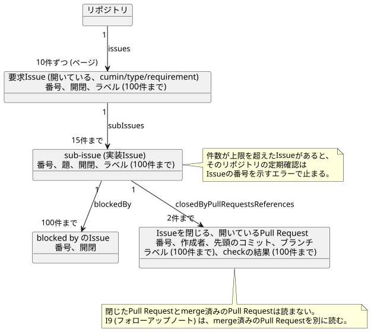
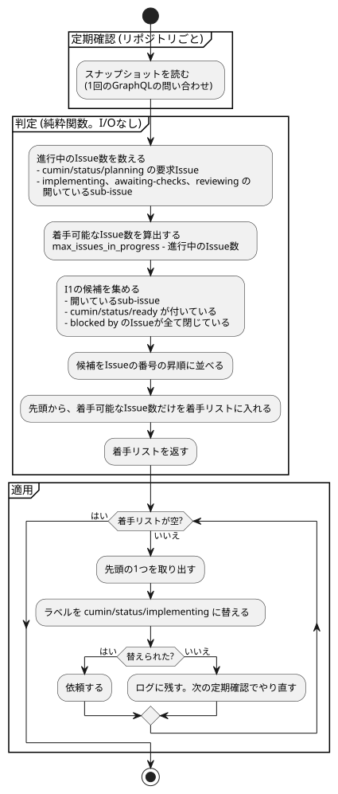
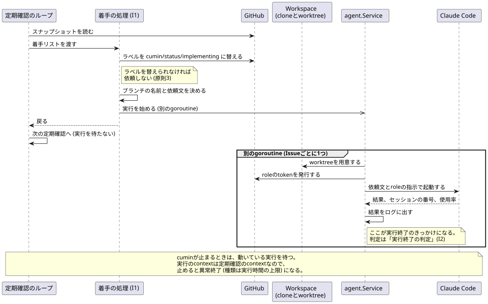
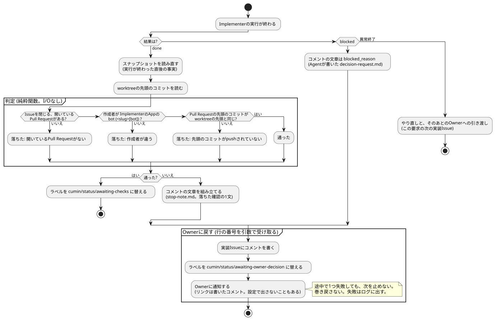

# 定期確認の設計

- 状態: Approved
- 要件: [Issueのラベルと状態遷移](../requirements/workflow/issue-states.md)、[cumin本体の要件](../requirements/cumin-core.md) の「GitHubの定期確認」「状態の管理」「Agentの起動」「設定」
- 事実の出どころ: [調査・実測で確定した制約](../requirements/evidence/measured-constraints.md) の行の番号 (「実測 N」と書く) か、公式ドキュメントのページの名前で示す。

定期確認の1回分 (GitHubを読み、判定し、着手し、実行の終わりを判定する) の設計を書く。issue-states.md の行 (R1〜R7、I1〜I11) を実現する決定は、この文書に足す。プログラム全体にまたがる決定 (Hostのファイル、Keychain、launchd、テストの2層、GitHubクライアント、riskの基準の受け渡し、起動前の使用率の確認) は [cumin本体の設計メモ](cumin-core.md) にある。

## 範囲

扱うこと:

- 定期確認と、そのきっかけで動く判定と動作の設計。`internal/workflow` が受け持つ範囲に当たる。

扱わないこと:

- 何をするか。要件文書にあり、ここでは繰り返さない。
- GitHubクライアントの認証、問い合わせの上限、REST と GraphQL の使い分け。[cumin本体の設計メモ](cumin-core.md) の「GitHubクライアント」にある。
- 1回のAgentの実行 (作業場所、CLIの起動、環境、時間の上限)。[Agentの実行の設計](agent-run.md) にある。

## 設計

### 定期確認で読む内容

対象のリポジトリごとに、開いていて `cumin/type/requirement` の付いたIssueを起点にして、次を読む。項目の名前は、GraphQLのスキーマで確かめた (実測 36 と、2026-09-20 の introspection)。

| 読むもの | 項目 | 使う行 |
|---|---|---|
| 要求Issueと、そのsub-issue。番号、id、開閉、今のラベル | `Issue.subIssues`、`labels` | R1〜R6、I1 |
| sub-issueの題。依頼のブランチの名前に使う | `Issue.title` | I1 |
| 状態ラベルが付いた時刻 | `timelineItems(itemTypes: [LABELED_EVENT])` の `createdAt` と `label` | R3、レビューのラウンド |
| blocked by のIssueの開閉 | `Issue.blockedBy` | I1 |
| Issueを閉じる、開いているPull Request。番号、作成者、先頭のコミット、ブランチの名前 | `Issue.closedByPullRequestsReferences`、`author { __typename login }`、`headRefOid`、`headRefName` | I1、I2、I4、I6、I7、I11 |
| 開いているPull Requestの、今のラベル | `PullRequest.labels` | I11 |
| レビュー。出した人、結果、対象のコミット、時刻 | `PullRequest.reviews` の `author`、`state`、`commit`、`submittedAt` | I5〜I8、レビューのラウンド |
| 先頭のコミットのcheckの結果 | `PullRequest.statusCheckRollup` の `contexts` | I3、I4 |
| 既定のブランチと、その先頭のコミット | `Repository.defaultBranchRef` の `name` と `target.oid` | リポジトリの設定 |
| リポジトリの設定とriskの基準 | `Repository.object(expression: "HEAD:.cumin/config.toml")` と同 `.cumin/risk-criteria.md` の `Blob` の `oid`、`text`、`byteSize`、`isBinary`、`isTruncated` | リポジトリの設定 |

図の元ファイル: [poll-snapshot.puml](poll-snapshot.puml)

Pull Requestの読み方:

- 読むのは、開いているPull Requestだけである (`includeClosedPrs` を付けない)。定期確認の判定でPull Requestを見る行は、どれも開いているPull Requestを対象にする。閉じたPull RequestはI2に通らず、merge済みのPull RequestはIssueを閉じるので、判定の対象にならない。閉じたPull Requestまで読むと、Ownerの対応待ちや閉じたIssueに溜まった古いPull Requestが1つのIssueで上限 (5件) に達し、そのリポジトリの定期確認が止まりうる。開いているものだけなら、通常は1つのIssueに1件で、上限には届かない。
- merge済みのPull Requestが要るのはフォローアップノート (I9) だけで、下に書いたとおり別に読む。

- GraphQLの `author` は、GitHub Appが作ったPull Requestでは `Bot` 型で、`login` に `[bot]` が付かない (2026-09-22 にsandboxで実測)。RESTの `user.login` と、Agentがコミットに使う身元は `<slug>[bot]` である。GitHubクライアントが `Bot` の `login` に `[bot]` を足して、判定には `<slug>[bot]` の形だけを渡す。
- 作成者のアカウントが消えていると `author` は null になる。判定には空の作成者として渡す。

ラベルが付いた時刻の使い方:

- R3は、sub-issueに `cumin/status/ready` が付いた時刻が、要求Issueに `cumin/status/awaiting-owner-review` が付いた時刻よりあとかどうかで判定する。
- レビューのラウンドは、実装Issueに最後に `cumin/status/ready` が付いた時刻と、`cumin-reviewer` の最後の `APPROVE` の時刻の、新しいほうよりあとに出たレビューを数える。
- 同じラベルが何度も付くので、ラベルごとに、いちばん新しい `LabeledEvent` を使う。今付いているかどうかは、`labels` で見る。

閉じた要求Issueと、そのsub-issueは読まない。cuminは、閉じた要求Issueには何もしないためである (Issueのラベルと状態遷移の原則6)。

Pull Requestのラベルは、I11でIssueのラベルと比べるためだけに読む。判定には使わない (原則5)。

ブランチの名前を読むのは、続きの依頼のためである。Issueを閉じる開いているPull Requestがあるときは、その名前をそのまま使い、題から作り直さない。

checkの結果の読み方:

- `statusCheckRollup` の `contexts` は、check run (GitHub Actionsなど) と commit status の2種類を返す。cuminは、どちらからも名前 (`CheckRun.name`、`StatusContext.context`) と結論だけを読む。必須のcheckの一覧が、この名前で書かれているためである。
- 結論は、通った (`SUCCESS`、`SKIPPED`、`NEUTRAL`)、落ちた、まだ終わっていない、の3つに畳む (実測 20、51)。終わっていない check run (`status` が `COMPLETED` でない) と、`EXPECTED`、`PENDING` の commit status は、まだ終わっていないものとして扱う。
- 知らない種類の context が来たら、そのリポジトリの定期確認をエラーにする。読めない check の上でI3を通すより、止まって知らせるほうがよい。
- 必須のcheckがGitHub Appに紐づいているとき (rulesetの `integration_id`。sandboxの `cumin-protected-paths` がそれである) は、そのAppが出したcheckだけが条件を満たす。GitHubも同じに扱う。cuminは、必須のcheckのAppのidと、check runの `checkSuite.app.databaseId` を持ち、名前とAppの両方で照らす (I3、I4が使う)。commit statusにはAppのidがないので、Appを指定した必須のcheckは満たせない。この項目を足してもコストは変わらない (接続ではないため)。
- 必須のcheckの一覧は、この問い合わせでは読めないのでRESTで読む (`GET /repos/{owner}/{repo}/rules/branches/{branch}`、実測 53)。読むのは、`cumin/status/awaiting-checks` のIssueがそのリポジトリに1つ以上あるときだけである。RESTの上限はGraphQLと別なので、問い合わせのポイントは増えない。
- ラベルとcheckの結果は、Pull Requestの下の接続なので、1件のPull Requestにつき1ずつコストの係数を上げる。sub-issueを15件、Pull Requestを2件までにして、1ページを11ポイントに収めている。接続の中の件数 (ラベル、check、blocked by) はコストを変えないので、100件まで読む。式と見積もりは [cumin本体の設計メモ](cumin-core.md) の「GitHubクライアント」にある。

失敗したcheckの内容の読み方 (I4の依頼に入れる):

- 落ちた必須のcheckごとに、RESTで2つ読む。check runのannotation (`GET /repos/{owner}/{repo}/check-runs/{id}/annotations`) と、そのjobのログの終わり (`GET /repos/{owner}/{repo}/actions/jobs/{job_id}/logs`) である。check runのidとjobのidは、先に読む `GET /repos/{owner}/{repo}/commits/{sha}/check-runs` から取る。jobのidは `details_url` の最後の部分である (実測 54)。
- 落ちたcheckだけを読む。通ったcheckには呼び出しを出さない。annotationは `failure` のものだけを採る。
- ログは終わりだけを採る。jobが失敗した理由は終わりにあるためである。読むのは最大8MiBで、そのうち末尾の2,000バイトを残す。1つのcheckの文章は4,000文字までにし、切ったことを文章に書く。この3つの数は、要件の設定の表にないので、コードの定数にする。
- 読めなかったときは、エラーにしない。文章はcheckの名前と「内容を読めなかった」だけになり、警告をログに出す。名前だけでも依頼を出す価値があるためである。commit statusにはcheck runがないので、この道に入る。
- 公開リポジトリでは、Checks と Actions の権限がなくても読める (実測 54)。privateリポジトリでは読めないことがあるが、v0.1の対象は公開リポジトリである。

フォローアップノート (I9) で使うものは、mergeされたPull Requestについてだけ、別に読む。Pull Requestの説明、レビューのコメント、要求Issueのコメントである。要求Issueのコメントを読むのは、フォローアップノートの目印を探して、再起動のあとも同じノートを二重に書かないためである。

### リポジトリの設定の読み取り

対象のリポジトリの `.cumin/config.toml` と `.cumin/risk-criteria.md` は、定期確認の問い合わせで一緒に読む。何を上書きできるかと、優先順位は要件にあり、キーの一覧は [設定の一覧](../development/configuration.md) にある。ここでは、どう読むかだけを決める。

- 読む場所は `HEAD:` である。GraphQL の `expression` の `HEAD` はそのリポジトリの既定のブランチを指すので、Pull Requestのブランチの内容は入らない。要件のとおり、`.cumin/` の変更はOwnerがmergeしたものだけが効く。
- 読む頻度は、定期確認のたびである。要求Issueのページが複数になるときは、1ページめだけで読む (変数 `$repositoryFiles` と `@include`)。1回の定期確認が読むのは1組でよいためである。
- 追加のコストはない。`object` と `defaultBranchRef` は接続 (connection) ではないので、問い合わせのポイントは変わらない。2026-09-22に実測し、足す前と足したあとのどちらも `cost` は6だった。
- `text` を解析するのは `internal/workflow` の側である。同じ内容を毎回解析しないように、`Blob` の `oid` を一緒に返す。oid はgitのblobのハッシュなので、内容が変われば変わる。
- ファイルがなければ、`object` は `null` を返す。これはエラーではなく、Hostの設定がそのまま効く。
- `isBinary` が真、`text` が `null`、`isTruncated` が真のいずれかなら、そのリポジトリの読み取りをパスの名前を添えたエラーにする。ルールが、ファイルの一部だけを見て動くことを防ぐ。1MiB を超えるファイルは `isTruncated` になる。
- 採らなかった案: REST の `GET /repos/{owner}/{repo}/contents/{path}?ref=<既定のブランチ>`。どちらも `Contents` の read で呼べる (公式: Permissions required for GitHub Apps) が、RESTだとリポジトリごとに1回の定期確認で2回の要求が増え、Issueの事実とファイルの時点がずれる。

読んだあとの扱い:

- 定期確認は、リポジトリごとに「Hostの設定に `.cumin/config.toml` を重ねた設定」と「riskの基準の文章と、その出どころ」を持つ。持ち回すのは `internal/workflow` で、GitHubの型は入らない。
- 解析するのは、`Blob` の `oid` が変わったときだけである。変わらない間は、前の結果を使う。
- ファイルが誤っていたら、そのリポジトリの定期確認をやめる。エラーにはファイルの名前とキーの名前が入る。他のリポジトリの定期確認は続く。誤りの結果は持たないので、次の定期確認で読み直し、Ownerがmergeで直せば自動で戻る。同じ理由で続けて失敗したときは、次の話題のとおりOwnerに知らせる。
- Agentの起動には、そのリポジトリのroleの設定 (`cli`、`model`) を渡す。Agentの接続部分は、依頼に設定が付いていればそれを使い、なければHostの設定を使う。
- ログに出すのは、設定の出どころ (`host` か `repository`) と、riskの基準の出どころ (`default`、`host`、`repository`) だけである。riskの基準の文章はログに出さない。

### 定期確認の判定

図の元ファイル: [poll-decide.puml](poll-decide.puml)

- 判定は `internal/workflow` の純粋関数である。スナップショットと、設定 (リポジトリごとに同時に進めるIssueの数) だけから、着手リストを返す。I/Oをしない。同じスナップショットからは、Issueの並び順によらず、同じ着手リストを返す。着手可能なIssue数は、定期確認のたびにラベルから数え直す。ファイルにもメモリにも持ち越さない。
- 進行中として数えるのは、`cumin/status/planning` の要求Issueと、`cumin/status/implementing`、`cumin/status/awaiting-checks`、`cumin/status/reviewing` の開いているsub-issueである。`cumin/status/implementing` の要求Issue (R3) は、Agentが動いていないので数えない。数えると、初期値の上限 (1) では、どのsub-issueにも着手できなくなる。
- 動作の適用は、判定とは別の部分が行う。着手では、ラベルを替えてから依頼する (Issueのラベルと状態遷移の原則3)。ラベルを替えられなければ依頼せず、次の定期確認でやり直す。
- 今の判定はI1だけである。あとの行 (R1〜R7、I2〜I11) は、同じ関数に分岐を足す。
- 採らなかった案: 定期確認の中で、GitHubを読みながら判定する。判定の途中で事実が変わりうるうえ、表形式のテストができない。

### Implementerへの依頼

- ブランチの名前は `cumin/<Issue番号>-<短い説明>` で、cuminが決めて渡す (Implementerの要件の「入力」)。短い説明は、実装Issueの題から作る。小文字にし、`a`〜`z` と `0`〜`9` 以外の文字の連続を1つの `-` にし、先頭と末尾の `-` を除き、40文字以内に収まる単語の並びを先頭から残す (先頭の単語だけで40文字を超えるときは、その単語を40文字で切る)。何も残らなければ `issue` にする。例: 題が "Add the login screen" のIssue #10 は `cumin/10-add-the-login-screen` になる。
- 名前を題から作るのは、最初の依頼のときである。そのIssueを閉じる開いているPull Requestが既にあれば、そのPull Requestのブランチを使う (続きの依頼を作る要求Issueが適用する)。題が変わっても、既にあるPull Requestのブランチは変わらない。
- 依頼文は `internal/workflow` の純粋関数が組み立てる。「実装」の依頼文に入れるのは、依頼の種類、リポジトリ、実装Issueの番号、ブランチ、作業場所と、1つのPull Requestを開く短い指示 (説明を書く前にskill `cumin-pull-request` を呼ぶこと、`Closes #<番号>` を書くこと) である。依頼の種類によらないことは、roleの指示にあり、依頼文には書かない。
- 採らなかった案: 短い説明をAgentに決めさせる。名前がGitHubの事実になる前にcuminが知っている必要があり、続きの依頼でも同じ名前を渡すためである。

### Agentの実行の並行化

図の元ファイル: [poll-start.puml](poll-start.puml)

- 着手 (I1) は、ラベルを替えたあと、worktreeの用意からAgentの実行の終わりまでを、定期確認とは別のgoroutineで進める。定期確認とAgentの実行は並行して走り、定期確認は実行を待たない。1回の実行は最長50分続くので、待つと、その間に他のリポジトリの定期確認も、他のIssueの着手も止まる。
- goroutineはIssueごとに1つである。同時に走る数は、着手の判定が数える進行中のIssueの数 (「定期確認の判定」) で決まる。実行中のIssueの集合は、ラベルから分かるので手元に持たない。
- 依頼の種類は「実装」だけである。続きの依頼 (I4、I5) と、既にあるPull Requestのブランチを使うことは、後の要求Issueが足す。
- worktreeの用意に失敗したときは、Issueの番号を添えてログに出して、そのgoroutineを終える。ラベルは `cumin/status/implementing` のまま残る。辻褄の合わないIssueの回収は、v0.1では作らない ([Issueのラベルと状態遷移](../requirements/workflow/issue-states.md) の「v0.1では実装しないこと」)。
- 実行の終わりが、実行終了のきっかけになる (原則1)。判定は次の話題にある。
- cuminが止まるときは、動いている実行を待ってから終わる。実行のcontextは定期確認のcontextなので、止めると実行は異常終了 (種類は「実行時間の上限」) になる。
- 採らなかった案: 実行の終わりを、別の仕組み (キュー、ファイル) に記録して、次の定期確認で拾う。実行はcuminの子プロセスなので、終わりはその場で分かる (原則1)。記録を挟むと、失っても困らないはずの手元の状態が増える。

### 実行終了の判定

図の元ファイル: [poll-verify.puml](poll-verify.puml)

- Implementerの実行が `done` で終わったら、cuminはそのリポジトリのスナップショットを読み直し ([cumin本体の設計メモ](cumin-core.md) の「GitHubクライアント」)、実行したIssueについてI2の3つの確認を、この順で行う。そのIssueを閉じる開いているPull Requestがあること。そのPull Requestの作成者が、ImplementerのAppのbot (`<slug>[bot]`) であること。Pull Requestの先頭のコミット (`headRefOid`) が、worktreeの先頭のコミットと同じであること (最後のコミットがpushされている)。
- Pull Requestは、IssueとPull Requestの紐づけ (`closedByPullRequestsReferences`) で見つける。ブランチの名前では探さない。開いているPull Requestが2つ以上あれば、番号の大きいものを確かめる。
- 判定は純粋関数で、結果を値として返す。通ったかどうかと、落ちたときはどの確認で落ちたか (開いているPull Requestがない、作成者が違う、先頭のコミットがpushされていない) と、確かめたPull Requestの番号である。通れば、ラベルを `cumin/status/awaiting-checks` に替える。落ちたときは、次の話題の手順でOwnerに戻す。
- 判定に渡す2つの値は、Agentの実行の側から来る。ImplementerのAppのbotのlogin (`<slug>[bot]`) は実行の結果に付いて返り、worktreeの先頭のコミットは `git rev-parse HEAD` で読む ([Agentの実行の設計](agent-run.md) の「作業場所」と「1回の依頼の手順」)。
- `blocked` の結果と異常終了は、この判定に入らない。`blocked` は次の話題の手順でOwnerに戻す。異常終了は、種類をログに出すだけで、やり直しとその先は次の実装Issueが足す。

### うまくいかなかったときに、Ownerに戻す道

- 先に進めないときは、1か所の手順でOwnerに戻す。行の番号 (I2 など) を引数で受け取り、順に、実装Issueにコメントを書き、状態ラベルを `cumin/status/awaiting-owner-decision` に替え、Ownerに通知する。あとの行 (I4、I8、I10) は、同じ手順を自分の行の番号で呼ぶ。
- 順番に意味がある。理由がGitHubに残ってからラベルが替わり、最後に「見に来てほしい」と伝える。
- 途中で1つ失敗しても、次を止めない。コメントを書けなくてもラベルは替え、ラベルを替えられなくても通知は出す。巻き戻しもしない。止まったIssueがあることは、どれか1つが落ちても伝わるほうがよい。失敗はログに出す。
- 通知のリンクは、書いたコメントのアドレスにする。理由の全文がそこにあるためである。コメントを書けなかったときは、Issueのアドレスにする。
- 検証が落ちたときのコメントは、cuminが [stop-note.md](../../../templates/stop-note.md) の形式で書く。本文には、落ちた確認の1文 (開いているPull Requestがない、作成者が違う、先頭のコミットがpushされていない) と、確かめたPull Requestの番号を入れる。同じ1文を通知にも入れて、Ownerがどちらを読んでも同じ言葉になるようにする。
- `blocked` のときのコメントは、Agentが返した `blocked_reason` をそのまま載せる。Agentが [decision-request.md](../../../templates/decision-request.md) の形式で書いているためである。通知には、その1行目 (Ownerに決めてほしいこと) を入れる。やり直さない (Issueのラベルと状態遷移の、Implementerが `blocked` を返したときの決まり)。
- ラベルを替えるには、そのIssueの今のラベルが要る。`blocked` の道では、実行終了のあとにスナップショットを読み直して取る。読み取れなければ、ラベルを替えずにログに出す。状態ラベルだけを書き込むと、riskのラベルが消えるためである。
- 通知を出すかどうかは、そのリポジトリの設定 `notify.discord.enabled` で決まる。通知の失敗は error のログに出すだけである ([cumin本体の設計メモ](cumin-core.md) の「Ownerへの通知」)。
- 異常終了のときは、同じ依頼を同じ作業場所で1回だけやり直す ([Agentの実行の設計](agent-run.md) の「異常終了のやり直し」)。2回目も異常終了なら、この手順でOwnerに戻す。コメントには、異常終了の種類と、やり直したことを書く。Agentが残したPull Requestがあれば、その番号も書く。作業がGitHubまで届いたかどうかを、Ownerが先に知れるためである。

### 定期確認が続けて失敗したとき

- リポジトリごとに、続けて失敗した回数と、その理由を数える。3回目に1回だけOwnerに知らせ、そのリポジトリの定期確認が成功するまで、それ以上は送らない。理由が変われば別の問題なので、数え直す。ただし、一度知らせたあとは、理由が変わっても次の通知は出さない。次に知らせるのは、成功を挟んだあとである (cumin本体の要件の通知の表)。
- 理由が同じかどうかは、失敗の文章が同じかどうかで見る。文章にはファイルの名前とキーの名前が入るので、同じ誤りなら同じ文章になる。
- 通知には行の番号を入れない。cumin本体の要件の通知の表で、この行にだけ番号がないためである。リンクはリポジトリにする。Issueの問題ではないからである。
- 通知を出すかどうかは、Hostの設定で決める。リポジトリの設定 (`notify.discord.enabled`) は、そのリポジトリのIssueについての通知に効く。定期確認そのものが失敗しているときは、リポジトリの設定を読めていないか、その誤りが原因であることがあるので、リポジトリの側には決めさせない。
- 二重に送らないことを、何で保証するか。実行終了をきっかけにする通知 (`blocked`、検証の失敗、異常終了) は、GitHub上の事実で保証する。1回の実行の終わりに1回だけ通り、そのときラベルが `cumin/status/awaiting-owner-decision` に替わるので、同じ実行で二度は起きない。定期確認の失敗の数は、GitHub上に事実がないので、cuminがメモリで数える。
- メモリで足りる理由。cuminが再起動すると数は0に戻るが、失敗が続いていれば3回の定期確認 (初期値で3分) のあとに改めて知らせる。遅れるだけで、失われない。要件が手元に持ってよいと認めたものの一覧 (cumin本体の要件の「状態の持ち方」) に、この数は入っていないので、ファイルにはしない。
- 採らなかった案: 失敗のたびに知らせる。定期確認は60秒ごとなので、直らない誤りが通知の洪水になる。

## まだ決めていないこと

なし。

## 後回しにしたこと

- checkの結果とPull Requestのラベルを、定期確認の問い合わせから外し、待っているPull Requestだけの小さな問い合わせで読むこと。1ページは11ポイントから4ポイントになる。きっかけ: 対象のリポジトリが増えて、GraphQLのポイントが足りなくなったとき (60秒間隔で1リポジトリ毎時660ポイント)。
- 要求の水準で後回しにしたことは、[要求のbacklog](../requirements/backlog.md) にある。
