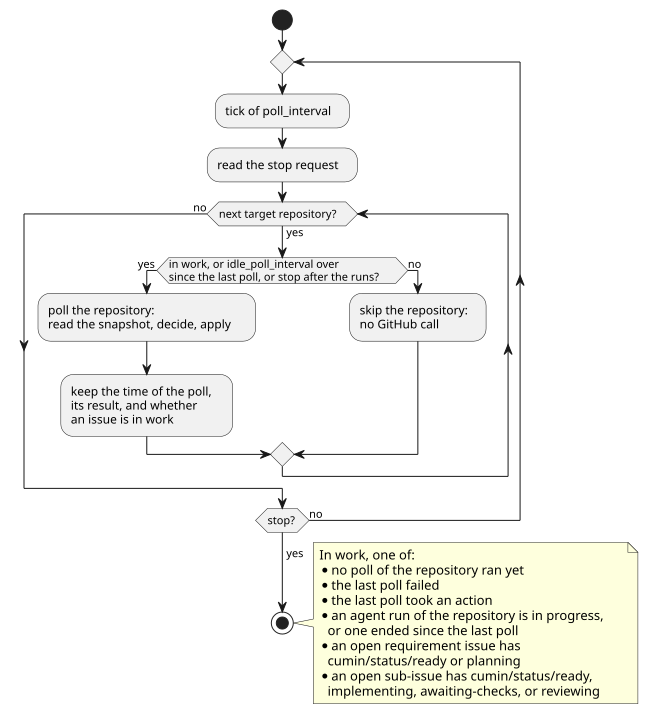
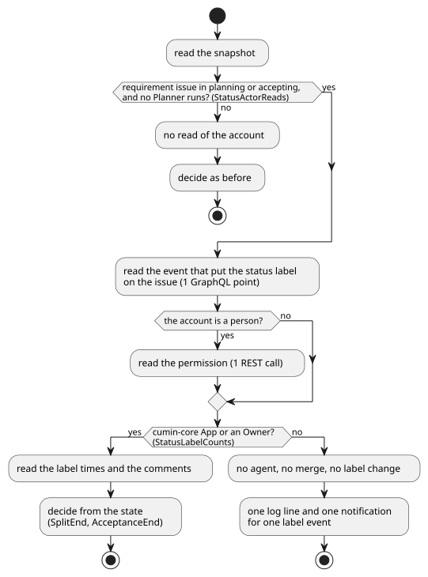
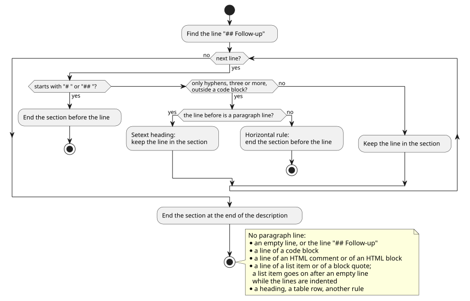
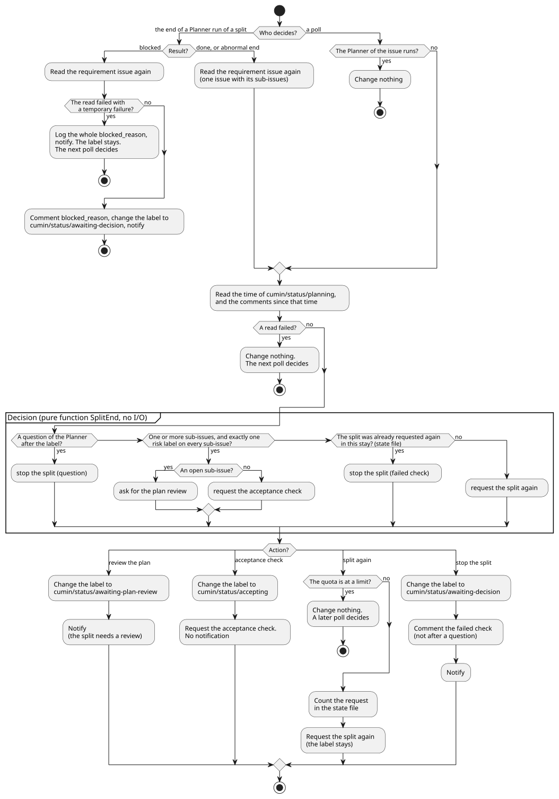

# 定期確認の設計

- 状態: Approved
- 要件: [Issueのラベルと状態遷移](../requirements/workflow/issue-states.md)、[cumin本体の要件](../requirements/cumin-core.md) の「GitHubの定期確認」「状態の管理」「Agentの起動」「設定」
- 事実の出どころ: [調査・実測で確定した制約](../evidence/measured-constraints.md) の行の番号 (「実測 N」と書く) か、公式ドキュメントのページの名前で示す。

定期確認の1回分 (GitHubを読み、判定し、着手し、実行の終わりを判定する) の設計を書く。issue-states.md の表の遷移を実現する決定は、この文書に足す。プログラム全体にまたがる決定 (Hostのファイル、Keychain、launchd、テストの2層、GitHubクライアント、riskの基準の受け渡し、起動前の使用率の確認) は [cumin本体の設計メモ](cumin-core.md) にある。

## 範囲

扱うこと:

- 定期確認と、そのきっかけで動く判定と動作の設計。`internal/workflow` が受け持つ範囲に当たる。

扱わないこと:

- 何をするか。要件文書にあり、ここでは繰り返さない。
- GitHubクライアントの認証、問い合わせの上限、REST と GraphQL の使い分け。[cumin本体の設計メモ](cumin-core.md) の「GitHubクライアント」にある。
- 1回のAgentの実行 (作業場所、CLIの起動、環境、時間の上限)。[Agentの実行の設計](agent-run.md) にある。

## 設計

### 定期確認の間隔

図の元ファイル: [poll-interval.puml](poll-interval.puml)

- cuminは `poll_interval` ごとに、対象のリポジトリを順に見る。作業中のリポジトリは毎回確かめる。作業中でないリポジトリは、前回の定期確認から `idle_poll_interval` が過ぎるまで飛ばす。飛ばすときは、GitHubを1回も呼ばない (cumin本体の要件の「GitHubの定期確認」、テスト26)。
- 作業中とは、次のどれかである。
  - そのリポジトリの定期確認を、まだ1回もしていない。
  - 前回の定期確認が失敗した。動作の1つが失敗したときも含む。
  - 前回の定期確認で、何か動作をした。Maintainerの承認とMaintainerのレビューの候補 (「start the merge」、「send back for changes」) は、mergeか差し戻しまで進んだときだけ動作に数える。候補は、Maintainerが動くまで毎回の判定に出るためである。
  - そのリポジトリでAgentの実行が進んでいる。または、前回の定期確認のあとに実行が終わった。
  - 前回のスナップショットに、`cumin/status/ready` か `cumin/status/planning` の開いている要求Issueがある。
  - 前回のスナップショットに、`cumin/status/ready`、`cumin/status/implementing`、`cumin/status/checking`、`cumin/status/reviewing` の開いているsub-issueがある。
- 判定は `internal/workflow` の純粋関数である。`Snapshot.HasIssueInWork` がスナップショットからIssueを見て、`RepositoryInWork` が前回の定期確認の結果と実行の有無から作業中かを返し、`PollIsDue` が前回からの時間と2つの間隔から、今回確かめるかを返す。時計を読むのは `Service.Poll` である。
- 前回の定期確認の時刻と結果は、リポジトリごとにメモリに持つ。GitHub上の事実ではないが、失っても作業を失わない。cuminが起動し直すと、全てのリポジトリを1回確かめるだけである。
- 作業中でないリポジトリが気付く速さ。Maintainerが `cumin/status/ready` を付ける、Pull Requestを承認する、レビューで差し戻す、のどれにも、最長で `idle_poll_interval` (初期値は5分) のうちに気付く。気付いた定期確認は動作をするか、作業中のIssueを読むので、次の定期確認は `poll_interval` のあとに来る。
- 実行が終わると、ラベルが作業中のものでなくても、次の `poll_interval` で確かめる。mergeの手順は、実装Issueのラベルを作業中のものにしないまま進むので、実行の終わりを別に覚える。受け入れの確認 (「request the acceptance check」) の間は、要求Issueが `cumin/status/accepting` なので、作業中のIssueとして読む。
- 時間の比べ方。`poll_interval` の刻みは、わずかに早く来ることがある。前回からの時間が `idle_poll_interval` に `poll_interval` の半分だけ足りなくても、確かめる。足りないからと次の刻みまで待つと、5分のはずが6分になるためである。`idle_poll_interval` が `poll_interval` の倍数でないときは、いちばん近い刻みで確かめる。
- リポジトリは、それぞれ別に判定する。作業中でないリポジトリを飛ばしても、他のリポジトリの定期確認は `poll_interval` のままである。
- 実行を待ってから止める間 ([cumin本体の設計メモ](cumin-core.md) の「実行を待ってから止める」) は、どのリポジトリも飛ばさない。最後の定期確認が全てのリポジトリを読む、という止め方を変えないためである。
- フォローアップノートを書けなかった定期確認 (コメントの読み取りの失敗) は、失敗に数えない。動作も作業中のIssueもなければ、次に試すのは `idle_poll_interval` のあとである。受け入れの確認が遅れるだけで、作業は失われない。
- 待ち状態の通知 (「tell that cumin waits」) は変わらない。飛ばしたリポジトリは、動作もなく、cuminがMaintainerなしで進めるIssueもないリポジトリだからである。Agentの起動が利用枠だけで待っているという記録は、飛ばした定期確認では消えず、そのリポジトリを次に読むまで残る ([利用枠の設計](quota.md) の「通知の重複の防ぎ方」)。
- ログ。作業中でなくなったときと、作業中に戻ったときに、リポジトリごとに1行ずつ出す。飛ばすたびには出さない。
- `idle_poll_interval` が0のとき (テストが `Service` を直に作るとき) は、飛ばさない。設定ファイルからは、`poll_interval` より短い値を指定できない。

### 定期確認で読む内容

対象のリポジトリごとに、開いていて `cumin/type/requirement` の付いたIssueを起点にして、次を読む。Pull Requestとその下の項目は、2つ目の問い合わせで読む (下の「2つの問い合わせ」)。項目の名前は、GraphQLのスキーマで確かめた (実測 55 と、2026-09-20 の introspection)。

| 読むもの | 項目 | 使う行 |
|---|---|---|
| 要求Issueと、そのsub-issue。番号、id、開閉、今のラベル | `Issue.subIssues`、`labels` | 要求Issueの遷移、「request the implementation」 |
| 要求Issueとsub-issueの題。sub-issueの題は、依頼のブランチの名前に使う。どちらの題も、モニターファイルの `agents[].title` と `waiting[].title` に載せるだけで、判定には使わない ([モニターファイルとメニューバーのアプリの設計](status-menu-bar.md))。スカラーなので、問い合わせのコストは変わらない | `Issue.title` | 「request the implementation」 |
| sub-issueのGraphQLのid。「wait for the checks」がリンクを付けるときに使う。スカラーなので、問い合わせのコストは変わらない | `Issue.id` | 「wait for the checks」 |
| 状態ラベルが付いた時刻。定期確認の問い合わせとは別の、小さな問い合わせで読む (「ラベルの時刻の読み取り」) | `timelineItems(itemTypes: [LABELED_EVENT, UNLABELED_EVENT])` の `createdAt` と `label` | 「mark the requirement as in work」、レビューのラウンド、「send back for changes」、「stop for missing checks」 |
| 最新の `cumin/status/ready` を付けたアカウント。着手の候補 (「request the split」、「request the implementation」) では判定の前に、ほかの起動ではAgentを起動する前に、別の小さな問い合わせで読む (「Maintainerのreadyの確認 (request the split、request the implementation)」「Issue Ownerのログイン名の読み取り」) | `timelineItems(itemTypes: [LABELED_EVENT, UNLABELED_EVENT])` の `createdAt`、`label`、`actor { __typename login }` | 「request the split」と「request the implementation」の条件 (Maintainerのready)、起動の依頼の事実 (どのroleでも) |
| blocked by のIssueの開閉。要求Issueとsub-issueの両方 | `Issue.blockedBy` | 「request the split」、「request the implementation」 |
| Issueを閉じる、開いているPull Request。番号、作成者、先頭のコミット、ブランチの名前 | `Issue.closedByPullRequestsReferences`、`author { __typename login }`、`headRefOid`、`headRefName` | 「request the implementation」、「wait for the checks」 (リンクがあるか)、「request a check fix」、「stop for failed checks」、「start the merge」、「ask for the merge decision」、「copy the labels to the pull request」 |
| 開いているPull Requestの、今のラベル | `PullRequest.labels` | 「copy the labels to the pull request」 |
| 開いているPull Requestが、既定のブランチにmergeできるか。`MERGEABLE`、`CONFLICTING`、`UNKNOWN` の3つ | `PullRequest.mergeable` | 「request a conflict resolution」、mergeの手順 |
| 先頭のコミットの時刻 | `PullRequest.commits(last: 1)` の `commit { oid committedDate }` | 「stop for missing checks」 |
| レビュー。出した人、結果、対象のコミット、時刻 | `PullRequest.reviews` の `author`、`state`、`commit`、`submittedAt` | 「request a review fix」、「start the merge」、「ask for the merge decision」、「request the cause」、「stop at the round limit」、レビューのラウンド |
| 先頭のコミットのcheckの結果 | `PullRequest.statusCheckRollup` の `contexts` | 「request the review」、「request a check fix」、「stop for failed checks」 |
| 既定のブランチと、その先頭のコミット | `Repository.defaultBranchRef` の `name` と `target.oid` | リポジトリの設定 |
| リポジトリの設定とriskの基準 | `Repository.object(expression: "HEAD:.cumin/config.toml")` と同 `.cumin/risk-criteria.md` の `Blob` の `oid`、`text`、`byteSize`、`isBinary`、`isTruncated` | リポジトリの設定 |

図の元ファイル: [poll-snapshot.puml](poll-snapshot.puml)

2つの問い合わせ:

- 1回の定期確認は、GitHubを2つの問い合わせで読む。1つ目 (`snapshotQuery`) はsub-issueまでで止まり、番号、id、題、開閉、閉じた時刻、ラベル、blocked by を読む。2つ目 (`pullRequestsQuery`) は、選んだsub-issueだけについて、Issueを閉じる開いているPull Request (`closedByPullRequestsReferences` と、その下の全ての項目) を読む。上の表のPull Requestの行は、どれも2つ目の問い合わせで読む。
- 1つ目の問い合わせは、sub-issueを12件ずつのページで読む (`subIssues(first: 12)` と `pageInfo { hasNextPage endCursor }`)。12件は、1回の分割の上限である。`hasNextPage` のIssueだけ、そのIssue 1つの問い合わせ (`subIssuePageQuery`) で、`after` を付けて次のページを読む。3ページ、36件までである。分割し直した要求Issueは、前の分割の閉じたsub-issueを持ち続けるためである。36件を超えるIssueは、全部を読めないIssueである (下の「全部を読めないIssue」)。次のページは1ページごとに1ポイントで、どのIssueも12件以下の定期確認では、問い合わせの数もポイントも増えない (2026-10-08にcumin-worksで実測)。スナップショットのポイントの合計は、次のページのポイントを含む。1つの要求Issueの読み取り (`ReadRequirementIssue`) も、同じページで読む。ラベルの時刻の問い合わせと、ラベルを付けたアカウントの問い合わせも、sub-issueを12件ずつのページで、36件まで読む。
- 分ける理由はポイントである。Pull Requestは、1ページ17ポイントのうち14ポイントを占めていた (2026-10-03に実測、[#421](https://github.com/cloveclovedev/cumin-works/pull/421))。今の値は、下の「ポイント」の項目にある。Pull Requestを読む行が当てはまるsub-issueは、少ない。
- 選ぶのは、開いていて `cumin/status/*` のラベルが付いたsub-issueである。`internal/workflow` の純粋関数 `Snapshot.SubIssuesWithPullRequestRules` が、1つ目の読み取りから選ぶ。選んだsub-issueがなければ、2つ目の問い合わせを送らない。
- `Service.Poll` が、2つの読み取りから1つのスナップショットを作る (`Snapshot.WithPullRequests`)。`Decide` と各行の判定は、そのスナップショットだけを読む純粋関数のままである。選ばなかったsub-issueは、Pull Requestなしでスナップショットに入る。
- `cumin status` はラベルだけを読むので、1つ目の問い合わせだけを送る。

選んだsub-issueが、Pull Requestを読む行の対象を全て含む理由:

| 行 | 対象のsub-issue | 含む理由 |
|---|---|---|
| 「request the implementation」 (readyの実装Issueに着手) | 開いていて `cumin/status/ready` | `cumin/status/ready` は状態ラベルである |
| 「request the review」 (checkが通り、reviewへ)、「request a check fix」 (checkが失敗し、修正へ)、「request a conflict resolution」 (衝突の解消の依頼)、「stop for missing checks」 (checkが結果を返さない) | 開いていて `cumin/status/checking` | `cumin/status/checking` は状態ラベルである |
| 「start the merge」 (Maintainerの承認のあとのmerge)、「send back for changes」 (Maintainerの指摘への対応の依頼)、「request a conflict resolution」 (衝突の解消の依頼) | 開いていて `cumin/status/awaiting-merge-decision` | `cumin/status/awaiting-merge-decision` は状態ラベルである |
| 「copy the labels to the pull request」 (Pull Requestにラベルを写す) | 開いていて状態ラベルのあるsub-issue | cuminが作るPull Requestは、状態ラベルのある実装Issueのものである。状態ラベルが変わるたびに、選んだsub-issueとして写す |

- 「copy the labels to the pull request」は、状態ラベルのない開いたsub-issueと、閉じたsub-issueのPull Requestには、ラベルを写さなくなる。閉じたsub-issueのPull Requestはmerge済みで、開いていない。Maintainerが状態ラベルを全て外したsub-issueでは、Pull Requestに前のラベルが残り、Maintainerが次に状態ラベルを付けたときに写し直す。写したラベルは判定に使わない (原則5) ので、判定は変わらない。
- 実行終了の判定 (「wait for the checks」、「request a review fix」、「start the merge」、「ask for the merge decision」、「request the cause」、「stop at the round limit」、「stop the review」) は、定期確認ではなく、1つのIssueの読み取りでPull Requestを読む (「実行終了のあとの読み取り」)。この読み取りは変わらない。

読む時点が2つになっても判定が正しい理由:

- 判定の入口は、1つ目の時点のsub-issueのラベルである。Pull Requestの事実は、それよりあとの2つ目の時点のものになる。1つの行が読むPull Requestの事実 (先頭のコミット、check、レビュー、`mergeable`) は、どれも2つ目の問い合わせの1回の応答から来るので、互いに食い違わない。
- 動作は、どの行でも読み取りよりあとに起きる。問い合わせが1つのときも、スナップショットは動作の時点より古かった。各動作は、ラベルを先に替えることと、動作の前の確かめ (mergeの手順の読み直しなど) で、これに耐えるように作ってある。2つ目の時点は動作に近いので、Pull Requestの事実はむしろ新しくなる。
- 2つの時点のあいだにsub-issueへ状態ラベルが付いたとき。そのsub-issueは選ばれず、Pull Requestなしで入る。そのsub-issueに当てはまる行は、1つ目の時点のラベルで判定するので、今回は出ない。次の定期確認で読む。ラベルが1つ目の読み取りの直後に付いたときと同じである。
- 2つの時点のあいだにPull Requestがmergeされるか閉じられたとき。sub-issueは開いたまま、Pull Requestなしで入る。「request the review」、「request a check fix」、「stop for failed checks」、「start the merge」、「send back for changes」、「request a conflict resolution」、「stop for missing checks」は、Pull Requestがなければ何もしない。「request the implementation」は、Pull Requestがなければ新しいブランチで依頼する。これは、問い合わせが1つのときに、Maintainerが手でPull Requestを閉じたあとのスナップショットと同じ形である。
- 2つの時点のあいだにPull Requestが開いたか、pushが入ったとき。新しいほうの事実で判定する。1つ目の時点より古い事実で判定することはない。
- 2つの時点のあいだにsub-issueが消えたか、別のリポジトリへ移ったとき。2つ目の問い合わせがエラーを返し、そのリポジトリの今回の定期確認を止める。欠けたスナップショットでは判定しない。

全部を読めないIssue (cumin本体の要件の「全部を読めないIssue」):

- 上限を超えたIssueは、定期確認のエラーにしない。1つ目の問い合わせの上限は、要求Issueかそのsub-issueの、sub-issue (36件)、ラベル (100件)、blocked by のIssue (100件) である。2つ目の問い合わせの上限は、sub-issueの開いているPull Request (2件) と、Pull Requestのラベル、check、レビュー (100件ずつ) である。
- `ReadSnapshot` は、全部を読めた要求Issueだけを返す。上限を超えたIssueは、別の一覧 (`RepositorySnapshot.Unread`) に入れる。一覧の1件は、要求Issueの番号、上限を超えたIssueの番号、上限の文章 (例: `more than 36 sub-issues`) である。`ReadPullRequests` も、上限を超えたsub-issueを同じ形で返す (`PullRequestsRead.Unread`)。
- sub-issueの1つが上限を超えたら、その要求Issueを、全てのsub-issueと一緒にスナップショットから外す (`Snapshot.WithoutRequirementIssues`)。外すのは、2つの読み取りから1つのスナップショットを作るところ (`readSnapshot`) である。判定も、そのあとの読み取り (ラベルの時刻、ラベルを付けたアカウント、コメント) も、そのIssueを見ない。だから、ラベルは替わらず、Agentも起動しない。
- 外した要求Issueの作業は、同時に進めるIssueの数に数え続ける。判定はそのIssueを動かさないが、作業は続いているためである。数えないと、着手が `max_issues_in_progress` を超える。読めた分 (`Snapshot.Unread`) を、`inProgress` だけが読む。数え方はほかのIssueと同じで、状態ラベルで数える。ラベルが上限を超えたIssueは、状態ラベルを読めていないかもしれないので、進めている1件として数える。36件を超えた分のsub-issueは、読んでいないので数えない。
- 定期確認は、全部を読めないIssueごとにログに1行 (warn) 出す。行には、Issueの番号 (`issue`)、要求Issueの番号 (`requirement_issue`)、上限 (`limit`) が入る。定期確認はエラーを返さないので、「定期確認が続けて失敗したとき」の数にも入らない。ほかのIssueは、同じ定期確認で今までどおり進む。通知は、1回だけである (「全部を読めないIssueの通知」)。
- 上限のほかの読み取りの失敗は、今までどおり、そのリポジトリの定期確認のエラーである。GraphQLのエラー、次のページの読み取りの失敗、知らない値 (`mergeable`、checkの種類、Issueの状態)、誤った `.cumin/config.toml` がこれに当たる。
- Agentの実行が終わった直後の1つのIssueの読み取りでは、上限を超えたIssueは、Issueの番号を示すエラーのままである (「実行終了の判定」)。
- 採らなかった案: 上限を超えたsub-issueだけを外し、要求Issueと残りのsub-issueは進める。要求Issueの判定 (全てのsub-issueが閉じたか) が、欠けた一覧の上で動くことになる。

2つ目の問い合わせの上限とポイント:

- sub-issueは、1つ目の問い合わせで読んだidで指定する (`nodes(ids:)`)。1回に100件までで、101件ではGitHubがエラーを返す (2026-10-03 にcumin-worksで実測)。選んだsub-issueが100件を超えるときは、100件ごとに分けて送る。
- Pull Requestは1つのsub-issueに2件まで、その下のラベル、check、レビューは100件までである。超えたsub-issueは、全部を読めないIssueである (上の「全部を読めないIssue」)。上限は、1つのIssueの読み取りと同じ値である。
- ポイント (2026-10-03 にcumin-worksで `rateLimit { cost }` を実測)。1つ目の問い合わせは1ページ3ポイントである。2つ目の問い合わせは、sub-issueが1件でも9件でも1ポイント、100件で9ポイントである。

Pull Requestの読み方:

- 読むのは、開いているPull Requestだけである (`includeClosedPrs` を付けない)。定期確認の判定でPull Requestを見る行は、どれも開いているPull Requestを対象にする。閉じたPull Requestは「wait for the checks」に通らず、merge済みのPull RequestはIssueを閉じるので、判定の対象にならない。閉じたPull Requestまで読むと、Maintainerの対応待ちや閉じたIssueに溜まった古いPull Requestが1つのIssueで上限 (5件) に達し、そのリポジトリの定期確認が止まりうる。開いているものだけなら、通常は1つのIssueに1件で、上限には届かない。
- merge済みのPull Requestが要るのはフォローアップノート (write the follow-up note) だけで、下に書いたとおり別に読む。

- GraphQLの `author` は、GitHub Appが作ったPull Requestでは `Bot` 型で、`login` に `[bot]` が付かない (2026-09-22 にsandboxで実測)。RESTの `user.login` と、Agentがコミットに使う身元は `<slug>[bot]` である。GitHubクライアントが `Bot` の `login` に `[bot]` を足して、判定には `<slug>[bot]` の形だけを渡す。
- 作成者のアカウントが消えていると `author` は null になる。判定には空の作成者として渡す。

mergeできるかと、先頭のコミットの時刻の読み方:

- `mergeable` は、GitHubの3つの値 (`MergeableState`) をそのまま、専用の型でスナップショットに入れる。3つ以外の値が来たら、そのリポジトリの定期確認をエラーにする。意味を知らない値の上で判定しないためである。`UNKNOWN` は、GitHubがまだ計算している印であり、エラーではない。
- 先頭のコミットの時刻は、`Commit.committedDate` である。`Commit.pushedDate` は、GitHubがもう返さない (スキーマに「no longer supported」とある)。項目は、公式のGraphQL reference (Objects の `PullRequest` と `Commit`、Enums の `MergeableState`) と、2026-10-03 の introspection で確かめた。
- 先頭のコミットは、`commits(last: 1)` で読む。`PullRequest.headRef` は接続ではないのでコストを変えないが、cumin-worksの開いているPull Requestで `null` を返したので使わない (実測 128)。
- `commits(last: 1)` のコミットが `headRefOid` と違うとき (2つの項目のあいだにpushが入ったとき) は、時刻を空にする。次の定期確認で読み直す。時刻が空のあいだ、「stop for missing checks」は決めない。
- `mergeable` は、「request a conflict resolution」の判定が読む (「checkを待つ間の衝突の解消の依頼 (request a conflict resolution)」)。`cumin/status/merging` の中の手順も、読み直した値を読む (「mergeの手順 (start the merge、ask for the merge decision)」)。先頭のコミットの時刻は、「stop for missing checks」の判定が読む (「必須のcheckが結果を返さないときの停止 (stop for missing checks)」)。mergeの手順 (「start the merge」) が、mergeを断られたあとにRESTで読む `mergeable` は、これとは別で、変わらない。

ラベルが付いた時刻の使い方:

- 「mark the requirement as in work」は、sub-issueに `cumin/status/ready` が付いた時刻が、要求Issueに `cumin/status/awaiting-plan-review` または `cumin/status/awaiting-acceptance` が付いた時刻よりあとかどうかで判定する。
- レビューのラウンドは、実装Issueに最後に `cumin/status/ready` が付いた時刻と、`cumin-reviewer` の最後の `APPROVE` の時刻の、新しいほうよりあとに出たレビューを数える (「レビューのラウンドの数え方」)。
- 「stop for missing checks」の待ち時間は、実装Issueに最後に `cumin/status/checking` が付いた時刻と、先頭のコミットの時刻の、遅いほうから数える。cuminは、ラベルの時刻をsub-issueごとにスナップショットに入れる。
- 「send back for changes」は、Maintainerのレビューが出された時刻が、実装Issueに最後に `cumin/status/awaiting-merge-decision` が付いた時刻よりあとかどうかを見る。cuminは、この時刻をsub-issueごとにスナップショットに入れる (「Maintainerのレビューへの対応の依頼 (send back for changes)」)。
- 同じラベルが何度も付くので、ラベルごとに、そのラベルを最後にIssueに付けたイベントを使う (「ラベルを付けたイベントの決まり」)。今付いているかどうかは、`labels` で見る。

閉じた要求Issueと、そのsub-issueは読まない。cuminは、閉じた要求Issueには何もしないためである (Issueのラベルと状態遷移の原則6)。

Pull Requestのラベルは、「copy the labels to the pull request」でIssueのラベルと比べるためだけに読む。判定には使わない (原則5)。

ブランチの名前を読むのは、続きの依頼のためである。Issueを閉じる開いているPull Requestがあるときは、その名前をそのまま使い、題から作り直さない。

checkの結果の読み方:

- `statusCheckRollup` の `contexts` は、check run (GitHub Actionsなど) と commit status の2種類を返す。cuminは、どちらからも名前 (`CheckRun.name`、`StatusContext.context`) と結論だけを読む。必須のcheckの一覧が、この名前で書かれているためである。
- 結論は、通った (`SUCCESS`、`SKIPPED`、`NEUTRAL`)、落ちた、まだ終わっていない、の3つに畳む (実測 51)。終わっていない check run (`status` が `COMPLETED` でない) と、`EXPECTED`、`PENDING` の commit status は、まだ終わっていないものとして扱う。
- 知らない種類の context が来たら、そのリポジトリの定期確認をエラーにする。読めない check の上で「request the review」を通すより、止まって知らせるほうがよい。
- 必須のcheckがGitHub Appに紐づいているとき (rulesetの `integration_id`。sandboxの `cumin-protected-paths` がそれである) は、そのAppが出したcheckだけが条件を満たす。GitHubも同じに扱う。cuminは、必須のcheckのAppのidと、check runの `checkSuite.app.databaseId` を持ち、名前とAppの両方で照らす (「request the review」、「request a check fix」と「stop for failed checks」が使う)。commit statusにはAppのidがないので、Appを指定した必須のcheckは満たせない。この項目を足してもコストは変わらない (接続ではないため)。
- 必須のcheckの一覧は、この問い合わせでは読めないのでRESTで読む (`GET /repos/{owner}/{repo}/rules/branches/{branch}`、実測 53)。読むのは、`cumin/status/checking` のIssueがそのリポジトリに1つ以上あるときだけである。RESTの上限はGraphQLと別なので、問い合わせのポイントは増えない。
- ラベル、checkの結果、レビュー、先頭のコミット (`commits`) は、Pull Requestの下の接続なので、1件のPull Requestにつき1ずつコストの係数を上げる。これらの接続は2つ目の問い合わせにあり、選んだsub-issueだけについて読む。Pull Requestを2件までにして、2つ目の問い合わせを、sub-issueが9件までで1ポイント、100件で9ポイントに収めている (2026-10-03に実測、[#449](https://github.com/cloveclovedev/cumin-works/pull/449))。接続の中の件数 (ラベル、check、レビュー、blocked by) はコストを変えないので、100件まで読む。式と見積もりは [cumin本体の設計メモ](cumin-core.md) の「GitHubクライアント」にある。

失敗したcheckの内容の読み方 (「request a check fix」の依頼に入れる):

- 落ちた必須のcheckごとに、RESTで2つ読む。check runのannotation (`GET /repos/{owner}/{repo}/check-runs/{id}/annotations`) と、そのjobのログの終わり (`GET /repos/{owner}/{repo}/actions/jobs/{job_id}/logs`) である。check runのidとjobのidは、先に読む `GET /repos/{owner}/{repo}/commits/{sha}/check-runs` から取る。jobのidは `details_url` の最後の部分である (実測 54)。
- 落ちたcheckだけを読む。通ったcheckには呼び出しを出さない。annotationは `failure` のものだけを採る。
- ログは終わりだけを採る。jobが失敗した理由は終わりにあるためである。読みながら末尾の2,000バイトだけを残すので、ログが長くてもメモリは増えない。上限の64MiBに達したときは、そこで読むのをやめ、「ここで読むのをやめた。jobの終わりではない」と文章の先頭に書く。1つのcheckの文章は4,000バイトまでにし、切ったことを文章に書く。切る位置は文字の切れ目に合わせる。この3つの数は、要件の設定の表にないので、コードの定数にする。
- 必須のcheckがAppを指定しているときは、そのAppのcheck runの内容だけを読む。判定 (「request the review」、「request a check fix」、「stop for failed checks」) と同じ決まりである。同じ名前のcheckを2つのAppが出していても、別のAppの内容が混ざらない。結果は、落ちた必須のcheckの並びで返す。同じ名前を2つのrulesetが別のAppで求めていても、それぞれの文章が残る。
- annotationは全てのページを読む。失敗のannotationが、警告100件の次のページにあることがあるためである。集めた失敗が文章の上限を超えたら、そこで読むのをやめる。
- 読めなかったときは、エラーにしない。文章はcheckの名前と「内容を読めなかった」だけになり、警告をログに出す。名前だけでも依頼を出す価値があるためである。commit statusにはcheck runがないので、この道に入る。
- 読むのは、落ちたcheck runだけである。同じ名前のcheck runが2つあり、あとの1つが通っている (定期確認のあとにやり直された) ときに、通ったほうの内容を「失敗の内容」として渡さないためである。
- jobのログを読むのは、`details_url` が `/actions/runs/<番号>/job/<番号>` の形のときだけである。GitHub Actions以外のAppの `details_url` は、そのAppのものであり、末尾の数字はjobの番号ではない。
- 公開リポジトリでは、Checks と Actions の権限がなくても読める (実測 54)。privateリポジトリでは読めないことがあるが、v0.1の対象は公開リポジトリである。

フォローアップノート (write the follow-up note) で使うものは、閉じたsub-issueについてだけ、別に読む (「フォローアップノート (write the follow-up note)」)。

### レビューのラウンドの数え方

- レビューは、定期確認の問い合わせで、開いているPull Requestごとに100件まで読む。出した人 (Appは `<slug>[bot]` の形)、結果 (`state`)、対象のコミット、出した時刻、アドレスである。100件を超えるPull Requestがあれば、他の接続と同じく、そのsub-issueを全部を読めないIssueとして扱う (「全部を読めないIssue」)。レビューの一部だけでラウンドを数えないためである。Pull Requestの下の接続が1つ増えるので、1ページのコストは11ポイントから14ポイントになった (2026-09-30にsandboxで実測。[cumin本体の設計メモ](cumin-core.md) の「GitHubクライアント」の式のとおり)。
- 実装Issueに最後に `cumin/status/ready` が付いた時刻は、「mark the requirement as in work」と同じラベルの時刻の問い合わせを、その実装Issueの番号で呼んで読む (「ラベルの時刻の読み取り」)。1ポイントである。読むのは、ラウンドが要る場面 (Reviewerへの依頼と、その実行の終わり) だけである。
- ラウンドに数えるのは、`cumin-reviewer` のレビューのうち、結果が `CHANGES_REQUESTED` のものである。`COMMENTED` だけのレビューはReviewerの結果ではなく (Reviewerの要件の「完了の条件」)、cuminが依頼し直すので、ラウンドに数えない。`PENDING` は、まだ出ていないレビューである。
- `DISMISSED` のレビューは、`APPROVE` と同じく数え直しの起点にする。GitHubは今の結果だけを返し、取り下げる前の結果を返さない。rulesetの "Dismiss stale pull request approvals when new commits are pushed" が取り下げるのは承認なので、`DISMISSED` の多くは元の `APPROVE` である。これをラウンドに数えると、その承認より前のラウンドが数え直されず、上限に早く達する。人が `CHANGES_REQUESTED` を取り下げたときはMaintainerの介入と同じなので、数え直してよい。
- 修正を求めたレビューのあとでは、数えた数がそのレビューのラウンドである。「request a review fix」は上限 (`max_review_rounds`) 未満で修正を依頼し、「request the cause」と「stop at the round limit」は上限で止める。次にReviewerに依頼するラウンドは、数えた数に1を足したものになる (「request the review」)。
- 2ラウンド目以降の依頼には、最後のラウンドのレビューの対象のコミットを入れる。Reviewerは、そこから今の先頭のコミットまでの差分と、前の指摘を見る。
- Reviewerの実行の終わりに確かめるのは、`cumin-reviewer` が最後に出したレビューである。結果は問わず (`PENDING` を除く)、`COMMENTED` だけのものも最後のレビューになる。
- 最後に承認したコミットは、`cumin-reviewer` のレビューのうち、結果が `APPROVED` で一番新しいものの対象のコミットである (`LastApprovedCommit`)。`cumin/status/ready` の時刻は見ない。Maintainerが付け直しても、承認した部分は変わらないためである。`DISMISSED` のレビューは数えない。GitHubは取り下げる前の結果を返さないので、承認だったかどうかが分からないためである。ほかの人の承認と、`PENDING` のレビューも数えない。
- 判定は、どれも `internal/workflow` の純粋関数 (`ReviewRounds`、`LastReviewedCommit`、`LastApprovedCommit`、`LatestReview`) である。GitHub上の事実だけから数えるので、cuminが再起動しても同じ数になる。

### ラベルの時刻の読み取り

- 「mark the requirement as in work」は、要求Issueに `cumin/status/awaiting-plan-review` または `cumin/status/awaiting-acceptance` が付いた時刻と、sub-issueに `cumin/status/ready` が付いた時刻を比べる。時刻は、GitHubがIssueのタイムラインに残す `LabeledEvent` の `createdAt` から読む。
- 定期確認の問い合わせには入れず、時刻が要る要求Issueのときだけ、別の問い合わせで読む。要るのは5つの場合である。1つは、要求Issueが `cumin/status/accepting` のときで、そのラベルが最後に付いた時刻を読む (Plannerの質問のコメントが、そのあとに書かれたかを見る)。1つは、「mark the requirement as in work」が成り立ちうるとき、つまり要求Issueが `cumin/status/awaiting-plan-review` または `cumin/status/awaiting-acceptance` で、`cumin/status/ready` の付いた開いているsub-issueがあるときである。もう1つは、`cumin/status/checking` の付いた開いているsub-issueがあるときで、そのsub-issueにラベルが最後に付いた時刻を読む (「stop for missing checks」の待ち時間の起点)。最後の1つは、`cumin/status/awaiting-merge-decision` の開いているsub-issueのPull Requestで、今の先頭のコミットに、人の `CHANGES_REQUESTED` のレビューがあるときで、そのsub-issueに `cumin/status/awaiting-merge-decision` が最後に付いた時刻を読む (「send back for changes」)。残りの1つは、要求Issueが `cumin/status/planning` で、Plannerが動いていないときで、そのラベルが最後に付いた時刻を読む (質問のコメントが、そのあとに書かれたかを見る)。判定の純粋関数 (`NeedsLabelTimes` と、`cumin/status/planning` では `SplitNeedsFacts`) がこれを決める。
- 1回の問い合わせで、要求Issueと、そのsub-issueの1ページ (12件) のタイムラインを読む。`hasNextPage` のIssueだけ、同じ問い合わせに `after` を付けて次のページを読む。3ページ、36件までで、36件を超えるIssueは、Issueの番号を示すエラーにする。ページの大きさとページの数は、スナップショットの定数を使う。各Issueは、新しいほうから100件の `LabeledEvent` と `UnlabeledEvent` を読み (`last: 100`)、ラベルごとに、そのラベルを最後にIssueに付けたイベントの時刻を使う (「ラベルを付けたイベントの決まり」)。同じラベルが付いたり外れたりするためである。コストは1ページごとに1ポイントである (2026-09-29にcumin-worksで実測。`UnlabeledEvent` を足したあとも1ポイントで、2026-10-05に実測した。`after` を付けたページも1ポイントで、2026-10-08に実測した)。sub-issueが12件以下のIssueは、今までどおり1回の問い合わせで読む。
- 読むのは状態ラベルがその形のあいだだけなので、ふだんの定期確認のコストは変わらない。要求Issueが `cumin/status/accepting` の間と、`cumin/status/planning` でPlannerが動いていない間と、Maintainerが分割結果を確認している間 (前の分割の `cumin/status/ready` が残っているとき) と、sub-issueがcheckを待っている間と、Maintainerの `CHANGES_REQUESTED` が今の先頭のコミットに残ったままsub-issueがMaintainerの判断を待っている間は、その要求Issueごとに、定期確認のたびに1ポイント増える。1つの要求Issueで2つ以上が要るときも、問い合わせは1回である。
- `cumin/status/checking` の時刻だけが読めなかったときは、ほかの行を止めない。「mark the requirement as in work」が成り立ちえない要求Issueでは、着手 (「request the implementation」) も待たない。
- 読めなかったときは、「send back for changes」の候補にしない。Issueは `cumin/status/awaiting-merge-decision` のままなので、次の定期確認でやり直す。
- 読めなかったときは、ログに出して、「mark the requirement as in work」をその定期確認では判定しない。その要求Issueのsub-issueの着手 (「request the implementation」) も、次の定期確認まで待つ。着手すると `cumin/status/ready` が外れ、「mark the requirement as in work」が二度と成り立たなくなるためである。「mark the requirement as in work」がラベルを替えられなかったときも、同じ理由で待つ。ほかの行は進める。
- 採らなかった案: 定期確認の問い合わせに、sub-issueごとのタイムラインを入れる。1ページに要求Issue 10件 x sub-issue 12件のタイムラインが加わり、ページを小さくしても、「mark the requirement as in work」が要らない定期確認のたびにコストが増える。

### ラベルを付けたイベントの決まり

- ラベルを付けたアカウントと、ラベルが付いた時刻は、同じ1つのイベントから読む。そのラベルの最後の `UnlabeledEvent` のあとの、最初の `LabeledEvent` である。読んだイベントの中にそのラベルの `UnlabeledEvent` がなければ、読んだ中で最初の `LabeledEvent` である。ラベルが外れたあとも、最後に付けたイベントが答える (レビューのラウンドが使う、最後の `cumin/status/ready` の時刻)。
- 間に `UnlabeledEvent` のない、同じラベルのあとの `LabeledEvent` は数えない。付いているラベルは、もう一度付けられないので、そのイベントはラベルをIssueに付けたイベントではない。
- 理由は、GitHubが `LabeledEvent` を遅れて、別のアカウントで記録することがあるためである ([調査・実測で確定した制約](../evidence/measured-constraints.md) の141)。Maintainerが付けた `cumin/status/ready` のあとに、Issueを作ったGitHub Appの名前で同じラベルのイベントが記録された。一番新しいイベントを使うと、Maintainerのreadyが「Maintainerでない」になり、何も始まらない。
- 決まりは、`internal/platform/github` の関数 `puttingLabelEvents` の1つだけにある。ラベルの時刻の読み取り (`ReadLabelTimes`) と、ラベルを付けたアカウントの読み取り (`ReadLabelActor`、`ReadOwnLabelActor`) が、どれもこの関数を使う。`cumin/status/ready` も、ほかの状態ラベルも同じである。イベントは、タイムラインの順 (古いほうから) に見る。
- この文書の「最新の `cumin/status/ready` を付けたアカウント」「ラベルが最後に付いた時刻」は、どれもこのイベントのアカウントと時刻のことである。
- そのために、2つの問い合わせは `LabeledEvent` と一緒に `UnlabeledEvent` を読む (`itemTypes: [LABELED_EVENT, UNLABELED_EVENT]`)。コストはどちらも1ポイントのままである (2026-10-05にcumin-worksで実測。値は、この決まりを入れたPull Requestの説明にある)。定期確認のコストは変わらない。
- 読む100件は、付けたイベントと外したイベントを合わせた数になる。状態ラベルは替わるたびに2つのイベントを残すので、読める範囲は、状態の移り変わりのおよそ50回ぶんである。範囲の外のイベントの扱いは、前と同じである (「Issue Ownerのログイン名の読み取り」)。
- 読んだ100件の先頭より前にラベルが付いていて、範囲の中に繰り返しのイベントだけがあるときは、その繰り返しのイベントが答える。範囲の外は見えないためである。

### Issue Ownerのログイン名の読み取り

- 起動の依頼の事実「Issue Ownerのログイン名」([Agentに共通の要件](../requirements/agents/common.md) の「起動の依頼の事実」) のために、Agentを起動する前に、その実行が扱うIssueに最新の `cumin/status/ready` を付けたアカウントを読む。GitHubがIssueのタイムラインに残す `LabeledEvent` の `actor` から読む。
- 問い合わせは、ラベルの時刻の問い合わせと同じ形に `actor { __typename login }` を足したものである (`ReadLabelActor`)。1回で、そのIssueと、そのsub-issueの1ページ (12件) のタイムラインを、新しいほうから100件ずつ読む。Issue自身に、そのラベルを付けたイベント (「ラベルを付けたイベントの決まり」) があれば、それを使う。なければ、sub-issueごとのそのイベントの中で一番新しいものを使う (イベントのない要求Issue)。sub-issueを使うときだけ、ラベルの時刻の問い合わせと同じく、`hasNextPage` のIssueの次のページを `after` を付けて読む。3ページ、36件までで、36件を超えるIssueは、Issueの番号を示すエラーにする。1ページごとに1ポイントである。実装Issueにはsub-issueがないので、同じ問い合わせで足りる。
- そのアカウントがMaintainerかどうかは、「start the merge」と同じ読み取り (`RepositoryPermission`) と同じ判定 (`IsMaintainer`) で決める。Maintainerの定義は [cumin本体の要件](../requirements/cumin-core.md) の「Maintainer、Issue Owner、Operator」だけにある。次のどれかのときは、Issue Ownerのログイン名はない: イベントがない、`actor` がnull (アカウントがもうない)、`actor` が人ではない (`__typename` が `User` でない。GitHub Appは `Bot`)、権限がwrite未満である。人ではないときは、権限を読まない。
- コストは、GraphQLが1ポイント (2026-10-03にcumin-worksで実測。`LabeledEvent` に `actor` があることも、スキーマで確かめた) と、人のときのRESTの呼び出し1回である。起動のたびに増えるだけで、ふだんの定期確認のコストは変わらない。「request the split」と「request the implementation」の着手では、判定の前の読み取りを使うので、起動のときには増えない。
- 「request the split」と「request the implementation」では、判定の前の読み取り (「Maintainerのreadyの確認 (request the split、request the implementation)」) がスナップショットに入れた名前を使い、読み直さない。ほかの起動では、次のとおりに読む。
- 読むのは、ラベルを替える前である。順は、ログイン名を読む、ラベルを替える、依頼する、になる。読めなければ、ラベルを替えず、依頼もしない。次の定期確認でやり直す (「request the review」のラウンドの読み取りと同じ形)。ラベルを依頼より先に替えることは変わらない (原則3)。
- 読む場所は、定期確認が起動を決める所である: 「request the acceptance check」 (受け入れの確認)、「request the review」 (review)、「request a check fix」 (checkの修正)、「request a conflict resolution」 (checkまたはMaintainerの判断を待つ間の衝突の解消)、「send back for changes」 (Maintainerのレビューへの対応)、「start the merge」 (Maintainerの承認のあとのmerge) の衝突の解消。「start the merge」では、mergeが衝突したときだけ、ラベルを替える前に読む。読めなければ、Issueは `cumin/status/awaiting-merge-decision` のままなので、次の定期確認で「start the merge」がもう一度成り立つ。
- 1つの実行の続きで出す依頼は、その実行の前に読んだ名前を使い、読み直さない: 同じ実行の中の実装の依頼し直し、Reviewerの実行の終わりが決めた「request a review fix」の指摘の修正と「ask for the merge decision」のIssue Ownerのレビューの依頼、「start the merge」 (Reviewerの承認のあとのmerge) の衝突の解消。
- `cumin/status/reviewing` の出口 (「Reviewerへの依頼 (request the review、stop the review)」) では、次の依頼の前に読み直す: 定期確認が決めた「request a review fix」の指摘の修正と、「start the merge」のmergeが衝突したときの解消と、定期確認が決めた「ask for the merge decision」のIssue Ownerのレビューの依頼 (「mergeの手順 (start the merge、ask for the merge decision)」)。レビューの依頼し直しと「request the cause」の原因の整理は、定期確認が決めたときも、実行の終わりが決めたときも、依頼を組み立てる所 (`reviewRequestOf`) で読み直す。読めなければ、ラベルも状態ファイルも変えず、依頼もしない。Issueは `cumin/status/reviewing` のままなので、次の定期確認が同じ動作を決める。
- 読むのは、各Issueの新しいほうから100件のラベルのイベントだけである。最新の `cumin/status/ready` のあとに100件を超えるラベルのイベントがあると、そのイベントはないものとして扱う (要求Issueはsub-issueから読み、実装Issueは「ない」になる)。sub-issueから読むのは、依頼に書くログイン名だけである。「request the split」と「request the implementation」の条件の確認 (「Maintainerのreadyの確認 (request the split、request the implementation)」) は、sub-issueから読まず、「Maintainerでない」にする。
- 読んだ名前は、`internal/agent` が事実のかたまりに書く ([Agentの実行の設計](agent-run.md) の「Claude Codeの起動」)。
- 採らなかった案: ラベルの時刻の問い合わせに `actor` を足して、1つの問い合わせにまとめる。「mark the requirement as in work」とラウンドの読み取りは `actor` を使わず、2つの読み取りは使う場面も違うので、分けたままにした。

### Maintainerのreadyの確認 (request the split、request the implementation)

- 「request the split」と「request the implementation」は、そのIssueに最新の `cumin/status/ready` を付けたのがMaintainerであるときだけ成り立つ ([Issueのラベルと状態遷移](../requirements/workflow/issue-states.md) の「状態ラベルを付けたアカウント」)。そのため、判定の前に、着手の候補ごとに、付けたアカウントとその権限を読み、結果をスナップショットに入れる (`readReadyIssueOwners`)。
- 読むIssueは、純粋関数 `ReadyActorReads` が決める。「request the split」と「request the implementation」の候補 (開いていて、`cumin/status/ready` が付き、blocked by が全て閉じている。「request the implementation」では `cumin/type/owner-task` がない) を、着手の順 (優先度、Issueの番号) に並べて返す。同時に進めるIssueの数に空きがなければ、1つも返さない。着手の候補がない定期確認と、空きがない定期確認では、アカウントも権限も読まない。
- 読み取りは、「Issue Ownerのログイン名の読み取り」と同じ問い合わせである。ただし、そのIssue自身のイベントだけを使い、sub-issueのイベントには頼らない (`ReadOwnLabelActor`、`RepositoryPermission`、`IsMaintainer`)。候補には `cumin/status/ready` が付いているので、読んだ100件のイベントの中にreadyのイベントがなければ、「Maintainerでない」として扱う。sub-issueから読むと、triageのアカウントが要求Issueにreadyを付け、ほかのラベルを100回付け外ししてイベントを読む範囲の外に出すだけで、sub-issueのMaintainerのreadyで分割を始められてしまうためである。Maintainerの定義は、「start the merge」と同じ `IsMaintainer` だけにある。人ではないアカウントの権限は読まない。
- 着手の順に読み、Maintainerのreadyが空きの数だけ見つかったら、そこで止める。それよりあとの候補は、この定期確認では着手できないためである。
- スナップショットには、Issueごとに「読んだ」(`ReadyRead`) と、Issue Ownerのログイン名 (`ReadyIssueOwner`。Maintainerでなければ空) を入れる。判定 (`readyRequirementIssues`、`readySubIssues`) は、Maintainerのreadyと読めた候補だけを残す。Maintainerでない候補と、読んでいない候補は飛ばす。飛ばした候補は空きを使わないので、同じ定期確認で、ほかのMaintainerのreadyに着手する。
- Maintainerでないアカウントのreadyには、ラベルを替えず、依頼もしない。ログに1行 (warn) 残し、1回通知する。同じreadyのイベントについては、定期確認のたびに繰り返さない。伝えたイベントの時刻を、Issueごとにメモリに持つ (`readyTold`)。通知は多くても1回である: 送れなかったときも、ログにエラーを残すだけで、送り直さない。同じIssueに、Maintainerでないアカウントが新しくreadyを付けたときは、別のイベントなので、もう一度伝える。cuminが再起動すると、もう一度だけ伝える (失っても作業を失わない手元の状態)。
- 読めなかったときは、ログにエラーを出し、そのIssueは「読んでいない」のままにする。その定期確認では着手せず、次の定期確認で読み直す。ほかの行は進める。
- 待ち状態の通知 (「tell that cumin waits」) では、Maintainerでないreadyと読めたIssueを「Maintainerなしで進めるIssue」に数えない。読んでいないready (空きがない、読めなかった) は、これまでどおり数える (`MovesWithoutMaintainer`)。
- 実行を待ってから止める間は、新しい着手をしないので、読まない。
- コストは、読む候補1つにつき、GraphQLが1ポイントと、人のときのRESTの呼び出し1回である (「Issue Ownerのログイン名の読み取り」の実測)。着手するIssueでは、これまで起動の前に読んでいた分が判定の前に移るだけで、増えない。増えるのは、候補が着手できないまま残る間である: Maintainerでないready、利用枠で止まっている着手 (「stop agent starts」)、読み取りの失敗。その間は、定期確認のたびに、読む候補1つにつき同じコストがかかる。Maintainerのreadyが空きの数だけ見つかれば止めるので、1回の定期確認で読む数は、空きの数と、その前に並ぶMaintainerでないreadyの数の和までである。
- 確かめた公式のページ: GraphQLの [LabeledEvent](https://docs.github.com/en/graphql/reference/objects#labeledevent) (`actor`、`createdAt`、`label`)。2026-10-04に、スキーマの問い合わせ (`__type(name: "LabeledEvent")`) でも、`actor` が `Actor` (nullになりうる) であることを確かめた。権限は、RESTの [Get repository permissions for a user](https://docs.github.com/en/rest/collaborators/collaborators#get-repository-permissions-for-a-user) である (「start the merge」と同じ)。
- 採らなかった案: 着手を適用するとき (ラベルを替える直前) に確かめる。判定が、Maintainerでないreadyに空きを割り当ててしまい、同じ定期確認でほかのIssueに着手できない。判定の前に読めば、判定は純粋関数のままで、空きを正しく分けられる。
- 採らなかった案: 読んだ結果を、次の定期確認まで持ち越す。readyを付け直したことは、イベントを読まないと分からないので、候補であるあいだは毎回読む。

### 状態ラベルを付けたアカウントの確認

図の元ファイル: [poll-status-actor.puml](poll-status-actor.puml)

- cuminは、`cumin-core` のGitHub AppかMaintainerが最後に付けた状態ラベルだけを、状態として扱う ([Issueのラベルと状態遷移](../requirements/workflow/issue-states.md) の「状態ラベルを付けたアカウント」)。決まりは、純粋関数 `StatusLabelCounts` の1つだけにある。ラベルの名前と、そのラベルをIssueに付けたイベント (「ラベルを付けたイベントの決まり」) のアカウントと、`cumin-core` のログイン名を受け取り、数えるかどうかを返す。人は `IsMaintainer` で決める。GitHub Appは、`cumin-core` であるときだけ数える。GraphQLはGitHub Appのログイン名を `[bot]` なしで返すので、どちらの形でも同じとして比べる。`cumin/status/ready` は、Maintainerだけを数える (「Maintainerのreadyの確認 (request the split、request the implementation)」と同じ決まり)。アカウントがもうないとき、イベントが見つからないときは、数えない。
- 今、この確認をするのは、定期確認が状態から決める3つの状態である: 要求Issueの `cumin/status/planning` と `cumin/status/accepting`、実装Issueの `cumin/status/implementing` (「実行終了の判定」)。実装Issueの `cumin/status/reviewing` と `cumin/status/merging` (「mergeの手順 (start the merge、ask for the merge decision)」) でも確かめる。`checking` の決まりは、作るときに同じ関数 (`StatusLabelCounts`、`readStatusActor`) を呼ぶ。人を待つ状態は、Maintainerの操作でそこから出るときにMaintainerを確かめるので、対象にしない。例外は「request the acceptance check」である。要求Issueの `cumin/status/implementing` から出るときと同じく、`cumin/status/awaiting-plan-review` からも、状態ラベルを付けたアカウントを確かめずに出て、Plannerを起動する。
- 読むのは、cuminがその状態から動作を起こす直前だけである。読むIssueは、純粋関数 `StatusActorReads` が決める: `cumin/status/planning` か `cumin/status/accepting` の要求Issueで、Plannerが動いていないもの。Plannerが動いている間は、ラベルから何も決めないので、読まない。この2つの状態でPlannerが動いていないのは、ふつう、cuminの再起動のあとか、実行のあとの読み取りが失敗したあとの、1回の定期確認だけである。
- 読む場所は2つある。定期確認では、ラベルの時刻とコメントを読む前に読み、結果をスナップショットに入れる (`readStatusActors`。`StatusRead` と `StatusCounts`)。Plannerの実行の終わりでは、Issueを読み直したあと、ラベルの時刻とコメントの前に読む (`readRequirementFacts`)。実行の間にラベルが付け替えられることがあるためである。
- 判定 (`SplitEnd`、`AcceptanceEnd`) は、読めて、数えるラベルのときだけ動作を返す。数えないラベルと、読めなかったラベルでは、何も返さない。数えないラベルのIssueでは、ラベルの時刻もコメントも読まない (`SplitNeedsFacts`、`NeedsLabelTimes`、`NeedsComments`)。
- 数えないラベルには、Agentを起動せず、ラベルも替えない。ログに1行 (warn) 残し、1回通知する (`tellStatusOfAnother`)。同じラベルのイベントについては、定期確認のたびに繰り返さない。伝えたイベントの時刻は、readyと同じメモリ (`readyTold`) に持つ。1つのIssueの状態ラベルは1つなので、Issueごとに1つの時刻で足りる。cuminが再起動すると、もう一度だけ伝える。
- 読み取りは、「Maintainerのreadyの確認 (request the split、request the implementation)」と同じ問い合わせである (`ReadOwnLabelActor`)。答えるイベントは、そのラベルをIssueに付けたイベントである (「ラベルを付けたイベントの決まり」)。そのIssue自身のイベントだけを使い、新しいほうから100件の中にそのラベルのイベントがなければ、数えない。
- 読めなかったときは、ログにエラーを出し、そのIssueは「読んでいない」のままにする。その定期確認では何も決めず、次の定期確認で読み直す。ほかの行は進める。`cumin-core` のログイン名が読めなかったときも同じである。
- 待ち状態の通知 (「tell that cumin waits」) では、数えないラベルと読めたIssueを「Maintainerなしで進めるIssue」に数えない (`MovesWithoutMaintainer`)。
- コストは、読むIssue1つにつき、GraphQLが1ポイント (「Issue Ownerのログイン名の読み取り」の実測) と、人のときのRESTの呼び出し1回である。状態から決めるIssueのない定期確認では、何も読まないので、ふだんの定期確認のコストは変わらない。増えるのは次のときである: Plannerの実行の終わりごとに1回、再起動のあとなどでPlannerが動いていない `planning` か `accepting` を決める定期確認で1回、数えないラベルが残る間は定期確認のたびに1回。数えないラベルでは、ラベルの時刻とコメントを読まないので、その分は減る。
- 採らなかった案: 定期確認の問い合わせに、Issueごとのタイムラインを入れる。状態から決めるIssueがない定期確認でも、コストが増える。
- 採らなかった案: `cumin-core` が付けたことを手元に覚えて、読み取りを省く。再起動のあとに決められることが要件なので、GitHubの事実から読む。

### 要求Issueのコメントの読み取り

- 「request the acceptance check」と「ask for the acceptance」は、Plannerの受け入れの確認のコメントが、最後のsub-issueが閉じたあとに書かれたかを見る。問い合わせは `issueOrPullRequest` で、IssueにもPull Requestにも答える。「request the cause」も、Pull Requestのコメントを同じ問い合わせで読む。`issue(number:)` はPull Requestの番号を解決しない (2026-09-30にcumin-worksで確かめた。NOT_FOUNDになる)。sub-issueが閉じた時刻は、定期確認の問い合わせで `closedAt` として読む。スカラーの項目なので、コストは変わらない。
- コメントは、「request the acceptance check」か「ask for the acceptance」が成り立ちうる要求Issueのときと、`cumin/status/planning` の出口を決めるときだけ、別の問い合わせで読む。成り立ちうるのは、要求Issueが `cumin/status/accepting` のときと、`cumin/status/implementing` または `cumin/status/awaiting-plan-review` で、sub-issueが1つ以上あり、全て閉じているときである (`NeedsComments`)。新しいほうから50件ずつ、最後のsub-issueが閉じた時刻に届くまで遡って読む (`comments(last: 50, before: ...)`)。ふつうは1ページで届き、コストは1ポイントだった (2026-09-30にcumin-worksで実測)。決まった件数だけを読むと、受け入れの確認のあとにコメントが多く付いたとき、確認のコメントが読む範囲から外れる。Plannerは同じ回の自分のコメントを書き直すだけで、書き直しても並び順と作成の時刻は変わらないので、「request the acceptance check」が依頼を繰り返してしまう。`cumin/status/planning` では、Plannerが動いていないときだけ読み (`SplitNeedsFacts`)、`cumin/status/planning` が付いた時刻まで遡る。その時刻を読めなかったときは、コメントを読まない。質問のコメントとして数えるのは、PlannerのAppか、cumin-coreのAppが書いた決定の依頼である。Plannerの `blocked_reason` は、cumin-coreがコメントに書くためである。
- 数えるのは、作成者がPlannerのAppのbot (`<slug>[bot]`) で、1行目が `## Acceptance check` のコメントだけである。表の結果は読まない。同じ読み取りから、Plannerの質問のコメント (作成者が同じbotで、1行目が `## Decision needed` で始まる) の時刻も取る。botのloginは、AppのJWTで `GET /app` を1回読んで作り、覚えておく。
- 読めなかったときは、ログに出して、その要求Issueでは「request the acceptance check」も「ask for the acceptance」も判定しない。次の定期確認で読み直す。
- 「request the acceptance check」は、`cumin/status/implementing` からでも `cumin/status/awaiting-plan-review` からでも、閉じたsub-issueのフォローアップノート (write the follow-up note) を書き終えるまで待つ。「write the follow-up note」は判定の前に動き、要求Issueごとに「もう書くノートがない」ことを `FollowUpsDone` に残す。書くノートがないとは、閉じたsub-issueのそれぞれについて、ノートがあるか、mergeされずに閉じたか、拾うものがないことである。この定期確認で読めなかったり書けなかったりしたら、「request the acceptance check」は待ち、次の定期確認でやり直す。最後のsub-issueが閉じた回は、同じ定期確認の中で、ノートを書いてから受け入れの確認を依頼する。「ask for the acceptance」は待たない。受け入れの確認のコメントは、「request the acceptance check」が依頼したあとにしか書かれないので、ノートより先にならない。

### 閉じたIssueの片付け

- 定期確認の問い合わせのあと、判定の前に、別の手順として行う。GitHubには何も書かない。
- 対象を決めるのは純粋関数 `IssuesToCleanUp` で、スナップショットの閉じたsub-issueのうち、Agentが動いていないものを返す。何を消し、何を残すかは [Agentの実行の設計](agent-run.md) の「作業場所」にある。
- 定期確認が失敗したリポジトリでは、片付けない。スナップショットがないためである。

### フォローアップノート (write the follow-up note)

- 定期確認の問い合わせのあと、判定の前に、別の手順として行う。「write the follow-up note」は要求Issueのラベルを替えず、Agentも起動しないので、判定の着手リストには入れない。
- 対象は、スナップショットにある開いている要求Issueの、閉じたsub-issueである。閉じた要求Issueはスナップショットにないので、何も読まず、何も書かない (原則6)。
- 要求Issueごとに、まずコメントを読む (「要求Issueのコメントの読み取り」と同じ問い合わせ)。読むのは、閉じたsub-issueのうち一番早く閉じた時刻よりあとのコメントである。ノートは、sub-issueが閉じたあとにしか書かれないためである。
- ノートの最後の行には、目に見えない目印 `<!-- cumin:follow-up-note issue=<sub-issue> pull-request=<Pull Request> notes=<番号,...> -->` を置く。`notes` は、そのsub-issueでノートが要るPull Requestの全てである。1つのsub-issueに、ノートの要るmerge済みのPull Requestが2つ以上あるとき、cuminは全てを読んでから書く。途中で書き込みに失敗しても、`notes` のうちノートのないものが残るので、次の定期確認がそのsub-issueを読み直す。`notes` のない目印は、自分のPull Requestだけを表す。結び付いたPull Requestのうち、まだ開いているものも `notes` に入れる。sub-issueが閉じたあとにmergeされたとき、そのノートを書くためである。開いたまま閉じられたPull Requestは、ノートが付かないので、要求Issueが開いている間、そのsub-issueを読み直し続ける (1回に1ポイント)。「request the acceptance check」は、まだ開いているPull Requestを待たない。目印を数えるのは、cumin-coreのAppのbotが書いたコメントだけである。公開リポジトリでは誰でもコメントを書けるので、ほかの人の目印でノートが止まらないようにする。botのloginは、cumin-coreのAppのJWTで `GET /app` を1回読んで作り、覚えておく。
- 閉じた時刻以降に書かれた目印があり、その `notes` の全てにノートがあるsub-issueは、もう読まない。ないsub-issueだけ、閉じるよう結び付いたPull Requestの一覧を読む (`closedByPullRequestsReferences` に `includeClosedPrs` を付ける。閉じたものとmerge済みのものも返る)。誰がsub-issueを閉じたかは見ない。2026-09-30から、GitHubはmergeでIssueを閉じないことがあり、そのときはcumin (#222) かMaintainerが閉じるためである (#239 のNote)。一覧のうち、merge済みで、まだ目印のないPull Requestごとに、説明とレビューのスレッドを1回の問い合わせで読む (公式: GraphQLのスキーマの `PullRequest.reviewThreads`。2026-09-30にintrospectionで確かめた)。どちらの問い合わせも、コストは1ポイントだった (2026-09-30にcumin-worksとsandboxで実測)。結び付いたPull Requestが10件を超えたら、読み取りの誤りにする。
- merge済みのPull Requestが結び付いていなければ、ノートは書かない。mergeせずに閉じたPull Requestだけのときと、結び付いたPull Requestがないときである。結び付いたmerge済みのPull Requestが2つ以上あれば、それぞれに1つずつ書く。GitHubが結び付けなかったときの扱いは #272 が決める。
- 拾うものは2つである。1つは、説明の `## Follow-up` の見出しから、次の見出しか次の罫線 (`---` だけの行) までの文章で、テンプレートの `<!-- -->` を除いてそのままコピーする。`Follow-up` はテンプレートの最後の節なので、罫線がないと、CLIが説明の最後に足す署名までコピーしてしまう。テンプレートは、節のあとに、空行をはさんで罫線を置く。コードブロックの中の罫線では止めない。段落の行のすぐ下にあるハイフンだけの行は、罫線ではなく、下線で書く見出し (Setext heading) なので、そこでも止めない。段落の行でないのは、空行、`## Follow-up` の行、コードブロックの行 (4つの空白かタブで字下げしたコードを含む)、HTMLのコメントとHTMLのブロックの行、リストの項目と引用の行、見出し、表の行、ほかの罫線である。リストの項目は、空行のあとでも、字下げした行が続く間は続く。そのすぐ下のハイフンだけの行は罫線で、節はそこで終わる。空か `None` なら、ないものとする。もう1つは、スレッドの最初のコメントが、ReviewerのAppのbotの `<ラベル> (non-blocking):` で始まるスレッドである。そのうち、ラベルが `praise` と `note` でないもので、返答のどれも `Fixed` か `Answer` で始まらないものを拾う。返答した人は問わない。

  

  図の元ファイル: [poll-follow-up-section.puml](poll-follow-up-section.puml)

- スレッドの行は、今の行 (`line`) を使う。コードが動いて今の行がないときは、書かれたときの行 (`originalLine`) を使う。どちらもなければ、ファイルの名前だけを書く。
- レビューのスレッドか、1つのスレッドのコメントが100件を超えたら、読み取りの誤りとして記録し、ノートを書かない。一部だけを全体として写さないためである。
- 拾うものがなければ、ノートを書かず、目印も残さない。そのPull Requestは、要求Issueが開いている間、定期確認のたびに読み直す。コストは、目印のない閉じたsub-issue1つにつき、一覧の1ポイントと、merge済みのPull Request1つにつき1ポイント、それに要求Issueのコメントの1ポイントである。手元に「読んだ」記録を持たず、GitHubの事実だけで決めるためである。
- 読めなかったとき、書けなかったときは、ログに出して、次の定期確認でやり直す。その要求Issueの「request the acceptance check」は、それまで待つ (「要求Issueのコメントの読み取り」)。
- 判定の純粋関数は `FollowUpCandidates`、`FollowUpNote` などで、`internal/workflow/followup.go` にある。
- 採らなかった案: 拾うものがないPull Requestも、手元のメモリに覚えて読み直さない。cuminが再起動するまでの読み直しは減るが、手元の記録で判定することになる。コストが問題になったら、改めて考える。

### リポジトリの設定の読み取り

対象のリポジトリの `.cumin/config.toml` と `.cumin/risk-criteria.md` は、定期確認の問い合わせで一緒に読む。何を上書きできるかと、優先順位は要件にあり、キーの一覧は [設定の一覧](../development/configuration.md) にある。ここでは、どう読むかだけを決める。

- 読む場所は `HEAD:` である。GraphQL の `expression` の `HEAD` はそのリポジトリの既定のブランチを指すので、Pull Requestのブランチの内容は入らない。要件のとおり、`.cumin/` の変更はMaintainerがmergeしたものだけが効く。
- 読む頻度は、定期確認のたびである。要求Issueのページが複数になるときは、1ページめだけで読む (変数 `$repositoryFiles` と `@include`)。1回の定期確認が読むのは1組でよいためである。
- 追加のコストはない。`object` と `defaultBranchRef` は接続 (connection) ではないので、問い合わせのポイントは変わらない。2026-09-22に実測し、足す前と足したあとのどちらも `cost` は6だった。
- `text` を解析するのは `internal/workflow` の側である。同じ内容を毎回解析しないように、`Blob` の `oid` を一緒に返す。oid はgitのblobのハッシュなので、内容が変われば変わる。
- ファイルがなければ、`object` は `null` を返す。これはエラーではなく、Hostの設定がそのまま効く。
- `isBinary` が真、`text` が `null`、`isTruncated` が真のいずれかなら、そのリポジトリの読み取りをパスの名前を添えたエラーにする。ルールが、ファイルの一部だけを見て動くことを防ぐ。1MiB を超えるファイルは `isTruncated` になる。
- 採らなかった案: REST の `GET /repos/{owner}/{repo}/contents/{path}?ref=<既定のブランチ>`。どちらも `Contents` の read で呼べる (公式: Permissions required for GitHub Apps) が、RESTだとリポジトリごとに1回の定期確認で2回の要求が増え、Issueの事実とファイルの時点がずれる。

読んだあとの扱い:

- 定期確認は、リポジトリごとに「Hostの設定に `.cumin/config.toml` を重ねた設定」と「riskの基準の文章と、その出どころ」と「保護されたパスの一覧」を持つ。保護されたパスの一覧は、`protected_paths` の値であり、ファイルかキーがなければ初期値である。持ち回すのは `internal/workflow` で、GitHubの型は入らない。
- 解析するのは、`Blob` の `oid` が変わったときだけである。変わらない間は、前の結果を使う。
- ファイルが誤っていたら、そのリポジトリの定期確認をやめる。エラーにはファイルの名前とキーの名前が入る。他のリポジトリの定期確認は続く。誤りの結果は持たないので、次の定期確認で読み直し、Maintainerがmergeで直せば自動で戻る。同じ理由で続けて失敗したときは、次の話題のとおり通知する。
- Agentの起動には、そのリポジトリのroleの設定 (`cli`、`model`) と、保護されたパスの一覧を渡す。一覧は、どのroleの起動にも、実行の事実として渡す。cuminは一覧の中身を確かめない。確かめるのは、GitHub Actionsのcheck (`cumin-protected-paths`) だけである。Agentの接続部分は、依頼に設定が付いていればそれを使い、なければHostの設定を使う。
- ログに出すのは、設定の出どころ (`host` か `repository`) と、riskの基準の出どころ (`default`、`host`、`repository`) だけである。riskの基準の文章はログに出さない。

### 定期確認の判定

図の元ファイル: [poll-decide.puml](poll-decide.puml)

- 判定は `internal/workflow` の純粋関数である。スナップショットと、設定 (リポジトリごとに同時に進めるIssueの数、優先度のラベルの一覧、checkの待ち時間)、定期確認の時刻だけから、着手リストを返す。時刻は値として受け取り、時計を読まない。I/Oをしない。同じスナップショットからは、Issueの並び順によらず、同じ着手リストを返す。着手可能なIssue数は、定期確認のたびにラベルから数え直す。ファイルにもメモリにも持ち越さない。
- 進行中として数えるのは、`cumin/status/planning` と `cumin/status/accepting` の要求Issueと、`cumin/status/implementing`、`cumin/status/checking`、`cumin/status/reviewing`、`cumin/status/merging` の開いているsub-issueである。`cumin/status/implementing` の要求Issue (「mark the requirement as in work」) は、Agentが動いていないので数えない。数えると、初期値の上限 (1) では、どのsub-issueにも着手できなくなる。
- 進行中の数は、作業中のラベルだけで数える (`inProgress`)。cuminのメモリ (動いているAgentの集合) と状態ファイルは、数に使わない。`cumin/status/ready` のIssueは、メモリか状態ファイルにそのIssueが残っていても、数えない。
- 動作の適用は、判定とは別の部分が行う。着手では、ラベルを替えてから依頼する (Issueのラベルと状態遷移の原則3)。ラベルを替えられなければ依頼せず、次の定期確認でやり直す。
- 今の判定は「request the split」、「ask for the plan review」、「request the acceptance check」、「mark the requirement as in work」、「ask about the remaining sub-issues」、「ask for the acceptance」、`cumin/status/planning` の出口 (「request the split again」と「stop the split」)、`cumin/status/accepting` の出口 (「request the acceptance check again」と「stop the acceptance check」)、「request the implementation」、「request the review」、「request a check fix」、「stop for failed checks」、「copy the labels to the pull request」、「start the merge」、「send back for changes」、「request a conflict resolution」、「stop for missing checks」である。「write the follow-up note」は判定の前の別の手順である (「フォローアップノート (write the follow-up note)」)。「wait for the checks」、「request a review fix」、「start the merge」、「ask for the merge decision」、「request the cause」、「stop at the round limit」、「stop the review」は、実行の終わりに判定する。`cumin/status/planning` の出口は、定期確認でも、Plannerの実行の終わりでも、同じ関数で判定する。
- 「mark the requirement as in work」、「ask about the remaining sub-issues」、「ask for the acceptance」は、要求Issueのラベルを替えるだけで、Agentを起動しない。そのため一番先に決め、上限の空きを使わない。「request the acceptance check」は、「request the split」、「request the implementation」と同じく上限の空きを分け合い、同じ順番 (優先度、Issueの番号) で着手する。
- 「request the acceptance check」は、要求Issueが `cumin/status/implementing` または `cumin/status/awaiting-plan-review` で、sub-issueが1つ以上あり、全て閉じているときに成り立つ。`cumin/status/awaiting-plan-review` で成り立つのは、最後に開いていたsub-issueが `cumin/type/owner-task` だったときなど、Maintainerがsub-issueを閉じたときである。最後のsub-issueが閉じたあとに書かれた受け入れの確認のコメントが既にあれば、どちらの状態でも依頼しない。要求Issueのラベルを `cumin/status/accepting` に替えてから依頼する。Maintainerの `cumin/status/ready` は要らない。`cumin/status/accepting` の要求Issueは、Plannerが動いていなくても、同時に進めるIssueの数に数える。
- `cumin/status/accepting` の出口は、純粋関数 `AcceptanceEnd` が、要求Issueの事実と「Plannerが動いているか」(`Snapshot.Running`) から決める。定期確認も、Plannerの実行の終わりも、同じ関数で決める。そのため、確認の途中でcuminが再起動しても、次の定期確認が同じ結果を出す。
  - Plannerが動いている間は、何もしない。
  - 最後のsub-issueが閉じたあとに書かれた受け入れの確認のコメントがあれば、「ask for the acceptance」 である。
  - Plannerの質問のコメントが、`cumin/status/accepting` が付いた時刻以降に書かれていれば、「stop the acceptance check」である。cuminはコメントを書かず、ラベルを `cumin/status/awaiting-decision` に替えて通知する。
  - どちらのコメントもなければ、「request the acceptance check again」である。この `cumin/status/accepting` の間に1回だけ依頼し直す。依頼し直した回数は、Hostの状態ファイルに持つ。最初の依頼も依頼し直しも、Agentの起動の前の1つの確認が利用枠を確かめる ([利用枠の設計](quota.md) の「Agentの起動の前の確認」)。定期確認が決めたときも、実行の終わりが決めたときも同じである。上限に達していれば、何も依頼せず、回数も数えない。Issueは `cumin/status/accepting` のまま残り、あとの定期確認が同じ判定をやり直す。依頼し直したあとにもコメントがなければ、ラベルを `cumin/status/awaiting-decision` に替えてから、理由をコメントに書き、通知する。ラベルを替えられなければ、コメントも通知も出さず、状態ファイルの回数も消さない。次の定期確認が、依頼せずに同じ判定をやり直す。
  - コメントかラベルの時刻を読めなかったときは、決めない。次の定期確認が決める。
- 動いているAgentの集合 (`Snapshot.Running`) は、定期確認の最初に、GitHubのどの読み取りよりも前に読む。スナップショットを読んだあとに終わった実行は、自分の終わりを既に決めて、Issueを動かしている。その実行は、この定期確認ではまだ「動いている」ので、定期確認は古いスナップショットから同じ終わりをもう一度決めない (ラベルの付け替え、通知、依頼を二重にしない)。次の定期確認が決める。実行を始めるのは定期確認だけなので、先に読んだ集合から漏れる実行はない。`cumin/status/planning` と `cumin/status/accepting` のどちらの出口も、この順番に頼る。
- `cumin/status/planning` の出口は、純粋関数 `SplitEnd` が、要求Issueの事実と「Plannerが動いているか」(`Snapshot.Running`) から決める。定期確認も、Plannerの実行の終わりも、同じ関数で決める。そのため、分割の途中でcuminが再起動しても、実行のあとの読み取りが失敗しても、次の定期確認が同じ結果を出す。
  - Plannerが動いている間は、何もしない。ラベルの時刻もコメントも読まない (`SplitNeedsFacts`)。
  - Plannerの質問のコメントが、`cumin/status/planning` が付いた時刻以降に書かれていれば、「stop the split」である。cuminはコメントを書かず、ラベルを `cumin/status/awaiting-decision` に替えて通知する。質問は、分割の確認より先に見る。分割し直す要求Issueには、前の分割のsub-issueがあって確認を通ることがあり、そのときに質問を見落とさないためである。cumin-coreが書いた決定の依頼 (Plannerの `blocked` のあとのコメント) も、質問として数える。`blocked` のあとでラベルを替えられなかったときや、その前にcuminが再起動したときに、依頼もコメントも繰り返さないためである。
  - 分割が確認を通り (`VerifySplit`)、開いているsub-issueがあれば、「ask for the plan review」 である。ラベルを `cumin/status/awaiting-plan-review` に替えてから、1回だけ通知する。
  - 分割が確認を通り、sub-issueが全て閉じていれば、「request the acceptance check」 である。ラベルを `cumin/status/accepting` に替えてから、受け入れの確認を依頼する。通知しない。要求Issueは既に進行中の数に入っているので、空きを待たない。
  - 分割が確認を通らなければ、「request the split again」である。この `cumin/status/planning` の間に1回だけ依頼し直す。依頼し直した回数は、Hostの状態ファイルに持つ (`split_requests`)。回数は、依頼し直す実行が始まる直前 (作業場所を用意できたあと) に数える。作業場所を用意できなかったときは数えず、Agentを起動できなかったときは数えた分を戻す。Plannerが動いていないのに、1回だけの依頼し直しを使い切らないためである。そのときは、次の定期確認がもう一度依頼し直す。`cumin/status/accepting` の依頼し直しも同じである。利用枠の判定 (「stop agent starts」、stop agent starts) は、Agentの起動の前の1つの確認が、回数を数える前に行う。定期確認が決めたときも、分割の実行の終わりが決めたときも同じである。上限に達していれば、何も依頼せず、回数も数えない。Issueは `cumin/status/planning` のまま残り、あとの定期確認が同じ判定をやり直す。依頼し直したあとにも確認を通らなければ、ラベルを `cumin/status/awaiting-decision` に替えてから、落ちた確認の文をコメントに書き、通知する。ラベルを替えられなければ、コメントも通知も出さず、状態ファイルの回数も消さない。次の定期確認が、依頼せずに同じ判定をやり直す。
  - コメントかラベルの時刻を読めなかったときは、決めない。次の定期確認が決める。
  - コメントは、`cumin/status/planning` が付いた時刻以降のものだけを読む。その時刻を読めなかったときは、コメントを読まない。
- 状態ファイルを失うと、回数は0に戻る。そのときは、もう1回だけ余分に依頼する。Plannerは、同じ回の自分のコメントを書き直すので、コメントは増えない (Plannerの要件の「やり直しに備えること」)。
- 要求Issueが `cumin/status/implementing` のままで、受け入れの確認のコメントが既にあるとき (ラベルを移す前のcuminが依頼した確認) は、今までどおり、依頼せずに「ask for the acceptance」で `cumin/status/awaiting-acceptance` に替える。
- 「mark the requirement as in work」は、要求Issueに状態ラベルがないときは `cumin/status/ready` の付いた開いているsub-issueがあれば成り立ち、`cumin/status/awaiting-plan-review` または `cumin/status/awaiting-acceptance` のときは、そのラベルよりあとに `cumin/status/ready` が付いたsub-issueがあれば成り立つ。「ask about the remaining sub-issues」は、`cumin/status/implementing` の要求Issueに開いているsub-issueがあり、その全てに状態ラベルがないときに成り立つ。`cumin/type/owner-task` のsub-issueも、状態ラベルがないので数える。
- 「ask about the remaining sub-issues」の通知は、ラベルを替えたあとに1回だけ出す。次の定期確認では要求Issueがもう `cumin/status/implementing` ではないので、同じ通知を繰り返さない。ラベルを替えられなければ通知せず、次の定期確認でやり直す。
- 「request a conflict resolution」、「request the review」、「request a check fix」、「stop for failed checks」、「stop for missing checks」は、着手 (「request the split」、「request the implementation」) より先に決める。`cumin/status/checking` のIssueは、同時に進めるIssueの数に既に数えられているので、先に決めても着手の枠を奪わない。
- checkの判定は純粋関数である。必須のcheckの一覧と、先頭のコミットのcheckの結果から、通った・落ちた・待ちの3つのどれかを返す。決まりは次のとおりである。
  - 必須のcheckが1つもなければ、すぐ通ったとみなす。
  - 名前が同じ結果が、その必須のcheckに当たる。rulesetがAppを指定していれば、そのAppの結果だけが当たる。
  - 1つでも落ちていれば、ほかがまだ終わっていなくても「落ちた」にする。「request a check fix」の修正は、待つより先である。
  - 結果がない、または終わっていない必須のcheckがあれば「待ち」にする。必須のcheckの一覧はpushの前から決まっているので、現れていないcheckは、これから現れるcheckである。
  - 必須でないcheckは、落ちていても判定に入らない。
- 「request a check fix」は、`cumin/status/checking` のIssueで、Pull Requestの先頭のコミットの必須のcheckが「落ちた」ときに成り立つ。動作には、落ちた必須のcheckを、Appも含めて持たせる。上限に達したかどうかは、Hostの状態ファイルの回数を読む適用の側で、純粋関数 (回数 < `max_check_fix_requests`) に聞く。回数はGitHubの事実ではないので、スナップショットには入れない。
- 「request a conflict resolution」は、`cumin/status/checking` または `cumin/status/awaiting-merge-decision` のIssueで、スナップショットのPull Requestの `mergeable` が `CONFLICTING` のときに成り立つ。`UNKNOWN` と `MERGEABLE` では成り立たない。`UNKNOWN` は、GitHubがまだ計算している印なので、あとの定期確認が決める。「request a conflict resolution」が成り立つIssueには、「request the review」も「request a check fix」も出さない。1つの定期確認では、最初に成り立った行だけを動かすためである。
- `cumin/status/awaiting-merge-decision` のIssueの「request a conflict resolution」は、「start the merge」と「send back for changes」の候補のあとに並べる。実行中のIssue (「start the merge」のmergeの手順が動いているIssue) と、`cumin/status/ready` も付いているIssue (「request the implementation」が扱う) は除く。適用の順は「checkを待つ間の衝突の解消の依頼 (request a conflict resolution)」に書く。
- 「stop for missing checks」は、`cumin/status/checking` のIssueで、checkの判定が「待ち」のまま、checkの待ち時間 (リポジトリの設定 `checks_wait_time`) を過ぎたときに成り立つ。「request a conflict resolution」、「request the review」、「request a check fix」、「stop for failed checks」のあとに決めるので、衝突したPull Requestは「request a conflict resolution」、落ちたcheckは「request a check fix」か「stop for failed checks」になり、「stop for missing checks」にはならない。`mergeable` が `UNKNOWN` のままでも成り立つ。待ち時間の起点は、ラベルの時刻と先頭のコミットの時刻の、遅いほうである。待っている間に新しいコミットがpushされると、起点が新しくなる。ラベルの時刻か、先頭のコミットの時刻を読めなかった定期確認では決めず、あとの定期確認が決める。先頭のコミットの時刻が空のときは、新しいコミットがpushされた直後かもしれないためである。動作には、先頭のコミット、結果を返していない必須のcheck (結果がない、または終わっていない)、待った時間を持たせる。実装Issueを閉じる開いているPull Requestがないとき (誰かが閉じたなど) も、ラベルの時刻から待ち時間を過ぎたら成り立つ。先頭のコミットがないので、起点はラベルの時刻だけである。動作には、Pull Requestの番号を0にして、待った時間だけを持たせる。
- 「request the review」は、`cumin/status/reviewing` に替えたあと、Reviewerを起動する (「Reviewerへの依頼 (request the review、stop the review)」)。
- 「copy the labels to the pull request」は、Issueを閉じる開いているPull Requestごとに、そのラベルのうち `cumin/status/*` と `risk/*` を、Issueのものに置き換える。ほかのラベルは残す。並び順によらず同じなら、書き込まない。書き込みは、Issueと同じ "Set labels for an issue" で行う。GitHubでは、Pull RequestもこのAPIのIssueである。
- 「copy the labels to the pull request」がコピーするのは、その定期確認で読んだIssueのラベルである。同じ定期確認や実行の終わりで替えたラベルは、次の定期確認でPull Requestに届く。ラベルは、MaintainerがPull Requestの一覧で見るためのもので、判定には使わないので、この遅れは困らない。
- 「request the implementation」は、`cumin/type/owner-task` の付いたsub-issueに着手しない。`cumin/status/ready` が付いていても同じである。同時に進めるIssueの数は、ほかのIssueと同じく状態ラベルで数える。Maintainerの作業のIssueはふつう状態ラベルを持たないので、数に入らない。作業の途中で `cumin/type/owner-task` が付いたIssueは、そのラベルのあいだAgentが動きうるので、数に入れたままにする。
- 「request the split」と「request the implementation」は、どちらもAgentを起動するので、同じ上限の空きを分け合う。候補を合わせて、優先度の高い順、同じ優先度ならIssueの番号の昇順に並べ、先頭から空きの数だけ着手する。どちらかの行を先にする決まりは置かない。優先度が同じなら、Maintainerが先に書いたものが先に進み、表形式のテストで結果が1つに決まる。
- 優先度は、純粋関数 `PriorityRank` が、Issueのラベルと設定の一覧から順位 (0が最も高い) にする。「request the split」と「request the acceptance check」は要求Issueのラベルで、「request the implementation」はsub-issueのラベルで決め、sub-issueに優先度のラベルがなければ要求Issueのラベルで決める。どちらにもなければ、一覧の長さを順位にするので、どのラベルよりもあとになる。ラベルの名前は、GitHubと同じく大文字と小文字を区別せずに比べる。
- 「request the split」と「request the implementation」の候補は、最新の `cumin/status/ready` を付けたのがMaintainerであると、判定の前に読めたものだけである (「Maintainerのreadyの確認 (request the split、request the implementation)」)。Maintainerでない候補と、読んでいない候補は、着手リストに入れず、空きも使わない。
- 並べ替えるのは、着手できる候補だけである。blocked by のIssueが開いている候補は先に落ちていて、空きの数は並べ替えのあとで当てるので、優先度はどちらも越えない。利用枠は、着手を適用するときに確かめる (次の項目)。
- 優先度のラベルの一覧は、リポジトリの設定を重ねたあとの値を渡す。`priority_labels` はリポジトリの設定ファイルにだけ書ける。Hostの設定に書けるようにすると、cuminは初期値のラベルを作らず、`scripts/setup-repo.sh` もHostの設定を読まないので、ラベルを用意する人がいなくなる。書かれていないリポジトリでは、初期値のラベルを使い、足りないものをcuminが作る。作るのは、起動時ではなく定期確認の中である。設定に書かれているかどうかは、リポジトリの `.cumin/config.toml` を読むまで分からないためである。設定を読み直すたびに1回だけ確かめ、失敗したら次の定期確認でやり直す。設定に書かれたラベルはOrganizationのものなので、cuminは作らず、変えない。
- Agentに依頼する動作は、どれも、ラベルを替える前、依頼し直しを数える前に、使用率を上限と比べる (「stop agent starts」、stop agent starts)。確かめる場所は、Agentの起動の前の1つの確認である。読んだばかりの使用率が手元になければ、読み直す。上限に達していれば、ラベルも手元の状態も変えずに、その依頼を飛ばす。Agentを起動しない動作 (ラベルの付け替え、コメント、通知、merge、Issueを閉じること) は進める。次の定期確認で、判定からやり直す。手順は [利用枠の設計](quota.md) の「Agentの起動の前の確認」にある。
- Operatorが実行を待ってから止めるよう頼んだあと ([cumin本体の設計メモ](cumin-core.md) の「実行を待ってから止める」) も、判定は変えず、判定の結果を全て適用する。Agentの起動は、どれも、その前に1つの確認 (`PermitStart`) を通る。Agentに依頼する動作は、ラベルを替える前、依頼し直しを数える前に、起動の許可を取る。止める間は許可がないので、何も変えずに戻る。利用枠が上限に達している間も、同じ確認が許可を返さない。Agentを起動する関数 (`startAgent`) は1つだけで、許可を受け取る。
- 採らなかった案: 定期確認の中で、GitHubを読みながら判定する。判定の途中で事実が変わりうるうえ、表形式のテストができない。

### Implementerへの依頼

- ブランチの名前は `cumin/<Issue番号>-<短い説明>` で、cuminが決めて渡す (Implementerの要件の「入力」)。短い説明は、実装Issueの題から作る。小文字にし、`a`〜`z` と `0`〜`9` 以外の文字の連続を1つの `-` にし、先頭と末尾の `-` を除き、40文字以内に収まる単語の並びを先頭から残す (先頭の単語だけで40文字を超えるときは、その単語を40文字で切る)。何も残らなければ `issue` にする。例: 題が "Add the login screen" のIssue #10 は `cumin/10-add-the-login-screen` になる。
- 名前を題から作るのは、最初の依頼のときである。そのIssueを閉じる開いているPull Requestが既にあれば、そのPull Requestのブランチを使う。2つ以上あれば、「wait for the checks」の検証と同じく、番号が最も大きいものを使う。題が変わっても、既にあるPull Requestのブランチは変わらない。
- Pull Requestが既にあるときの着手 (「request the implementation」) は、依頼の種類が「続き」になる (Implementerの要件の「いつ起動されるか」)。worktreeは、そのPull Requestのブランチ (`origin/<ブランチ>`) から作る。前のラウンドのworktreeが残っていれば、消してから作り直す。残ったworktreeは、別のブランチの上にあるか、そのあとにpushされたコミットより遅れていることがあり、新しいセッションはGitHubの事実から始めるためである。ただし、GitHubにない作業 (コミットしていない変更、pushしていないコミット) を持つworktreeは消さずに、そのまま使う。cuminが止めた実行の作業がそこに残るためである ([Agentの実行の設計](agent-run.md) の作業場所)。依頼文には、Pull Requestの番号と、新しいPull Requestを作らずに同じPull Requestにコミットを積むことを書く。「request the implementation」なので、セッションは新しい。
- 依頼文は `internal/workflow` の純粋関数が組み立てる。「実装」の依頼文に入れるのは、依頼の種類、リポジトリ、実装Issueの番号、ブランチ、作業場所と、1つのPull Requestを開く短い指示 (説明を書く前にskill `cumin-pull-request` を呼ぶこと、`Closes #<番号>` を書くこと) である。依頼の種類によらないことは、roleの指示にあり、依頼文には書かない。
- 起動の依頼には、依頼文とは別に、扱うIssueの事実を入れる。Implementerでは、どの種類の依頼 (実装、続き、checkの修正、指摘の修正、衝突の解消) でも、実装Issueの番号と、種類「implementation issue」と、Issue Ownerのログイン名 (「Issue Ownerのログイン名の読み取り」) である。`internal/agent` が、依頼文の先頭の事実のかたまりに書く ([Agentの実行の設計](agent-run.md) の「Claude Codeの起動」)。
- 採らなかった案: 短い説明をAgentに決めさせる。名前がGitHubの事実になる前にcuminが知っている必要があり、続きの依頼でも同じ名前を渡すためである。

### Plannerへの依頼 (request the split、request the acceptance check)

- 要求Issueのラベルを `cumin/status/planning` に替えてから、Plannerに依頼する。替えられなければ依頼せず、次の定期確認でやり直す。「request the implementation」と同じ形である。「request the split」で `cumin/status/planning` に入るときに、状態ファイルのその要求Issueの分を消す。「request the split again」は、ラベルを替えずに同じ依頼を出し、実行が始まる直前に回数を数える。Issue Ownerのログイン名は、依頼の前に読む。
- 作業場所は、要求Issueの番号とPlannerの組のworktreeで、既定のブランチの先頭をdetachedで開く ([Agentの実行の設計](agent-run.md) の「作業場所」)。ブランチは作らない。依頼のたびに、前の依頼のworktreeを消してから作り直す。受け入れの確認は、mergeされた全てのsub-issueを含むmainを読む必要があり、分割のときのworktreeは古いためである。Plannerは何も書かないので、消して失うものはない。異常終了のあとのやり直しは、同じworktreeで続ける。
- 「request the acceptance check」では、要求Issueのラベル (`cumin/status/implementing` または `cumin/status/awaiting-plan-review`) を `cumin/status/accepting` に替えてから依頼する。替えられなければ依頼せず、次の定期確認でやり直す。「受け入れの確認」の依頼文には、依頼の種類、リポジトリ、要求Issueの番号、作業場所と、mergeされた作業の上でRequirementsを1項目ずつ確かめてコメントする短い指示を入れる。
- 依頼は、新しいセッションで始める。分割 (「request the split」) も受け入れの確認 (「request the acceptance check」) も、新しいセッションで始まるためである (Plannerの要件の「いつ起動されるか」)。例外は、受け入れの確認の依頼し直しである。受け入れの確認の実行のセッションを状態ファイルに持ち、依頼し直しは、そのセッションがあれば続きから始める。要求Issueが `cumin/status/accepting` を出るときと、次に「request the acceptance check」で入るときに、状態ファイルのその要求Issueの分を消す。
- 「分割」の依頼文に入れるのは、依頼の種類、リポジトリ、要求Issueの番号、作業場所と、分割して計画をコメントする短い指示である。skillの名前、GitHubに残すもの、やり直しへの備えは、roleの指示にある。
- riskの基準は、「request the implementation」と同じく、リポジトリの3段を解決した本文を起動の依頼で渡す。
- 扱うIssueの事実は、分割 (「request the split」) でも受け入れの確認 (「request the acceptance check」) でも、要求Issueの番号と、種類「requirement issue」と、Issue Ownerのログイン名である。「request the implementation」と同じく、起動の依頼で渡す。Issue Ownerのログイン名は、「request the split」では判定の前の読み取り (「Maintainerのreadyの確認 (request the split、request the implementation)」) の名前を使い、「request the acceptance check」では依頼の前に読む。「request the acceptance check」で読めなければ依頼せず、次の定期確認でやり直す (「Issue Ownerのログイン名の読み取り」)。
- 分割の実行の終わりは、`done` でも異常終了でも、要求Issueと、そのラベルの時刻とコメントを読み直して、定期確認と同じ `SplitEnd` で決める (「実行終了の判定」)。確認を通らなければ、利用枠を確かめてから、同じ実行の中で、同じworktreeで1回だけ依頼し直し、それでも通らなければMaintainerに戻す。利用枠の上限に達していれば、依頼し直さず、回数も数えず、あとの定期確認が決める。sub-issueが全て閉じていれば、ラベルを `cumin/status/accepting` に替えて、同じ実行の中で受け入れの確認を始める。読み直しが失敗したら何もせず、次の定期確認が決める。cuminが止まる途中なら、依頼し直さず、受け入れの確認も始めない。受け入れの確認の実行の終わりは、`done` でも異常終了でも、要求Issueと、そのラベルの時刻とコメントを読み直して、定期確認と同じ `AcceptanceEnd` で決める。コメントがあれば「ask for the acceptance」、なければ同じ実行の中で1回だけ依頼し直し、それでもなければMaintainerに戻す。異常終了のたびに同じ依頼をやり直すことはしない。読み直しが失敗したら何もせず、次の定期確認が決める。`blocked` だけは、GitHubから読まずに、動作の名前を `stop the acceptance check` にして、「stop the split」と同じ手順でMaintainerに戻す (`blocked_reason` をcuminがコメントに書く)。cuminが止まる途中なら、依頼し直さず、ラベルも替えない。

### Agentの実行の並行化

図の元ファイル: [poll-start.puml](poll-start.puml)

- 着手 (「request the implementation」) は、ラベルを替えたあと、worktreeの用意からAgentの実行の終わりまでを、定期確認とは別のgoroutineで進める。定期確認とAgentの実行は並行して走り、定期確認は実行を待たない。1回の実行は最長50分続くので、待つと、その間に他のリポジトリの定期確認も、他のIssueの着手も止まる。
- goroutineはIssueごとに1つである。同時に走る数は、着手の判定が数える進行中のIssueの数 (「定期確認の判定」) で決まる。実行中のIssueの集合は、ラベルから分かるので手元に持たない。
- 依頼の種類は、「request the implementation」の「実装」と「続き」、「request a check fix」の「checkの修正」、「request a review fix」の「指摘の修正」、「send back for changes」の「Maintainerのレビューへの対応」、「start the merge」、「request a conflict resolution」の「衝突の解消」である。どれも同じ手順 (worktreeの用意、起動、実行の終わりの判定) を通り、違うのは動作の名前 (`action.go`)、ブランチ、再開するセッション、依頼文だけである。Reviewerの依頼は、同じ形の別の手順である (「Reviewerへの依頼 (request the review、stop the review)」)。
- worktreeの用意に失敗したときは、Issueの番号を添えてログに出して、そのgoroutineを終える。ラベルは `cumin/status/implementing` のまま残り、次の定期確認が実装を依頼し直す (「実行終了の判定」)。依頼し直した実行でも用意に失敗したら、Maintainerに戻す。Issueを `cumin/status/implementing` に残し続けないためである。cuminを止めたときに取り消された `git clone` の失敗も、Agentの異常終了ではなく、この用意の失敗として扱う (実測 96)。辻褄の合わないIssueの回収は、v0.1では作らない ([Issueのラベルと状態遷移](../requirements/workflow/issue-states.md) の「v0.1では実装しないこと」)。
- 実行の終わりが、実行終了のきっかけになる (原則1)。判定は次の話題にある。
- cuminがすぐに止まるときは、動いている実行を待ってから終わる。実行のcontextは定期確認のcontextなので、止めると実行は異常終了 (種類は「実行時間の上限」) になる。実行を待ってから止めるときは、contextを終わらせないので、実行は自分で終わる。
- 採らなかった案: 実行の終わりを、別の仕組み (キュー、ファイル) に記録して、次の定期確認で拾う。実行はcuminの子プロセスなので、終わりはその場で分かる (原則1)。記録を挟むと、失っても困らないはずの手元の状態が増える。

### checkの修正の依頼 (request a check fix)

- 「request a check fix」を適用する順は、回数を1つ増やして状態ファイルに書く、ラベルを `cumin/status/implementing` に替える、失敗したcheckの内容を読む、依頼する、である。回数を先に書くのは、書けない状態ファイルで上限を越えて依頼し続けないためである。書けなければラベルを替えず、次の定期確認でやり直す。ラベルを依頼より先に替えるのは、同じ修正を二重に依頼しないためである (原則3)。ラベルを替えられなければ、依頼せずに回数を元に戻す。替えられない失敗が続いても、1回も修正しないまま上限に達しないためである。
- 上限 (リポジトリの設定 `max_check_fix_requests`) に達していれば、依頼しない。「Maintainerに戻す道」の手順を、動作の名前 `stop for failed checks` で呼ぶ。ただし、ラベルを先に `cumin/status/awaiting-decision` に替え、替えられたときだけコメントと通知に進む。定期確認が決める停止なので、ラベルが替わらないと、次の定期確認が同じ停止を決め、コメントと通知を繰り返すためである。実行の終わりが決める停止 (「stop the implementation」) は、実行ごとに1回しか起きないので、コメントを先に書く順のままにする。コメントと通知には、落ちたcheckの名前と、依頼した回数を書く。
- 依頼は、状態ファイルにある直前の実行のセッションを `--resume` で再開する。セッションがなければ (状態ファイルを失ったとき)、新しいセッションで始まる。依頼文には、落ちたcheckごとに、その内容 (「失敗したcheckの内容の読み方」) を載せる。内容はcheckの出力なので、指示ではなくデータとして読むよう依頼文に書く。
- worktreeは、そのIssueのものを使う。ブランチは、Pull Requestのブランチである。前のworktreeは、続きの依頼 (「request the implementation」) と同じく、GitHubにない作業を持っていなければ消して、`origin/<ブランチ>` から作り直す。ブランチの名前が変わったときや、新しいPull Requestができたときも、Pull Requestのブランチの上で直せる。
- 実行の終わりは、「request the implementation」の依頼と同じに扱う。`done` なら「wait for the checks」の検証をもう一度行い、通れば `cumin/status/checking` に戻る。`blocked` ならMaintainerに戻す。異常終了は、`done` と同じく、GitHubの事実から `ImplementationEnd` で決める (「実行終了の判定」)。Pull Requestが確認を通らなければ、1回だけ依頼し直す。
- 回数とセッションは、Maintainerが `cumin/status/ready` を付け直したとき (「request the implementation」) に消える。次の依頼は新しいセッションで、回数0から始まる。

### 必須のcheckが結果を返さないときの停止 (stop for missing checks)

- 「stop for missing checks」は、Agentに依頼しない。「Maintainerに戻す道」の手順を、動作の名前 `stop for missing checks` で呼ぶ。「stop for failed checks」と同じく、ラベルを先に `cumin/status/awaiting-decision` に替え、替えられたときだけコメントと通知に進む。定期確認が決める停止なので、ラベルが替わらないと、次の定期確認が同じ停止を決め、コメントと通知を繰り返すためである。ラベルが替わると、次の定期確認では「stop for missing checks」が成り立たないので、停止は1回だけである。
- コメントと通知には、同じ1文を入れる。Pull Requestの先頭のコミット、結果を返していない必須のcheckの名前、待った時間を書く。開いているPull Requestがないときは、そのことと待った時間を書き、コメントの `Pull request:` は `None` になる。理由は書かない。cuminは見える事実だけを書き、理由はMaintainerが調べる。
- 定期確認の時刻は、利用枠の判定と同じ時計 (`Service.now`) から1回読み、判定に値として渡す。
- 実行を待って止める間も、この停止は適用する。Agentを起動しないためである。

### checkを待つ間の衝突の解消の依頼 (request a conflict resolution)

- GitHubは、衝突のあるPull Requestで `pull_request` のワークフローを動かさない。そのため、衝突したままでは必須のcheckが結果を返さず、「request the review」も「request a check fix」も成り立たない。「request a conflict resolution」は、定期確認のスナップショットの `mergeable` から衝突を見つけて、Implementerに戻す。
- 「request a conflict resolution」を適用する順は、Issue Ownerのログイン名を読む、ラベルを `cumin/status/implementing` に替える、依頼する、である。ラベルを依頼より先に替えるのは、同じ依頼を二重に出さないためである (原則3)。ログイン名を読めないとき、ラベルを替えられないときは、依頼せず、Issueは `cumin/status/checking` のまま残る。次の定期確認でやり直す。
- 依頼は、mergeが衝突したとき (「start the merge」) と同じ「衝突の解消」である。依頼文も同じで、既定のブランチの名前を入れる。依頼文の最初の文は、Pull Requestが既定のブランチと衝突していることだけを言い、mergeが失敗したとは言わない。「request a conflict resolution」では、cuminはまだmergeを呼んでいないためである。
- 依頼は、状態ファイルにあるImplementerのセッションを `--resume` で再開し、別のgoroutineで動かす。worktree、ブランチ、実行の終わりの扱いは、checkの修正 (「request a check fix」) と同じである。`done` なら「wait for the checks」の検証を行い、通れば `cumin/status/checking` に戻る。
- checkの修正を依頼した回数には数えない。衝突はImplementerの誤りではなく、並行して進むほかのPull Requestのmergeで起きるためである ([Issueのラベルと状態遷移](../requirements/workflow/issue-states.md) の「checkを待つ間の行」)。
- 衝突の解消の実行が `done` で終わっても、Pull Requestの先頭のコミットが衝突したときのままなら、「wait for the checks」に進まずに、動作の名前 `stop the implementation` でMaintainerに戻す。そのまま `cumin/status/checking` に戻すと、次の定期確認が同じ依頼を出し続けるためである。
- 実行を待って止める間は、起動の許可がないので、この依頼を始めない。Issueの状態ラベルは変わらないので、次の起動の定期確認で「request a conflict resolution」がそのまま成り立つ。
- 「request a conflict resolution」は、Maintainerの判断を待つ間 (`cumin/status/awaiting-merge-decision`) にも成り立つ。ほかのPull Requestのmergeで衝突したPull Requestを、Maintainerが承認する前にImplementerに戻す。Maintainerは、mergeできる先頭のコミットだけを判断すればよい。適用の手順、依頼文、先頭のコミットが変わらないときの停止 (動作の名前 `stop the implementation`) は、checkを待つ間と同じである。ログイン名を読めないとき、ラベルを替えられないときは、Issueは `cumin/status/awaiting-merge-decision` のまま残り、次の定期確認でやり直す。解消のあとは、「wait for the checks」、必須のcheck、Reviewerのレビュー (「request the review」) を通り、「ask for the merge decision」でもう一度Maintainerの判断を待つ。
- Maintainerの判断を待つ間の「request a conflict resolution」は、同じ定期確認の「start the merge」と「send back for changes」のあとに適用する。衝突した先頭のコミットにMaintainerのレビューがあるときは、そのレビューが先に決める。「start the merge」が動いたとき (mergeの手順、または停止) と、「send back for changes」が差し戻したときは、そのIssueの「request a conflict resolution」を適用しない。Maintainerの承認は、今までどおり「start the merge」を通り、mergeの衝突から「衝突の解消」になる。Maintainerが承認していても、必須のcheckが通っていなくて「start the merge」がmergeを待つときは、「start the merge」は動いていないので、「request a conflict resolution」を適用する。衝突したPull Requestでは、checkがもう動かないためである。「start the merge」か「send back for changes」の確認がエラーで終わったときも、適用しない。次の定期確認が決める。Maintainerのレビューかどうかは、権限を読まないと分からないので、純粋な判定は候補を並べるだけにして、適用の側が落とす。Maintainerでない人のレビューしかないときは、「start the merge」も「send back for changes」も動かないので、「request a conflict resolution」を適用する。
- `UNKNOWN` と `MERGEABLE` では、Maintainerの判断を待つIssueは何も変わらない。「stop for missing checks」は `cumin/status/checking` だけの行なので、`UNKNOWN` が続いても止めない。
- `mergeable` は、定期確認の2つ目の問い合わせが、選んだsub-issueのPull Requestで読む。`cumin/status/awaiting-merge-decision` は状態ラベルなので、Maintainerの判断を待つ開いているIssueは選ばれ、そのPull Requestの `mergeable` も読む (「定期確認で読む内容」の2つの問い合わせの表)。

### Reviewerへの依頼 (request the review、stop the review)

図の元ファイル: [poll-review.puml](poll-review.puml)

- 「request the review」を適用する順は、ラウンドを読む、ラベルを `cumin/status/reviewing` に替える、依頼する、である。ラウンドは、ReviewerのAppのbotのloginと、実装Issueに最後に `cumin/status/ready` が付いた時刻と、スナップショットのレビューから数える (「レビューのラウンドの数え方」)。読めなければラベルを替えず、次の定期確認でやり直す。ラベルを依頼より先に替えるのは、同じレビューを二重に依頼しないためである (原則3)。
- ReviewerのAppのbotのloginは、Plannerと同じく、AppのJWTで `GET /app` を1回読んで作り、覚えておく。
- 作業場所は、実装IssueとReviewerの組のworktreeで、Pull Requestの先頭のコミットをdetachedで開く ([Agentの実行の設計](agent-run.md) の「作業場所」)。依頼のたびに、前のラウンドのworktreeを消してから作り直す。ラウンドごとに先頭のコミットが変わるためである。レビューの依頼し直しと原因の整理の依頼も、同じ手順を通るので、worktreeを作り直す。
- 1ラウンド目は新しいセッションで始める。2ラウンド目以降は、Hostの状態ファイルにあるReviewerのセッションを `--resume` で再開する。Reviewerのセッションは、Implementerのセッションと別の項目 (`reviewer_session_id`) に持つ。2つのroleはセッションを共有しない (Reviewerの要件の「いつ起動されるか」)。セッションがなければ (状態ファイルを失ったとき)、新しいセッションで始まる。Maintainerが `cumin/status/ready` を付け直すと、「request the implementation」が両方のセッションを消す。
- 依頼文 (「review」) に入れるのは、リポジトリ、実装Issue、Pull Request、先頭のコミット、ラウンドと上限、作業場所と、2ラウンド目以降では前のラウンドでレビューしたコミットである。ラウンドごとに見る範囲は、roleの指示にある (Reviewerの要件の「ラウンドごとに見る範囲」)。
- ReviewerがこのPull Requestの前のコミットを承認しているときは、依頼文のラウンドの行の次に、最後に承認したコミットを `Approved commit: <コミット>` の行で入れる。承認のあとはラウンドが1から数え直され、前のラウンドでレビューしたコミットがないので、Reviewerがどこまで承認したかを依頼から読めるようにするためである。1ラウンド目では、指示の文も、そのコミットから今の先頭のコミットまでの差分だけを、1ラウンド目の深さで見るように言う。2ラウンド目以降は、行が加わるだけで、指示の文は変わらない。承認したコミットが今の先頭のコミットのときは、差分がないので、行を入れない。一度も承認していなければ、依頼文は今までと同じである。
- 扱うIssueの事実は、review、やり直しのreview、原因の整理 (「request the cause」) のどれでも、実装Issueの番号と、種類「implementation issue」と、Issue Ownerのログイン名である。「request the implementation」と同じく、起動の依頼で渡す。Issue Ownerのログイン名は、ラウンドと同じく、ラベルを替える前に読む (「Issue Ownerのログイン名の読み取り」)。
- `cumin/status/reviewing` の出口は、定期確認と、Reviewerの実行の終わりが、同じ純粋関数 `ReviewEnd` で決める。入力は、読み直した実装Issueと、その事実 (`ReviewingFacts`) と、Reviewerが動いているかである。実行の終わりを覚えておく必要がないので、cuminが再起動しても、実行のあとの読み取りが失敗しても、次の定期確認が同じ事実から同じ動作を決める。Reviewerが動いている間 (`Snapshot.Running`) は、何も決めず、何も読まない。
- 事実は、Reviewerが動いていない `cumin/status/reviewing` の実装Issueごとに読む (`reviewingNow`)。その実装Issueの読み直し、最新の `cumin/status/reviewing` を付けたアカウントと時刻 (「状態ラベルを付けたアカウントの確認」)、その時刻より後のIssueのコメント、最後の `cumin/status/ready` の時刻、状態ファイルの値である。必須のcheckの一覧は、先頭のコミットに `APPROVE` があるときだけ読む。Pull Requestのコメントは、上限のラウンドで `REQUEST_CHANGES` があるときだけ読む。どれかを読めなければ、その定期確認では何も決めない。
- ラベルを付けたのが `cumin-core` でもMaintainerでもなければ、何もしない。Agentを起動せず、mergeせず、ラベルも替えない。そのラベルのイベントにつき1回だけ通知する。
- `ReviewEnd` は、次の順に確かめ、最初に成り立つ動作を返す。
  - Reviewerか `cumin-core` の質問のコメント (1行目が `## Decision needed`) が、`cumin/status/reviewing` より後にある: 「stop the review」。ラベルを `cumin/status/awaiting-decision` に替えて通知する。理由はそのコメントにあるので、cuminは書かない。
  - 先頭のコミットが、依頼したときのコミット (状態ファイルの `review_head`) と違う: 「go back to the checks」。ラベルを `cumin/status/checking` に戻す。必須のcheckが通ったのは古いコミットだけだからである。古いコミットに出たレビューは、GitHubにあるとおりにラウンドに数える。状態ファイルを失ったときは、この条件は成り立たない。
  - 先頭のコミットに `APPROVE` がある (純粋関数 `CheckReview`): `DecideMerge` で決める。`risk/low` はmergeの手順 (「start the merge」)、`risk/medium` と `risk/high` は「ask for the merge decision」、必須のcheckが通っていなければ「go back to the checks」、riskのラベルがちょうど1つでなければ、動作の名前 `stop the review` でMaintainerに戻す。
  - 先頭のコミットに `REQUEST_CHANGES` がある: ラウンドが上限未満なら「request a review fix」。上限に達していれば、Reviewerの原因の整理のコメントがあるときは「stop at the round limit」、ないときは「request the cause」である。原因の整理を依頼した回数は、Hostの状態ファイル (`cause_requests`) に持つ。この `cumin/status/reviewing` の間に2回依頼してもコメントがなければ、動作の名前 `stop at the round limit` でMaintainerに戻し、依頼し直したこと (`Retried: once`) を書く。この条件を先に確かめる。1回目の原因の整理の実行が `done` で終わってコメントを残さなかったときは、その実行の終わりが、すぐに同じ動作の名前で戻す。
  - 先頭のコミットにレビューがない: 「request the review again」。この `cumin/status/reviewing` の間に1回だけ依頼し直す。依頼し直した回数は、Hostの状態ファイル (`review_requests`) に持つ。もう依頼し直していれば、動作の名前 `stop the review` でMaintainerに戻す。Reviewerの実行が異常終了したときも、結果を残さなかった実行なので、この条件で決める。実行の中で同じ依頼をやり直すことはしない。そのため、1回の滞在でReviewerが起動するのは、2回までである。
    - `done` で終わったReviewerの実行の終わりが決めたときは、その実行のセッションを再開し、何が見つからなかったかだけを書いた短い依頼文を送る。そのセッションは、もとの依頼文を持っているためである。
    - 定期確認が決めたときと、異常終了した実行の終わりが決めたときは、もとの「review」の依頼文をそのまま送る。セッションは、そのラウンドの最初の依頼と同じに選ぶ (1ラウンド目は新しいセッション、2ラウンド目以降は状態ファイルのセッション)。再起動で切れた実行も、異常終了した実行も、セッションを残さないので、状態ファイルのセッションが、この滞在の依頼を受け取ったとは限らないためである。
- Reviewerへの依頼は、最初のレビューの依頼 (「request the review」) も、依頼し直しも、原因の整理の依頼も、Agentの起動の前の1つの確認が利用枠を確かめる ([利用枠の設計](quota.md) の「Agentの起動の前の確認」)。指摘の修正の依頼 (request a review fix) も同じである。上限に達していれば、何も依頼せず、回数も数えず、依頼のための読み取り (`reviewRequestOf`) もしない。Issueは今の状態 (`cumin/status/checking` か `cumin/status/reviewing`) のままなので、あとの定期確認が同じ動作を決める。上限に当たって結果を残さなかった実行を、すぐにもう一度動かさないためである。
- 回数は、利用枠を確かめたあと、依頼の前に数える。数えたあとに起動できなかった依頼 (作業場所を用意できない、Agentを起動できない) も、1回に数えたままにする。最初の依頼が起動できなかったときは、何も変えず、次の定期確認が依頼し直す。この滞在の2回目の依頼も起動できなければ、動作の名前 (レビューは `stop the review`、原因の整理は `stop at the round limit`) でMaintainerに戻し、理由を書く (`stopForReviewerStart`)。3回目は依頼しない。Implementerの作業場所の扱い (`stopForWorkDirectory`) と同じ形である。誤りの内容は、Hostのパスを含むことがあるので、Hostのログにだけ出す。
- 「request the review」は、ラベルを替える前に、状態ファイルの `review_requests` と `cause_requests` を0に、`review_head` を依頼する先頭のコミットにする。ラベルを替えた直後にcuminが再起動しても、次の定期確認がこの滞在の値を読むためである。
- 動作の適用は、定期確認でも実行の終わりでも同じ関数 (`applyReviewEnd`) が行う。ラベルを先に替え、替えられなければ、依頼もコメントも通知も出さない。Issueは `cumin/status/reviewing` のままなので、次の定期確認が同じ動作を決める。そのため、依頼も通知も二重にならない。
- ラベルのあとに続く長い処理 (「request a review fix」の依頼、「request the cause」の原因の整理、レビューの依頼し直し) は、実行の終わりではReviewerの実行と同じgoroutineで続ける。定期確認が決めたときは、別のgoroutineで動かし、定期確認は待たない。どちらでも、その間、Issueは作業中のIssueの集合に残るので、同じIssueのAgentは、いつも1つだけである。
- `blocked` なら、「stop the review」である。やり直さず、動作の名前 `stop the review` で「Maintainerに戻す道」の手順をすぐに呼ぶ。コメントは、Reviewerが書いた `blocked_reason` である。順は、ラベルを替える、コメントを書く、通知する、である。コメントを先に書くと、コメントのあとでラベルを替えられなかったときは次の定期確認が質問のコメントから決められるが、コメントを書けなかったときは、レビューのない `cumin/status/reviewing` が残り、次の定期確認がレビューを依頼し直してしまう。ラベルを先に替えれば、コメントを書けなくても、IssueはMaintainerの番にある。ラベルを替えられなかったときも、コメントは書く。このコメントは `cumin-core` が書く質問のコメントなので、次の定期確認が「stop the review」を決める。
- Reviewerの実行のあとの手順が一時的な失敗で終わっても、cuminは手順をメモリに持たない。mergeも、`cumin/status/merging` の中で定期確認のたびに決める (「mergeの手順 (start the merge、ask for the merge decision)」)。
- cuminが実行の終わりに止まるとき (「stop after the current runs」) は、定期確認も、Reviewerの実行の終わりも、「request a review fix」の依頼、原因の整理の依頼、レビューの依頼し直しを始めない。起動の許可がないためである (`PermitStart`)。どちらも、ラベルを替える前に戻る。Issueは `cumin/status/reviewing` のまま、次の起動を待つ。次の起動の定期確認が、同じ事実から同じ依頼を1回だけ決める。Agentの要らない出口 (mergeの手順、通知、checkへの戻り、Maintainerに戻す道) は、実行の終わりでも行う。
- 異常終了は、`done` と同じく `ReviewEnd` で決める。同じ実行の中で、異常終了に続いてレビューがないままMaintainerに戻すときは、その異常終了の種類を理由の文の終わりに足す。cuminが止まるとき (contextの取り消し) の異常終了は、何も決めず、ラベルも変えない。
- 採らなかった案: レビューが見つからないときに、すぐMaintainerに戻す。Reviewerの要件の「完了の条件」は、1回だけ依頼し直すと決めている。
- 採らなかった案: ReviewerとImplementerのセッションを1つの項目に持つ。「request a review fix」はImplementerのセッションを、2ラウンド目のレビューはReviewerのセッションを再開するので、1つでは足りない。

### 指摘の修正の依頼 (request a review fix)

- 先頭のコミットに `REQUEST_CHANGES` が出ていたら、読み直したレビューからラウンドを数え直す。そのレビューのラウンドである。上限 (リポジトリの設定 `max_review_rounds`) 未満なら「request a review fix」、上限に達していれば「request the cause」である。判定は純粋関数 `ReviewEnd` の中にある (ラウンド < `max_review_rounds`)。
- 「request a review fix」を適用する順は、Issue Ownerのログイン名を読む (定期確認が決めたときだけ)、状態ファイルに `cumin/status/implementing` の滞在の始まりを書く、ラベルを `cumin/status/implementing` に替える、依頼する、である。ラベルを替えられなければ依頼しない。ラベルが替わったあとは、Issueが `cumin/status/reviewing` ではないので、次の定期確認が同じ依頼を決めることはない。再起動のあとも、依頼は1回だけである。
- 依頼は、状態ファイルにあるImplementerのセッションを `--resume` で再開する。Reviewerのセッションではない。worktree、ブランチ、実行の終わりの扱いは、checkの修正 (「request a check fix」) と同じである。`done` なら「wait for the checks」の検証をもう一度行い、通れば `cumin/status/checking` に戻る。そのあと「request the review」が、次のラウンドのレビューを依頼する。
- 依頼文 (「指摘の修正」) に入れるのは、リポジトリ、実装Issue、Pull Request、ブランチ、作業場所と、レビューのアドレスである。指摘そのものは依頼文に写さない。Implementerが、GitHubで指摘を読み、スレッドごとに返答するためである (返答のテンプレートはskill `cumin-review-reply`)。
- Implementerの依頼は、Reviewerの実行の終わりが決めたときは、同じgoroutineで続けて行う。定期確認が決めたときは、別のgoroutineで行う。どちらでも、同じIssueのAgentは、いつも1つだけである。
- 上限に達していれば、Implementerには依頼せず、「上限での原因の整理 (request the cause、stop at the round limit)」に進む。

### Maintainerのレビューへの対応の依頼 (send back for changes)

- 定期確認の判定 (純粋関数) が、候補を集める。集め方は「start the merge」の候補と同じで、見るレビューだけが違う。`cumin/status/awaiting-merge-decision` の開いた実装Issueで、Pull Requestの今の先頭のコミットに、人 (botでないアカウント) の `CHANGES_REQUESTED` のレビューがあるものである。実行中のIssueは除く。`cumin/status/ready` も付いているIssueは除く。Maintainerが新しい着手を求めているので、「request the implementation」が扱う。
- 候補にするのは、そのレビューが、実装Issueに最後に `cumin/status/awaiting-merge-decision` が付いた時刻よりあとに出されたときだけである。2つの時刻は、どちらもGitHubの事実である。レビューの時刻は定期確認の問い合わせの `submittedAt`、ラベルの時刻はラベルの時刻の問い合わせで読み、スナップショットのsub-issueに入れる (「ラベルの時刻の読み取り」)。cuminは手元に何も残さない。ラベルの時刻を読めなかった定期確認では、候補にしない。読めても、そのラベルの時刻がないとき (新しいほうから100件の `LabeledEvent` に入っていないとき) も、候補にしない。時刻が分からないまま差し戻すと、同じレビューで繰り返すためである。
- 候補ごとに、判断のレビューを出した人たちの権限を、「start the merge」と同じ読み取りと同じ判定 (`IsMaintainer`) で確かめる。Maintainerのレビューのうち、最新の判断のレビューが今の先頭のコミットへの `CHANGES_REQUESTED` で、実装Issueに最後に `cumin/status/awaiting-merge-decision` が付いた時刻よりあとに出されていれば、「send back for changes」が成り立つ (純粋関数 `MaintainerRequestedChanges`)。古いコミットへのレビュー、botのレビュー、Maintainerでない人のレビューは数えない。`COMMENTED` は判断のレビューではないので、コメントだけのレビューでは何も起きない。あとから出したMaintainerの `APPROVED` は、差し戻しを取り消す。
- 「send back for changes」を適用する順は、Issue Ownerのログイン名を読む、ラベルを `cumin/status/implementing` に替える、依頼する、である。権限かログイン名を読めないとき、またはラベルを替えられないときは、依頼しない。Issueは `cumin/status/awaiting-merge-decision` のままなので、次の定期確認でやり直す。ラベルを替えたあとは候補にならないので、同じ依頼を二度出さない。
- 依頼は、状態ファイルにあるImplementerのセッションを `--resume` で再開し、別のgoroutineで動かす。worktree、ブランチ、実行の終わりの扱いは、checkの修正 (「request a check fix」) と同じである。`done` なら「wait for the checks」の検証を行い、必須のcheck、Reviewerのレビュー (「request the review」) を通って、「ask for the merge decision」でもう一度Maintainerの判断を待つ。直したコミットで先頭が変わるので、前の `CHANGES_REQUESTED` は古いコミットへのレビューになり、もう数えない。Reviewerのラウンドは、Reviewerの最後の `APPROVE` のあとから数え直すので、1ラウンド目から始まる (「レビューのラウンドの数え方」)。
- 1つの `CHANGES_REQUESTED` で差し戻すのは1回だけである。Implementerがコミットせずに答えると、先頭のコミットは変わらず、Maintainerの `CHANGES_REQUESTED` はそのコミットに残る。Issueは、「wait for the checks」、必須のcheck、Reviewerのレビューを通って、「ask for the merge decision」で `cumin/status/awaiting-merge-decision` に戻る。そのレビューは、このラベルが付いた時刻より前のものなので、「send back for changes」はもう成り立たず、Maintainerの判断を待つ。Maintainerがもう一度 `CHANGES_REQUESTED` を出すと、そのレビューはラベルよりあとなので、1回だけ差し戻す。
- 必須のcheckは読まない。「send back for changes」はmergeしないためである。同時に進めるIssueの数も見ない。新しい着手ではなく、Maintainerが求めた続きの作業だからである。実行を待って止める間と、利用枠が上限に達している間 (「stop agent starts」、stop agent starts) は、起動の許可がないので、この依頼を始めない。ラベルも替えない。Maintainerが変更を求めていて、依頼が起動の許可を待つ間は、その定期確認では同じIssueの衝突の解消 (「request a conflict resolution」) も始めない。衝突の解消が先頭のコミットを動かすと、Maintainerのレビューが先頭のコミットのものでなくなるためである。
- 候補を確かめただけの定期確認は、待ち状態の通知 (「tell that cumin waits」) では動作に数えない。差し戻したときに数える。「start the merge」と同じである。
- 依頼文 (「Maintainerのレビューへの対応」、`Request: owner review fix`) は、`internal/workflow` の純粋関数 `MaintainerReviewFixRequestText` が組み立てる。入れるのは、リポジトリ、実装Issue、Pull Request、ブランチ、作業場所と、Maintainerのレビューのアドレスである。
- 依頼文は、そのレビューとコメントをGitHubで読むこと、Pull Requestのブランチで直すこと、新しいPull Requestを作らないことを伝える。コメントそのものは依頼文に写さない。Implementerが、GitHubでコメントを読み、スレッドごとに返答するためである (返答のテンプレートはskill `cumin-review-reply`)。
- 「指摘の修正」(「request a review fix」) と別の種類にするのは、Maintainerのコメントに `(blocking)` の印がないためである。roleの指示は、指摘の修正では blocking のコメントにだけ返答すると決めている。この依頼では、Maintainerのレビューの全てのコメントに対応し、それぞれに返答する。これは依頼文と `roles/implementer.md` の両方に書く。`roles/implementer.md` の指摘の修正の決まりは、種類 `review fix` を名指しするので、この依頼には当たらない。
- レビューの本文にも対応する。本文にはコメントのスレッドがないので、Implementerは、Pull Requestへのコメント1つで本文に答える。これも依頼文と `roles/implementer.md` の両方に書く。
- セッションは、Implementerの直前のセッションの続きである (Implementerの要件の「いつ起動されるか」)。

### mergeの手順 (start the merge、ask for the merge decision)

図の元ファイル: [poll-merge.puml](poll-merge.puml)

- Reviewerが今の先頭のコミットを承認したら、`cumin/status/reviewing` の出口の判定 (`ReviewEnd`。「Reviewerへの依頼 (request the review、stop the review)」) が、同じ読み直しの中で必須のcheckの一覧を読み、純粋関数 `DecideMerge` で決める。読むのは、その実装Issueだけである (「実行終了の判定」)。既定のブランチの名前も、同じ問い合わせで読む。必須のcheckは、そのブランチのruleから読むためである。riskは実装Issueのラベルから読む (原則5)。riskのラベルがちょうど1つでなければ、動作の名前 `stop the review` でMaintainerに戻す。riskを先に確かめるのは、ラベルの誤りが、checkの状態によらず必ず止まるようにするためである。
- checkの結果は、この読み直しで読んだPull Requestのものを使う。レビューとcheckを、同じ時点の事実で判定するためである。
- 必須のcheckが先頭のコミットで通っていなければ、ラベルを `cumin/status/checking` に戻す。Reviewerの実行中に先頭のコミットが動いたとき (「Reviewerへの依頼」) と同じ扱いで、「request the review」か「request a check fix」が次の定期確認で決め直す。
- `risk/low` なら、ラベルを `cumin/status/merging` に替える (「start the merge」)。それ以外の `risk/*` は、ラベルを `cumin/status/awaiting-merge-decision` に替えて、Pull Requestのアドレスを入れた通知を1回出す (「ask for the merge decision」)。ラベルを替えられなければ、通知を出さない。Issueは `cumin/status/reviewing` のままなので、次の定期確認が同じ「ask for the merge decision」を決め、そのときに通知を出す。再起動のあとの定期確認でも同じである。
- 「ask for the merge decision」では、ラベルを替えたあと、通知の前に、`cumin-core` がIssue Ownerのレビューを依頼する (`POST /repos/{owner}/{repo}/pulls/{n}/requested_reviewers`、`reviewers` にIssue Ownerのログイン名を1つ。公式: Request reviewers for a pull request。要る権限は Pull requests の書き込み。公式: Permissions required for GitHub Apps。実測 138)。GitHubの「レビューの依頼」の一覧に、Maintainerの判断を待つPull Requestだけを載せるためである。Maintainerの決定は #305 にある。
  - 依頼する相手は、実装Issueに最新の `cumin/status/ready` を付けたアカウントである。Maintainerに当たるアカウントが複数あっても、依頼するのはこの1つだけである。Reviewerの実行の終わりが決めた「ask for the merge decision」では、その実行の前に読んだ名前を使い、読み直さない。定期確認が決めた「ask for the merge decision」 (再起動のあとなど) では、覚えた名前がないので、ラベルを替える前に読む。読めなければ、ラベルを替えず、依頼も通知も出さない。Issueは `cumin/status/reviewing` のままなので、次の定期確認が同じ「ask for the merge decision」を決める (「Issue Ownerのログイン名の読み取り」)。Issue Ownerのログイン名がなければ、依頼せず、そのことをログに書く (`askMaintainerToMerge`)。
  - 依頼は、通知を出すときに必ず出す。「ask for the merge decision」が成り立つたびに出るので、Maintainerの差し戻し (「send back for changes」) や衝突の解消 (「request a conflict resolution」) のあとにも、もう一度出る。すでに依頼してあるアカウントへの同じ依頼は、失敗せず、一覧にも1つのまま残る (実測 139)。
  - 依頼が失敗したら、ログに書くだけにする。Maintainerに戻さず、一時的な失敗でも手順を持っておかず、通知はそのまま出す。通知は出るので、依頼がなくてもIssueは進むためである。受け入れた不利益は、失敗した回のPull Requestが、次に「ask for the merge decision」が成り立つまで一覧に載らないことである。協力者でないアカウントへの依頼は422になる (実測 140) が、Maintainerはwrite以上の権限を持つので、ふつうは起きない。
  - 依頼は、cuminのどの判断も変えない。レビューの依頼はレビューではなく、「start the merge」は今までどおり、Maintainerの `APPROVED` のレビューだけを読む (`MaintainerApproved`)。
  - 採らなかった案: `CODEOWNERS` のファイルで依頼する。GitHubは、Pull Requestが開いたときに依頼する (公式: About code owners) ので、cuminが自分でmergeする `risk/low` でも、Reviewerの承認の前でも依頼が出て、一覧が「Maintainerの判断を待つ」を表さなくなる。ファイルに決まったログイン名を書くことにもなる。
  - 採らなかった案: write以上の権限を持つ人の全員に依頼する。「ask for the merge decision」のたびに協力者の一覧を読むことになり、全員に全ての依頼が届く。
- 「start the merge」では、ラベルを `cumin/status/merging` に替えるだけである (「start the merge」)。mergeは、`cumin/status/merging` の中で、あとの定期確認が送る。「start the merge」も同じである。
- `cumin/status/merging` のIssueは、同時に進めるIssueの数の上限に数え (`inProgress`)、作業中のIssueとしても数える (`HasIssueInWork`)。
- `cumin/status/merging` の中の手順は、定期確認のたびに、GitHub上の事実から決める (純粋関数 `MergeEnd`)。メモリに手順を持っておかないので、mergeの答えが届かなかったときも、再起動のあとも、同じ事実から同じ手順になる。
  - 定期確認は、`cumin/status/merging` の開いた実装Issueを1つずつ読み直す (`mergingNow`)。読むのは、最新の `cumin/status/merging` を付けたアカウント (「状態ラベルを付けたアカウントの確認」)、開いているPull Requestとそのレビューとcheck、Reviewer Appのログイン名、判断のレビューを出した人の権限、必須のcheckである。開いているPull Requestがないときだけ、Issueを閉じるリンクのPull Requestを読む (`ReadLinkedPullRequests`)。読み取りが失敗したら、その定期確認では何も決めない。
  - ラベルを付けたのが `cumin-core` でもMaintainerでもなければ、何もしない。mergeもしない。
  - 「close the merged issue」: 開いているPull Requestがなく、リンクのPull Requestのうち番号が最も大きいものがmerge済みなら、実装Issueを読み、開いていれば `cumin-core` が完了として閉じる。GitHubが閉じていれば、Issueは定期確認の対象から外れている。閉じるのはこの状態の中だけなので、Maintainerが開き直したIssueは開いたままになる。読み取りと閉じる操作は、止める合図で取り消さず、10秒の上限で行う。一時的な失敗は定期確認のエラーにし、次の定期確認が同じことを決める。一時的でない失敗は、Maintainerに戻す (「stop the merge」)。
  - mergeの条件 (純粋関数 `MergeConditionsHold`) は、riskのラベルがちょうど1つ、必須のcheckが先頭のコミットで全て通っている、Reviewerの最新のレビューが先頭のコミットへの `APPROVE`、である。`risk/medium` と `risk/high` では、それに加えて、Maintainerの最新の判断のレビューが先頭のコミットへの `APPROVED` である (`MaintainerApproved`)。ラベルは条件の代わりにならないので、mergeを送る定期確認ごとに、読み直した事実で確かめる。
  - 条件が成り立ち、読み直したPull Requestの `mergeable` が `CONFLICTING` なら、mergeを送らずに「request a conflict resolution」を決める (`ResolveMergeConflict`)。GitHubが衝突を返しているPull Requestのmergeは、必ず断られるためである。Agentの起動を止めている間は、衝突の解消が待つので、mergeを送ると、定期確認のたびに断られるmergeを1回送ることになる。条件が成り立たないときは、`CONFLICTING` でも「go back to the checks」である。
  - 条件が成り立ち、`mergeable` が `MERGEABLE` か `UNKNOWN` なら、`cumin-core` が `PUT /repos/{owner}/{repo}/pulls/{n}/merge` を呼ぶ。`merge_method` はリポジトリの設定、`sha` は読み直した先頭のコミット、つまり承認されたコミットである。承認のあとにpushされたコミットは、条件が成り立たないので、mergeしない。mergeの状態が `clean` になるのは待たない。"Restrict updates" のruleがあるブランチでは、常に `blocked` だからである (実測 62)。mergeが通っても、ラベルは替えない。次の定期確認が、merge済みのPull Requestを読んで「close the merged issue」を決める。
  - 「go back to the checks」: Pull Requestがmergeされておらず、条件が成り立たなければ、ラベルを `cumin/status/checking` に替える。mergeは送らない。承認のあとのMaintainerの `REQUEST_CHANGES`、checkの失敗、先頭のコミットの移動が、これに当たる。
  - mergeの答えが届かなかったとき、または一時的な失敗 (`github.IsTemporary`) のときは、定期確認のエラーにする。Issueは `cumin/status/merging` のままで、コメントも通知も出さない。次の定期確認が、Pull Requestがmerge済みかを読んで続けるので、同じmergeを2回行うことはない。
  - 405で、答えが "Base branch was modified" で始まるとき (`github.ErrBaseModified`) は、Issueを止めない。`cumin/status/merging` のまま、コメントも通知も出さず、次の定期確認がもう一度送る。
  - それ以外の405は、衝突とrulesetの拒否の両方で返る (実測 62、#286 の M4)。405のあとにPull Requestを読み直し、`mergeable` が `false` なら衝突とみなす。mergeの前に読んだ `mergeable` は、古い `MERGEABLE` のことがある (#286 の M4、M5)。そのため、`MERGEABLE` と `UNKNOWN` ではmergeを送り、衝突はmergeの答えから決める。
  - 「request a conflict resolution」: 定期確認が読んだ `mergeable` が `CONFLICTING` のとき (mergeは送らない) と、送ったmergeが衝突で断られたときは、同じ手順 (`resolveConflict`) である。起動の許可を取り (`permitStart`)、Issue Ownerのログイン名を読み、ラベルを `cumin/status/implementing` に替えてから、Implementerに「衝突の解消」を依頼する。セッションは、状態ファイルにあるImplementerのセッションの続きである。worktree、ブランチ、実行の終わりの扱いは、指摘の修正 (「request a review fix」) と同じで、`done` のあとは「wait for the checks」、必須のcheck、「request the review」を通る。依頼文には、既定のブランチの名前を入れる。ログイン名の読み取りかラベルの付け替えが失敗したら、依頼せず、次の定期確認が同じ事実から決め直す。
  - 実行を待って止める間と、利用枠が上限に達している間 (「stop agent starts」、stop agent starts) は、衝突でも何も変えない。衝突の解消は起動の許可を取れないので、ラベルを替えず、Implementerも起動せず、ログに1行出す。Issueは `cumin/status/merging` のまま残り、許可が取れる定期確認が、同じ衝突から依頼する。Agentへのほかの依頼と同じく、起動を待つためである。その間、`mergeable` が `CONFLICTING` のPull Requestにはmergeを送らない。`MERGEABLE` か `UNKNOWN` と読んだPull Requestには、mergeを送り、断られたら待つ。
  - 衝突の解消は、既定のブランチをPull Requestのブランチにmergeして行う。Implementerの指示は強制pushを禁じており、rebaseしたブランチはpushできないためである。新しい先頭のコミットには、Reviewerの新しい承認が要る。ラウンドは、最後の `APPROVE` から数え直す (「レビューのラウンドの数え方」)。
  - 衝突の解消の実行が `done` で終わっても、Pull Requestの先頭のコミットが衝突したときのままなら、`cumin/status/implementing` の出口の判定がMaintainerに戻す。そのまま通すと、同じ衝突がレビューとmergeを何度も回るためである。
  - 「stop the merge」: 先頭のコミットが動いたという答え (409) と、それ以外の一時的でない拒否 (GitHubの答えを入れる) は、ラベルを `cumin/status/awaiting-decision` に替えてから、1文のコメントと通知でMaintainerに戻す。コメントの `Step` は `stop the merge` である。ただし、拒否のあとにPull Requestを読んでmerge済みなら、止めない。前のmergeの答えが届かなかった場合で、次の定期確認が閉じる。
  - 1回の定期確認で、1つのリポジトリに2つ以上のmergeを送るときは、2つ目からは送る前に5秒待つ (`DefaultMergeWait`)。GitHubが既定のブランチを更新する時間を置くためである。待つ時間は設定の表にないので、コードに置く。
- 採らなかった案: mergeの前に読んだ `mergeable` だけで衝突を決め、mergeの答えからは決めない。読んだ値が古い `MERGEABLE` のことがあり、衝突を見落とす (#286 の M4)。`CONFLICTING` と読んだときだけmergeを省き、ほかは呼んでから読むほうが、確かに分かる。

### Maintainerの承認のあとのmerge (start the merge)

- 定期確認の判定 (純粋関数) が、候補を集める。`cumin/status/awaiting-merge-decision` の開いた実装Issueで、Pull Requestの今の先頭のコミットに、人 (botでないアカウント) の `APPROVED` のレビューがあるものである。実行中のIssueは除く。候補には、判断のレビュー (`APPROVED` か `CHANGES_REQUESTED`) を出した人を全て入れる。
- 候補ごとに、その人たちの権限を `cumin-core` で読む (`GET /repos/{owner}/{repo}/collaborators/{username}/permission`。公式: Get repository permissions for a user。要る権限は Metadata の read。実測は #286 の M1)。`permission` が `admin` か `write` で、`user.type` が `User` の人がMaintainerである ([cumin本体の要件](../requirements/cumin-core.md) の「Maintainer、Issue Owner、Operator」。maintainは `write` として返る)。候補がなければ、権限も必須のcheckも読まない。
- Maintainerのレビューのうち、最新の判断のレビューが今の先頭のコミットへの `APPROVED` なら、「start the merge」が成り立つ (純粋関数 `MaintainerApproved`)。古いコミットへの承認、botの承認、Maintainerでない人の承認は数えない。あとから出したMaintainerの `CHANGES_REQUESTED` は、承認を取り消す。それが今の先頭のコミットへのレビューなら、「send back for changes」が成り立つ (「Maintainerのレビューへの対応の依頼 (send back for changes)」)。
- 「最新のレビュー」に、`COMMENTED` は数えない。GitHubも、mergeの判断には `APPROVED` と `CHANGES_REQUESTED` だけを使う。Maintainerが承認のあとに質問のコメントを書いても、承認は残る。
- 次に、「start the merge」と同じ `DecideMerge` で、riskのラベルと必須のcheckを確かめる。riskのラベルがちょうど1つでなければ、動作の名前 `start the merge` でMaintainerに戻す ([cumin本体の設計メモ](cumin-core.md) の「動作の名前」)。checkが通っていなければ、何もしない。通れば、次の定期確認で「start the merge」がまた成り立つ。riskの値では分けない。Maintainerが判断したからである。
- 「start the merge」が成り立ったら、ラベルを `cumin/status/merging` に替えるだけである (「start the merge」)。mergeは、「mergeの手順 (start the merge、ask for the merge decision)」に書いた `cumin/status/merging` の中の手順が送る。衝突、拒否、閉じ方も同じである。Maintainerの承認は、mergeを送る定期確認ごとに確かめ直す。
- 採らなかった案: Maintainerの一覧をHostの設定に持つ。要求のbacklogにある。権限はGitHubにあり、設定と二重に持たないほうがよい。

### 上限での原因の整理 (request the cause、stop at the round limit)

- 上限のラウンドで `REQUEST_CHANGES` が出て、原因の整理のコメントがまだなければ、Reviewerのセッション (状態ファイルの `reviewer_session_id`) のまま、「原因の整理」を依頼する (「request the cause」)。作業場所は、先頭のコミットを開き直したReviewerのworktreeである。依頼文には、リポジトリ、実装Issue、Pull Request、上限、作業場所と、Pull RequestにMaintainer向けのコメントを1つ書き、レビューは出さないという短い指示を入れる。形式はskill `cumin-decision-request` にある。
- 判定の前に、Pull Requestのコメントを、最後のレビューの時刻まで遡って読む (「要求Issueのコメントの読み取り」と同じ問い合わせ)。ReviewerのAppのbotが書き、1行目が `## Decision needed` で始まり、最後のレビューより古くないコメントがあれば、それが原因の整理である (純粋関数 `ExplanationOf`)。比べる時刻はどちらもGitHubの時刻なので、Hostの時計はずれてもよい。
- 見つかれば、「stop at the round limit」である。ラベルを `cumin/status/awaiting-decision` に替え、1回だけ通知する。通知のリンクは、そのコメントのアドレスである。理由はReviewerが書いたので、cuminはコメントを書かない。ラベルを替えられなければ通知を出さず、次の定期確認が同じ動作を決める。
- 原因の整理の実行が `done` で終わってもコメントが見つからないとき、`blocked` のとき、この滞在で2回依頼してもコメントがないとき (異常終了、再起動で切れた実行) は、動作の名前 `stop at the round limit` でMaintainerに戻す (「Reviewerへの依頼 (request the review、stop the review)」)。どの場合も、Maintainerが決めることに変わりはないためである。`blocked` のコメントは、Reviewerの `blocked_reason` である。
- 「request the cause」は、定期確認も決める。再起動のあと、コメントがあれば通知だけを出し、なければ原因の整理を依頼する。ラベルが替わったあとは `cumin/status/reviewing` ではないので、コメントと通知が二重になることはない。
- 採らなかった案: 原因の整理が見つからないとき、Reviewerにもう一度依頼する。「request the cause」の表は「うまくいかないとき」を定めていない。上限に達した時点で、Maintainerが決めることは決まっているので、stop noteで知らせれば足りる。

### 実行終了の判定

図の元ファイル: [poll-verify.puml](poll-verify.puml)

- `cumin/status/implementing` の出口は、定期確認のたびに、GitHub上の事実から決める。対象は、開いている実装Issueで、このcuminがそのImplementerの実行を持っていないものである (`ImplementationNeedsFacts`)。Implementerが動いている間は、定期確認はそのIssueについて何も読まず、何も替えない。Implementerの実行の終わりも、`done` でも異常終了でも、同じ読み取り (`implementingNow`) と同じ純粋関数 (`ImplementationEnd`) で、その場で決める。cuminの再起動で実行が切れたときと、実行のあとの読み取りが失敗したときは、次の定期確認が同じ事実から同じ動作を決める。手順を持っておくことはしない。
- 読むものは、次のとおりである。どれかを読めなければ、何も替えずに終え、次の定期確認が決める。
  - そのIssueだけの読み直し ([cumin本体の設計メモ](cumin-core.md) の「GitHubクライアント」)。もう `cumin/status/implementing` でなければ、何もしない。
  - 最新の `cumin/status/implementing` を付けたアカウントと、その時刻 (`readStatusActor`)。`cumin-core` かMaintainerが付けたものでなければ、何もせず、1回だけ通知する (「状態ラベルを付けたアカウントの確認」)。
  - そのラベルの時刻よりあとのコメント。質問として数えるのは、ImplementerのAppか、cumin-coreのAppが書いた決定の依頼である。Implementerの `blocked_reason` は、cumin-coreがコメントに書くためである。
  - ブランチの開いているPull Request。実行の終わりでは、その実行のブランチである。定期確認では、着手のときと同じ決め方のブランチである (`ClaimBranch`)。
  - worktreeの先頭のコミット。Hostにworktreeがなければ空で、確認は通らない。
  - Hostの状態ファイル: この `cumin/status/implementing` の間に依頼し直した回数 (`implementation_requests`) と、依頼が衝突の解消かどうか (`conflict_resolution`)。どちらも、ラベルを `cumin/status/implementing` に替える場所で、ラベルを替える前に書き直す (`startStay`)。着手 (「request the implementation」) は状態ファイルを消し、checkの修正 (「request a check fix」) は回数と同じ書き込みで書き、指摘の修正 (「request a review fix」)、衝突の解消 (「start the merge」、「request a conflict resolution」)、Maintainerのレビューへの対応 (「send back for changes」) も同じ場所で書く。ラベルを替えた直後にcuminが再起動しても、前の `cumin/status/implementing` の回数が残らないためである。書けなければ、ラベルを替えず、依頼もしない。
- `ImplementationEnd` は、次の順で決める。
  - ラベルよりあとに質問のコメントがあれば、「stop the implementation」である。ラベルを `cumin/status/awaiting-decision` に替えて、通知する。コメントは書かない。
  - Pull Requestが確認を通り、依頼が衝突の解消で、先頭のコミットの時刻がラベルの時刻より前なら、「stop the implementation」である。衝突の解消が先頭のコミットを変えなかったので、同じ衝突でレビューを繰り返さない。動作の名前は `stop the implementation` である。
  - Pull Requestが確認を通れば、「wait for the checks」である。リンクがなければ付けて、ラベルを `cumin/status/checking` に替える。
  - 確認を通らず、まだ依頼し直していなければ、「request the implementation again」である。この `cumin/status/implementing` の間に1回だけである。利用枠の判定 (「stop agent starts」、stop agent starts) は、Agentの起動の前の1つの確認が、回数を数える前に行う。上限に達していれば、依頼も数えることもせず、次の定期確認がやり直す。利用枠の上限に当たった実行を、やり直しに数えないためである。回数は、実行の終わりでは依頼し直す実行が始まる直前に、定期確認ではworktreeを用意する前に数え、Agentを起動できなかったときは戻す。実行の終わりでは、同じ実行の中で、同じworktreeで、同じ依頼文で依頼し直す。定期確認では、Pull Requestがあれば「続き」、なければ「実装」の依頼文で依頼する。状態ファイルが衝突の解消と言い、Pull Requestがあれば、実行の終わりと同じく「衝突の解消」の依頼文で依頼する。どちらも、状態ファイルにImplementerのセッションがあれば、その続きから始める。cuminが止まる途中なら、依頼し直さない。
  - 確認を通らず、依頼し直したあとなら、「stop the implementation」である。落ちた確認の文をコメントに書く (`Retried: once`)。
- worktreeを用意できなかった依頼は、Agentに何も送らない。最初の依頼で用意できなければ、何も替えず、次の定期確認が上の判定で依頼し直す。定期確認が依頼し直した実行でも用意できなければ、その場で「stop the implementation」にする (`stopForWorkDirectory`)。コメントには、用意できなかったことと `Retried: once` を書く。エラーの文は、Hostのパスを含みうるので、コメントには書かず、Hostのログに出す。3回目の依頼は送らない。
- Maintainerに戻すときは、ラベルを先に替える。替えられなければ、コメントも通知も出さず、状態ファイルの回数も消さない。次の定期確認が、依頼せずに同じ判定をやり直す。
- `blocked` だけは、GitHubから読まずに、`blocked_reason` をcuminがコメントに書いてMaintainerに戻す。そのあとのラベルの付け替えが失敗したときは、次の定期確認が、そのコメントを質問として読み、ラベルを替える。
- Pull Requestの確認は、「wait for the checks」の3つで、この順で行う。そのブランチに、ImplementerのAppの開いているPull Requestがあること。そのPull Requestの作成者が、ImplementerのAppのbot (`<slug>[bot]`) であること。Pull Requestの先頭のコミット (`headRefOid`) が、worktreeの先頭のコミットと同じであること (最後のコミットがpushされている)。
- Pull Requestは、その実行のブランチ (cuminが決めて依頼に渡したもの) と作成者で見つける。RESTの `GET /repos/{owner}/{repo}/pulls?state=open&head=<owner>:<branch>` で読む (公式: List pull requests。要る権限は Pull requests の read。Permissions required for GitHub Apps)。`head` に持ち主を付けるので、forkのブランチは入らない。ImplementerのAppのものが2つ以上あれば、番号の大きいものを確かめる。ほかのブランチのPull Requestは、Issueにリンクされていても使わない。
- リンクで探さないのは、GitHubが本文の `Closes #N` からリンクを作らないことがあるためである (2026-09-30から。sandboxと他のリポジトリで確かめた)。ほかの行は、今までどおりリンク (`closedByPullRequestsReferences`) でPull Requestを見つける。「wait for the checks」がリンクを付けるので、ほかの行も同じPull Requestを見る。
- 3つの確認が通り、IssueにそのPull Requestを閉じるリンクがなければ、`cumin-core` がGraphQLの `addCloseIssueReferences` でリンクを付ける (公式: GraphQL reference の Issues。入力は `issueId` と `pullRequestIds`)。`cumin-core` のtokenで呼べることは、sandboxで実測した (#276)。付けたあとでそのIssueをもう一度読み直し、リンクがあることを確かめてから、ラベルを替える。GitHubが既にリンクを作っていれば、何も付けない。
- Issueを閉じる開いているPull Requestが、定期確認で読む上限 (2件) に既に達しているときは、リンクを付けずにMaintainerに戻す。もう1つ付けると、そのIssueを読めなくなり、そのリポジトリの定期確認が毎回失敗するためである。
- リンクを付けられなかったとき、または読み直してもリンクがないときは、動作の名前 `stop the implementation` でMaintainerに戻す。一時的でない失敗は、やり直さない。
- リンクを付ける呼び出し、付けたあとの読み直し、ラベルの付け替えが一時的な失敗 (`github.IsTemporary`) で終わったときも、何も持っておかない。Issueは `cumin/status/implementing` のまま残り、次の定期確認が同じ判定をやり直す。
- Agentの実行のあとの手順をメモリに持っておく仕組みはない。Planner、Implementer、Reviewerのどの実行のあとでも、GitHubの呼び出しが、クライアントのやり直しのあとも一時的な失敗で終わったら、cuminはログに出すだけである。例外は1つで、分割の実行が `blocked` で終わったあとの読み直しが失敗したときは、ログに加えて、1回通知する (下の「Plannerの実行のあとの手順」)。どちらの場合も、Issueはラベルをそのまま持ち、作業中のIssueの集合 (`markInProgress`) から外れる。次の定期確認が、GitHub上の事実から同じ判定をやり直す。cuminを再起動しても、同じである。mergeの手順 (「start the merge」) も、`cumin/status/merging` の中で、定期確認が事実から決め直す (「mergeの手順 (start the merge、ask for the merge decision)」)。
  - 残る仕組みは2つである。1回の呼び出しの中の読み取りのやり直し (`retry.go`) と、レート制限の間は呼び出しを送らないこと (`ratelimit.go`) である ([cumin本体の設計](cumin-core.md) の「GitHubクライアント」)。
- 採らなかった案: 全ての行で、ブランチの名前でPull Requestを見つける。スナップショット、「write the follow-up note」、mergeのあとのIssueの閉じ方まで変わる。「wait for the checks」でリンクを付ければ、変わるのは「wait for the checks」だけで、GitHubがリンクを作るようになっても、そのまま動く。
- 判定は純粋関数で、結果を値として返す。通ったかどうかと、落ちたときはどの確認で落ちたか (開いているPull Requestがない、作成者が違う、先頭のコミットがpushされていない) と、確かめたPull Requestの番号と、リンクを付けるかどうかである。通れば、リンクを付けてから、ラベルを `cumin/status/checking` に替える。落ちたときは、`ImplementationEnd` が、依頼し直すか、Maintainerに戻すかを決める。
- 判定に渡す3つの値は、Agentの実行の側から来る。ブランチは依頼に渡したものである。ImplementerのAppのbotのlogin (`<slug>[bot]`) は実行の結果に付いて返り、worktreeの先頭のコミットは `git rev-parse HEAD` で読む ([Agentの実行の設計](agent-run.md) の「作業場所」と「1回の依頼の手順」)。
- 実行終了のあとの読み直しは、1つのIssueを番号で指定する問い合わせである (`ReadSubIssue`、`ReadRequirementIssue`)。リポジトリの全ページは読まない。「ask for the plan review」、「stop the split」、「wait for the checks」、「request a review fix」、「start the merge」、「ask for the merge decision」、「request the cause」、「stop at the round limit」、「stop the review」の判定が使うのは、1つのIssueの事実だけだからである。
  - 実装Issueでは、ラベル、blocked by、そのIssueを閉じる開いているPull Request (check、レビュー、先頭のコミット、`mergeable`)、親の要求Issueの状態とラベル、既定のブランチの名前を読む。要求Issueでは、ラベル、blocked by、sub-issueを読む。sub-issueの項目は、定期確認と同じである。
  - Issueの項目は、定期確認の問い合わせと同じ2つのfragment (`requirementIssueFields`、`subIssueFields`) と、2つ目の問い合わせと同じfragment (`closingPullRequestFields`) から作る。上限も同じ値を渡す。そのため、どちらで読んでも、判定は同じ事実を受け取る。
  - 上限を超えたIssueは、Issueの番号を入れたエラーにする。エラーにするのは、この読み取りだけである。定期確認は、エラーにせず、そのIssueを外して進む (「全部を読めないIssue」)。読めなければ、ラベルを替えずにログに出す。Plannerの `blocked` のあとの読み直しが一時的な失敗で終わったときも、ラベルを替えない。このときは、`blocked_reason` の全文をログに出し、1回通知する (下の「Plannerの実行のあとの手順」)。
  - 読むのは1回の問い合わせなので、判定が見る事実の時点は1つのままである。
  - ポイントは、実装Issueで1、要求Issueで2である (cumin-worksで実測、2026-10-03、`rateLimit.cost`、[#454](https://github.com/cloveclovedev/cumin-works/pull/454))。全ページを読み直すと、cumin-worksでは34ポイントだった ([#421](https://github.com/cloveclovedev/cumin-works/pull/421))。
  - 読み直しがIssueを返すのは、定期確認がそのIssueを読むときだけである (原則6: 閉じた要求Issueと、そのsub-issueは読まない)。要求Issueは、開いていて、`cumin/type/requirement` のラベルを持つこと。実装Issueは、親がそのような要求Issueであること。そのために、実装Issueの問い合わせは、親の状態とラベルも読む (`parent`)。
  - そうでないIssueは、理由を入れたエラーにして、読めなかったときと同じに扱う: ラベルを替えず、mergeもせず、ログに出す。実行中に要求Issueが閉じられたときも、定期確認が動かないIssueを、実行終了の判定が動かさない。どの行も、定期確認と同じ事実から同じ動作を決める。
- `blocked` の結果は、この判定に入らない。次の話題の手順でMaintainerに戻す。Implementerの異常終了は、`done` と同じく、この判定 (`ImplementationEnd`) で決める。異常終了のたびに同じ依頼をやり直すことはしない。Plannerの異常終了も、下のとおり、GitHubの事実から決める。Reviewerの異常終了も、同じように `ReviewEnd` で決める (「Reviewerへの依頼 (request the review、stop the review)」)。
- Plannerの分割の実行が `done` か異常終了で終わったら、同じようにその要求Issueだけを、sub-issueと一緒に読み直し、続けてラベルの時刻とコメントを読む。そして、定期確認と同じ純粋関数 `SplitEnd` で決める (「定期確認の判定」の `cumin/status/planning` の出口)。分割の確認 (`VerifySplit`) は2つである。sub-issueが1つ以上あること。全てのsub-issueに `risk/*` のラベルがちょうど1つ付いていること。閉じたsub-issueも数える。sub-issueは番号の小さい順に確かめ、最初に落ちたものの番号を結果に入れる。分割の中身は判定しない。見るのはMaintainerである。
- 確認が通れば、開いているsub-issueがあるときは、要求Issueのラベルを `cumin/status/awaiting-plan-review` に替え、「分割結果の確認が必要」と通知する。sub-issueが全て閉じているとき (受け入れの確認が `blocked` で止まったあとに、Maintainerが `cumin/status/ready` で再開し、Plannerが何も作らなかったとき) は、`cumin/status/accepting` に替え、通知せずに、受け入れの確認を依頼する。行き先を決めるのは純粋関数 (`SplitStatus`) である。通知のリンクは要求Issueのアドレスである。通知は止まったことの知らせではないので、戻す道の手順を通らず、同じ通知の部分を直接呼ぶ。
- Plannerの `blocked` は、「stop the implementation」と同じ扱いで、動作の名前を `stop the split` にしてMaintainerに戻す (`blocked_reason` をcuminがコメントに書く)。異常終了は、`done` と同じく事実から決める。異常終了のたびに同じ依頼をやり直すことはしない。分割のPlannerのセッションは手元に残さない。
- Plannerの実行のあとの手順: 分割の実行が `blocked` で終わったあとの、Maintainerに戻す前の要求Issueの読み直しが、一時的な失敗 (`github.IsTemporary`) で終わったときは、GitHubには何も書かない。`blocked_reason` の全文をログに出し、1回通知する (要件: [cumin本体の要件](../requirements/cumin-core.md) の「GitHubの呼び出しの失敗」)。`done` と異常終了のあとも、何も持っておかない。要求Issueは `cumin/status/planning` のまま残り、次の定期確認が事実から決める。次の図は、定期確認と実行の終わりに共通の判定である。

  

  図の元ファイル: [poll-split.puml](poll-split.puml)

  - `blocked` のあとの読み直しは、Maintainerに戻す手順のどの書き込みよりも前にある。そのため、読み直しが一時的な失敗で終わったときは、コメントもラベルの付け替えも出ていない。Maintainerに戻す手順の中の失敗は、今までどおり、ログに出して次に進む。
  - そのとき、Plannerの `blocked_reason` はGitHubに残らない。cuminは、実行のあとの手順のために何も持っておかないので、次の定期確認は質問を書けない。そこで、その場で `blocked_reason` の全文をエラーのログに出し、1回通知する。通知は、Plannerが質問したことと、Hostのログに全文があることを伝える。リンクは要求Issueのアドレスである。次の定期確認は、`SplitEnd` で、ほかの終わり方と同じ事実 (sub-issue、Plannerの質問のコメント、依頼し直した回数) から決める。
  - 受け入れの確認 (「request the acceptance check」) の実行のあとの手順も、何も持っておかない。要求Issueは `cumin/status/accepting` のまま残り、次の定期確認が事実から決める。

### うまくいかなかったときに、Maintainerに戻す道

- 先に進めないときは、1か所の手順でMaintainerに戻す。動作の名前 (`stop the implementation`、`stop the split` など。`internal/workflow/action.go` の一覧) を引数で受け取り、順に、止まったIssue (「stop the implementation」では実装Issue、「stop the split」では要求Issue) にコメントを書き、状態ラベルを `cumin/status/awaiting-decision` に替え、通知する。「stop for failed checks」、「stop for missing checks」 (必須のcheckが結果を返さない)、「stop the review」 (Reviewerへの依頼が2回とも起動できない、Reviewerのレビューが2回とも見つからない (異常終了を含む)、Reviewerの `blocked`) も、同じ手順を、その経路の動作の名前で呼ぶ。あとの「stop at the round limit」も同じである。コメントの `Step` の行と通知の1行目は、その名前を示す。
- 順番に意味がある。理由がGitHubに残ってからラベルが替わり、最後に「見に来てほしい」と伝える。`blocked` の道だけは、ラベルを先に替えてからコメントを書く。コメントを書けなかったときに、次の定期確認が同じ作業を依頼し直さないためである。定期確認が決める停止も、ラベルを先に替える。
- 途中で1つ失敗しても、次を止めない。コメントを書けなくてもラベルは替え、ラベルを替えられなくても通知は出す。巻き戻しもしない。止まったIssueがあることは、どれか1つが落ちても伝わるほうがよい。失敗はログに出す。
- 通知のリンクは、書いたコメントのアドレスにする。理由の全文がそこにあるためである。コメントを書けなかったときは、Issueのアドレスにする。tokenを取れなかったときも同じである。そのときは、コメントの全文をHostのログに error で出し、通知の理由に、コメントを書けなかったことと、全文がHostのログにあることを足す。
- 検証が落ちたときのコメントは、cuminが [stop-note.md](../../../templates/stop-note.md) の形式で書く。本文には、落ちた確認の1文 (「stop the implementation」では、ブランチに開いているPull Requestがない、作成者が違う、先頭のコミットがpushされていない、リンクの数が上限に達している、リンクを付けられなかった (GitHubの答えを入れる)、読み直してもリンクがない。「stop the split」では、sub-issueがない、あるsub-issueにriskのラベルがない、2つ以上ある) と、確かめたPull Requestの番号 (「stop the split」では「None」) を入れる。同じ1文を通知にも入れて、Maintainerがどちらを読んでも同じ言葉になるようにする。
- `blocked` のときのコメントは、Agentが返した `blocked_reason` をそのまま載せる。Agentが [decision-request.md](../../../templates/decision-request.md) の形式で書いているためである。通知には、その1行目 (Maintainerに決めてほしいこと) を入れる。やり直さない (Issueのラベルと状態遷移の、Implementerが `blocked` を返したときの決まり)。
- ラベルを替えるには、そのIssueの今のラベルが要る。`blocked` の道では、実行終了のあとにそのIssueを読み直して取る。読み取れなければ、ラベルを替えずにログに出す。状態ラベルだけを書き込むと、riskのラベルが消えるためである。
- 通知を出すかどうかは、そのリポジトリの設定 `notify.discord.enabled` で決まる。通知の失敗は error のログに出すだけである ([cumin本体の設計メモ](cumin-core.md) の通知の話題)。
- Implementerの異常終了は、この手順を直接は呼ばない。`ImplementationEnd` が、依頼し直したあとにもPull Requestが確認を通らないと決めたときに、落ちた確認の1文と、依頼し直したこと (`Retried: once`) と、確かめたPull Requestの番号をコメントに書く (「実行終了の判定」)。同じ実行の中で、異常終了に続いてMaintainerに戻すときは、その異常終了の種類 (実行時間の上限など) を理由の文の終わりに足す。Maintainerがどこから調べるかを知るためである。再起動のあとの定期確認が戻すときは、種類はHostのログにだけある。
- Reviewerの異常終了も、この手順を直接は呼ばない。`ReviewEnd` が、依頼し直したあとにも先頭のコミットにレビューがないと決めたときに、その1文と、依頼し直したこと (`Retried: once`) と、Pull Requestの番号をコメントに書く (「Reviewerへの依頼 (request the review、stop the review)」)。同じ実行の中で、異常終了に続いてMaintainerに戻すときは、Implementerと同じく、その異常終了の種類を理由の文の終わりに足す。

### 定期確認が続けて失敗したとき

- リポジトリごとに、続けて失敗した回数と、その理由を数える。3回目に1回だけ通知し、そのリポジトリの定期確認が成功するまで、それ以上は送らない。理由が変われば別の問題なので、数え直す。ただし、一度知らせたあとは、理由が変わっても次の通知は出さない。次に知らせるのは、成功を挟んだあとである (cumin本体の要件の通知の表)。
- 理由が同じかどうかは、失敗の文章が同じかどうかで見る。文章にはファイルの名前とキーの名前が入るので、同じ誤りなら同じ文章になる。
- 通知には動作の名前を入れない。cumin本体の要件の通知の表で、この行にだけ番号がないためである。リンクはリポジトリにする。Issueの問題ではないからである。
- 通知を出すかどうかは、Hostの設定で決める。リポジトリの設定 (`notify.discord.enabled`) は、そのリポジトリのIssueについての通知に効く。定期確認そのものが失敗しているときは、リポジトリの設定を読めていないか、その誤りが原因であることがあるので、リポジトリの側には決めさせない。
- 二重に送らないことを、何で保証するか。実行終了をきっかけにする通知 (`blocked`、検証の失敗、異常終了) は、GitHub上の事実で保証する。1回の実行の終わりに1回だけ通り、そのときラベルが `cumin/status/awaiting-decision` に替わるので、同じ実行で二度は起きない。定期確認の失敗の数は、GitHub上に事実がないので、cuminがメモリで数える。
- メモリで足りる理由。cuminが再起動すると数は0に戻るが、失敗が続いていれば3回の定期確認 (初期値で3分) のあとに改めて知らせる。遅れるだけで、失われない。要件が手元に持ってよいと認めたものの一覧 (cumin本体の要件の「状態の持ち方」) に、この数は入っていないので、ファイルにはしない。
- 採らなかった案: 失敗のたびに知らせる。定期確認は60秒ごとなので、直らない誤りが通知の洪水になる。

### 全部を読めないIssueの通知

- 定期確認は、全部を読めないIssueを、Issueと上限の組ごとに1回だけ通知する (`notifyUnreadIssues`、cumin本体の要件の「全部を読めないIssue」と通知の表)。同じIssueが同じ上限を超えたままなら、次の定期確認では通知しない。同じIssueが別の上限を超えたら、別の通知である。
- 通知には、リポジトリ、上限を超えたIssue、その要求Issue、上限の文章 (例: `more than 36 sub-issues`) が入る。リンクは、上限を超えたIssueである。Maintainerが小さくするのは、そのIssueだからである。
- 通知には動作の名前を入れない。cumin本体の要件の通知の表で、この行に名前がないためである。
- 通知を出すかどうかは、リポジトリの設定 (`notify.discord.enabled`) で決める。Issueについての通知であり、この定期確認はリポジトリの設定を読めているためである。だから、通知は設定の読み取りのあとに出す。設定を読めなかった定期確認は失敗であり、「定期確認が続けて失敗したとき」が扱う。通知が無効のときは、ログに1回だけ残す。
- 知らせたIssueと上限の組は、その要求Issueの番号と一緒に、リポジトリごとにメモリで持つ。スナップショットを読めた定期確認で、その定期確認の一覧 (`RepositorySnapshot.Unread`) のどの1件も要求Issueを指していない組を忘れる。だから、Issueを全部読めた定期確認のあとで、もう一度上限を超えたら、改めて通知する。読み取りが失敗した定期確認は、何も忘れない。
- 組が一覧にないだけでは忘れない。読み取りは、要求Issueの最初の上限で止まり、その上限が、同じ要求Issueとそのsub-issueのほかの上限を隠すためである。2つ目の問い合わせも、外した要求IssueのPull Requestを読まない。要求Issueが一覧にある間は、どの定期確認もそのIssueを全部読めていないので、知らせた組を持ち続ける。
- メモリで足りる理由は、「定期確認が続けて失敗したとき」と同じである。cuminが再起動すると、Issueごとにもう一度通知するだけである。ファイルもコメントも書かない。
- 送信に失敗した通知は、次の定期確認で送り直す。失敗した組を、知らせた組から外すためである。「stop agent starts」の通知と同じ扱いである (`notifyQuota`)。人が動くまで何も進まないIssueなので、ログだけに残すのでは足りない。通知が無効のとき、または送り先がないときは、送り直さない。

## まだ決めていないこと

なし。

## 後回しにしたこと

- 要求の水準で後回しにしたことは、[要求のbacklog](../requirements/backlog.md) にある。
