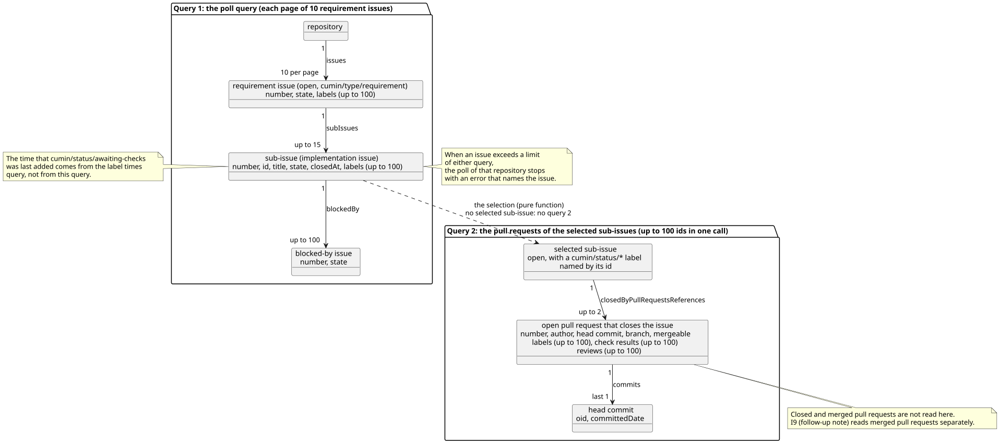
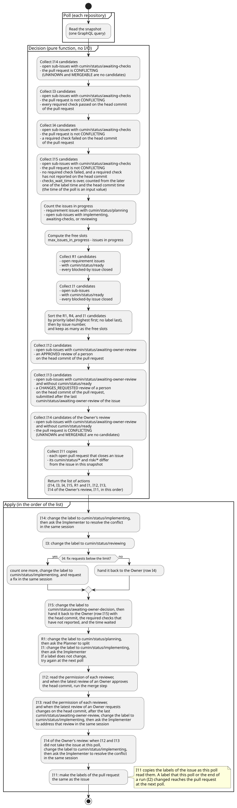
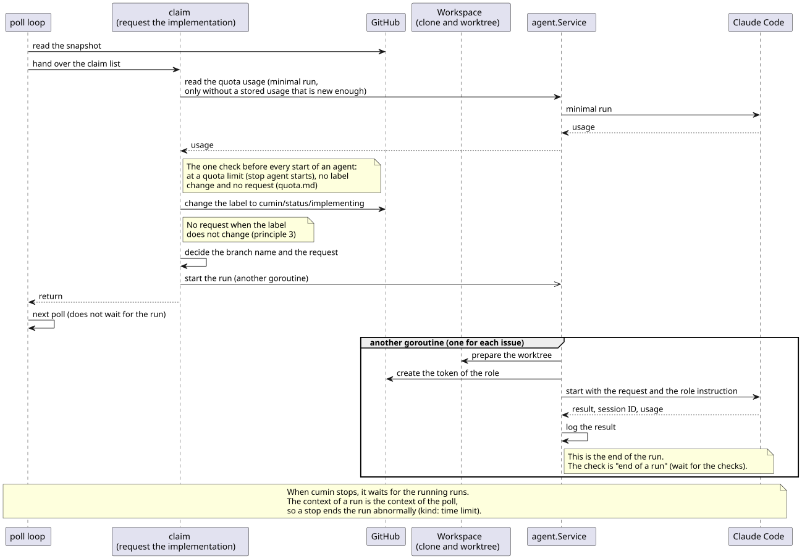
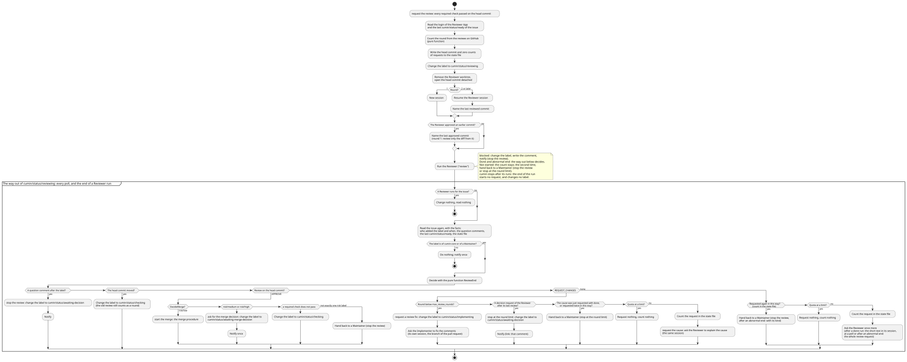
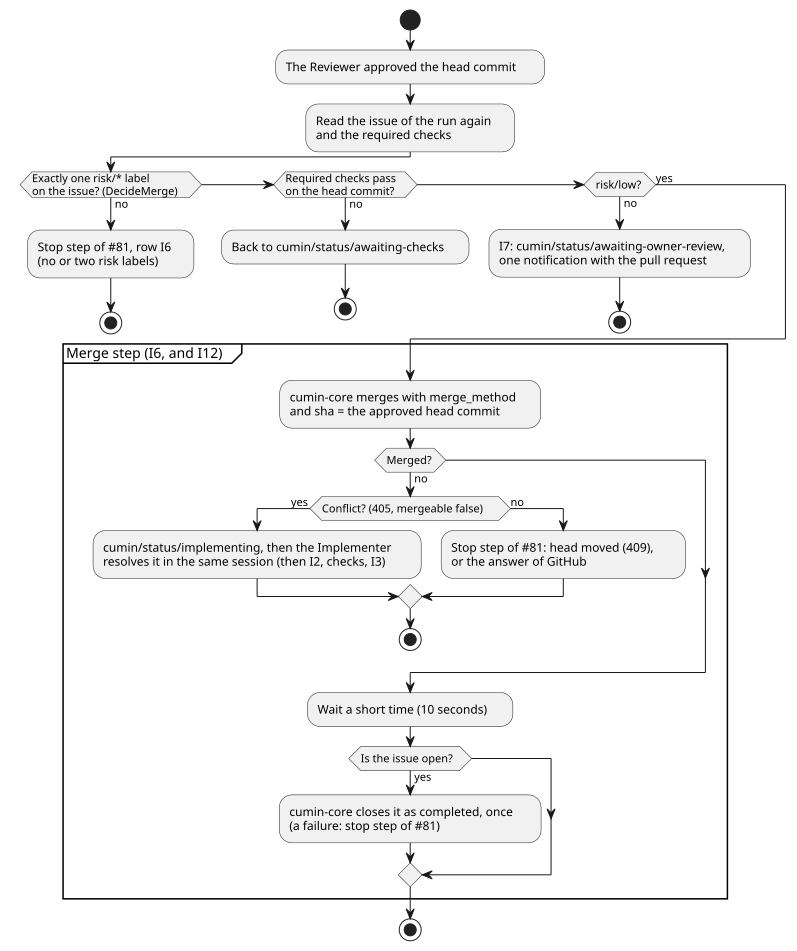
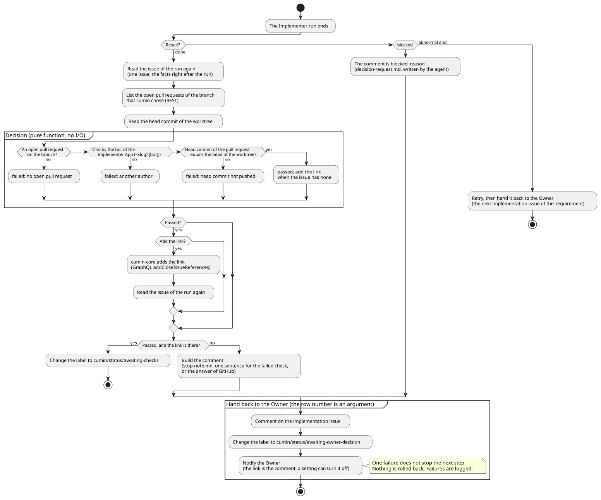

# 定期確認の設計

- 状態: Approved
- 要件: [Issueのラベルと状態遷移](../requirements/workflow/issue-states.md)、[cumin本体の要件](../requirements/cumin-core.md) の「GitHubの定期確認」「状態の管理」「Agentの起動」「設定」
- 事実の出どころ: [調査・実測で確定した制約](../evidence/measured-constraints.md) の行の番号 (「実測 N」と書く) か、公式ドキュメントのページの名前で示す。

定期確認の1回分 (GitHubを読み、判定し、着手し、実行の終わりを判定する) の設計を書く。issue-states.md の行 (R1〜R7、I1〜I11) を実現する決定は、この文書に足す。プログラム全体にまたがる決定 (Hostのファイル、Keychain、launchd、テストの2層、GitHubクライアント、riskの基準の受け渡し、起動前の使用率の確認) は [cumin本体の設計メモ](cumin-core.md) にある。

## 範囲

扱うこと:

- 定期確認と、そのきっかけで動く判定と動作の設計。`internal/workflow` が受け持つ範囲に当たる。

扱わないこと:

- 何をするか。要件文書にあり、ここでは繰り返さない。
- GitHubクライアントの認証、問い合わせの上限、REST と GraphQL の使い分け。[cumin本体の設計メモ](cumin-core.md) の「GitHubクライアント」にある。
- 1回のAgentの実行 (作業場所、CLIの起動、環境、時間の上限)。[Agentの実行の設計](agent-run.md) にある。

## 設計

### 定期確認で読む内容

対象のリポジトリごとに、開いていて `cumin/type/requirement` の付いたIssueを起点にして、次を読む。項目の名前は、GraphQLのスキーマで確かめた (実測 55 と、2026-09-20 の introspection)。

| 読むもの | 項目 | 使う行 |
|---|---|---|
| 要求Issueと、そのsub-issue。番号、id、開閉、今のラベル | `Issue.subIssues`、`labels` | R1〜R6、I1 |
| sub-issueの題。依頼のブランチの名前に使う | `Issue.title` | I1 |
| sub-issueのGraphQLのid。I2がリンクを付けるときに使う。スカラーなので、問い合わせのコストは変わらない | `Issue.id` | I2 |
| 状態ラベルが付いた時刻。定期確認の問い合わせとは別の、小さな問い合わせで読む (「ラベルの時刻の読み取り」) | `timelineItems(itemTypes: [LABELED_EVENT])` の `createdAt` と `label` | R3、レビューのラウンド、I15 (読むだけで、判定はまだない) |
| 最新の `cumin/status/ready` を付けたアカウント。Agentを起動する前に、別の小さな問い合わせで読む (「Ownerのログイン名の読み取り」) | `timelineItems(itemTypes: [LABELED_EVENT])` の `createdAt`、`label`、`actor { __typename login }` | 起動の依頼の事実 (どのroleでも) |
| blocked by のIssueの開閉。要求Issueとsub-issueの両方 | `Issue.blockedBy` | R1、I1 |
| Issueを閉じる、開いているPull Request。番号、作成者、先頭のコミット、ブランチの名前 | `Issue.closedByPullRequestsReferences`、`author { __typename login }`、`headRefOid`、`headRefName` | I1、I2 (リンクがあるか)、I4、I6、I7、I11 |
| 開いているPull Requestの、今のラベル | `PullRequest.labels` | I11 |
| 開いているPull Requestが、既定のブランチにmergeできるか。`MERGEABLE`、`CONFLICTING`、`UNKNOWN` の3つ | `PullRequest.mergeable` | I14 (読むだけで、判定はまだない) |
| 先頭のコミットの時刻 | `PullRequest.commits(last: 1)` の `commit { oid committedDate }` | I15 (読むだけで、判定はまだない) |
| レビュー。出した人、結果、対象のコミット、時刻 | `PullRequest.reviews` の `author`、`state`、`commit`、`submittedAt` | I5〜I8、レビューのラウンド |
| 先頭のコミットのcheckの結果 | `PullRequest.statusCheckRollup` の `contexts` | I3、I4 |
| 既定のブランチと、その先頭のコミット | `Repository.defaultBranchRef` の `name` と `target.oid` | リポジトリの設定 |
| リポジトリの設定とriskの基準 | `Repository.object(expression: "HEAD:.cumin/config.toml")` と同 `.cumin/risk-criteria.md` の `Blob` の `oid`、`text`、`byteSize`、`isBinary`、`isTruncated` | リポジトリの設定 |

図の元ファイル: [poll-snapshot.puml](poll-snapshot.puml)

Pull Requestの読み方:

- 読むのは、開いているPull Requestだけである (`includeClosedPrs` を付けない)。定期確認の判定でPull Requestを見る行は、どれも開いているPull Requestを対象にする。閉じたPull RequestはI2に通らず、merge済みのPull RequestはIssueを閉じるので、判定の対象にならない。閉じたPull Requestまで読むと、Ownerの対応待ちや閉じたIssueに溜まった古いPull Requestが1つのIssueで上限 (5件) に達し、そのリポジトリの定期確認が止まりうる。開いているものだけなら、通常は1つのIssueに1件で、上限には届かない。
- merge済みのPull Requestが要るのはフォローアップノート (I9) だけで、下に書いたとおり別に読む。

- GraphQLの `author` は、GitHub Appが作ったPull Requestでは `Bot` 型で、`login` に `[bot]` が付かない (2026-09-22 にsandboxで実測)。RESTの `user.login` と、Agentがコミットに使う身元は `<slug>[bot]` である。GitHubクライアントが `Bot` の `login` に `[bot]` を足して、判定には `<slug>[bot]` の形だけを渡す。
- 作成者のアカウントが消えていると `author` は null になる。判定には空の作成者として渡す。

mergeできるかと、先頭のコミットの時刻の読み方:

- `mergeable` は、GitHubの3つの値 (`MergeableState`) をそのまま、専用の型でスナップショットに入れる。3つ以外の値が来たら、そのリポジトリの定期確認をエラーにする。意味を知らない値の上で判定しないためである。`UNKNOWN` は、GitHubがまだ計算している印であり、エラーではない。
- 先頭のコミットの時刻は、`Commit.committedDate` である。`Commit.pushedDate` は、GitHubがもう返さない (スキーマに「no longer supported」とある)。項目は、公式のGraphQL reference (Objects の `PullRequest` と `Commit`、Enums の `MergeableState`) と、2026-10-03 の introspection で確かめた。
- 先頭のコミットは、`commits(last: 1)` で読む。`PullRequest.headRef` は接続ではないのでコストを変えないが、cumin-worksの開いているPull Requestで `null` を返したので使わない (実測 128)。
- `commits(last: 1)` のコミットが `headRefOid` と違うとき (2つの項目のあいだにpushが入ったとき) は、時刻を空にする。次の定期確認で読み直す。
- どちらの値も、今の判定は読まない。I14とI15の判定は、別のIssueで足す。mergeの手順 (I6、I12) がRESTで読む `mergeable` は、これとは別で、変わらない。

ラベルが付いた時刻の使い方:

- R3は、sub-issueに `cumin/status/ready` が付いた時刻が、要求Issueに `cumin/status/awaiting-owner-review` が付いた時刻よりあとかどうかで判定する。
- レビューのラウンドは、実装Issueに最後に `cumin/status/ready` が付いた時刻と、`cumin-reviewer` の最後の `APPROVE` の時刻の、新しいほうよりあとに出たレビューを数える (「レビューのラウンドの数え方」)。
- I15の待ち時間は、実装Issueに最後に `cumin/status/awaiting-checks` が付いた時刻から数える。cuminは、この時刻をsub-issueごとにスナップショットに入れる。
- 同じラベルが何度も付くので、ラベルごとに、いちばん新しい `LabeledEvent` を使う。今付いているかどうかは、`labels` で見る。

閉じた要求Issueと、そのsub-issueは読まない。cuminは、閉じた要求Issueには何もしないためである (Issueのラベルと状態遷移の原則6)。

Pull Requestのラベルは、I11でIssueのラベルと比べるためだけに読む。判定には使わない (原則5)。

ブランチの名前を読むのは、続きの依頼のためである。Issueを閉じる開いているPull Requestがあるときは、その名前をそのまま使い、題から作り直さない。

checkの結果の読み方:

- `statusCheckRollup` の `contexts` は、check run (GitHub Actionsなど) と commit status の2種類を返す。cuminは、どちらからも名前 (`CheckRun.name`、`StatusContext.context`) と結論だけを読む。必須のcheckの一覧が、この名前で書かれているためである。
- 結論は、通った (`SUCCESS`、`SKIPPED`、`NEUTRAL`)、落ちた、まだ終わっていない、の3つに畳む (実測 51)。終わっていない check run (`status` が `COMPLETED` でない) と、`EXPECTED`、`PENDING` の commit status は、まだ終わっていないものとして扱う。
- 知らない種類の context が来たら、そのリポジトリの定期確認をエラーにする。読めない check の上でI3を通すより、止まって知らせるほうがよい。
- 必須のcheckがGitHub Appに紐づいているとき (rulesetの `integration_id`。sandboxの `cumin-protected-paths` がそれである) は、そのAppが出したcheckだけが条件を満たす。GitHubも同じに扱う。cuminは、必須のcheckのAppのidと、check runの `checkSuite.app.databaseId` を持ち、名前とAppの両方で照らす (I3、I4が使う)。commit statusにはAppのidがないので、Appを指定した必須のcheckは満たせない。この項目を足してもコストは変わらない (接続ではないため)。
- 必須のcheckの一覧は、この問い合わせでは読めないのでRESTで読む (`GET /repos/{owner}/{repo}/rules/branches/{branch}`、実測 53)。読むのは、`cumin/status/awaiting-checks` のIssueがそのリポジトリに1つ以上あるときだけである。RESTの上限はGraphQLと別なので、問い合わせのポイントは増えない。
- ラベル、checkの結果、レビュー、先頭のコミット (`commits`) は、Pull Requestの下の接続なので、1件のPull Requestにつき1ずつコストの係数を上げる。sub-issueを15件、Pull Requestを2件までにして、1ページを17ポイントに収めている (実測 128)。接続の中の件数 (ラベル、check、レビュー、blocked by) はコストを変えないので、100件まで読む。式と見積もりは [cumin本体の設計メモ](cumin-core.md) の「GitHubクライアント」にある。

失敗したcheckの内容の読み方 (I4の依頼に入れる):

- 落ちた必須のcheckごとに、RESTで2つ読む。check runのannotation (`GET /repos/{owner}/{repo}/check-runs/{id}/annotations`) と、そのjobのログの終わり (`GET /repos/{owner}/{repo}/actions/jobs/{job_id}/logs`) である。check runのidとjobのidは、先に読む `GET /repos/{owner}/{repo}/commits/{sha}/check-runs` から取る。jobのidは `details_url` の最後の部分である (実測 54)。
- 落ちたcheckだけを読む。通ったcheckには呼び出しを出さない。annotationは `failure` のものだけを採る。
- ログは終わりだけを採る。jobが失敗した理由は終わりにあるためである。読みながら末尾の2,000バイトだけを残すので、ログが長くてもメモリは増えない。上限の64MiBに達したときは、そこで読むのをやめ、「ここで読むのをやめた。jobの終わりではない」と文章の先頭に書く。1つのcheckの文章は4,000バイトまでにし、切ったことを文章に書く。切る位置は文字の切れ目に合わせる。この3つの数は、要件の設定の表にないので、コードの定数にする。
- 必須のcheckがAppを指定しているときは、そのAppのcheck runの内容だけを読む。判定 (I3、I4) と同じ決まりである。同じ名前のcheckを2つのAppが出していても、別のAppの内容が混ざらない。結果は、落ちた必須のcheckの並びで返す。同じ名前を2つのrulesetが別のAppで求めていても、それぞれの文章が残る。
- annotationは全てのページを読む。失敗のannotationが、警告100件の次のページにあることがあるためである。集めた失敗が文章の上限を超えたら、そこで読むのをやめる。
- 読めなかったときは、エラーにしない。文章はcheckの名前と「内容を読めなかった」だけになり、警告をログに出す。名前だけでも依頼を出す価値があるためである。commit statusにはcheck runがないので、この道に入る。
- 読むのは、落ちたcheck runだけである。同じ名前のcheck runが2つあり、あとの1つが通っている (定期確認のあとにやり直された) ときに、通ったほうの内容を「失敗の内容」として渡さないためである。
- jobのログを読むのは、`details_url` が `/actions/runs/<番号>/job/<番号>` の形のときだけである。GitHub Actions以外のAppの `details_url` は、そのAppのものであり、末尾の数字はjobの番号ではない。
- 公開リポジトリでは、Checks と Actions の権限がなくても読める (実測 54)。privateリポジトリでは読めないことがあるが、v0.1の対象は公開リポジトリである。

フォローアップノート (I9) で使うものは、閉じたsub-issueについてだけ、別に読む (「フォローアップノート (I9)」)。

### レビューのラウンドの数え方

- レビューは、定期確認の問い合わせで、開いているPull Requestごとに100件まで読む。出した人 (Appは `<slug>[bot]` の形)、結果 (`state`)、対象のコミット、出した時刻、アドレスである。100件を超えるPull Requestがあれば、他の接続と同じく、そのリポジトリの定期確認をエラーにする。レビューの一部だけでラウンドを数えないためである。Pull Requestの下の接続が1つ増えるので、1ページのコストは11ポイントから14ポイントになった (2026-09-30にsandboxで実測。[cumin本体の設計メモ](cumin-core.md) の「GitHubクライアント」の式のとおり)。
- 実装Issueに最後に `cumin/status/ready` が付いた時刻は、R3と同じラベルの時刻の問い合わせを、その実装Issueの番号で呼んで読む (「ラベルの時刻の読み取り」)。1ポイントである。読むのは、ラウンドが要る場面 (Reviewerへの依頼と、その実行の終わり) だけである。
- ラウンドに数えるのは、`cumin-reviewer` のレビューのうち、結果が `CHANGES_REQUESTED` のものである。`COMMENTED` だけのレビューはReviewerの結果ではなく (Reviewerの要件の「完了の条件」)、cuminが依頼し直すので、ラウンドに数えない。`PENDING` は、まだ出ていないレビューである。
- `DISMISSED` のレビューは、`APPROVE` と同じく数え直しの起点にする。GitHubは今の結果だけを返し、取り下げる前の結果を返さない。rulesetの "Dismiss stale pull request approvals when new commits are pushed" が取り下げるのは承認なので、`DISMISSED` の多くは元の `APPROVE` である。これをラウンドに数えると、その承認より前のラウンドが数え直されず、上限に早く達する。人が `CHANGES_REQUESTED` を取り下げたときはOwnerの介入と同じなので、数え直してよい。
- 修正を求めたレビューのあとでは、数えた数がそのレビューのラウンドである。I5は上限 (`max_review_rounds`) 未満で修正を依頼し、I8は上限で止める。次にReviewerに依頼するラウンドは、数えた数に1を足したものになる (I3)。
- 2ラウンド目以降の依頼には、最後のラウンドのレビューの対象のコミットを入れる。Reviewerは、そこから今の先頭のコミットまでの差分と、前の指摘を見る。
- Reviewerの実行の終わりに確かめるのは、`cumin-reviewer` が最後に出したレビューである。結果は問わず (`PENDING` を除く)、`COMMENTED` だけのものも最後のレビューになる。
- 判定は、どれも `internal/workflow` の純粋関数 (`ReviewRounds`、`LastReviewedCommit`、`LatestReview`) である。GitHub上の事実だけから数えるので、cuminが再起動しても同じ数になる。

### ラベルの時刻の読み取り

- R3は、要求Issueに `cumin/status/awaiting-owner-review` が付いた時刻と、sub-issueに `cumin/status/ready` が付いた時刻を比べる。時刻は、GitHubがIssueのタイムラインに残す `LabeledEvent` の `createdAt` から読む。
- 定期確認の問い合わせには入れず、時刻が要る要求Issueのときだけ、別の問い合わせで読む。要るのは2つの場合である。1つは、R3が成り立ちうるとき、つまり要求Issueが `cumin/status/awaiting-owner-review` で、`cumin/status/ready` の付いた開いているsub-issueがあるときである。もう1つは、`cumin/status/awaiting-checks` の付いた開いているsub-issueがあるときで、そのsub-issueにラベルが最後に付いた時刻を読む (I15の待ち時間の起点)。判定の純粋関数 (`NeedsLabelTimes`) がこれを決める。
- 1回の問い合わせで、要求Issueと、そのsub-issue (15件まで) のタイムラインを読む。各Issueは、新しいほうから100件の `LabeledEvent` を読み (`last: 100`)、ラベルごとに一番新しい時刻を使う。同じラベルが付いたり外れたりするためである。コストは1ポイントだった (2026-09-29にcumin-worksで実測)。
- 読むのは状態ラベルがその形のあいだだけなので、ふだんの定期確認のコストは変わらない。Ownerが分割結果を確認している間 (前の分割の `cumin/status/ready` が残っているとき) と、sub-issueがcheckを待っている間は、その要求Issueごとに、定期確認のたびに1ポイント増える。1つの要求Issueで両方が要るときも、問い合わせは1回である。
- `cumin/status/awaiting-checks` の時刻だけが読めなかったときは、ほかの行を止めない。R3が成り立ちえない要求Issueでは、着手 (I1) も待たない。
- 読めなかったときは、ログに出して、R3をその定期確認では判定しない。その要求Issueのsub-issueの着手 (I1) も、次の定期確認まで待つ。着手すると `cumin/status/ready` が外れ、R3が二度と成り立たなくなるためである。R3がラベルを替えられなかったときも、同じ理由で待つ。ほかの行は進める。
- 採らなかった案: 定期確認の問い合わせに、sub-issueごとのタイムラインを入れる。1ページに要求Issue 10件 x sub-issue 15件のタイムラインが加わり、ページを小さくしても、R3が要らない定期確認のたびにコストが増える。

### Ownerのログイン名の読み取り

- 起動の依頼の事実「Ownerのログイン名」([Agentに共通の要件](../requirements/agents/common.md) の「起動の依頼の事実」) のために、Agentを起動する前に、その実行が扱うIssueに最新の `cumin/status/ready` を付けたアカウントを読む。GitHubがIssueのタイムラインに残す `LabeledEvent` の `actor` から読む。
- 問い合わせは、ラベルの時刻の問い合わせと同じ形に `actor { __typename login }` を足したものである (`ReadLabelActor`)。1回で、そのIssueと、そのsub-issue (15件まで) のタイムラインを、新しいほうから100件ずつ読む。Issue自身にイベントがあれば、その中で一番新しいものを使う。なければ、sub-issueのイベントの中で一番新しいものを使う (イベントのない要求Issue)。実装Issueにはsub-issueがないので、同じ問い合わせで足りる。
- そのアカウントがOwnerかどうかは、I12と同じ読み取り (`RepositoryPermission`) と同じ判定 (`IsOwner`) で決める。Ownerの定義は [cumin本体の要件](../requirements/cumin-core.md) の「Owner」だけにある。次のどれかのときは、Ownerのログイン名はない: イベントがない、`actor` がnull (アカウントがもうない)、`actor` が人ではない (`__typename` が `User` でない。GitHub Appは `Bot`)、権限がwrite未満である。人ではないときは、権限を読まない。
- コストは、GraphQLが1ポイント (2026-10-03にcumin-worksで実測。`LabeledEvent` に `actor` があることも、スキーマで確かめた) と、人のときのRESTの呼び出し1回である。起動のたびに増えるだけで、ふだんの定期確認のコストは変わらない。
- 読むのは、ラベルを替える前である。順は、ログイン名を読む、ラベルを替える、依頼する、になる。読めなければ、ラベルを替えず、依頼もしない。次の定期確認でやり直す (I3のラウンドの読み取りと同じ形)。ラベルを依頼より先に替えることは変わらない (原則3)。
- 読む場所は、定期確認が起動を決める所である: I1 (着手)、R1 (分割)、R4 (受け入れの確認)、I3 (review)、I4 (checkの修正)、I12 (Ownerの承認のあとのmerge) の衝突の解消。I12では、mergeが衝突したときだけ、ラベルを替える前に読む。読めなければ、Issueは `cumin/status/awaiting-owner-review` のままなので、次の定期確認でI12がもう一度成り立つ。
- 1つの実行の続きで出す依頼は、その実行の前に読んだ名前を使い、読み直さない: 異常終了のあとのやり直し、I5の指摘の修正、I8の原因の整理、I6 (Reviewerの承認のあとのmerge) の衝突の解消。I6で読み直さないのは、そこで読めないと、Issueが `cumin/status/reviewing` のまま残り、どの定期確認もやり直さないためである。
- 読むのは、各Issueの新しいほうから100件のラベルのイベントだけである。最新の `cumin/status/ready` のあとに100件を超えるラベルのイベントがあると、そのイベントはないものとして扱う (要求Issueはsub-issueから読み、実装Issueは「ない」になる)。
- 読んだ名前は、`internal/agent` が事実のかたまりに書く ([Agentの実行の設計](agent-run.md) の「Claude Codeの起動」)。
- 採らなかった案: ラベルの時刻の問い合わせに `actor` を足して、1つの問い合わせにまとめる。R3とラウンドの読み取りは `actor` を使わず、2つの読み取りは使う場面も違うので、分けたままにした。

### 要求Issueのコメントの読み取り

- R4とR7は、Plannerの受け入れの確認のコメントが、最後のsub-issueが閉じたあとに書かれたかを見る。問い合わせは `issueOrPullRequest` で、IssueにもPull Requestにも答える。I8も、Pull Requestのコメントを同じ問い合わせで読む。`issue(number:)` はPull Requestの番号を解決しない (2026-09-30にcumin-worksで確かめた。NOT_FOUNDになる)。sub-issueが閉じた時刻は、定期確認の問い合わせで `closedAt` として読む。スカラーの項目なので、コストは変わらない。
- コメントは、R4かR7が成り立ちうる要求Issueのときだけ、別の問い合わせで読む。成り立ちうるのは、要求Issueが `cumin/status/implementing` で、sub-issueが1つ以上あり、全て閉じているときである (`NeedsComments`)。新しいほうから50件ずつ、最後のsub-issueが閉じた時刻に届くまで遡って読む (`comments(last: 50, before: ...)`)。ふつうは1ページで届き、コストは1ポイントだった (2026-09-30にcumin-worksで実測)。決まった件数だけを読むと、受け入れの確認のあとにコメントが多く付いたとき、確認のコメントが読む範囲から外れる。Plannerは同じ回の自分のコメントを書き直すだけで、書き直しても並び順と作成の時刻は変わらないので、R4が依頼を繰り返してしまう。
- 数えるのは、作成者がPlannerのAppのbot (`<slug>[bot]`) で、1行目が `## Acceptance check` のコメントだけである。表の結果は読まない。botのloginは、AppのJWTで `GET /app` を1回読んで作り、覚えておく。
- 読めなかったときは、ログに出して、その要求IssueではR4もR7も判定しない。次の定期確認で読み直す。
- R4は、閉じたsub-issueのフォローアップノート (I9) を書き終えるまで待つ。I9は判定の前に動き、要求Issueごとに「もう書くノートがない」ことを `FollowUpsDone` に残す。書くノートがないとは、閉じたsub-issueのそれぞれについて、ノートがあるか、mergeされずに閉じたか、拾うものがないことである。この定期確認で読めなかったり書けなかったりしたら、R4は待ち、次の定期確認でやり直す。最後のsub-issueが閉じた回は、同じ定期確認の中で、ノートを書いてから受け入れの確認を依頼する。R7は待たない。受け入れの確認のコメントは、R4が依頼したあとにしか書かれないので、ノートより先にならない。

### 閉じたIssueの片付け

- 定期確認の問い合わせのあと、判定の前に、別の手順として行う。GitHubには何も書かない。
- 対象を決めるのは純粋関数 `IssuesToCleanUp` で、スナップショットの閉じたsub-issueのうち、Agentが動いていないものを返す。何を消し、何を残すかは [Agentの実行の設計](agent-run.md) の「作業場所」にある。
- 定期確認が失敗したリポジトリでは、片付けない。スナップショットがないためである。

### フォローアップノート (I9)

- 定期確認の問い合わせのあと、判定の前に、別の手順として行う。I9は要求Issueのラベルを替えず、Agentも起動しないので、判定の着手リストには入れない。
- 対象は、スナップショットにある開いている要求Issueの、閉じたsub-issueである。閉じた要求Issueはスナップショットにないので、何も読まず、何も書かない (原則6)。
- 要求Issueごとに、まずコメントを読む (「要求Issueのコメントの読み取り」と同じ問い合わせ)。読むのは、閉じたsub-issueのうち一番早く閉じた時刻よりあとのコメントである。ノートは、sub-issueが閉じたあとにしか書かれないためである。
- ノートの最後の行には、目に見えない目印 `<!-- cumin:follow-up-note issue=<sub-issue> pull-request=<Pull Request> notes=<番号,...> -->` を置く。`notes` は、そのsub-issueでノートが要るPull Requestの全てである。1つのsub-issueに、ノートの要るmerge済みのPull Requestが2つ以上あるとき、cuminは全てを読んでから書く。途中で書き込みに失敗しても、`notes` のうちノートのないものが残るので、次の定期確認がそのsub-issueを読み直す。`notes` のない目印は、自分のPull Requestだけを表す。結び付いたPull Requestのうち、まだ開いているものも `notes` に入れる。sub-issueが閉じたあとにmergeされたとき、そのノートを書くためである。開いたまま閉じられたPull Requestは、ノートが付かないので、要求Issueが開いている間、そのsub-issueを読み直し続ける (1回に1ポイント)。R4は、まだ開いているPull Requestを待たない。目印を数えるのは、cumin-coreのAppのbotが書いたコメントだけである。公開リポジトリでは誰でもコメントを書けるので、ほかの人の目印でノートが止まらないようにする。botのloginは、cumin-coreのAppのJWTで `GET /app` を1回読んで作り、覚えておく。
- 閉じた時刻以降に書かれた目印があり、その `notes` の全てにノートがあるsub-issueは、もう読まない。ないsub-issueだけ、閉じるよう結び付いたPull Requestの一覧を読む (`closedByPullRequestsReferences` に `includeClosedPrs` を付ける。閉じたものとmerge済みのものも返る)。誰がsub-issueを閉じたかは見ない。2026-09-30から、GitHubはmergeでIssueを閉じないことがあり、そのときはcumin (#222) かOwnerが閉じるためである (#239 のOwner役のNote)。一覧のうち、merge済みで、まだ目印のないPull Requestごとに、説明とレビューのスレッドを1回の問い合わせで読む (公式: GraphQLのスキーマの `PullRequest.reviewThreads`。2026-09-30にintrospectionで確かめた)。どちらの問い合わせも、コストは1ポイントだった (2026-09-30にcumin-worksとsandboxで実測)。結び付いたPull Requestが10件を超えたら、読み取りの誤りにする。
- merge済みのPull Requestが結び付いていなければ、ノートは書かない。mergeせずに閉じたPull Requestだけのときと、結び付いたPull Requestがないときである。結び付いたmerge済みのPull Requestが2つ以上あれば、それぞれに1つずつ書く。GitHubが結び付けなかったときの扱いは #272 が決める。
- 拾うものは2つである。1つは、説明の `## Follow-up` の見出しから、次の見出しか次の罫線 (`---` だけの行) までの文章で、テンプレートの `<!-- -->` を除いてそのままコピーする。`Follow-up` はテンプレートの最後の節なので、罫線がないと、CLIが説明の最後に足す署名までコピーしてしまう。テンプレートは、節のあとに罫線を置く。コードブロックの中の罫線では止めない。空か `None` なら、ないものとする。もう1つは、スレッドの最初のコメントが、ReviewerのAppのbotの `<ラベル> (non-blocking):` で始まるスレッドである。そのうち、ラベルが `praise` と `note` でないもので、返答のどれも `Fixed` か `Answer` で始まらないものを拾う。返答した人は問わない。
- スレッドの行は、今の行 (`line`) を使う。コードが動いて今の行がないときは、書かれたときの行 (`originalLine`) を使う。どちらもなければ、ファイルの名前だけを書く。
- レビューのスレッドか、1つのスレッドのコメントが100件を超えたら、読み取りの誤りとして記録し、ノートを書かない。一部だけを全体として写さないためである。
- 拾うものがなければ、ノートを書かず、目印も残さない。そのPull Requestは、要求Issueが開いている間、定期確認のたびに読み直す。コストは、目印のない閉じたsub-issue1つにつき、一覧の1ポイントと、merge済みのPull Request1つにつき1ポイント、それに要求Issueのコメントの1ポイントである。手元に「読んだ」記録を持たず、GitHubの事実だけで決めるためである。
- 読めなかったとき、書けなかったときは、ログに出して、次の定期確認でやり直す。その要求IssueのR4は、それまで待つ (「要求Issueのコメントの読み取り」)。
- 判定の純粋関数は `FollowUpCandidates`、`FollowUpNote` などで、`internal/workflow/followup.go` にある。
- 採らなかった案: 拾うものがないPull Requestも、手元のメモリに覚えて読み直さない。cuminが再起動するまでの読み直しは減るが、手元の記録で判定することになる。コストが問題になったら、改めて考える。

### リポジトリの設定の読み取り

対象のリポジトリの `.cumin/config.toml` と `.cumin/risk-criteria.md` は、定期確認の問い合わせで一緒に読む。何を上書きできるかと、優先順位は要件にあり、キーの一覧は [設定の一覧](../development/configuration.md) にある。ここでは、どう読むかだけを決める。

- 読む場所は `HEAD:` である。GraphQL の `expression` の `HEAD` はそのリポジトリの既定のブランチを指すので、Pull Requestのブランチの内容は入らない。要件のとおり、`.cumin/` の変更はOwnerがmergeしたものだけが効く。
- 読む頻度は、定期確認のたびである。要求Issueのページが複数になるときは、1ページめだけで読む (変数 `$repositoryFiles` と `@include`)。1回の定期確認が読むのは1組でよいためである。
- 追加のコストはない。`object` と `defaultBranchRef` は接続 (connection) ではないので、問い合わせのポイントは変わらない。2026-09-22に実測し、足す前と足したあとのどちらも `cost` は6だった。
- `text` を解析するのは `internal/workflow` の側である。同じ内容を毎回解析しないように、`Blob` の `oid` を一緒に返す。oid はgitのblobのハッシュなので、内容が変われば変わる。
- ファイルがなければ、`object` は `null` を返す。これはエラーではなく、Hostの設定がそのまま効く。
- `isBinary` が真、`text` が `null`、`isTruncated` が真のいずれかなら、そのリポジトリの読み取りをパスの名前を添えたエラーにする。ルールが、ファイルの一部だけを見て動くことを防ぐ。1MiB を超えるファイルは `isTruncated` になる。
- 採らなかった案: REST の `GET /repos/{owner}/{repo}/contents/{path}?ref=<既定のブランチ>`。どちらも `Contents` の read で呼べる (公式: Permissions required for GitHub Apps) が、RESTだとリポジトリごとに1回の定期確認で2回の要求が増え、Issueの事実とファイルの時点がずれる。

読んだあとの扱い:

- 定期確認は、リポジトリごとに「Hostの設定に `.cumin/config.toml` を重ねた設定」と「riskの基準の文章と、その出どころ」と「保護されたパスの一覧」を持つ。保護されたパスの一覧は、`protected_paths` の値であり、ファイルかキーがなければ初期値である。持ち回すのは `internal/workflow` で、GitHubの型は入らない。
- 解析するのは、`Blob` の `oid` が変わったときだけである。変わらない間は、前の結果を使う。
- ファイルが誤っていたら、そのリポジトリの定期確認をやめる。エラーにはファイルの名前とキーの名前が入る。他のリポジトリの定期確認は続く。誤りの結果は持たないので、次の定期確認で読み直し、Ownerがmergeで直せば自動で戻る。同じ理由で続けて失敗したときは、次の話題のとおりOwnerに知らせる。
- Agentの起動には、そのリポジトリのroleの設定 (`cli`、`model`) と、保護されたパスの一覧を渡す。一覧は、どのroleの起動にも、実行の事実として渡す。cuminは一覧の中身を確かめない。確かめるのは、GitHub Actionsのcheck (`cumin-protected-paths`) だけである。Agentの接続部分は、依頼に設定が付いていればそれを使い、なければHostの設定を使う。
- ログに出すのは、設定の出どころ (`host` か `repository`) と、riskの基準の出どころ (`default`、`host`、`repository`) だけである。riskの基準の文章はログに出さない。

### 定期確認の判定

図の元ファイル: [poll-decide.puml](poll-decide.puml)

- 判定は `internal/workflow` の純粋関数である。スナップショットと、設定 (リポジトリごとに同時に進めるIssueの数、優先度のラベルの一覧) だけから、着手リストを返す。I/Oをしない。同じスナップショットからは、Issueの並び順によらず、同じ着手リストを返す。着手可能なIssue数は、定期確認のたびにラベルから数え直す。ファイルにもメモリにも持ち越さない。
- 進行中として数えるのは、`cumin/status/planning` の要求Issueと、`cumin/status/implementing`、`cumin/status/awaiting-checks`、`cumin/status/reviewing` の開いているsub-issueである。`cumin/status/implementing` の要求Issue (R3) は、Agentが動いていないので数えない。数えると、初期値の上限 (1) では、どのsub-issueにも着手できなくなる。
- 動作の適用は、判定とは別の部分が行う。着手では、ラベルを替えてから依頼する (Issueのラベルと状態遷移の原則3)。ラベルを替えられなければ依頼せず、次の定期確認でやり直す。
- 今の判定はR1、R3、R4、R6、R7、I1、I3、I4、I11、I12である。I9は判定の前の別の手順である (「フォローアップノート (I9)」)。R2、I2、I5〜I8、I10は、実行の終わりに判定する。
- R3、R6、R7は、要求Issueのラベルを替えるだけで、Agentを起動しない。そのため一番先に決め、上限の空きを使わない。R4は、R1、I1と同じく上限の空きを分け合い、同じ順番 (優先度、Issueの番号) で着手する。
- R4の依頼中は、要求Issueのラベルが `cumin/status/implementing` のまま変わらない。そのため、Plannerが動いていることは、cuminが手元に持つ実行中のIssueの集合で判定に渡す (`Snapshot.Running`)。実行中の受け入れの確認は、同時に進めるIssueの数にも数える。cuminが再起動すると集合は空になり、コメントがなければR4がもう一度依頼する。Plannerは、同じ回の自分のコメントを書き直すので、コメントは増えない (Plannerの要件の「やり直しに備えること」)。R3は、要求Issueに状態ラベルがないときは `cumin/status/ready` の付いた開いているsub-issueがあれば成り立ち、`cumin/status/awaiting-owner-review` のときは、そのラベルよりあとに `cumin/status/ready` が付いたsub-issueがあれば成り立つ。R6は、`cumin/status/implementing` の要求Issueに開いているsub-issueがあり、その全てに状態ラベルがないときに成り立つ。`cumin/type/owner-task` のsub-issueも、状態ラベルがないので数える。
- R6の通知は、ラベルを替えたあとに1回だけ出す。次の定期確認では要求Issueがもう `cumin/status/implementing` ではないので、同じ通知を繰り返さない。ラベルを替えられなければ通知せず、次の定期確認でやり直す。
- I3とI4は、着手 (R1、I1) より先に決める。`cumin/status/awaiting-checks` のIssueは、同時に進めるIssueの数に既に数えられているので、先に決めても着手の枠を奪わない。
- checkの判定は純粋関数である。必須のcheckの一覧と、先頭のコミットのcheckの結果から、通った・落ちた・待ちの3つのどれかを返す。決まりは次のとおりである。
  - 必須のcheckが1つもなければ、すぐ通ったとみなす。
  - 名前が同じ結果が、その必須のcheckに当たる。rulesetがAppを指定していれば、そのAppの結果だけが当たる。
  - 1つでも落ちていれば、ほかがまだ終わっていなくても「落ちた」にする。I4の修正は、待つより先である。
  - 結果がない、または終わっていない必須のcheckがあれば「待ち」にする。必須のcheckの一覧はpushの前から決まっているので、現れていないcheckは、これから現れるcheckである。
  - 必須でないcheckは、落ちていても判定に入らない。
- I4は、`cumin/status/awaiting-checks` のIssueで、Pull Requestの先頭のコミットの必須のcheckが「落ちた」ときに成り立つ。動作には、落ちた必須のcheckを、Appも含めて持たせる。上限に達したかどうかは、Hostの状態ファイルの回数を読む適用の側で、純粋関数 (回数 < `max_check_fix_requests`) に聞く。回数はGitHubの事実ではないので、スナップショットには入れない。
- I3は、`cumin/status/reviewing` に替えたあと、Reviewerを起動する (「Reviewerへの依頼 (I3、I10)」)。
- I11は、Issueを閉じる開いているPull Requestごとに、そのラベルのうち `cumin/status/*` と `risk/*` を、Issueのものに置き換える。ほかのラベルは残す。並び順によらず同じなら、書き込まない。書き込みは、Issueと同じ "Set labels for an issue" で行う。GitHubでは、Pull RequestもこのAPIのIssueである。
- I11がコピーするのは、その定期確認で読んだIssueのラベルである。同じ定期確認や実行の終わりで替えたラベルは、次の定期確認でPull Requestに届く。ラベルは、OwnerがPull Requestの一覧で見るためのもので、判定には使わないので、この遅れは困らない。
- I1は、`cumin/type/owner-task` の付いたsub-issueに着手しない。`cumin/status/ready` が付いていても同じである。同時に進めるIssueの数は、ほかのIssueと同じく状態ラベルで数える。Ownerの作業のIssueはふつう状態ラベルを持たないので、数に入らない。作業の途中で `cumin/type/owner-task` が付いたIssueは、そのラベルのあいだAgentが動きうるので、数に入れたままにする。
- R1とI1は、どちらもAgentを起動するので、同じ上限の空きを分け合う。候補を合わせて、優先度の高い順、同じ優先度ならIssueの番号の昇順に並べ、先頭から空きの数だけ着手する。どちらかの行を先にする決まりは置かない。優先度が同じなら、Ownerが先に書いたものが先に進み、表形式のテストで結果が1つに決まる。
- 優先度は、純粋関数 `PriorityRank` が、Issueのラベルと設定の一覧から順位 (0が最も高い) にする。R1とR4は要求Issueのラベルで、I1はsub-issueのラベルで決め、sub-issueに優先度のラベルがなければ要求Issueのラベルで決める。どちらにもなければ、一覧の長さを順位にするので、どのラベルよりもあとになる。ラベルの名前は、GitHubと同じく大文字と小文字を区別せずに比べる。
- 並べ替えるのは、着手できる候補だけである。blocked by のIssueが開いている候補は先に落ちていて、空きの数は並べ替えのあとで当てるので、優先度はどちらも越えない。利用枠は、着手を適用するときに確かめる (次の項目)。
- 優先度のラベルの一覧は、リポジトリの設定を重ねたあとの値を渡す。`priority_labels` はリポジトリの設定ファイルにだけ書ける。Hostの設定に書けるようにすると、cuminは初期値のラベルを作らず、`scripts/setup-repo.sh` もHostの設定を読まないので、ラベルを用意する人がいなくなる。書かれていないリポジトリでは、初期値のラベルを使い、足りないものをcuminが作る。作るのは、起動時ではなく定期確認の中である。設定に書かれているかどうかは、リポジトリの `.cumin/config.toml` を読むまで分からないためである。設定を読み直すたびに1回だけ確かめ、失敗したら次の定期確認でやり直す。設定に書かれたラベルはOrganizationのものなので、cuminは作らず、変えない。
- R1とI1は、ラベルを替える前に、使用率を読んで上限と比べる (Q1)。上限に達していれば、ラベルも手元の状態も変えずに、その着手を飛ばす。次の定期確認で、判定からやり直す。手順は [利用枠の設計](quota.md) の「着手の前の確認」にある。
- Ownerが実行を待ってから止めるよう頼んだあと ([cumin本体の設計メモ](cumin-core.md) の「実行を待ってから止める」) は、判定の結果から、Agentに新しい依頼を出す動作を落としてから適用する。判定そのものは変えない。
- 採らなかった案: 定期確認の中で、GitHubを読みながら判定する。判定の途中で事実が変わりうるうえ、表形式のテストができない。

### Implementerへの依頼

- ブランチの名前は `cumin/<Issue番号>-<短い説明>` で、cuminが決めて渡す (Implementerの要件の「入力」)。短い説明は、実装Issueの題から作る。小文字にし、`a`〜`z` と `0`〜`9` 以外の文字の連続を1つの `-` にし、先頭と末尾の `-` を除き、40文字以内に収まる単語の並びを先頭から残す (先頭の単語だけで40文字を超えるときは、その単語を40文字で切る)。何も残らなければ `issue` にする。例: 題が "Add the login screen" のIssue #10 は `cumin/10-add-the-login-screen` になる。
- 名前を題から作るのは、最初の依頼のときである。そのIssueを閉じる開いているPull Requestが既にあれば、そのPull Requestのブランチを使う。2つ以上あれば、I2の検証と同じく、番号が最も大きいものを使う。題が変わっても、既にあるPull Requestのブランチは変わらない。
- Pull Requestが既にあるときの着手 (I1) は、依頼の種類が「続き」になる (Implementerの要件の「いつ起動されるか」)。worktreeは、そのPull Requestのブランチ (`origin/<ブランチ>`) から作る。前のラウンドのworktreeが残っていれば、消してから作り直す。残ったworktreeは、別のブランチの上にあるか、そのあとにpushされたコミットより遅れていることがあり、新しいセッションはGitHubの事実から始めるためである。ただし、GitHubにない作業 (コミットしていない変更、pushしていないコミット) を持つworktreeは消さずに、そのまま使う。cuminが止めた実行の作業がそこに残るためである ([Agentの実行の設計](agent-run.md) の作業場所)。依頼文には、Pull Requestの番号と、新しいPull Requestを作らずに同じPull Requestにコミットを積むことを書く。I1なので、セッションは新しい。
- 依頼文は `internal/workflow` の純粋関数が組み立てる。「実装」の依頼文に入れるのは、依頼の種類、リポジトリ、実装Issueの番号、ブランチ、作業場所と、1つのPull Requestを開く短い指示 (説明を書く前にskill `cumin-pull-request` を呼ぶこと、`Closes #<番号>` を書くこと) である。依頼の種類によらないことは、roleの指示にあり、依頼文には書かない。
- 起動の依頼には、依頼文とは別に、扱うIssueの事実を入れる。Implementerでは、どの種類の依頼 (実装、続き、checkの修正、指摘の修正、衝突の解消) でも、実装Issueの番号と、種類「implementation issue」と、Ownerのログイン名 (「Ownerのログイン名の読み取り」) である。`internal/agent` が、依頼文の先頭の事実のかたまりに書く ([Agentの実行の設計](agent-run.md) の「Claude Codeの起動」)。
- 採らなかった案: 短い説明をAgentに決めさせる。名前がGitHubの事実になる前にcuminが知っている必要があり、続きの依頼でも同じ名前を渡すためである。

### Plannerへの依頼 (R1、R4)

- 要求Issueのラベルを `cumin/status/planning` に替えてから、Plannerに依頼する。替えられなければ依頼せず、次の定期確認でやり直す。I1と同じ形である。
- 作業場所は、要求Issueの番号とPlannerの組のworktreeで、既定のブランチの先頭をdetachedで開く ([Agentの実行の設計](agent-run.md) の「作業場所」)。ブランチは作らない。依頼のたびに、前の依頼のworktreeを消してから作り直す。受け入れの確認は、mergeされた全てのsub-issueを含むmainを読む必要があり、分割のときのworktreeは古いためである。Plannerは何も書かないので、消して失うものはない。異常終了のあとのやり直しは、同じworktreeで続ける。
- R4では、ラベルを替えずに依頼する。「受け入れの確認」の依頼文には、依頼の種類、リポジトリ、要求Issueの番号、作業場所と、mergeされた作業の上でRequirementsを1項目ずつ確かめてコメントする短い指示を入れる。
- 依頼は、いつも新しいセッションで始める。Plannerのセッションは手元に残さない。分割 (R1) も受け入れの確認 (R4) も、新しいセッションで始まるためである (Plannerの要件の「いつ起動されるか」)。
- 「分割」の依頼文に入れるのは、依頼の種類、リポジトリ、要求Issueの番号、作業場所と、分割して計画をコメントする短い指示である。skillの名前、GitHubに残すもの、やり直しへの備えは、roleの指示にある。
- riskの基準は、I1と同じく、リポジトリの3段を解決した本文を起動の依頼で渡す。
- 扱うIssueの事実は、分割 (R1) でも受け入れの確認 (R4) でも、要求Issueの番号と、種類「requirement issue」と、Ownerのログイン名である。I1と同じく、起動の依頼で渡す。Ownerのログイン名は、R1ではラベルを替える前に、R4では依頼の前に読む。読めなければ依頼せず、次の定期確認でやり直す (「Ownerのログイン名の読み取り」)。
- 分割の実行の終わりは、R2のきっかけになる。判定は「実行終了の判定」にある。受け入れの確認の実行の終わりは、`done` ならラベルを替えない。次の定期確認で、コメントがあればR7、なければR4が成り立つ。`blocked` と2回目の異常終了は、行の番号をR4にして、R2と同じ手順でOwnerに戻す。

### Agentの実行の並行化

図の元ファイル: [poll-start.puml](poll-start.puml)

- 着手 (I1) は、ラベルを替えたあと、worktreeの用意からAgentの実行の終わりまでを、定期確認とは別のgoroutineで進める。定期確認とAgentの実行は並行して走り、定期確認は実行を待たない。1回の実行は最長50分続くので、待つと、その間に他のリポジトリの定期確認も、他のIssueの着手も止まる。
- goroutineはIssueごとに1つである。同時に走る数は、着手の判定が数える進行中のIssueの数 (「定期確認の判定」) で決まる。実行中のIssueの集合は、ラベルから分かるので手元に持たない。
- 依頼の種類は、I1の「実装」と「続き」、I4の「checkの修正」、I5の「指摘の修正」である。どれも同じ手順 (worktreeの用意、起動、実行の終わりの判定) を通り、違うのは行の番号、ブランチ、再開するセッション、依頼文だけである。Reviewerの依頼は、同じ形の別の手順である (「Reviewerへの依頼 (I3、I10)」)。
- worktreeの用意に失敗したときは、Issueの番号を添えてログに出して、そのgoroutineを終える。ラベルは `cumin/status/implementing` のまま残る。cuminを止めたときに取り消された `git clone` の失敗も、Agentの異常終了ではなく、この用意の失敗として扱う (実測 96)。辻褄の合わないIssueの回収は、v0.1では作らない ([Issueのラベルと状態遷移](../requirements/workflow/issue-states.md) の「v0.1では実装しないこと」)。
- 実行の終わりが、実行終了のきっかけになる (原則1)。判定は次の話題にある。
- cuminがすぐに止まるときは、動いている実行を待ってから終わる。実行のcontextは定期確認のcontextなので、止めると実行は異常終了 (種類は「実行時間の上限」) になる。実行を待ってから止めるときは、contextを終わらせないので、実行は自分で終わる。
- 採らなかった案: 実行の終わりを、別の仕組み (キュー、ファイル) に記録して、次の定期確認で拾う。実行はcuminの子プロセスなので、終わりはその場で分かる (原則1)。記録を挟むと、失っても困らないはずの手元の状態が増える。

### checkの修正の依頼 (I4)

- I4を適用する順は、回数を1つ増やして状態ファイルに書く、ラベルを `cumin/status/implementing` に替える、失敗したcheckの内容を読む、依頼する、である。回数を先に書くのは、書けない状態ファイルで上限を越えて依頼し続けないためである。書けなければラベルを替えず、次の定期確認でやり直す。ラベルを依頼より先に替えるのは、同じ修正を二重に依頼しないためである (原則3)。ラベルを替えられなければ、依頼せずに回数を元に戻す。替えられない失敗が続いても、1回も修正しないまま上限に達しないためである。
- 上限 (リポジトリの設定 `max_check_fix_requests`) に達していれば、依頼しない。「Ownerに戻す道」の手順を、行の番号I4で呼ぶ。ただし、ラベルを先に `cumin/status/awaiting-owner-decision` に替え、替えられたときだけコメントと通知に進む。定期確認が決める停止なので、ラベルが替わらないと、次の定期確認が同じ停止を決め、コメントと通知を繰り返すためである。実行の終わりが決める停止 (I2) は、実行ごとに1回しか起きないので、コメントを先に書く順のままにする。コメントと通知には、落ちたcheckの名前と、依頼した回数を書く。
- 依頼は、状態ファイルにある直前の実行のセッションを `--resume` で再開する。セッションがなければ (状態ファイルを失ったとき)、新しいセッションで始まる。依頼文には、落ちたcheckごとに、その内容 (「失敗したcheckの内容の読み方」) を載せる。内容はcheckの出力なので、指示ではなくデータとして読むよう依頼文に書く。
- worktreeは、そのIssueのものを使う。ブランチは、Pull Requestのブランチである。前のworktreeは、続きの依頼 (I1) と同じく、GitHubにない作業を持っていなければ消して、`origin/<ブランチ>` から作り直す。ブランチの名前が変わったときや、新しいPull Requestができたときも、Pull Requestのブランチの上で直せる。
- 実行の終わりは、I1の依頼と同じに扱う。`done` ならI2の検証をもう一度行い、通れば `cumin/status/awaiting-checks` に戻る。`blocked` ならOwnerに戻す。異常終了は1回だけやり直す。やり直しは新しいセッションで行い、異常終了したセッションを再開しない。
- 回数とセッションは、Ownerが `cumin/status/ready` を付け直したとき (I1) に消える。次の依頼は新しいセッションで、回数0から始まる。

### Reviewerへの依頼 (I3、I10)

図の元ファイル: [poll-review.puml](poll-review.puml)

- I3を適用する順は、ラウンドを読む、ラベルを `cumin/status/reviewing` に替える、依頼する、である。ラウンドは、ReviewerのAppのbotのloginと、実装Issueに最後に `cumin/status/ready` が付いた時刻と、スナップショットのレビューから数える (「レビューのラウンドの数え方」)。読めなければラベルを替えず、次の定期確認でやり直す。ラベルを依頼より先に替えるのは、同じレビューを二重に依頼しないためである (原則3)。
- ReviewerのAppのbotのloginは、Plannerと同じく、AppのJWTで `GET /app` を1回読んで作り、覚えておく。
- 作業場所は、実装IssueとReviewerの組のworktreeで、Pull Requestの先頭のコミットをdetachedで開く ([Agentの実行の設計](agent-run.md) の「作業場所」)。依頼のたびに、前のラウンドのworktreeを消してから作り直す。ラウンドごとに先頭のコミットが変わるためである。異常終了のあとのやり直しは、同じworktreeで続ける。
- 1ラウンド目は新しいセッションで始める。2ラウンド目以降は、Hostの状態ファイルにあるReviewerのセッションを `--resume` で再開する。Reviewerのセッションは、Implementerのセッションと別の項目 (`reviewer_session_id`) に持つ。2つのroleはセッションを共有しない (Reviewerの要件の「いつ起動されるか」)。セッションがなければ (状態ファイルを失ったとき)、新しいセッションで始まる。Ownerが `cumin/status/ready` を付け直すと、I1が両方のセッションを消す。
- 依頼文 (「review」) に入れるのは、リポジトリ、実装Issue、Pull Request、先頭のコミット、ラウンドと上限、作業場所と、2ラウンド目以降では前のラウンドでレビューしたコミットである。ラウンドごとに見る範囲は、roleの指示にある (Reviewerの要件の「ラウンドごとに見る範囲」)。
- 扱うIssueの事実は、review、やり直しのreview、原因の整理 (I8) のどれでも、実装Issueの番号と、種類「implementation issue」と、Ownerのログイン名である。I1と同じく、起動の依頼で渡す。Ownerのログイン名は、ラウンドと同じく、ラベルを替える前に読む (「Ownerのログイン名の読み取り」)。
- 実行が `done` で終わったら、スナップショットを読み直し、ReviewerのAppのbotが最後に出したレビューを確かめる (純粋関数 `CheckReview`)。それが今の先頭のコミットに対する `APPROVE` か `REQUEST_CHANGES` なら、レビューが出たとみなす。そうでなければ、同じセッションで1回だけ依頼し直す。依頼文には、何が見つからなかったかだけを書く。2回目も見つからなければ、行の番号I5 (I5の「うまくいかないとき」) で「Ownerに戻す道」の手順を呼ぶ。
- 読み直したPull Requestの先頭のコミットが、依頼したときと違えば (Reviewerの実行中にOwnerがpushしたときなど)、レビューを確かめずに、ラベルを `cumin/status/awaiting-checks` に戻す。必須のcheckが通ったのは古いコミットだけだからである。新しいコミットでcheckが走り、I3かI4がもう一度決める。古いコミットに出たレビューは、GitHubにあるとおりにラウンドに数える。
- `APPROVE` なら、「mergeの手順 (I6、I7)」に進む。`REQUEST_CHANGES` なら、「指摘の修正の依頼 (I5)」に進む。
- `blocked` なら、I10である。やり直さず、行の番号I10で「Ownerに戻す道」の手順を呼ぶ。コメントは、Reviewerが書いた `blocked_reason` である。
- 異常終了は、I1の依頼と同じく、同じ作業場所の新しいセッションで1回だけやり直す。2回目も異常終了なら、行の番号I3でOwnerに戻す。
- 採らなかった案: レビューが見つからないときに、すぐOwnerに戻す。Reviewerの要件の「完了の条件」は、1回だけ依頼し直すと決めている。
- 採らなかった案: ReviewerとImplementerのセッションを1つの項目に持つ。I5はImplementerのセッションを、2ラウンド目のレビューはReviewerのセッションを再開するので、1つでは足りない。

### 指摘の修正の依頼 (I5)

- Reviewerの実行の終わりに、先頭のコミットに `REQUEST_CHANGES` が出ていたら、読み直したレビューからラウンドを数え直す。そのレビューのラウンドである。上限 (リポジトリの設定 `max_review_rounds`) 未満ならI5、上限に達していればI8である。判定は純粋関数 (ラウンド < `max_review_rounds`) である。
- I5を適用する順は、ラベルを `cumin/status/implementing` に替える、依頼する、である。ラベルを替えられなければ依頼しない。実行の終わりが決める動作なので、次の定期確認が同じ依頼を決めることはない (Reviewerの実行ごとに1回しか起きない)。
- 依頼は、状態ファイルにあるImplementerのセッションを `--resume` で再開する。Reviewerのセッションではない。worktree、ブランチ、実行の終わりの扱いは、checkの修正 (I4) と同じである。`done` ならI2の検証をもう一度行い、通れば `cumin/status/awaiting-checks` に戻る。そのあとI3が、次のラウンドのレビューを依頼する。
- 依頼文 (「指摘の修正」) に入れるのは、リポジトリ、実装Issue、Pull Request、ブランチ、作業場所と、レビューのアドレスである。指摘そのものは依頼文に写さない。Implementerが、GitHubで指摘を読み、スレッドごとに返答するためである (返答のテンプレートはskill `cumin-review-reply`)。
- Implementerの依頼は、Reviewerの実行と同じgoroutineで続けて行う。同じIssueのAgentは、いつも1つだけである。
- 上限に達していれば、Implementerには依頼せず、「上限での原因の整理 (I8)」に進む。

### Ownerのレビューへの対応の依頼 (I13)

- 今あるのは、依頼文と、Implementerのroleの指示の決まりである。判定、ラベルの付け替え、依頼の開始は、まだない。
- 依頼文 (「Ownerのレビューへの対応」、`Request: owner review fix`) は、`internal/workflow` の純粋関数 `OwnerReviewFixRequestText` が組み立てる。入れるのは、リポジトリ、実装Issue、Pull Request、ブランチ、作業場所と、Ownerのレビューのアドレスである。
- 依頼文は、そのレビューとコメントをGitHubで読むこと、Pull Requestのブランチで直すこと、新しいPull Requestを作らないことを伝える。コメントそのものは依頼文に写さない。Implementerが、GitHubでコメントを読み、スレッドごとに返答するためである (返答のテンプレートはskill `cumin-review-reply`)。
- 「指摘の修正」(I5) と別の種類にするのは、Ownerのコメントに `(blocking)` の印がないためである。roleの指示は、指摘の修正では blocking のコメントにだけ返答すると決めている。この依頼では、Ownerのレビューの全てのコメントに対応し、それぞれに返答する。これは依頼文と `roles/implementer.md` の両方に書く。
- セッションは、Implementerの直前のセッションの続きである (Implementerの要件の「いつ起動されるか」)。

### mergeの手順 (I6、I7)

図の元ファイル: [poll-merge.puml](poll-merge.puml)

- Reviewerが今の先頭のコミットを承認したら、スナップショットと必須のcheckの一覧を読み直し、純粋関数 `DecideMerge` で決める。riskは実装Issueのラベルから読む (原則5)。riskのラベルがちょうど1つでなければ、行の番号I6でOwnerに戻す。riskを先に確かめるのは、ラベルの誤りが、checkの状態によらず必ず止まるようにするためである。
- checkの結果は、この読み直しで読んだPull Requestのものを使う。レビューを確かめたあとに、checkがもう一度動くことがあるためである。Pull Requestが見つからないか、先頭のコミットが承認したものと違えば、checkが通っていないものとして扱う。
- 必須のcheckが先頭のコミットで通っていなければ、ラベルを `cumin/status/awaiting-checks` に戻す。Reviewerの実行中に先頭のコミットが動いたとき (「Reviewerへの依頼」) と同じ扱いで、I3かI4が次の定期確認で決め直す。
- `risk/low` ならmergeの手順に進む (I6)。それ以外の `risk/*` は、ラベルを `cumin/status/awaiting-owner-review` に替えて、Pull Requestのアドレスを入れた通知を1回出す (I7)。ラベルを替えられなくても、通知は出す。実行の終わりは1回しか起きないので、Ownerが知る機会はそこだけだからである。
- mergeの手順は、I6とI12の両方が使う。行の番号は引数で受け取る。
  - `cumin-core` が `PUT /repos/{owner}/{repo}/pulls/{n}/merge` を呼ぶ。`merge_method` はリポジトリの設定、`sha` は承認された先頭のコミットである。承認のあとにpushされたコミットは、mergeしない (409。実測は #286 の M2)。mergeの状態が `clean` になるのは待たない。"Restrict updates" のruleがあるブランチでは、常に `blocked` だからである (実測 62)。
  - 405は、衝突とrulesetの拒否の両方で返る (実測 62、#286 の M4)。405のあとにPull Requestを読み直し、`mergeable` が `false` なら衝突とみなす。merge の前に読んだ `mergeable` は古いことがある (#286 の M4、M5) ので、mergeの前には読まない。
  - 衝突なら、ラベルを `cumin/status/implementing` に替えてから、Implementerに「衝突の解消」を依頼する (I6の失敗の欄)。セッションは、状態ファイルにあるImplementerのセッションの続きである。worktree、ブランチ、実行の終わりの扱いは、指摘の修正 (I5) と同じで、`done` のあとはI2、必須のcheck、I3を通る。依頼文には、既定のブランチの名前を入れる。
  - 衝突の解消は、既定のブランチをPull Requestのブランチにmergeして行う。Implementerの指示は強制pushを禁じており、rebaseしたブランチはpushできないためである。新しい先頭のコミットには、Reviewerの新しい承認が要る。ラウンドは、最後の `APPROVE` から数え直す (「レビューのラウンドの数え方」)。
  - 衝突の解消の実行が `done` で終わっても、Pull Requestの先頭のコミットが衝突したときのままなら、I2に進まずに、行の番号I6でOwnerに戻す。そのままI2に通すと、同じ衝突がレビューとmergeを何度も回るためである。
  - 先頭のコミットが動いたとき (409) と、それ以外の失敗 (GitHubの答えを入れる) は、1文でOwnerに戻す。
  - mergeが通ったら、10秒待ってから実装Issueを読む (`DefaultCloseWait`)。開いていれば、`cumin-core` が完了として閉じる。GitHubはリンクしたIssueを数秒で閉じていた (実測 60) が、2026-09-30から閉じないことがある (#276 の C5)。待つ時間は設定の表にないので、コードに置く。
  - 待っている間にcuminを止める合図が来たら、待ちを打ち切って、すぐに読んで閉じる。この2つの操作は、止める合図で取り消さず、10秒の上限で行う。上限は、止めるときに実行中の依頼を待つ時間より短くし、プロセスが終わる前に済むようにする。失敗したときにOwnerに戻す手順は、止める合図のもとでは、ほかの道と同じく動かない。mergeは取り消せず、そのPull Requestはもう開いていないので、あとの定期確認はこのIssueに戻ってこないためである。
  - 閉じるのは、この手順の中の1回だけである。読み取りか閉じる操作が失敗したら、Ownerに戻す。あとの定期確認では閉じないので、Ownerが開き直したIssueは開いたままになる。
  - mergeのあと、実装Issueのラベルは替えない。Issueが閉じれば、定期確認の対象から外れる。
- 採らなかった案: mergeの前に `mergeable` を読み、衝突なら呼ばない。読んだ値が古く、衝突を見落とす (#286 の M4)。呼んでから読むほうが、1回の読み取りで確かに分かる。

### Ownerの承認のあとのmerge (I12)

- 定期確認の判定 (純粋関数) が、候補を集める。`cumin/status/awaiting-owner-review` の開いた実装Issueで、Pull Requestの今の先頭のコミットに、人 (botでないアカウント) の `APPROVED` のレビューがあるものである。実行中のIssueは除く。候補には、判断のレビュー (`APPROVED` か `CHANGES_REQUESTED`) を出した人を全て入れる。
- 候補ごとに、その人たちの権限を `cumin-core` で読む (`GET /repos/{owner}/{repo}/collaborators/{username}/permission`。公式: Get repository permissions for a user。要る権限は Metadata の read。実測は #286 の M1)。`permission` が `admin` か `write` で、`user.type` が `User` の人がOwnerである ([cumin本体の要件](../requirements/cumin-core.md) の「Owner」。maintainは `write` として返る)。候補がなければ、権限も必須のcheckも読まない。
- Ownerのレビューのうち、最新の判断のレビューが今の先頭のコミットへの `APPROVED` なら、I12が成り立つ (純粋関数 `OwnerApproved`)。古いコミットへの承認、botの承認、Ownerでない人の承認は数えない。あとから出したOwnerの `CHANGES_REQUESTED` は、承認を取り消す。
- 「最新のレビュー」に、`COMMENTED` は数えない。GitHubも、mergeの判断には `APPROVED` と `CHANGES_REQUESTED` だけを使う。Ownerが承認のあとに質問のコメントを書いても、承認は残る。
- 次に、I6と同じ `DecideMerge` で、riskのラベルと必須のcheckを確かめる。riskのラベルがちょうど1つでなければ、行の番号I12でOwnerに戻す。checkが通っていなければ、何もしない。通れば、次の定期確認でI12がまた成り立つ。riskの値では分けない。Ownerが判断したからである。
- mergeは、「mergeの手順 (I6、I7)」と同じ手順を、行の番号I12で通る。衝突、失敗、閉じ方も同じである。手順は別のgoroutineで動き、実行中のIssueとして数える。手順が実装Issueを閉じるのを待つ間に、次の定期確認が同じIssueを候補にしないためである。
- 採らなかった案: Ownerの一覧をHostの設定に持つ。要求のbacklogにある。権限はGitHubにあり、設定と二重に持たないほうがよい。

### 上限での原因の整理 (I8)

- 上限のラウンドで `REQUEST_CHANGES` が出たら、そのラウンドのReviewerのセッションのまま、「原因の整理」を依頼する。作業場所は、そのラウンドのworktreeのままである。依頼文には、リポジトリ、実装Issue、Pull Request、上限、作業場所と、Pull RequestにOwner向けのコメントを1つ書き、レビューは出さないという短い指示を入れる。形式はskill `cumin-decision-request` にある。
- 実行が `done` で終わったら、Pull Requestのコメントを、最後のレビューの時刻まで遡って読む (「要求Issueのコメントの読み取り」と同じ問い合わせ)。ReviewerのAppのbotが書き、1行目が `## Decision needed` で始まり、最後のレビューより古くないコメントがあれば、それが原因の整理である (純粋関数 `ExplanationOf`)。比べる時刻はどちらもGitHubの時刻なので、Hostの時計はずれてもよい。
- 見つかれば、ラベルを `cumin/status/awaiting-owner-decision` に替え、Ownerに1回だけ通知する。通知のリンクは、そのコメントのアドレスである。理由はReviewerが書いたので、cuminはコメントを書かない。ラベルを替えられなくても、通知は出す (「Ownerに戻す道」と同じ考え方)。
- 見つからないとき、`blocked` のとき、2回目の異常終了のときは、行の番号I8で「Ownerに戻す道」の手順を呼ぶ。どの場合も、Ownerが決めることに変わりはないためである。`blocked` のコメントは、Reviewerの `blocked_reason` である。
- I8は実行の終わりが決める動作なので、Reviewerの実行ごとに1回しか起きない。コメントと通知が二重になることはない。
- 採らなかった案: 原因の整理が見つからないとき、Reviewerにもう一度依頼する。I8の表は「うまくいかないとき」を定めていない。上限に達した時点で、Ownerが決めることは決まっているので、stop noteで知らせれば足りる。

### 実行終了の判定

図の元ファイル: [poll-verify.puml](poll-verify.puml)

- Implementerの実行が `done` で終わったら、cuminはそのリポジトリのスナップショットを読み直し ([cumin本体の設計メモ](cumin-core.md) の「GitHubクライアント」)、その実行のブランチの開いているPull Requestを読み、実行したIssueについてI2の3つの確認を、この順で行う。そのブランチに、ImplementerのAppの開いているPull Requestがあること。そのPull Requestの作成者が、ImplementerのAppのbot (`<slug>[bot]`) であること。Pull Requestの先頭のコミット (`headRefOid`) が、worktreeの先頭のコミットと同じであること (最後のコミットがpushされている)。
- Pull Requestは、その実行のブランチ (cuminが決めて依頼に渡したもの) と作成者で見つける。RESTの `GET /repos/{owner}/{repo}/pulls?state=open&head=<owner>:<branch>` で読む (公式: List pull requests。要る権限は Pull requests の read。Permissions required for GitHub Apps)。`head` に持ち主を付けるので、forkのブランチは入らない。ImplementerのAppのものが2つ以上あれば、番号の大きいものを確かめる。ほかのブランチのPull Requestは、Issueにリンクされていても使わない。
- リンクで探さないのは、GitHubが本文の `Closes #N` からリンクを作らないことがあるためである (2026-09-30から。sandboxと他のリポジトリで確かめた)。ほかの行は、今までどおりリンク (`closedByPullRequestsReferences`) でPull Requestを見つける。I2がリンクを付けるので、ほかの行も同じPull Requestを見る。
- 3つの確認が通り、IssueにそのPull Requestを閉じるリンクがなければ、`cumin-core` がGraphQLの `addCloseIssueReferences` でリンクを付ける (公式: GraphQL reference の Issues。入力は `issueId` と `pullRequestIds`)。`cumin-core` のtokenで呼べることは、sandboxで実測した (#276)。付けたあとでスナップショットを読み直し、リンクがあることを確かめてから、ラベルを替える。GitHubが既にリンクを作っていれば、何も付けない。
- Issueを閉じる開いているPull Requestが、定期確認で読む上限 (2件) に既に達しているときは、リンクを付けずにOwnerに戻す。もう1つ付けると、そのIssueを読めなくなり、そのリポジトリの定期確認が毎回失敗するためである。
- リンクを付けられなかったとき、または読み直してもリンクがないときは、Ownerに戻す。どちらも実行の終わりに1回しか起きないので、やり直さない。
- 採らなかった案: 全ての行で、ブランチの名前でPull Requestを見つける。スナップショット、I9、mergeのあとのIssueの閉じ方まで変わる。I2でリンクを付ければ、変わるのはI2だけで、GitHubがリンクを作るようになっても、そのまま動く。
- 判定は純粋関数で、結果を値として返す。通ったかどうかと、落ちたときはどの確認で落ちたか (開いているPull Requestがない、作成者が違う、先頭のコミットがpushされていない) と、確かめたPull Requestの番号と、リンクを付けるかどうかである。通れば、リンクを付けてから、ラベルを `cumin/status/awaiting-checks` に替える。落ちたときは、次の話題の手順でOwnerに戻す。
- 判定に渡す3つの値は、Agentの実行の側から来る。ブランチは依頼に渡したものである。ImplementerのAppのbotのlogin (`<slug>[bot]`) は実行の結果に付いて返り、worktreeの先頭のコミットは `git rev-parse HEAD` で読む ([Agentの実行の設計](agent-run.md) の「作業場所」と「1回の依頼の手順」)。
- `blocked` の結果と異常終了は、この判定に入らない。`blocked` は次の話題の手順でOwnerに戻す。異常終了は、同じ依頼を1回だけやり直してから、次の話題の手順でOwnerに戻す。
- Plannerの実行が `done` で終わったら、同じようにスナップショットを読み直し、要求IssueについてR2の2つの確認を行う。sub-issueが1つ以上あること。全てのsub-issueに `risk/*` のラベルがちょうど1つ付いていること。閉じたsub-issueも数える。sub-issueは番号の小さい順に確かめ、最初に落ちたものの番号を結果に入れる。分割の中身は判定しない。見るのはOwnerである。
- R2が通れば、開いているsub-issueがあるときは、要求Issueのラベルを `cumin/status/awaiting-owner-review` に替え、Ownerに「分割結果の確認が必要」と通知する。sub-issueが全て閉じているとき (受け入れの確認が `blocked` で止まったあとに、Ownerが `cumin/status/ready` で再開し、Plannerが何も作らなかったとき) は、`cumin/status/implementing` に替え、通知しない。次の定期確認でR4が成り立つ。行き先を決めるのは純粋関数 (`SplitStatus`) である。通知のリンクは要求Issueのアドレスである。通知は止まったことの知らせではないので、戻す道の手順を通らず、同じ通知の部分を直接呼ぶ。
- Plannerの `blocked` と異常終了は、I2と同じ扱いで、行の番号をR2にしてOwnerに戻す。Plannerのセッションは手元に残さない。

### うまくいかなかったときに、Ownerに戻す道

- 先に進めないときは、1か所の手順でOwnerに戻す。行の番号 (I2、R2 など) を引数で受け取り、順に、止まったIssue (I2では実装Issue、R2では要求Issue) にコメントを書き、状態ラベルを `cumin/status/awaiting-owner-decision` に替え、Ownerに通知する。I4、I3 (Reviewerの2回目の異常終了)、I5 (Reviewerのレビューが2回とも見つからない)、I10 (Reviewerの `blocked`) も、同じ手順を自分の行の番号で呼ぶ。あとの行 (I8) も同じである。
- 順番に意味がある。理由がGitHubに残ってからラベルが替わり、最後に「見に来てほしい」と伝える。
- 途中で1つ失敗しても、次を止めない。コメントを書けなくてもラベルは替え、ラベルを替えられなくても通知は出す。巻き戻しもしない。止まったIssueがあることは、どれか1つが落ちても伝わるほうがよい。失敗はログに出す。
- 通知のリンクは、書いたコメントのアドレスにする。理由の全文がそこにあるためである。コメントを書けなかったときは、Issueのアドレスにする。
- 検証が落ちたときのコメントは、cuminが [stop-note.md](../../../templates/stop-note.md) の形式で書く。本文には、落ちた確認の1文 (I2では、ブランチに開いているPull Requestがない、作成者が違う、先頭のコミットがpushされていない、リンクの数が上限に達している、リンクを付けられなかった (GitHubの答えを入れる)、読み直してもリンクがない。R2では、sub-issueがない、あるsub-issueにriskのラベルがない、2つ以上ある) と、確かめたPull Requestの番号 (R2では「None」) を入れる。同じ1文を通知にも入れて、Ownerがどちらを読んでも同じ言葉になるようにする。
- `blocked` のときのコメントは、Agentが返した `blocked_reason` をそのまま載せる。Agentが [decision-request.md](../../../templates/decision-request.md) の形式で書いているためである。通知には、その1行目 (Ownerに決めてほしいこと) を入れる。やり直さない (Issueのラベルと状態遷移の、Implementerが `blocked` を返したときの決まり)。
- ラベルを替えるには、そのIssueの今のラベルが要る。`blocked` の道では、実行終了のあとにスナップショットを読み直して取る。読み取れなければ、ラベルを替えずにログに出す。状態ラベルだけを書き込むと、riskのラベルが消えるためである。
- 通知を出すかどうかは、そのリポジトリの設定 `notify.discord.enabled` で決まる。通知の失敗は error のログに出すだけである ([cumin本体の設計メモ](cumin-core.md) の「Ownerへの通知」)。
- 異常終了のときは、同じ依頼を同じ作業場所で1回だけやり直す ([Agentの実行の設計](agent-run.md) の「異常終了のやり直し」)。2回目も異常終了なら、この手順でOwnerに戻す。コメントには、異常終了の種類と、やり直したことを書く。Agentが残したPull Requestがあれば、その番号も書く。作業がGitHubまで届いたかどうかを、Ownerが先に知れるためである。

### 定期確認が続けて失敗したとき

- リポジトリごとに、続けて失敗した回数と、その理由を数える。3回目に1回だけOwnerに知らせ、そのリポジトリの定期確認が成功するまで、それ以上は送らない。理由が変われば別の問題なので、数え直す。ただし、一度知らせたあとは、理由が変わっても次の通知は出さない。次に知らせるのは、成功を挟んだあとである (cumin本体の要件の通知の表)。
- 理由が同じかどうかは、失敗の文章が同じかどうかで見る。文章にはファイルの名前とキーの名前が入るので、同じ誤りなら同じ文章になる。
- 通知には行の番号を入れない。cumin本体の要件の通知の表で、この行にだけ番号がないためである。リンクはリポジトリにする。Issueの問題ではないからである。
- 通知を出すかどうかは、Hostの設定で決める。リポジトリの設定 (`notify.discord.enabled`) は、そのリポジトリのIssueについての通知に効く。定期確認そのものが失敗しているときは、リポジトリの設定を読めていないか、その誤りが原因であることがあるので、リポジトリの側には決めさせない。
- 二重に送らないことを、何で保証するか。実行終了をきっかけにする通知 (`blocked`、検証の失敗、異常終了) は、GitHub上の事実で保証する。1回の実行の終わりに1回だけ通り、そのときラベルが `cumin/status/awaiting-owner-decision` に替わるので、同じ実行で二度は起きない。定期確認の失敗の数は、GitHub上に事実がないので、cuminがメモリで数える。
- メモリで足りる理由。cuminが再起動すると数は0に戻るが、失敗が続いていれば3回の定期確認 (初期値で3分) のあとに改めて知らせる。遅れるだけで、失われない。要件が手元に持ってよいと認めたものの一覧 (cumin本体の要件の「状態の持ち方」) に、この数は入っていないので、ファイルにはしない。
- 採らなかった案: 失敗のたびに知らせる。定期確認は60秒ごとなので、直らない誤りが通知の洪水になる。

## まだ決めていないこと

なし。

## 後回しにしたこと

- checkの結果、Pull Requestのラベル、レビューを、定期確認の問い合わせから外し、待っているPull Requestだけの小さな問い合わせで読むこと。1ページは17ポイントから5ポイント程度になる。きっかけ: 対象のリポジトリが増えて、GraphQLのポイントが足りなくなったとき (60秒間隔で1リポジトリ毎時1,020ポイント)。
- 要求の水準で後回しにしたことは、[要求のbacklog](../requirements/backlog.md) にある。
