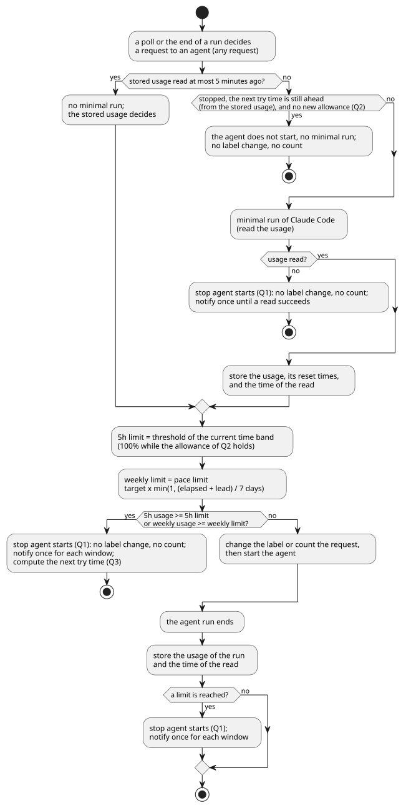

# 利用枠の設計

- 状態: Approved
- 要件: [Issueのラベルと状態遷移](../requirements/workflow/issue-states.md) のQ1〜Q4と「使用率の読み方」「上限の決め方」、[cumin本体の要件](../requirements/cumin-core.md) の「利用枠の守り方」「状態の持ち方」「設定」
- 事実の出どころ: [調査・実測で確定した制約](../requirements/evidence/measured-constraints.md) の行の番号 (「実測 N」と書く) か、公式ドキュメントのページの名前で示す。

新しい着手 (R1、I1) を止めるかどうかを、使用率からどう決めるかを書く。使用率を読む最小の実行そのもの (CLIの引数、作業ディレクトリ、読み取れないときの扱い) は、[cumin本体の設計メモ](cumin-core.md) の「起動前の使用率の確認」にある。

## 範囲

扱うこと:

- 使用率を読む時点、上限の計算、止めている間の動き、許可の受け渡し、Q1〜Q4の通知の重複の防ぎ方。`internal/quota` と、それを呼ぶ `internal/workflow` と `cmd/cumin` の受け持ちに当たる。

扱わないこと:

- 使用率を読む最小の実行の中身。[cumin本体の設計メモ](cumin-core.md) の「起動前の使用率の確認」にある。
- 枠の上限に当たったときの実行の終わり方 (実測 6、未確認)。
- Claude Code以外のCLIの枠。[要求のbacklog](../requirements/backlog.md) にある。

## 設計

### 着手の前の確認

図の元ファイル: [quota-start.puml](quota-start.puml)

- 使用率を読む最小の実行は、`internal/workflow` が着手 (R1、I1) を決めたあと、ラベルを付け替える前に行う。上限に達していれば、ラベルは変わらない。同じ状態からは、いつも同じ動作になる。
- `agent.Service.Start` は、使用率を読まない。着手でない依頼 (I4、I5、Reviewerへの依頼) は、上限に達していても進めるためである。
- 最小の実行は、着手ごとに1回行う。同じ定期確認で別のリポジトリにも着手するときも、前の着手の値を使い回さない。要件の「着手の直前に読み直す」に従う。
- 始まったばかりの実行は、まだ枠をほとんど使っていないので、読み直しても並行する実行の分は見えない。上限を超える分は、並行して動く実行 (リポジトリごとに `max_issues_in_progress`) の残りの分までであり、上限までの余白で受ける。
- 採らなかった案: 1回の定期確認で読んだ値を、その定期確認の全ての着手に使う方法。並行する着手が、同じ古い値で全て通る。
- 採らなかった案: Agentが動いている間は、どのリポジトリにも着手しない方法。超える分は減るが、要件の設定の表が認める、違うリポジトリの並行が失われる。
- Agentの実行が終わるたびに、その結果の使用率を残し、上限に達していればQ1で止める。次の着手を待たずに止められる。
- 採らなかった案: 今のまま `Start` の中で読み、上限に達していたらラベルを戻す方法。ラベルが行き来し、同じIssueを二重に扱う窓ができる。

### 上限の計算

- 判定は `internal/quota` の純粋な関数にする。入力は、使用率 (枠ごとの使用率とリセット時刻)、今の時刻、設定、許可である。出力は、枠ごとの上限と、止めるかどうかと、次に試す時刻である。I/Oを持たないので、時刻を与えるだけで週の始め、中ごろ、終わりを試せる。
- 使用率 (0〜1、実測 1) を百分率にして、上限と比べる。上限「以上」で止める。
- 経過時間は、今の時刻から、weekly枠のリセット時刻の7日前を引いたものである。0未満は0に、7日を超えれば7日にする。リセット時刻を過ぎた値しか残っていなければ、使用率は古いので、止める理由にしない。
- 5h枠の時間帯は、Hostのローカルの時刻で判定する (設定の時間帯と同じ)。
- 採らなかった案: weekly枠にも時間帯を持たせる方法。ペースの上限だけで、週の配分と、Ownerの分の確保が両立する。

### 止めている間

- 最新の使用率は、状態ファイル (`internal/core/state`) に、枠ごとのリセット時刻と読んだ時刻とともに残す。cuminが再起動しても、止めている間に最小の実行を繰り返さない。
- 次に試す時刻は、要件の「使用率の読み方」の決まりで、残した使用率から計算する。ペースの上限が使用率 u を上回る経過時間は、u ÷ 目標 × 7日 − 前倒しである。u が目標以上なら、weekly枠のリセット時刻になる。
- その時刻までの定期確認では、最小の実行をしない。その時刻を過ぎたら、着手の前の確認で読み直す (Q3)。Ownerの作業で使用率が増えていれば、また止まり、次の時刻を計算し直す。
- 使用率を読み取れなかったときは、次に試す時刻を持たない。次の定期確認で読み直す。

### 使い切りの許可

- `cumin quota allow` は、状態ファイルに残った最新の5h枠のリセット時刻を、許可のファイル (`quota-allowance.json`、[cumin本体の設計メモ](cumin-core.md) の「Hostに置くファイル」) に書く。許可は、その時刻を過ぎるまで効く。
- 残った5h枠のリセット時刻がない、または既に過ぎているときは、許可を書かずに、理由を表示して終わる。今の5h枠が分からないまま、許可の終わりを決められないためである。
- `cumin run` は、定期確認のたびに許可のファイルを読む。許可が効いている間は、5h枠の上限を100%にし、次に試す時刻を待たずに着手の前の確認を行う (Q2)。
- `cumin quota allow` は、状態ファイルを読むだけで、書かない。1つのファイルを書くプロセスは1つだけ、という決まりを守る。

### 通知の重複の防ぎ方

- Q1の通知は、枠ごとに、止めてから再開するまでに1回にする。読み取れなかったことの通知は、読み取れるまでに1回にする。
- Q4の通知は、cuminが何か動作をするまでに1回にする。
- どの印も、`cumin run` のメモリに持つ。再起動すると同じ通知がもう1回出うるが、状態ファイルに持つものを増やさない。
- 通知とinfoのログには、使用率の数値を書かない。数値は、debugのログと `cumin status` の表示にだけ出す。

### `cumin status` の表示

- `cumin status` は、状態ファイルと許可のファイルを読むだけで、最小の実行をしない。表示する使用率は、最後に読んだ値とその時刻である。
- 実行中のAgentとOwnerの対応を待つIssueは、GitHubのラベルから読む。`cumin run` とプロセスが違い、手元に実行中の一覧を持たないためである。

## まだ決めていないこと

| 決める、または確かめること | どこで |
|---|---|
| weekly枠のリセット時刻が、週の間に動かないこと (週の始まりをリセット時刻の7日前とする前提) | ライブシナリオ Quota-1 と、運用の記録 |
| `cumin status` が GitHub を読むときの身元 (`cumin-core` のtoken) | `cumin status` の実装Issue |

## 後回しにしたこと

- 使用率の推移を残して、ペースの目標を自動で合わせること。きっかけ: 目標と前倒しの手での調整が、週に1回を超えて必要になったとき。
