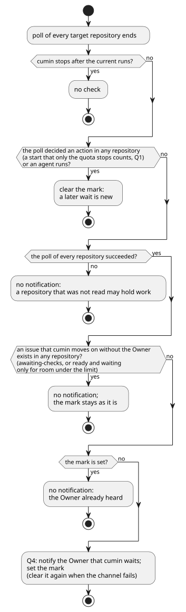
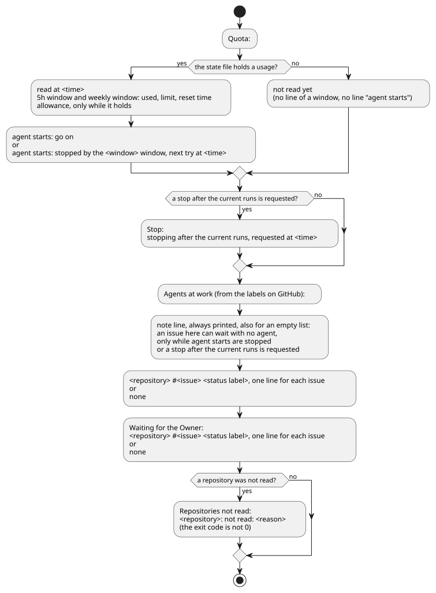

# 利用枠の設計

- 状態: Approved
- 要件: [Issueのラベルと状態遷移](../requirements/workflow/issue-states.md) のQ1〜Q4と「使用率の読み方」「上限の決め方」、[cumin本体の要件](../requirements/cumin-core.md) の「利用枠の守り方」「状態の持ち方」「設定」
- 事実の出どころ: [調査・実測で確定した制約](../evidence/measured-constraints.md) の行の番号 (「実測 N」と書く) か、公式ドキュメントのページの名前で示す。

Agentの起動を止めるかどうかを、使用率からどう決めるかを書く (「stop agent starts」「resume agent starts」)。使用率を読む最小の実行そのもの (CLIの引数、作業ディレクトリ、読み取れないときの扱い) は、[cumin本体の設計メモ](cumin-core.md) の「起動前の使用率の確認」にある。

## 範囲

扱うこと:

- 使用率を読む時点、上限の計算、止めている間の動き、許可の受け渡し、Q1〜Q4の通知の重複の防ぎ方。`internal/quota` と、それを呼ぶ `internal/workflow` と `cmd/cumin` の受け持ちに当たる。

扱わないこと:

- 使用率を読む最小の実行の中身。[cumin本体の設計メモ](cumin-core.md) の「起動前の使用率の確認」にある。
- 枠の上限に当たったときの実行の終わり方 (実測 6、未確認)。
- Claude Code以外のCLIの枠。[要求のbacklog](../requirements/backlog.md) にある。

## 設計

### Agentの起動の前の確認

図の元ファイル: [quota-start.puml](quota-start.puml)

- Agentの起動の前の確認は、`internal/workflow` がAgentに依頼する動作を決めたあと、ラベルを付け替える前、依頼し直しを数える前に行う。上限に達していれば、ラベルは変わらない。同じ状態からは、いつも同じ動作になる。
- 「読んだばかり」の使用率とは、状態ファイルに残した使用率のうち、読んだ時刻が今から5分以内のものである (ちょうど5分を含む)。要件の「使用率の読み方」が設計に任せた値である。純粋な関数 `quota.Fresh` が、読んだ時刻と今の時刻から決める。比べるのは壁時計の時刻である。Goの単調時計はHostのスリープの間に止まりうるので (公式: `time` パッケージの "Monotonic Clocks")、単調時計の値を外してから比べる。スリープの前に読んだ使用率が、読んだばかりのままにならない。
- 読んだばかりの使用率があれば、最小の実行をせずに、その使用率で上限と比べる。上限に達していれば起動せず、Q1 (stop agent starts) でOwnerに通知する (枠ごとに1回。待つIssueがいくつあっても同じである)。この停止のログはdebugにする。読んだばかりの間は定期確認のたびに同じ判定になり、infoだとログが埋まるためである。
- 読んだばかりの使用率がなければ (5分より古い、まだ残していない、読んだ時刻が今より先)、最小の実行を1回行って読み直す。読んだ時刻が今より先になるのは時計が戻ったときで、安全な側に倒す。
- 読み取れなかったことは、その定期確認の終わりまで覚えておく。同じ定期確認のあとの依頼は、最小の実行をせずに待つ。同じ理由でまた失敗するだけだからである。Ownerへの通知は、最初の失敗が出している。印は `cumin run` のメモリに持ち、状態ファイルには残さない。`Poll` が、全てのリポジトリを見る前に1回だけ消すので、次の定期確認は読み直す。読み取れたときは、印を付けない。
- 1回の起動のコストは、最小の実行が0回か1回である。Agentの実行は終わりに使用率を報告するので、実行の終わりに続く依頼は0回になる。同じ定期確認で続けて起動するときも、2件目からは1件目の最小の実行の値を使う。
- 5分は定数 (`quota.FreshFor`) にする。要件の設定の表にないためである。5分は、定期確認の間隔 (60秒) の数回分で、アイドルの間隔と同じである。Ownerの作業などcuminの外で使用率が増えても、見逃すのは5分の分までであり、上限までの余白で受ける。
- `agent.Service.Start` は、使用率を読まない。使用率の確認は、Agentの起動の前の1つの確認 (`permitStart` と純粋関数 `PermitStart`。[cumin本体の設計メモ](cumin-core.md) の「実行を待ってから止める」) の中にあり、`quotaAllowsStart` を呼ぶのはそこだけである。新しい種類の依頼も、この確認を通らずにAgentを起動できない。
- 確認を通る依頼は、Agentへの依頼の全てである。

  | Role | 依頼 |
  |---|---|
  | Planner | 分割 (R1)、分割の依頼し直し、受け入れの確認 (定期確認から、分割の実行の終わりから)、受け入れの確認の依頼し直し |
  | Implementer | 実装 (I1)、実装の依頼し直し、checkの修正 (I4)、指摘の修正 (I5)、衝突の解消 (merge、`cumin/status/checking`、`cumin/status/awaiting-merge-decision` から)、Ownerのレビューへの対応 (I13) |
  | Reviewer | レビュー (I3)、レビューの依頼し直し、原因の整理 (I8) |

- 上限に達しているとき、または使用率を読み取れないときは、その依頼のためのラベルの付け替えも、依頼し直しの回数の加算もしない。Issueは今の状態のまま残り、あとの定期確認が同じ事実から同じ動作を決める。上限に当たって結果を残さなかった実行を、依頼し直しに数えないためでもある。
- 動いている実行は、利用枠では止めない。Agentを起動しない動作 (ラベルの付け替え、コメント、通知、merge、Issueを閉じること) は、この確認を通らないので、上限に関係なく進む。
- 実行を待ってから止める間は、使用率を読まない。依頼は、どちらにしても次の起動まで待つためである。
- 始まったばかりの実行は、まだ枠をほとんど使っていないので、読み直しても並行する実行の分は見えない。上限を超える分は、並行して動く実行 (リポジトリごとに `max_issues_in_progress`) の残りの分までであり、上限までの余白で受ける。
- 採らなかった案: 起動ごとに最小の実行を1回行う方法。全てのAgentの起動の前に確かめるので、起動のたびに最小の実行が要り、コストが大きい。
- 採らなかった案: 「読んだばかり」の長さを設定にする方法。要件の設定の表にない。調整が要ると分かるまでは定数で足りる。
- 採らなかった案: Agentが動いている間は、どのリポジトリにも着手しない方法。超える分は減るが、要件の設定の表が認める、違うリポジトリの並行が失われる。
- Agentの実行が終わるたびに、その結果の使用率を、読んだ時刻とともに残し、上限に達していればQ1 (stop agent starts) で止める。次の起動を待たずに止められる。
- 採らなかった案: 今のまま `Start` の中で読み、上限に達していたらラベルを戻す方法。ラベルが行き来し、同じIssueを二重に扱う窓ができる。

### 上限の計算

- 判定は `internal/quota` の純粋な関数にする。入力は、使用率 (枠ごとの使用率とリセット時刻)、今の時刻、時刻を読むタイムゾーン (`*time.Location`)、設定、許可である。出力は、枠ごとの上限と、止めるかどうかと、次に試す時刻である。I/Oを持たないので、時刻を与えるだけで週の始め、中ごろ、終わりを試せる。
- 使用率 (0〜1、実測 1) を百分率にして、上限と比べる。上限「以上」で止める。
- 経過時間は、今の時刻から、weekly枠のリセット時刻の7日前を引いたものである。0未満は0に、7日を超えれば7日にする。リセット時刻を過ぎた値しか残っていなければ、使用率は古いので、止める理由にしない。
- 5h枠の時間帯は、入力のタイムゾーンでの時刻で判定する。今の時刻の値が持つタイムゾーンは使わない。cumin (`workflow.Service` と `cumin status`) は、Hostのタイムゾーン (`time.Local`) を渡すので、時間帯はHostのローカルの時刻になる (設定の時間帯と同じ)。タイムゾーンの設定は持たない。テストは固定のタイムゾーンを渡すので、結果は実行するマシンのタイムゾーンによらない。
- 採らなかった案: weekly枠にも時間帯を持たせる方法。ペースの上限だけで、週の配分と、Ownerの分の確保が両立する。

### 止めている間

- 最新の使用率は、状態ファイル (`internal/core/state`) に、枠ごとのリセット時刻と読んだ時刻とともに残す。cuminが再起動しても、止めている間に最小の実行を繰り返さない。
- 次に試す時刻は、要件の「使用率の読み方」の決まりで、残した使用率から計算する。ペースの上限が使用率 u を上回る経過時間は、u ÷ 目標 × 7日 − 前倒しである。その時刻ちょうどでは上限と使用率が等しく、まだ止まるので、1分を足す。u が目標以上なら、weekly枠のリセット時刻になる。
- 5h枠のしきい値が変わるのは、時間帯の始まりと終わりだけである。次の24時間のうちのそれらの時刻で、しきい値が使用率を上回る最初のものと、5h枠のリセット時刻の早いほうを取る。
- その時刻までの定期確認では、最小の実行をしない。その時刻を過ぎたら、Agentの起動の前の確認で読み直す (Q3)。残した使用率が読んだばかりの間は、次に試す時刻によらず、その使用率で判定する (「Agentの起動の前の確認」)。Ownerの作業で使用率が増えていれば、また止まり、次の時刻を計算し直す。
- 使用率を読み取れなかったときは、次に試す時刻を持たない。その定期確認の残りの依頼は最小の実行をせずに待ち (「Agentの起動の前の確認」)、次の定期確認で読み直す。
- Agentの実行の終わりに読んだ使用率も、読み取れた使用率として残す。「読み取れなかった」ことの通知の印も、そこで消える。

### 使い切りの許可

- `cumin quota allow` は、状態ファイルに残った最新の5h枠のリセット時刻を、許可のファイル (`quota-allowance.json`、[cumin本体の設計メモ](cumin-core.md) の「Hostに置くファイル」) に書く。許可は、その時刻を過ぎるまで効く。
- 残った5h枠のリセット時刻がない、または既に過ぎているときは、許可を書かずに、理由を表示して終わる。今の5h枠が分からないまま、許可の終わりを決められないためである。
- `cumin run` は、定期確認のたびに許可のファイルを読む。許可が効いている間は、5h枠の上限を100%にし、次に試す時刻を待たずにAgentの起動の前の確認を行う (Q2、resume agent starts)。
- `cumin quota allow` は、状態ファイルを読むだけで、書かない。1つのファイルを書くプロセスは1つだけ、という決まりを守る。
- 読めない許可のファイル (壊れている、版が違う) は、許可がないものとして扱う。警告は、理由が変わるまで1回だけ出す。定期確認のたびに読むので、毎回出すとログが埋まるためである。

### 通知の重複の防ぎ方

- Q1の通知は、枠ごとに、止めてから再開するまでに1回にする。読み取れなかったことの通知は、読み取れるまでに1回にする。
- Q4の通知は、cuminが何か動作をするまでに1回にする。全てのリポジトリの定期確認が成功し、どのリポジトリでも判定が動作を1つも決めず、実行中のAgentもおらず、Agentの起動が利用枠だけで待っているIssueがどのリポジトリにもなく、cuminがOwnerなしで次に進めるIssueがどのリポジトリにもないときに出す。利用枠で止まったR1とI1も、判定が決めた動作なので、Q4は出ない。定期確認が1つでも失敗したときは、送らない。読めなかったリポジトリに、進められるIssueがあるかもしれないためである。ただし、失敗した定期確認でも、決めた動作があれば印を消す。
- cuminがOwnerなしで次に進めるIssueは、スナップショットの純粋関数 (`Snapshot.MovesWithoutMaintainer`) がリポジトリごとに決める。`cumin/status/checking` の開いているsub-issueと、`cumin/status/planning`、`cumin/status/implementing`、`cumin/status/reviewing`、`cumin/status/accepting`、`cumin/status/merging` のIssueと、着手できるのに同時に進めるIssueの数の上限だけで待っている `cumin/status/ready` のIssueである。作業中のラベルのIssueは、Agentが動いていなくても数える。次の定期確認が、事実から次の動作を決めるためである。blocked by のIssueが開いている `cumin/status/ready` のIssueと、Ownerを待つIssueは数えない。`cumin-core` でもOwnerでもないアカウントが付けたと読めた作業中のラベルのIssueも、数えない。1つのリポジトリにあれば、全てのリポジトリについてQ4を出さない。 最新の `cumin/status/ready` を付けたのがOwnerでないと読めたIssueは、Ownerがreadyを付け直すまで進まないので、数えない ([定期確認の設計](poll.md) の「Ownerのreadyの確認 (R1、I1)」)。
- Agentの起動が利用枠だけで待っているIssueは、Agentの起動の前の1つの確認 (`permitStart`) が、リポジトリごとに記録する。利用枠が起動を止めたときに記録し、そのリポジトリの次の定期確認の始めに消す。その定期確認が、まだ待っている起動を全て判定し直すためである。どの状態のIssueでも同じである。たとえば、`cumin/status/awaiting-merge-decision` のIssueへのOwnerの変更依頼は、判定が決めた動作に数えないが、この記録でQ4を止める。Agentの実行の終わりに利用枠が止めた起動も、同じ確認を通るので、同じく記録する。1つのリポジトリにあれば、全てのリポジトリについてQ4を出さない。Q1が原因を知らせているためである。記録は `cumin run` のメモリに持つ。
- そのIssueがあっても、cuminは何も動作をしていないので、印は変えない。通知を出さないだけである。必須のcheckがいつまでも結果を返さないときは、その間Q4は出ない。

図の元ファイル: [quota-waiting.puml](quota-waiting.puml)
- 印は、使用率を読むたびに、上限に達していない枠の分を消す。その枠がまた上限に達したら、新しい停止として知らせる。
- Q1の通知を出すかどうかは、Hostの設定 `notify.discord.enabled` で決め、リポジトリの設定では変えない。利用枠はHostのアカウントのものであり、印は全てのリポジトリで共通なので、通知を止めたリポジトリが、ほかのリポジトリの停止まで黙らせないためである。
- どの印も、`cumin run` のメモリに持つ。再起動すると同じ通知がもう1回出うるが、状態ファイルに持つものを増やさない。
- 通知とinfoのログには、使用率の数値を書かない。数値は、debugのログと `cumin status` の表示にだけ出す。

### `cumin status` の表示

図の元ファイル: [quota-status.puml](quota-status.puml)

- `cumin status` は、状態ファイルと許可のファイルを読むだけで、最小の実行をしない。表示する使用率は、最後に読んだ値とその時刻である。時刻は、上限の計算と同じHostのタイムゾーンで表示する。
- 実行中のAgentとOwnerの対応を待つIssueは、GitHubのラベルから読む。`cumin run` とプロセスが違い、手元に実行中の一覧を持たないためである。Agentが動くのは、`cumin/status/planning` と `cumin/status/accepting` の要求Issueと、`cumin/status/implementing` と `cumin/status/reviewing` の開いている実装Issueである。`cumin/status/implementing` の要求Issueは、Agentが動いていないので数えない (R3)。
- 使用率を読んだあとは、Agentの起動を止めているかどうかを1行で表示する。`agent starts: go on` または `agent starts: stopped by the <枠> window` で、止めているときは次に試す時刻を添える。止めるのは、新しい着手だけでなく、すべてのAgentの起動である。
- 使用率を最初に読む前は、使用率をまだ読んでいないことを `not read yet` の1行で表示する。このときは、枠の行も `agent starts` の行もない。状態ファイルに使用率がないので、止めているかどうかを計算できないためである。
- 利用枠を待つIssueの一覧は表示しない。「Agentを起動するかどうか」は、Issueごとの判断ではなく、cuminの1つの判断だからである。そのため、状態ファイルにも待つIssueの一覧を持たない。代わりに、実行中のAgentの見出し `Agents at work (from the labels on GitHub):` のすぐ下に、注記を1行、いつも表示する。一覧が空のときも表示する。注記は、この一覧のIssueがAgentなしで待つことがあり、それはAgentの起動を止めている間か、今の実行のあとに止まる予約がある間だけである、と述べる。ラベルは、Agentが今動いているかどうかまでは示さない。
- GitHubは、`cumin run` と同じ `cumin-core` のtokenで読む。定期確認と同じスナップショットの問い合わせを使うので、GitHubから見た身元も読むものも増えない。Keychainの秘密鍵を読むので、`cumin run` と同じHostのユーザで実行する。読む鍵は `cumin-core` の分だけで、リポジトリごとに読む。鍵が読めない持ち主のリポジトリだけが「読めなかった」になり、利用枠とほかのリポジトリは表示する。
- 読めなかったリポジトリは、理由を添えて表示し、終了コードを0以外にする。ほかのリポジトリと利用枠は表示する。

## まだ決めていないこと

| 決める、または確かめること | どこで |
|---|---|
| weekly枠のリセット時刻が、週の間に動かないこと (週の始まりをリセット時刻の7日前とする前提) | ライブシナリオ Quota-1 と、運用の記録 |

## 後回しにしたこと

- 使用率の推移を残して、ペースの目標を自動で合わせること。きっかけ: 目標と前倒しの手での調整が、週に1回を超えて必要になったとき。
