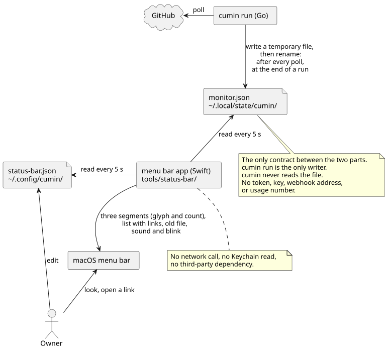

# モニターファイルとメニューバーのアプリの設計

- 状態: Draft
- 要件: 要求Issue [#392](https://github.com/cloveclovedev/cumin-works/issues/392) (cuminの状態をmacOSのメニューバーに表示する)。要件文書への反映は、[#500](https://github.com/cloveclovedev/cumin-works/issues/500) が [cumin本体の要件](../requirements/cumin-core.md) の「状態の持ち方」に行う
- 事実の出どころ: 公式ドキュメントはページの名前で示す。SF Symbolsの記号が使える版は、macOSに入っている一覧 (CoreGlyphs の `name_availability.plist`) で確かめ、「一覧」と書く。それ以外は、この文書で決めたことである。

`cumin run` が書くモニターファイル (`monitor.json`) の中身と、それを読んでmacOSのメニューバーに表示するアプリの作りを決める。`cumin status` も同じファイルを読むので、その読み方もここで決める。

## 範囲

扱うこと:

- モニターファイルの場所、書く時点、全てのフィールド。ファイルは、cuminとアプリの間のただ1つの約束である。
- アプリの技術、置き場所、ファイルの読み方、表示、新しい項目の知らせ方、設定。
- `cumin status` がファイルから読んで表示する行。

扱わないこと:

- ファイルに載せる事実をcuminがどう得るか。[定期確認の設計](poll.md) と [利用枠の設計](quota.md) にある。
- アプリのビルドと起動の手順、LaunchAgentのplist。[メニューバーのアプリを作って起動する](../guides/status-menu-bar.md) にある。
- GitHubをアプリから読むこと、macOS以外のOS。#392 が範囲の外としている。

## 設計

- 採らなかった案: Goのアプリと、third-partyのメニューバーのライブラリ。cgoを使う新しい依存が要る (#392 での決定)。
- 採らなかった案: SwiftBar (third-partyのメニューバーのホスト) のスクリプト。Operatorがthird-partyのアプリを入れることになる (#392 での決定)。
- 採らなかった案: アプリがGitHubを読む。アプリにtokenが要り、cuminが既に読んだ事実をもう一度読むことになる (#392 での決定)。

### 2つの部品と約束



図の元ファイル: [status-menu-bar.puml](status-menu-bar.puml)

- 部品は2つで、対等である。片方がなくても、もう片方は動く。書く側は `cumin run`、読む側はアプリである。2つをつなぐのはモニターファイルだけで、互いのコードも設定も読まない。
- `cumin status` も、同じファイルを読む。cuminのコードの中で、ただ1つの読み手である (「`cumin status` の読み方」)。
- `cumin run` はアプリを知らない。アプリがなくても同じファイルを書く。同じファイルを読めば、別の表示 (CLI、ウィジェット) も作れる。
- アプリは、cuminの設定 (`config.toml`)、手元の状態 (`state.json`)、ログ、Keychain、GitHubを読まない。ネットワークを使わない。
- ファイルには、token、鍵、webhookのアドレス、使用率の数値を入れない。入れるのは、リポジトリの名前、Issueの番号と題名、IssueまたはPull RequestのURL、role、依頼の種類、待つものの種類、時刻、定期確認のエラーの文章、利用枠の状態と枠の名前だけである。

### モニターファイル

- 場所は `~/.local/state/cumin/monitor.json` である。cuminを外から見る道具のためのファイルであり、cumin自身の状態ではないので、`state.json` と紛れない名前にする。[cumin本体の設計メモ](cumin-core.md) の「Hostに置くファイル」の決まり (JSON、先頭に `version`、同じディレクトリの一時ファイルに書いてから rename、書くプロセスは1つだけ) に従う。権限は `state.json` と同じ (ファイルは0600) にする。
- 書くのは `cumin run` だけである。`cumin run` は、このファイルを読まない。起動時にも読まず、次に書くときに上書きする。cuminは、このファイルから何も決めない。`cumin status` は、表示のためにだけ読む。失っても、次に書くまで表示が古くなるだけである。
- 書く時点は2つである。定期確認の1回り (`poll_interval` ごとの、全ての対象リポジトリの確認) の終わりと、Agentの実行の終わりである。どのリポジトリも飛ばした回りでも書く。実行の終わりの書き込みは、`agents` だけを今のものにし、ほかのフィールドは最後の定期確認の1回りのままにする。`last_poll.at` は、定期確認でだけ進む。実行の始まりでは書かない。実行は定期確認の中で始まるので、その回りの終わりの書き込みに載る。`last_poll.at` が `poll_interval` ごとに進むので、アプリは1つの決まった上限で、cuminが止まったことに気付ける。
- 採らなかった案: リポジトリを確かめた回りだけ書く。作業中のIssueがないと、書く間隔が `idle_poll_interval` まで延び、止まったことに気付くのが遅れる。
- 採らなかった案 (前の決定): 実行中の一覧をファイルに書かない。手元のファイルが1つ増えるためだった。#392 で、表示のために書くと決めた。
- 採らなかった案: 止まるときに「止まった」と書く。異常終了では書けないので、古いファイルの判定はどちらにしても要る。
- 中身は、定期確認が既に持っている事実から、純粋関数で作る。このファイルのために、GitHubへの問い合わせも、使用率を読む最小の実行も増やさない。関数は `internal/workflow` に、書き込みは `internal/core/state` に置く。
- 時刻は、RFC 3339のUTCの文字列にする (`state.json` と同じ)。
- `version` を上げるのは、読む側が壊れる変更のときだけにする。フィールドを足すだけなら上げない。アプリと `cumin status` は、知らないフィールドを読み飛ばし、自分が知る版より新しい `version` のファイルは表示しない。

フィールドは次の通りである。配列は、空のときも `[]` として必ず書く。

| フィールド | 型 | 意味 |
|---|---|---|
| `version` | 整数 | 形式の版。今は `1` |
| `last_poll.at` | 時刻 | 最後の定期確認の1回りが終わった時刻。アプリと `cumin status` は、これで古いファイルを判定する |
| `last_poll.errors` | 配列 | 最後の確認が失敗したままのリポジトリ。全て成功していれば空。飛ばしたリポジトリは、前の結果を保つ |
| `last_poll.errors[].repository` | 文字列 | `<owner>/<repo>` |
| `last_poll.errors[].message` | 文字列 | 失敗の理由を1行にしたもの。定期確認が続けて失敗したときの通知 ([定期確認の設計](poll.md)) に載せる文章と同じである |
| `stop_requested` | 真偽 | 実行を待ってから止まる途中か ([cumin本体の設計メモ](cumin-core.md) の「実行を待ってから止める」) |
| `quota.state` | 文字列 | `open` (Agentの起動を進める)、`stopped` (上限に達して止めている、「stop agent starts」)、`unread` (使用率を読み取れず止めている、「stop agent starts」) |
| `quota.stopped_windows` | 配列 | 上限に達した枠の名前。`5h` と `weekly`。`stopped` のときだけ要素を持つ |
| `quota.next_try_at` | 時刻 | 次にAgentの起動を試す時刻 (「resume agent starts」)。ないときは、キーを書かない |
| `agents` | 配列 | `cumin run` が実行中として持つAgentの実行。1つの実行が1つの要素。リポジトリ、Issueの番号の順に並べる |
| `agents[].repository` | 文字列 | `<owner>/<repo>` |
| `agents[].issue` | 整数 | Issueの番号 |
| `agents[].role` | 文字列 | `planner`、`implementer`、`reviewer` |
| `agents[].request` | 文字列 | 依頼の種類。roleの指示ファイルが使う名前 (`plan`、`acceptance check`、`implement`、`continue`、`check fix`、`conflict resolution`、`review`、`review fix`、`owner review fix`、`explain the cause`) |
| `agents[].title` | 文字列 | Issueの題名 |
| `agents[].url` | 文字列 | IssueのURL |
| `waiting` | 配列 | Maintainerの対応を待つ、開いているIssue。リポジトリごとに、最後に読めたスナップショットから作る。設定のリポジトリの順、Issueの番号の順に並べる |
| `waiting[].repository` | 文字列 | `<owner>/<repo>` |
| `waiting[].issue` | 整数 | Issueの番号 |
| `waiting[].kind` | 文字列 | 待つものの種類。下の表の4つの値 |
| `waiting[].title` | 文字列 | Issueの題名 |
| `waiting[].url` | 文字列 | `merge-decision` では、開いているPull RequestのURL。ほかの3つでは、IssueのURL |

例:

```json
{
  "version": 1,
  "last_poll": {
    "at": "2026-10-04T07:00:05Z",
    "errors": [
      {"repository": "example/app", "message": "read the snapshot: GitHub returned 502"}
    ]
  },
  "stop_requested": false,
  "quota": {
    "state": "stopped",
    "stopped_windows": ["5h"],
    "next_try_at": "2026-10-04T09:00:00Z"
  },
  "agents": [
    {"repository": "example/tool", "issue": 12, "role": "implementer", "request": "implement", "title": "feat(api): add the list endpoint", "url": "https://github.com/example/tool/issues/12"}
  ],
  "waiting": [
    {"repository": "example/tool", "issue": 9, "kind": "merge-decision", "title": "fix(api): return 404 for a missing item", "url": "https://github.com/example/tool/pull/14"},
    {"repository": "example/app", "issue": 31, "kind": "decision", "title": "Show the history of an item", "url": "https://github.com/example/app/issues/31"}
  ]
}
```

`waiting[].kind` の値:

| 値 | いつ | 今のメニューバーの区画 |
|---|---|---|
| `plan-review` | `cumin/status/awaiting-plan-review` の要求Issue。sub-issueが1つ以上あり、全て閉じているものは載せない。cuminが「request the acceptance check」で進めるためである | 承認を待つ |
| `merge-decision` | `cumin/status/awaiting-merge-decision` の実装Issue | 承認を待つ |
| `acceptance` | `cumin/status/awaiting-acceptance` の要求Issue | 承認を待つ |
| `decision` | `cumin/status/awaiting-decision` のIssue (要求Issueでも実装Issueでも) | 答えを待つ |

- 種類は、人を待つ4つのラベル ([Issueのラベルと状態遷移](../requirements/workflow/issue-states.md)) の1つずつから決まる。名前は、ラベルの名前から `awaiting-` を除いたものである。定期確認が既に読んでいるラベルだけで決まり、sub-issueの開閉は読まない。問い合わせも足さない。
- 載せるのは、4つのラベルのどれかを持つ要求Issueと、開いているsub-issueである。閉じたsub-issueは載せない。Issueの種類 (要求Issueか実装Issueか) では絞らない。表の「いつ」は、[Issueのラベルと状態遷移](../requirements/workflow/issue-states.md) でそのラベルが付くIssueである。
- 定期確認が飛ばしたリポジトリと、読み取りに失敗したリポジトリは、最後に読めたスナップショットの項目を保つ。ラベルが変わったIssueは、そのリポジトリを次に読めた定期確認の終わりの書き込みで、一覧から消える。
- 区画より細かく分けるのは、あとで表示を変えても、ファイルを変えずに済むようにするためである。
- 判断の依頼と、止まったIssueは、どちらも `decision` で、分けない。分けるにはコメントを読むことになる。
- `merge-decision` のURLは、定期確認の2つ目の問い合わせ ([定期確認の設計](poll.md) の「2つの問い合わせ」) が読んだ、開いているPull Requestの番号から作る。Maintainerが判断する場所は、Pull Requestだからである。開いているPull Requestが読めていないときは、IssueのURLにする。開いているPull Requestが2つ以上あるときは、スナップショットの最初の1つにする。
- `agents` に載るのは、`cumin run` が実行中として持つ実行だけである。Agentなしで進む作業中の状態 (`cumin/status/merging`) は載せない。受け入れの確認は、`cumin/status/accepting` のもとのPlannerの実行として載る。1つの実行が別の依頼に続くとき (レビューのあとの原因の説明、レビューのあとの修正) は、roleと依頼の種類が今の依頼のものに変わる。この変化では書かないので、ファイルには次の書き込み (定期確認の1回りの終わり、または実行の終わり) で載る。
- 題名は、メニューの行に出す。sub-issueの題名は、定期確認が既に読んでいる。要求Issueの題名は、1つ目の問い合わせに項目を1つ足して読む。問い合わせの数は増えない。`agents` の題名は、依頼を始めるときのスナップショットから取り、実行とともに持つ。
- 採らなかった案 (前の決定): 題名を載せず、URLをどれもIssueにする。載せるものは減るが、行が番号だけになり、mergeの判断ではPull Requestへ移る手間が残る。
- 利用枠は、状態の名前と、枠の名前と、次に試す時刻だけを載せる。使用率、上限、リセット時刻は載せない。受け入れた不利益: weekly枠の次に試す時刻は使用率から計算するので、設定を知る人は使用率を逆算できる。ファイルはHostのユーザだけが読める。

### アプリの構成

- Swiftのpackageを `tools/status-bar/` に置き、`swift build` で作る。third-partyの依存は持たない (#392 での決定)。Goのモジュールとは別で、`go build ./...` はこのディレクトリを読まない。
- 実行ターゲット1つと、テストのターゲット1つにする。表示はAppKitの `NSStatusItem` で作り、Dockには出さない。
- 採らなかった案: SwiftUIの `MenuBarExtra`。点滅のたびに1枚の画像を描き直して差し替えるので、画像を直接渡せる `NSStatusItem` のほうが単純である。
- 判定は純粋な型にまとめる。入力は、ファイルのバイト列、設定、今の時刻、前に見た項目である。出力は、メニューバーの区画、メニューの行、鳴らす音である。AppKitを使うのは、入口のファイルだけにする。
- テストは `swift test` (XCTest) で、純粋な型だけを試す。時刻は引数で渡すので、どのマシンでも同じ結果になる。Goの受け入れテストのgolden file (`internal/workflow/testdata/monitor-file.json`) を、Swiftのテストも読む。1つのファイルが、書く側と読む側の両方を確かめる。Maintainerのセッションのskill `watch` のスクリプトも、モニターファイルの `waiting` を読む。そのテスト (`plugins/cumin-maintainer/watch_test.go`) も、同じgolden fileを読む ([Maintainerのセッションにskillを入れる](../guides/maintainer-skills.md))。
- Swiftのテストは、golden fileを、テストのソースファイルの場所 (`#filePath`) からリポジトリの先頭をたどったパスで読む。写しも、packageのresourceも作らない。リポジトリのcheckoutの中で `swift test` を実行することが前提である。
- 対応する最も古い版は、macOS 13 と、Swiftのtools version 5.9 である。手本のアプリ (#392 での決定) と同じにする。
- CIのjob `status-bar` が、macOSのrunnerで `swift build` と `swift test` を実行する (`.github/workflows/ci.yml`)。テストはGoのコードのゴールデンファイルを読むので、アプリが読めない形にモニターファイルを変えると、このjobが失敗する。
- 起動は、ログイン時のLaunchAgentで行う。cuminのLaunchAgentとは別のものである。

### ファイルの読み方と表示

- アプリは、5秒ごとのタイマーで、モニターファイルと設定を読み直す。
- 採らなかった案: ディレクトリの監視。同じディレクトリに `state.json` とログがあり、ログの1行ごとに通知が来る。
- メニューバーには、区画を3つまで出す。区画は、SF Symbolsの記号1つと数字1つである。全ての区画を1枚のテンプレート画像に描くので、メニューバーの明暗に合わせて単色になる。

| 区画 | 数 | ファイルから | 記号 |
|---|---|---|---|
| 実行中 | 続いているAgentの実行 | `agents` の長さ | `play.fill` |
| 承認を待つ | Maintainerの承認を待つIssue | `kind` が `plan-review`、`merge-decision`、`acceptance` の `waiting` | `hand.raised.fill` |
| 答えを待つ | Maintainerの答えを待つIssue | `kind` が `decision` の `waiting` | `questionmark.circle.fill` |

- 数は、Hostの全てのリポジトリの合計である。数が0の区画は描かない。区画が1つも残らないときは、中立の記号 (`circle`) を1つ描き、項目が消えないようにする。
- 実行中の区画は、roleで分けない。roleと依頼の種類は、メニューの行に出す。
- 4つの記号は、どれもSF Symbolsの最初の版 (2019) からある (一覧)。記号から画像を作る `NSImage(systemSymbolName:accessibilityDescription:)` は macOS 11.0 からなので (公式: NSImage の同名のページ)、アプリが対応するどの版でも使える。
- メニューを開くと、`agents` と `waiting` の1行ずつが並ぶ。行には、リポジトリ、番号、題名と、`agents` ではroleと依頼の種類、`waiting` では種類を出す。行を選ぶと、`url` を既定のブラウザで開く。その下に、利用枠の状態、止める予約、定期確認のエラー、最後の定期確認の時刻、Quitを出す。
- 古いファイルの判定: 今の時刻から `last_poll.at` を引いた値が上限を超えたら、古いとする。上限の初期値は180秒で、設定で変えられる。`poll_interval` の初期値 (60秒) の3回分であり、1回りが遅れても古いとしない。`poll_interval` を長くしたHostでは、Operatorが上限も長くする。
- 採らなかった案: 上限をファイルに載せる (cuminが `poll_interval` から計算する)。#392 で、決まった上限とした。約束のフィールドも1つ増える。
- 古いファイル、ないファイル、読めないファイル、新しすぎる `version` のファイルでは、区画を出さず、中立の記号を薄くして1つ出す。メニューには理由を1行出す。古い数字を、今の状態のように見せないためである。

### `cumin status` の読み方

- `cumin status` は、モニターファイルを読んで、cuminが定期確認をしているかを表示する。読むのは `internal/core/state` の `ReadMonitorFile` で、表示は `cmd/cumin/status.go` にある。表示する行の名前は、[cumin本体の要件](../requirements/cumin-core.md) の `cumin status` の行に従う。
- 見出し `Last poll:` の下に、`last_poll.at` (Hostのタイムゾーン) と今までの経過時間、`last_poll.errors` の数、エラーの1つずつ (リポジトリと文章) を出す。
- 古いファイルの判定: 経過時間が、Hostの設定の `poll_interval` の3倍を超えたら、最後の定期確認が古いことを、上限とともに1行で出す。`cumin status` はHostの設定を読むので、アプリの決まった上限 (180秒) ではなく、`poll_interval` から上限を計算する。3倍にする理由は、アプリと同じである (1回りが遅れても古いとしない)。古いときも、ほかの行はそのまま出す。
- ファイルがないときは、そのことを1行で出す。読めないファイル (JSONでない、`version` が新しすぎる、`last_poll.at` か配列がない) は、理由を1行で出す。どちらのときも、モニターファイルからの行だけを省き、残りの表示は続ける。
- 見出し `Agents at work (as cumin run holds them, from the monitor file):` の一覧に、`agents` の1つずつを、リポジトリ、番号、role、依頼の種類、題名で出す。GitHubのラベルから読む一覧は、そのまま残す。ラベルの一覧は、Agentなしで待つIssueも含む。`agents` の一覧は、`cumin run` が今持つ実行だけである。
- モニターファイルの文字列 (題名、エラーの文章など) は、制御文字を除いてから出す。題名はGitHubのIssueから来るので、端末を操作する文字が入りうる。
- 終了コードは、モニターファイルの中身で変えない。古いときも、エラーがあるときも、ファイルがないときも、今までと同じである。
- `quota`、`stop_requested`、`waiting` は表示に使わない。`cumin status` は、同じ事実を状態ファイル、止める予約のファイル、GitHubのラベルから読んでいる。

### 新しい項目の知らせ方

- `waiting` に新しい項目が現れたら、音を1回鳴らす。対象は、待つ2つの区画 (承認を待つ、答えを待つ) で、それぞれ自分の新しい項目で鳴る。実行中の区画は、鳴らず、点滅しない。項目は、`repository`、`issue`、`kind` の組で見分ける。同じIssueでも、種類が変われば新しい項目である。
- 点滅は、設定 `blink` の3つの値で決まる (「アプリの設定」)。初期値の `new` では、新しい項目が現れた区画が点滅し、メニューを開くと止まる。
- アプリの起動のあと、最初に読んだ項目では鳴らさない。アプリを起動し直すたびに、既に知っている項目で鳴らさないためである。
- 見た項目は、アプリのメモリにだけ持つ。ファイルが古い間は、新しい項目を数えない。
- 採らなかった案: Notification Centerの通知。#392 の計画が範囲の外とした。app bundleが要るかは未確認である。
- 通知 (Discord) は、今までどおり `cumin run` が出す。アプリの音は、それを置き換えない。

### アプリの設定

- 場所は `~/.config/cumin/status-bar.json` で、Operatorが編集する。全てのキーは任意で、ないキーは初期値になる。ファイルがない、または読めないときは、全て初期値にする。
- TOMLにしない。標準ライブラリにTOMLの読み取りがなく、third-partyの依存を持たないためである。cuminの設定の一覧 ([設定の一覧](../development/configuration.md)) には載せず、ガイド (#507) に書く。

| キー | 意味 | 初期値 |
|---|---|---|
| `stale_after_sec` | 古いファイルとする上限 (秒) | `180` |
| `sound_approval` | 承認を待つ新しい項目で鳴らす、システムの音の名前。`""` は鳴らさない | `"Glass"` |
| `sound_answer` | 答えを待つ新しい項目で鳴らす、システムの音の名前。`""` は鳴らさない | `"Tink"` |
| `blink` | 待つ2つの区画の点滅。`off` (点滅しない)、`new` (新しい項目が現れると点滅し、メニューを開くと止まる)、`always` (区画が出ている間、点滅し続ける) | `"new"` |

## まだ決めていないこと

なし

## 後回しにしたこと

- Notification Centerの通知と、app bundle。きっかけ: 音と点滅では、Maintainerが気付かないと分かったとき。
- `cumin setup` にアプリのLaunchAgentを書き出すサブコマンドを足すこと。きっかけ: 手でplistを置く手順 (#507) が、誤りのもとになったとき。
