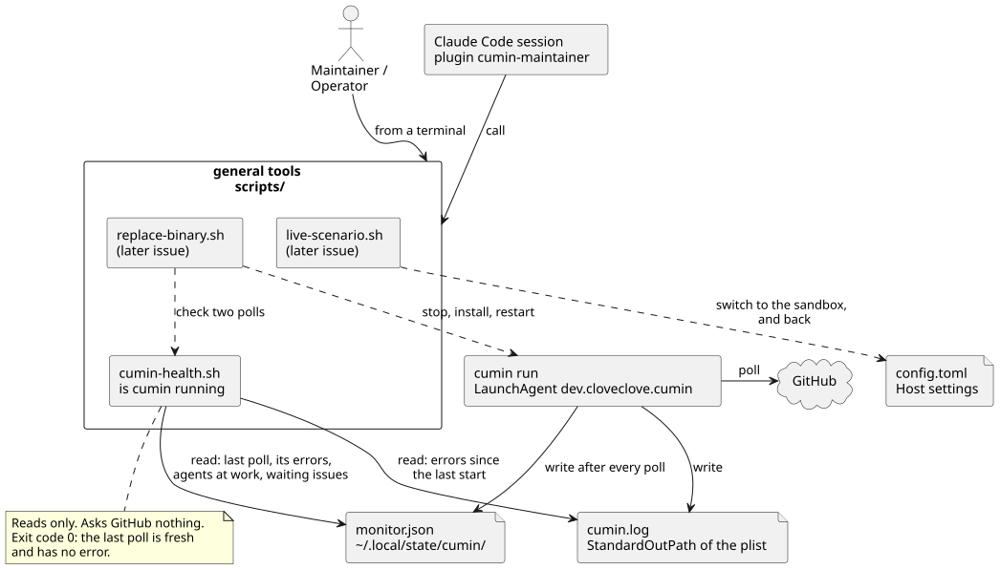

# Hostの一般の道具

MaintainerやOperatorが、Claude Codeなしで端末から使う道具の使い方。道具は `scripts/` のスクリプトで、どれも待つ時間に上限がある。Maintainerのセッションのskill ([Maintainerのセッションにskillを入れる](maintainer-skills.md)) は、同じ道具を呼ぶだけで、自分の手順を足さない。

## 一般の道具とは何か



図の元ファイル: [host-tools.puml](host-tools.puml)

| 道具 | すること | 今あるか |
|---|---|---|
| `scripts/cumin-health.sh` | cuminが動いているかを言う。最後の定期確認、起動してからのエラー、実行中のAgent | ある (この文書の「cuminが動いているか確かめる」) |
| `scripts/replace-binary.sh` | 実行を待ってcuminを止め、新しいバイナリを入れ、起動し直し、定期確認を2回確かめる | まだない。あとのIssueで加わる (図の点線の矢印) |
| `scripts/live-scenario.sh` | Hostの設定をsandboxに向けて実機のシナリオを実行し、結果にかかわらず設定を戻す | まだない。あとのIssueで加わる (図の点線の矢印) |

- 道具は、cuminの判断を変えない。`cumin-health.sh` は読むだけで、何も書かず、GitHubに問い合わせない。
- 道具は、1つのOrganizationの事実 (リポジトリ、App、人の名前) を持たない。

## cuminが動いているか確かめる

「cuminが動いているか」には、3つの部分がある。最後の定期確認、起動してからのエラー、実行中のAgentである。`cumin status` は実行中のAgentを、メニューバーのアプリ ([メニューバーのアプリを作って起動する](status-menu-bar.md)) は最後の定期確認を示す。`scripts/cumin-health.sh` は、3つをまとめて1回で出し、終了コードで答える。

### 必要なもの

- macOS。スクリプトは、macOSに入っている道具 (`sh`、`plutil`、`date`、`sed`、`awk`、`sleep`) だけを使う。JSONも `plutil` で読むので、`jq` は要らない。
- `cumin run` が1回以上定期確認を終えていること。モニターファイル (`~/.local/state/cumin/monitor.json`) は、そのときにできる。
- 起動してからのエラーを見るには、LaunchAgentのplist (`~/Library/LaunchAgents/dev.cloveclove.cumin.plist`、[セットアップの手順](../development/setup-guide.md))。plistがなくても、ほかの行は出る。

### 実行する

リポジトリの先頭で実行する。

```sh
scripts/cumin-health.sh
```

出力の例:

```text
last poll: 2026-10-04T07:00:05Z (55s ago)
errors of the last poll: 1
  example/app: read the snapshot: GitHub returned 502
errors since the start: 1 (log: <home>/.local/state/cumin/cumin.log)
  2026-10-04T06:20:00Z the poll failed
agents at work: 2
  example/app#31 planner (acceptance check): Show the history of an item
  example/tool#12 implementer (implement): feat(api): add the list endpoint
waiting issues: 2
error: the last poll has 1 error(s)
```

| 行 | 出どころ | 意味 |
|---|---|---|
| `last poll` | モニターファイルの `last_poll.at` | 最後の定期確認の1回りが終わった時刻と、今までの秒数 |
| `errors of the last poll` | モニターファイルの `last_poll.errors` | 最後の確認が失敗したままのリポジトリと、その理由 |
| `errors since the start` | LaunchAgentのログ | 最後の `cumin run starts` の行よりあとの、levelが `ERROR` の行の数と、各行の時刻とメッセージ |
| `agents at work` | モニターファイルの `agents` | 実行中のAgent。リポジトリ、Issueの番号、role、依頼の種類、題名 |
| `waiting issues` | モニターファイルの `waiting` | Maintainerの対応を待つIssueの数。中身は、メニューバーのアプリか `cumin status` で見る |
| 最後の行 | 上の行から | 動いていれば `cumin is running: ...`、そうでなければ `error:` と理由 |

- ログの場所は、plistの `StandardOutPath` から読む。スクリプトは場所を決め打ちしない。
- ログの行からは、時刻とメッセージだけを出す。ほかのフィールドは出さない。モニターファイルにも使用率は載らないので ([モニターファイルとメニューバーのアプリの設計](../designs/status-menu-bar.md))、スクリプトは使用率の数値を出さない。
- plistがない、ログが読めない、ログに `cumin run starts` の行がないときは、`errors since the start: unknown` と理由を出す。
- モニターファイルの各フィールドの意味は、[モニターファイルとメニューバーのアプリの設計](../designs/status-menu-bar.md) にある。

### 終了コード

| 終了コード | いつ |
|---|---|
| `0` | 最後の定期確認が新しく、エラーがない |
| `1` | 最後の定期確認が古い。最後の定期確認にエラーがある。モニターファイルがない、または読めない。`--wait-polls` が上限で終わった、または待った定期確認にエラーがあった |
| `2` | オプションの誤り |

- 「新しい」とは、今の時刻から `last_poll.at` を引いた値が上限以下であることである。上限の初期値は180秒で、メニューバーのアプリの `stale_after_sec` の初期値と同じである。`poll_interval` を長くしたHostでは、`--stale-after` で上限も長くする。
- 古いときは、cuminが止まったか、Hostがスリープしたかである。`launchctl print gui/$(id -u)/dev.cloveclove.cumin` で、jobの状態を確かめる。
- 起動してからのエラーは、表示するだけで、終了コードを変えない。前の定期確認のエラーは、次の定期確認が成功すれば済んだことだからである。
- モニターファイルの `version` が、スクリプトの知る版より新しいときも、読めないものとして `1` で終わる。

### オプション

| オプション | 意味 | 初期値 |
|---|---|---|
| `--stale-after <seconds>` | 最後の定期確認を古いとする上限 (秒) | `180` |
| `--wait-polls <n>` | 報告の前に、`last_poll.at` がn回進むのを待つ | 待たない |
| `--timeout <seconds>` | `--wait-polls` の待つ時間の上限 (秒) | `300` |
| `--monitor <file>` | モニターファイルの場所 | `~/.local/state/cumin/monitor.json` |
| `--plist <file>` | LaunchAgentのplistの場所 | `~/Library/LaunchAgents/dev.cloveclove.cumin.plist` |

### 次の定期確認を待つ

バイナリを入れ替えたあとなど、これからの定期確認が成功することを確かめたいときに使う。

```sh
scripts/cumin-health.sh --wait-polls 2 --timeout 300
```

- スクリプトは、`last_poll.at` が進むたびに `poll 1 of 2: <時刻>, no error` のように1行出す。n回進んだら、いつもの報告を出し、いつもの終了コードで終わる。
- 待った定期確認の1つにエラーがあれば、残りを待たずに報告を出し、`1` で終わる。
- 上限の時間が過ぎたら、報告を出し、`error: time limit: the last poll moved 1 time(s) of 2 in 300s` のように、上限で終わったことと進んだ回数を言って、`1` で終わる。上限のない待ちはない。
- `--timeout` は、`poll_interval` のn回分より長くする。初期値の300秒は、`poll_interval` の初期値 (60秒) の2回分に余裕を足したものである。
