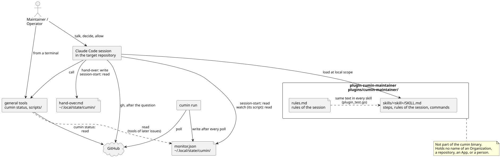

# Maintainerのセッションにskillを入れる

cuminと並んで働くMaintainerやOperatorのClaude Codeのセッションに、cuminとの働き方を教えるplugin `cumin-maintainer` の、インストールと更新の手順。cuminがAgentに渡すskill ([Agentの実行の設計](../designs/agent-run.md)) とは別のものである。cuminは、このpluginを読まない。

## pluginとは何か



図の元ファイル: [maintainer-skills.puml](maintainer-skills.puml)

| 部分 | 場所 | 役目 |
|---|---|---|
| セッション | 対象のリポジトリで起動したClaude Code | Maintainerと話し、skillの手順に従う |
| plugin | cumin-worksのリポジトリの `plugins/cumin-maintainer/` | skillと、全てのskillが繰り返すセッションの決まり (`rules.md`) を持つ。skillは、自分のスクリプトを、自分のディレクトリに持てる |
| 一般の道具 | `cumin status` と `scripts/` | Claude Codeなしでも端末から使える。skillは道具を呼ぶだけで、自分の手順を足さない。今ある道具は `cumin status` で、Hostの設定とGitHubを読む |
| モニターファイル | `~/.local/state/cumin/monitor.json` | `cumin run` が書く。今は、このファイルを読む道具がまだない。cuminのコードも読まない。待つIssueや最後の定期確認を、GitHubに問い合わせ直さずにこのファイルから読む道具 (図の点線の矢印) は、あとのIssueで `scripts/` に加わる ([モニターファイルとメニューバーのアプリの設計](../designs/status-menu-bar.md)) |

- cumin-worksのリポジトリが、そのままpluginのmarketplaceである。`.claude-plugin/marketplace.json` が、marketplaceの名前 `cumin-works` と、pluginの場所を相対パスで持つ。
- pluginは、1つのOrganizationの事実 (Organization、リポジトリ、App、人の名前) を持たない。対象のリポジトリは、セッションを起動した場所で決まる。
- 全てのskillは、同じ「セッションの決まり」と、自分が実行するコマンドの一覧を持つ。テスト (`plugins/cumin-maintainer/plugin_test.go`) が確かめる。

## セッションの決まり

`plugins/cumin-maintainer/rules.md` にある。3つの部分からなる。

| 部分 | 中身 |
|---|---|
| cuminの代わりに動かない | cuminが実装できるIssueを実装しない。Maintainerなしで要件の内容を変えない。許された範囲の外を承認しない。Claude Codeの権限の確認が断ったら止まり、別の方法を探さない |
| 話し方 | Maintainerの言語で話す。IssueやPull Requestは、最初に出すときに短い意味を添える。複数あるときは、要求Issue、sub-issue、Pull Requestの木を先に示す。判断の依頼は、選択肢と推奨を付けて短くする。自分の間違いは、何をしたかと合わせて、はっきり言う |
| 聞いてから行う | GitHubに記録が残る操作と、Hostを変える操作は、行う前に聞く。Maintainerが会話の中で許したものだけ、聞かずに行う |

## 今あるskill

| skill | 呼び方 | すること |
|---|---|---|
| `acceptance-leftovers` | `/cumin-maintainer:acceptance-leftovers` | 受け入れの確認のコメントに残った作業を、1つずつ、sub-issue、backlog、調査・実測で確定した制約の一覧、新しい要求Issueのどれかに振り分ける |
| `decision-request` | `/cumin-maintainer:decision-request` | `cumin/status/awaiting-decision` のIssueの判断依頼か、cuminが止めた理由のコメントを1つ読み、2種類に分ける。要件も方針も範囲も変えない、運用か技術の質問には、`templates/decision-request.md` が求める形 (止まったIssueへのコメント、そのあと `cumin/status/ready`) で答える。答えるのは、セッションが許された範囲の中か、Maintainerの言葉があるときだけである。それ以外の質問と、どちらか分からない質問は、GitHubに何も書かず、質問、選択肢、推奨をMaintainerに渡す |
| `merge-decision` | `/cumin-maintainer:merge-decision` | mergeの判断を待つPull Requestを1つ確かめて、決まった形で報告する。スクリプト `check-pull-request.sh` が、先頭のコミットへの承認、必須のcheck、保護されたパスの変更を、GitHubから1回読んで確かめる。差分はテスト以外を全部読む。承認は、Pull Requestの番号を入れた決まった質問のあとか、セッションが許された範囲の中だけで、1つずつ行う |

### `merge-decision` のスクリプト

`plugins/cumin-maintainer/skills/merge-decision/check-pull-request.sh <owner>/<repo> <number>` は、端末からも使える。GitHubを読むだけで、待たず、何も書かない。

| 終了コード | 意味 |
|---|---|
| 0 | Pull Requestが開いていてdraftではなく、先頭のコミットに承認 (`APPROVED`) があり、先頭のコミットに変更の依頼 (`CHANGES_REQUESTED`) がなく、必須のcheckが全て `success` である |
| 1 | まだ判断できない。最後の行が理由を言う: Pull Requestが開いていないかdraftである、承認が古いコミットにある、先頭のコミットに変更の依頼がある、checkが取り消された (`cancelled`)、待っている (`queued`)、飛ばされた (`skipped`)、報告がない、必須のcheckが1つもない |
| 2 | 引数が違う。または、`gh` の読み取りが失敗したか、空だった。何も判断しない |
| 124 | 制限時間 (60秒。環境変数 `CUMIN_CHECK_TIME_LIMIT` で秒数を変える) が来た。何も判断しない |

- 必須のcheckは、cuminと同じく、baseのブランチのrule (`GET /repos/{owner}/{repo}/rules/branches/{branch}`) から読む。Appを指定したruleは、そのAppのcheck runだけが満たす。
- レビューは、cuminと同じく、書いた人ごとに、`APPROVED` か `CHANGES_REQUESTED` の最新のものだけを数える。承認のあとに同じ人が変更を依頼すると、承認は数えない。誰の承認でも数えるので、skillは、承認した人を報告に書く。
- 読み取りの最後に、先頭のコミットをもう1回読む。途中でpushがあると、終了コード2で終わる。
- cuminとGitHubは、飛ばされたcheck (`skipped`) と `neutral` のcheckを通ったと数える。このスクリプトは数えない。人が見る前に、理由を確かめるためである。
- 保護されたパスは、既定のブランチの `.cumin/config.toml` から読む。照合の決まりは、`cumin-protected-paths` のcheckと同じである。ただし、大文字と小文字を同じに扱うのはASCIIの文字だけで、Unicodeの正規化はしない。保護されたパスの変更は、一覧に出すだけで、終了コードを変えない。
- 要るものは、`gh` と標準の道具 (`sh`、`awk`、`grep`、`sed`、`sort`、`mktemp`、`sleep`) だけである。
- テスト (`plugins/cumin-maintainer/merge_decision_test.go`) は、偽の `gh` を `PATH` に置いてスクリプトを動かす。

## インストールする

必要なもの: Claude Code v2.1.275 以降 (`claude --version`)。cumin-worksのリポジトリをcloneできるgitの認証。

対象のリポジトリで `claude` を起動し、セッションの中で次を実行する。

```text
/plugin install cumin-maintainer --marketplace cloveclovedev/cumin-works
```

1. Claude Codeが、marketplaceの出どころ (`<owner>/<repository>` の形のGitHubのリポジトリ) を示して、足してよいかを聞く。確かめて進める。
2. pluginの詳細が開く。scopeに「Install for you, in this repo only (local scope)」を選ぶ。
3. 最後の行が `Plugin is now active.` なら、すぐ使える。`Run /reload-plugins to apply.` なら、Claude Codeが読み込み直す。
4. `/` を打ち、`/cumin-maintainer:acceptance-leftovers` が出ることを確かめる。

### scopeの選び方

| scope | 効く範囲 | 書き込む設定 | このガイドの扱い |
|---|---|---|---|
| local | 自分の、このリポジトリのセッションだけ | `.claude/settings.local.json` | 既定。同じアカウントのほかのセッションにskillが出ない |
| project | このリポジトリで働く全員 | `.claude/settings.json` (コミットする) | Maintainerの全員がskillを使いたいリポジトリで選ぶ |
| user | 自分の、このマシンの全てのプロジェクト | `~/.claude/settings.json` | 勧めない。cuminと関係のないセッションにもskillが出る |

- project scopeの `.claude/settings.json` は、cuminの保護されたパス (`.claude/`) にあるので、Agentは変えられない。Maintainerが手でコミットする。コミットしても、ほかの人のマシンにpluginは入らない。それぞれが `claude plugin install cumin-maintainer@cumin-works --scope project` を1回実行する。
- skillを `~/.claude/skills/` にコピーしない。そこに置いたskillは、そのマシンの全てのプロジェクトで読み込まれる。このリポジトリには、そのためのスクリプトもない。

## 更新する

公式ではないmarketplaceは、自動の更新が初めは切ってある。新しいskillが入ったら、端末で次を実行する。

```sh
claude plugin update cumin-maintainer@cumin-works
```

- 動いているセッションは、読み込んだ版のままである。`/reload-plugins` を実行するか、セッションを起動し直す。
- `plugin.json` は `version` を持たない。そのため、cumin-worksのmainのコミットが進むたびに、更新が新しい版を取る。
- 自動の更新にするには、セッションで `/plugin` を開き、Marketplaces の `cumin-works` で「Enable auto-update」を選ぶ。

## 外す

| したいこと | 方法 |
|---|---|
| pluginを一時的に切る | `claude plugin disable cumin-maintainer@cumin-works` |
| pluginを外す | `claude plugin uninstall cumin-maintainer@cumin-works --scope local` |
| marketplaceごと外す | `claude plugin marketplace remove cumin-works`。そこから入れたpluginも外れる |

## 確かめた公式の文書

Claude Codeの公式の文書 (https://code.claude.com/docs/) を、2026-10-09に読んだ。

| ページ | 読んだこと |
|---|---|
| Extend Claude with skills | skillは `SKILL.md` を持つディレクトリである。front matterの `name` と `description`。pluginのskillは `<plugin>/skills/<skill>/SKILL.md` に置き、`/<plugin>:<skill>` で呼ぶ。`~/.claude/skills/` のskillは、そのマシンの全てのプロジェクトで読み込まれる |
| Plugins overview | pluginは `.claude-plugin/plugin.json` を持つディレクトリである。`.claude-plugin/marketplace.json` を持つリポジトリがmarketplaceである。有効なpluginは、skillの名前と説明を毎回の文脈に足す |
| Install and manage plugins | 3つのscopeと、それぞれが書き込む設定のファイル。`/plugin install <name> --marketplace <owner>/<repository>` (v2.1.275 以降)。`claude plugin update <plugin>@<marketplace>`。公式ではないmarketplaceの自動の更新は、初めは切ってある |
| Create a marketplace | `marketplace.json` は `name`、`owner`、`plugins` が必須である。相対パスの `source` は、`.claude-plugin/` を持つディレクトリから書く。項目の名前と `plugin.json` の名前を同じにする |
| Host and maintain a marketplace | `version` を持たないpluginは、コミットを追う。`version` を持つpluginは、その文字列が変わるまで更新されない |

実機では、`claude plugin validate .` と `claude plugin validate ./plugins/cumin-maintainer` が通ることを確かめた。`version` と `author` がないという警告が出る。`version` は上の理由で、`author` は1つのOrganizationの事実を持たないために、書いていない。対象のリポジトリへの実際のインストールは、Maintainerが1回行って確かめる。
