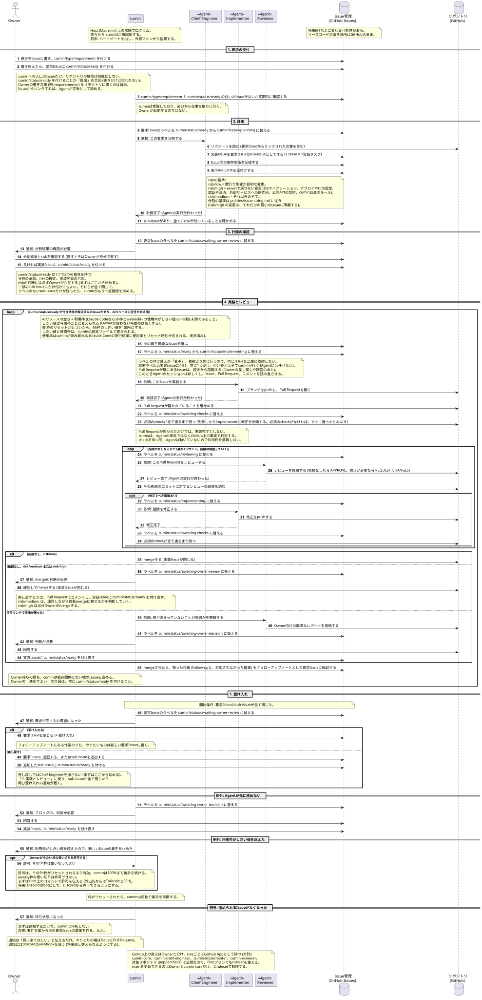

# cumin works v2 要求仕様書

## 解決したい課題

AIリソースを持ってはいるが、稼働していない時間も多い。時間あたりの成果を最大化したい

(個人的な課題) 昨年個人事業主としてclovecloveを立ち上げたが、本業も忙しくなかなか個人事業主としての成果を出せない。個人事業主の成果(webサービスやモバイルアプリ、ゲーム)だったり、ゆくゆくはSNSや身の回りのtodoもAI協調してできるだけ自動で成果を生む基盤を作りたい

(個人的な課題) 本業のタスクが多く自由時間が足りないので、AIが自律的に進められるタスクを増やす

### 課題を阻害する原因

1. 個人のモチベーションがAIリソースを使い始めるトリガーになっている
2. 自動化されたトリガー(時間起動など)が直接成果物に結びつくAIリソースの使い方をするのが難しい

## cumin-worksの目的
できる限り成果物オーナーの負担を減らしながら、AIリソースを使って時間あたりの成果を最大化するワークフローを提供する

## cumin-worksの指標

- 稼働率: claude codeの5h, weekly利用枠およびcodexのweekly利用枠を8~9割利用する
  - 残り1~2割はOwner作業で使うため残す
- 成果: 時間あたりにmergeされたissue数や受け入れられた要求数

## 登場人物

- Owner: 成果物の責任を持つ。現状は人間が担当する
- Human: 人間の作業者。Ownerも含む
- Agent: AI Agent

## Agent Role (現時点)

- Planner: Ownerの記載した要求を1実装タスク単位のIssueに分割する。Issueの依存関係を整理する。Issueのマージriskを仮付けする
- Implementer: Issueの内容を実装する
- Reviewer: Issueに対する実装(Pull Request)をレビューする

## 技術的な登場人物

- cumin: 本プロダクトが提供するAIリソース最大化協調ワークフロー基盤
- Host: cuminが動作するホストマシン。基本的にはMac miniを想定する。Linux対応は後回しでも良い。Windowsは対応しない。
- cumin user account: Host上でcuminを動かしているユーザアカウント。基本的にこのユーザアカウントに許されている操作はAgentが操作できる範囲となる
- GitHub: 成果物や状態のSource of truth

## GitHub上の登場人物

- Owner: OwnerのGitHubアカウント
- cumin-core: cumin基盤が使うGitHub App。mainへのマージができる。実装Issueのラベルを書き換える
- cumin-planner: Plannerロールが使うGitHub App。Issue関連の読み書き
- cumin-implementer: Implementerロールが使うGitHub App。ブランチをpushできる。Pull Requestが作れる
- cumin-reviewer: Reviewerロールが使うGitHub App。Pull RequestをApproveできる

概念の話で具体的なGitHub App名やRole名は運用組織によって変わる。cloveclovedevは上記名前で運用する

## ワークフロー

メインワークフロー ([main-workflow.puml](workflow/main-workflow.puml)):

## 実装の進め方

- シンプルファースト。常にシンプルに達成できる方法がないかを模索する。AIツールの進化は早い
- 要件ファースト。要件はシンプルに整理されていて、Owner(私)が全て把握できている
- ドキュメントファースト。実装できているところまで第三者に見せられるドキュメントが追従して作られている
- テストファースト。要件に紐づいたテストが整理されて実装されている。大量のユニットテストより、上位要件が実現できているかのテストを重視する

## フェーズ

- v0.1 (2026/10/1): こちらの基盤を使ってpeppercheckという個人事業プロダクトの作り直しを進められるようにする
- v0.2 (2026/11/1): 

## 現時点の制約

- 専用のHostが用意できるまでは、開発機で動かす。
