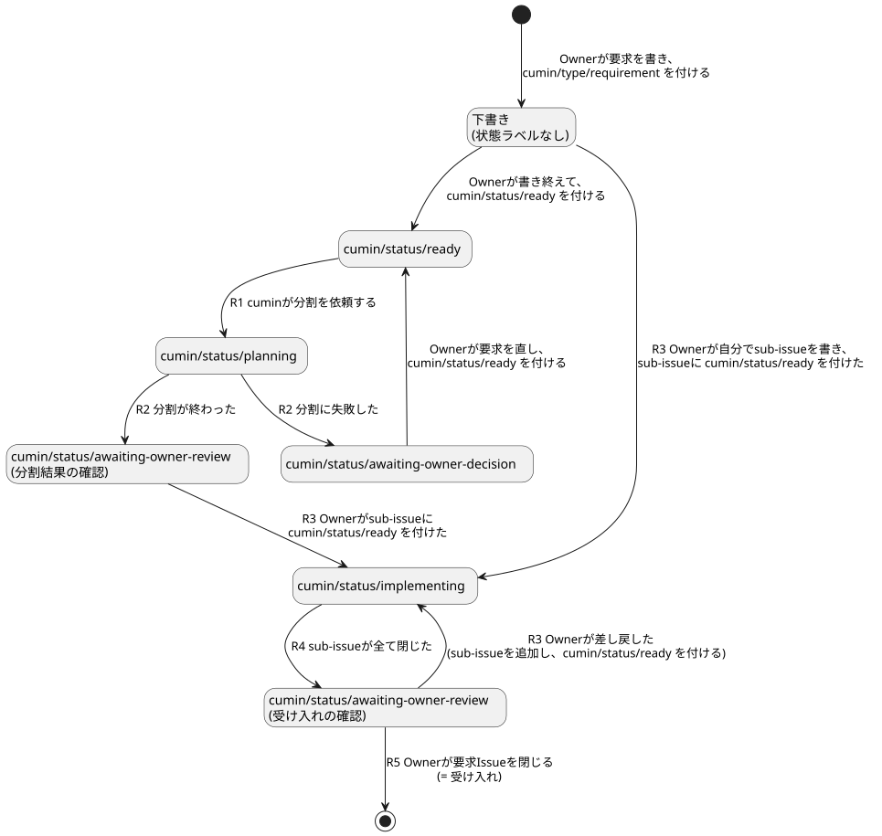
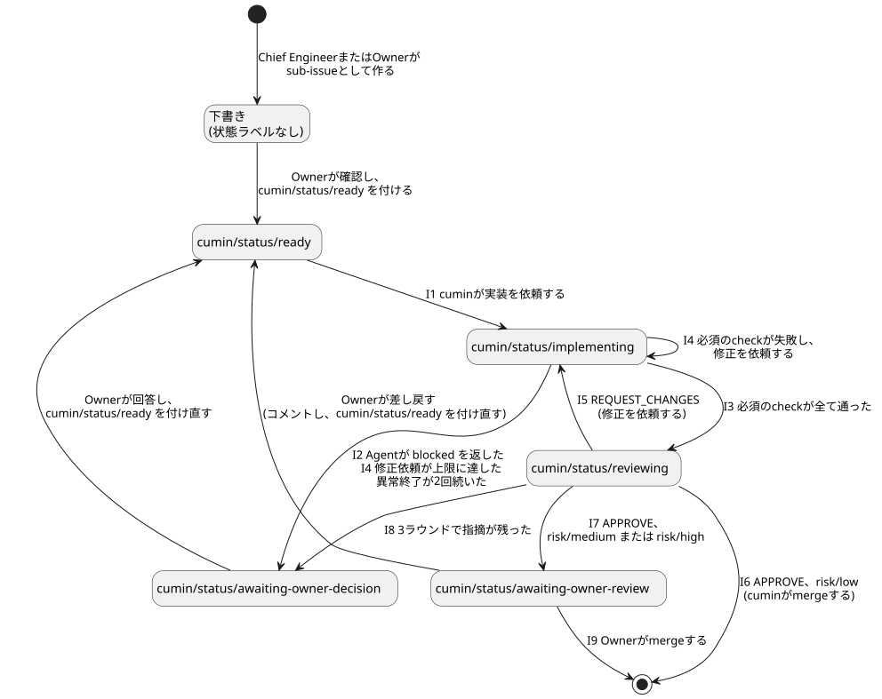

# Issueのラベルと状態遷移

[メインワークフロー](main-workflow.puml) に出てくる要求Issueと実装Issueについて、状態を表すラベルと、状態が移る条件をまとめる。状態が移る条件は、cuminの動作ごとに「何をきっかけに動くか」と「動く前に何を確かめるか」として書く。

cuminの動作のきっかけは、この文書の表を正とする。[cumin本体の要件](../cumin-core.md) と各Agentの要件は、この表の番号を参照する。

## ラベルの一覧

ラベルには3つの種類があり、名前の前半で見分けられる。

- `cumin/type/*`: Issueの種類を表す。今は `cumin/type/requirement` だけで、Issueが要求Issueであることを表す。状態ではないので、閉じるまで付けたままにする。
- `cumin/status/*`: Issueの状態を表す。1つのIssueに常に1つだけ付く。
- `risk/*`: mergeのriskを表す。実装Issueに常に1つだけ付く。

したがって要求Issueには、`cumin/type/requirement` と `cumin/status/*` の2つが付く。

| ラベル | 付く対象 | 意味 | 付ける人 |
|---|---|---|---|
| `cumin/type/requirement` | 要求Issue | これは要求Issueである | Owner |
| `cumin/status/ready` | 実装Issue、要求Issue | Ownerが「進めてよい」と合図した | Owner |
| `cumin/status/planning` | 要求Issue | Chief Engineerが分割している | cumin |
| `cumin/status/implementing` | 実装Issue、要求Issue | 実装Issueでは、Implementerが動いている (修正を含む)。要求Issueでは、sub-issueの実装が進んでいる | cumin |
| `cumin/status/awaiting-checks` | 実装Issue | Implementerの実行が終わり、必須のcheckの完了を待っている。Agentは動いていない | cumin |
| `cumin/status/reviewing` | 実装Issue | Reviewerが作業している | cumin |
| `cumin/status/awaiting-owner-review` | 実装Issue、要求Issue | Ownerが見て承認するのを待っている (分割結果、merge、受け入れ) | cumin |
| `cumin/status/awaiting-owner-decision` | 実装Issue、要求Issue | Agentが先に進めない。Ownerの回答を待っている | cumin |
| `risk/low`、`risk/medium`、`risk/high` | 実装Issue | mergeのrisk。Chief Engineerが仮に付け、Ownerが確定する | Chief Engineer、Owner |

実装Issueであることを表すラベルは作らない。`cumin/type/requirement` の付いたIssueのsub-issueが、実装Issueである。

## 原則

1. きっかけは2種類だけ。cuminがGitHubを定期的に確認して見つけた状態 (定期確認) と、cuminが起動したAgentの実行が終わったこと (実行終了) である。Agentのプロセスはcuminの子なので、終了はcuminにすぐ分かる。
2. Agentの申告では判定しない。GitHub上の事実で判定する。Agentには実行の最後に結果 (`done` か `blocked` か、と理由) を決まった形式で返させるが、`done` は「確かめ始めてよい」という合図でしかない。Pull Requestがあるか、checkが通ったか、レビューが出たかは、cuminがGitHubで確かめる。
3. 着手は、依頼より先にラベルを付け替えることで表す。同じIssueを二重に依頼しない。
4. 状態を表すラベルは1つのIssueに常に1つだけで、付け替えは全てcuminが行う。例外は `cumin/status/ready` で、これだけはOwnerが付ける。

Agentの結果を決まった形式で受け取る手段として、Claude Codeのheadless実行には `--json-schema` がある (公式ドキュメントで確認済み)。

## 要求Issueの状態遷移

図の元ファイル: [requirement-issue-states.puml](requirement-issue-states.puml)

| # | cuminの動作 | きっかけ | 動く前に確かめること | うまくいかないとき |
|---|---|---|---|---|
| R1 | 要求Issueに `cumin/status/planning` を付け、Chief Engineerに分割を依頼する | 定期確認: 開いていて、`cumin/type/requirement` と `cumin/status/ready` が付いた要求Issueがある。sub-issueがあるかどうかは問わない | AIリソースに空きがある | — |
| R2 | 要求Issueのラベルを `cumin/status/awaiting-owner-review` に替え、Ownerに「分割結果の確認が必要」と通知する | 実行終了: Chief Engineerの実行が終わった | sub-issueが1つ以上ある。全てのsub-issueにriskのラベルがちょうど1つ付いている | `cumin/status/awaiting-owner-decision` に替えて通知する。異常終了なら、その前に1回だけやり直す |
| R3 | 要求Issueのラベルを `cumin/status/implementing` に替える | 定期確認: sub-issueのどれかに `cumin/status/ready` が付いた | 要求Issueに状態ラベルがないか、`cumin/status/awaiting-owner-review` が付いている | — |
| R4 | 要求Issueのラベルを `cumin/status/awaiting-owner-review` に替え、Ownerに「受け入れ可能になった」と通知する | 定期確認: sub-issueが全て閉じた | 要求Issueに `cumin/status/implementing` が付いている。sub-issueが1つ以上ある | — |
| R5 | (何もしない。完了) | Ownerが要求Issueを閉じた | — | — |

差し戻しのとき、Ownerはsub-issueを追加して `cumin/status/ready` を付ける。これでR3が再び成り立ち、追加分が閉じるとR4が再び成り立つ。

Ownerは、要求Issueを書き終えたら `cumin/status/ready` を付ける。これでR1が成り立つ。分割に失敗して `cumin/status/awaiting-owner-decision` になったときも、要求Issueを直してから `cumin/status/ready` を付ける。sub-issueが途中まで作られていても、Chief Engineerは既にあるsub-issueを確かめて、同じものを二重に作らない。`cumin/type/requirement` は要求Issueである印なので、外さずに付けたままにする。Ownerの「進めてよい」の合図を、実装Issueと同じ `cumin/status/ready` に揃えるため、この形にしている。

OwnerがChief Engineerを通さずに、自分でsub-issueを書いてもよい。このときOwnerは、要求Issueには `cumin/status/ready` を付けず、sub-issueにだけ付ける。R1は成り立たず、R3が成り立つ。

## 実装Issueの状態遷移

図の元ファイル: [implementation-issue-states.puml](implementation-issue-states.puml)

| # | cuminの動作 | きっかけ | 動く前に確かめること | うまくいかないとき |
|---|---|---|---|---|
| I1 | ラベルを `cumin/status/implementing` に替え、新しいセッションでImplementerに実装を依頼する。Pull Requestが既にあれば、続きから進めるよう依頼する | 定期確認: 開いていて `cumin/status/ready` が付いた実装Issueがある | blocked by のIssueが全て閉じている。AIリソースに空きがある (利用枠がしきい値未満、または使い切りの許可がある) | — |
| I2 | ラベルを `cumin/status/awaiting-checks` に替え、必須のcheckの完了を待ち始める | 実行終了: Implementerの実行が終わり、結果が `done` | このIssueを閉じるPull Requestが開いている。そのPull Requestの作成者が、ImplementerのGitHub Appである。ブランチの先頭のコミットがpushされている | 結果が `blocked`、Pull Requestがない、または作成者が違うなら `cumin/status/awaiting-owner-decision` に替えて通知する。異常終了なら1回だけやり直し、それでも駄目なら同じ扱いにする |
| I3 | ラベルを `cumin/status/reviewing` に替え、Reviewerにレビューを依頼する | 定期確認: `cumin/status/awaiting-checks` の実装Issueで、必須のcheckが、Pull Requestの先頭のコミットで全て通った。必須のcheckが1つもなければ、すぐに通ったとみなす | — | — |
| I4 | ラベルを `cumin/status/implementing` に戻し、失敗したcheckの内容を添えてImplementerに修正を依頼する | 定期確認: `cumin/status/awaiting-checks` の実装Issueで、必須のcheckのどれかが失敗した | checkの修正依頼が上限 (3回) に達していない | 上限に達したら `cumin/status/awaiting-owner-decision` に替えて通知する |
| I5 | ラベルを `cumin/status/implementing` に替え、Implementerに指摘の修正を依頼する | 実行終了: Reviewerの実行が終わった | Reviewerの最新のレビューが、Pull Requestの今の先頭のコミットに対する `REQUEST_CHANGES` である。ラウンドが上限に達していない | レビューが出ていない、または古いコミットに対するものなら、Reviewerに1回だけ依頼し直す |
| I6 | Pull Requestをmergeする | 実行終了: Reviewerの実行が終わった | 最新のレビューが今の先頭のコミットに対する `APPROVE` である。checkが全て通っている。riskが `risk/low` である | mergeできない (衝突など) なら、`cumin/status/implementing` に替えてImplementerに解消を依頼する |
| I7 | ラベルを `cumin/status/awaiting-owner-review` に替え、Ownerに「mergeの判断が必要」と通知する | I6と同じ | I6と同じ。ただしriskが `risk/medium` または `risk/high` である | — |
| I8 | Reviewerに「何が決まっていないことが原因か」の整理を依頼し、レポートが投稿されたら `cumin/status/awaiting-owner-decision` に替えて通知する | 実行終了: Reviewerの実行が終わった | 最新のレビューが `REQUEST_CHANGES` で、ラウンドが上限に達した | — |
| I9 | 残った宿題を、要求Issueにコメントとして転記する。実装Issueはこれで完了 | 定期確認: OwnerまたはcuminがPull Requestをmergeし、GitHubが実装Issueを閉じた | このPull Requestについて、まだ転記していない。`Follow-up` に文章があるか、対応されなかった `(non-blocking)` の指摘がある | — |
| I10 | `blocked_reason` を実装Issueにコメントとして投稿し、ラベルを `cumin/status/awaiting-owner-decision` に替えて通知する。やり直さない | 実行終了: Reviewerの実行が終わり、結果が `blocked` | — | — |

I5〜I8は、Reviewerの結果が `done` のときの動作である。結果が `blocked` のときは、I10に従う。

必須のcheckとは、mainに適用されるrulesetの "Require status checks to pass before merging" に登録されたcheckである。cuminは `GET /repos/{owner}/{repo}/rules/branches/{branch}` でその一覧を読む。

- 一覧が空なら、checkを待たずに進む。
- 一覧が空でなければ、その全てがPull Requestの先頭のコミットで通るまで待つ。
- 「今そのコミットに付いているcheckの一覧」で判定しないのは、pushの直後はcheckがまだ1つも現れておらず、「checkがない」のか「これから現れる」のかを区別できないためである。必須のcheckの一覧は、pushの前から決まっている。

`cumin/status/awaiting-checks` を置くのは、「Implementerの実行が終わり、checkを待っている」ことをGitHubに残すためである。`cumin/status/implementing` のままだと、Implementerが修正の途中なのか、checkを待っているのかを、GitHub上の事実から区別できない。必須のcheckが1つもないリポジトリでも、この状態を必ず通る。次の定期確認で、すぐにI3が成り立つ。

I2〜I4により、「Pull Requestが開かれた」ことは実装完了のきっかけにならない。Implementerの実行が終わり、かつcheckが全て通ったことをcuminが確かめて、初めてレビューに進む。checkの待ち時間にAgentは動いていないので、利用枠を消費しない。

Ownerが `cumin/status/awaiting-owner-review` や `cumin/status/awaiting-owner-decision` のIssueに `cumin/status/ready` を付け直すと、I1が再び成り立つ。cuminは着手のときに、古い状態ラベルを外す。

レビューのラウンドと、checkの修正を依頼した回数は、I1で `cumin/status/ready` から `cumin/status/implementing` に移るたびに0に戻る。Ownerが介入したあとはAgentのセッションも新しくなるので、上限も数え直す。レビューのラウンドは、次の2つのうち新しいほうよりあとに出た、`cumin-reviewer` のレビューの数で数える。実装Issueに最後に `cumin/status/ready` が付いたときと、`cumin-reviewer` が最後に `APPROVE` を出したときである。`APPROVE` のあとで数え直すのは、I6で衝突を解消すると先頭のコミットが変わり、レビューをやり直すことになるためである。どちらもGitHub上の事実なので、cuminは数を手元に持たない。

Implementerが `blocked` を返したとき (I2) は、やり直さずに、1回目から `cumin/status/awaiting-owner-decision` に替える。実装に必要な要件が足りない、という場合が多いためである。Ownerは実装Issueか、その上の要求Issueを書き直して進められる状態にしてから、実装Issueに `cumin/status/ready` を付け直す。Reviewerが `blocked` を返したとき (I10) も、同じ扱いにする。

## Agentのセッションの扱い

- Ownerが介入したあと (`cumin/status/ready` の付け直し) は、Agentのセッションを新しくする。新しいセッションのAgentは、Issue、Pull Request、レビュー、Ownerのコメントを GitHub から読み直して、続きから進める。
- Ownerの介入を挟まない一続きの作業 (I4のcheckの修正、I5の指摘の修正、Reviewerの2ラウンド目以降) は、同じセッションで続ける。
- こうする理由は3つある。書き直される前のIssueを前提にした古い文脈を引きずらない。作業の状態はGitHubにあるので、セッションを捨てても失うものがない。Ownerの対応には時間が空くので、古いセッションを再開すると長い文脈を読み直す分だけ利用枠を余計に使う。

## Issueの状態によらないトリガー

利用枠と待ち状態に関するcuminの動作。

| # | cuminの動作 | きっかけ | 動く前に確かめること |
|---|---|---|---|
| Q1 | 新しい着手 (R1、I1) を止め、Ownerに通知する。実行中のIssueは最後まで進める | 実行終了、または着手の直前の確認: 5h枠またはweekly枠の使用率が、しきい値を超えた | この枠でまだ通知していない |
| Q2 | 着手を再開する | Host上のコマンドで、Ownerが5h枠の使い切りを許可した。許可はその5h枠のリセットまで有効 | weekly枠の使用率がしきい値を超えていない |
| Q3 | 着手を再開する | 定期確認: 枠のリセット時刻を過ぎた | — |
| Q4 | Ownerに「待ち状態になった」と通知する | 定期確認: R1もI1も成り立たず、実行中のAgentもいない | 前回の通知のあとに、cuminが何か動作をした (同じ通知を繰り返さない) |

使用率の読み方:

- 使用率は、Agentの実行結果から読む。加えて、着手 (R1、I1) の直前にも読み直す。同じアカウントの利用枠は、cuminの外 (Ownerの作業など) でも使われるためである。
- 着手の直前に使用率を読み取れなければ、着手せずに、Ownerに通知する。

しきい値の決め方:

- しきい値は時間帯ごとに変えられる。Ownerが使わない時間帯は高くする。
- 5h枠のリセットが近づいたら (初期値は残り30分)、5h枠のしきい値を100%にする。使わなければ消える分を拾うため。
- 使い切りを許可できるのは5h枠だけである。weekly枠のしきい値は、Ownerの許可でも、リセットが近いときの決まりでも超えさせない。
- しきい値、時間帯、「リセットが近い」とみなす残り時間は、cuminの設定ファイルで変えられる。コードに埋め込まない。

## Agentの異常終了

Agentの実行が異常終了したとき (プロセスの失敗、タイムアウトなど) は、同じ依頼を1回だけやり直す。それでも駄目なら `cumin/status/awaiting-owner-decision` に替えてOwnerに通知する。利用枠の上限に当たった場合はやり直しに数えず、枠のリセットを待つ。

## v0.1では実装しないこと

- 辻褄の合わないIssueの回収。cuminが再起動すると、`cumin/status/planning`、`cumin/status/implementing`、`cumin/status/reviewing` のまま、実行中のAgentがいないIssueが残りうる。`cumin/status/awaiting-checks` のIssueは、Agentが動いていない状態なので、再起動のあともI3とI4で続きから進む。将来は、ラベルとcuminの動作状態を突き合わせて、適切な状態まで戻す機能を作る。v0.1では、OwnerがそのIssueに `cumin/status/ready` を付け直せば、I1により続きから再開する。
- mergeの前にmainの最新を取り込んでcheckをやり直すこと。v0.1では、衝突がなく、実装時点の必須のcheckが通っていればmergeする。将来は、rulesetの "Require branches to be up to date before merging" を使う案がある。依存関係のあるIssueは、先のIssueがmergeされてから着手するので、この問題が起きるのは並行して進めた独立のIssueの間だけである。

## まだ確かめていないこと

- `GET /repos/{owner}/{repo}/rules/branches/{branch}` は、公式ドキュメント (permissions-required-for-github-apps) によれば、GitHub Appのtokenで呼べて、要る権限は Metadata: Read-only である。実機では、まだ確かめていない。
