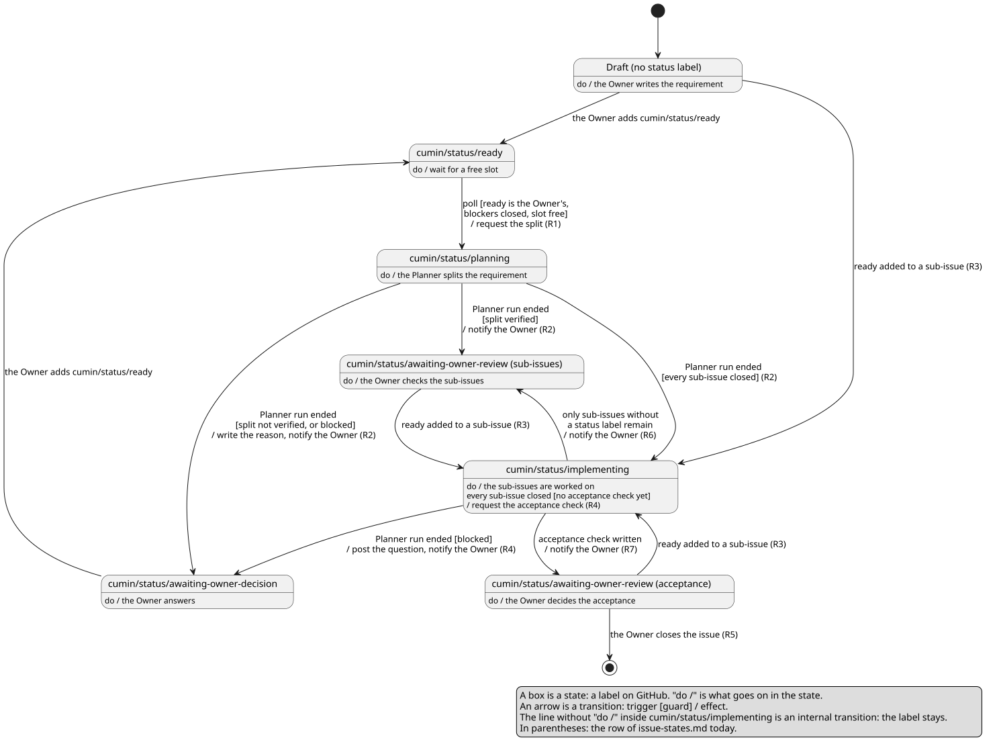
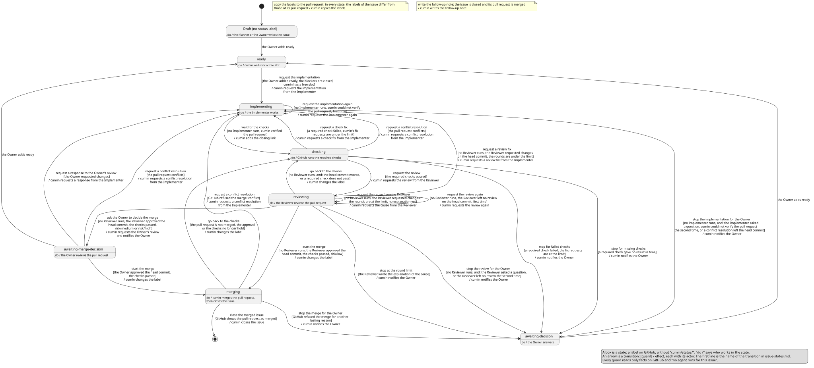
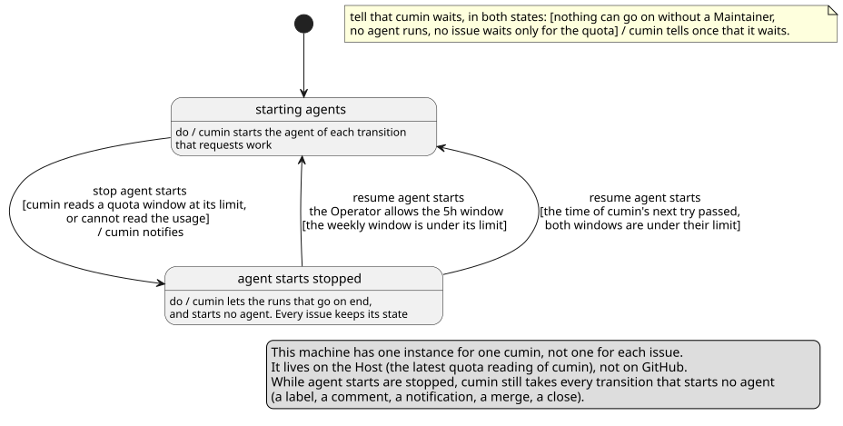
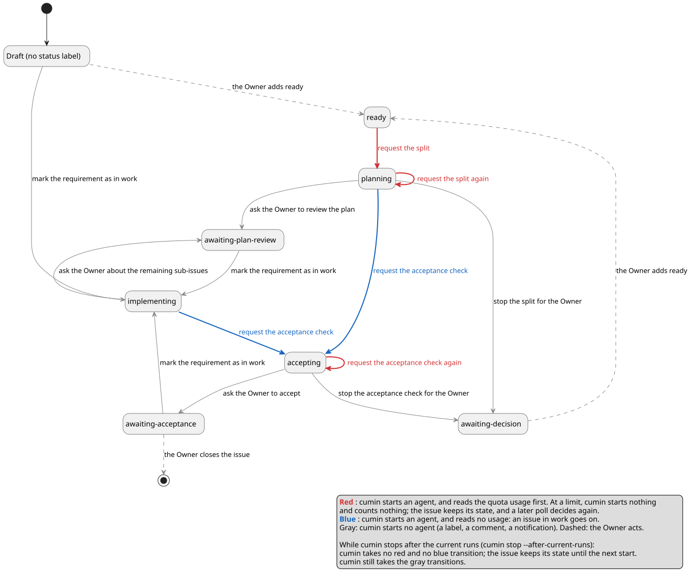
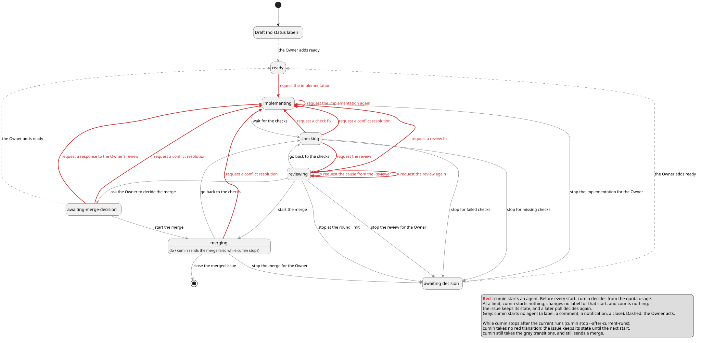

# Issueのラベルと状態遷移

[メインワークフロー](main-workflow.puml) に出てくる要求Issueと実装Issueについて、状態を表すラベルと、状態が移る条件をまとめる。状態遷移図の書き方に合わせて、状態、その状態で進むこと、遷移 (きっかけ、条件、動作) を分けて書く。

cuminの動作は、この文書の表を正とする。[cumin本体の要件](../cumin-core.md) と各Agentの要件は、この表の遷移を名前で参照する。

## ラベルの一覧

ラベルには4つの種類がある。優先度のラベルのほかは、名前の前半で見分けられる。

- `cumin/type/*`: Issueの種類を表す。`cumin/type/requirement` は要求Issue、`cumin/type/owner-task` はMaintainerが手で行う作業のIssueを表す。状態ではないので、閉じるまで付けたままにする。
- `cumin/status/*`: Issueの状態を表す。1つのIssueに常に1つだけ付く。
- `risk/*`: mergeのriskを表す。実装Issueに常に1つだけ付く。
- 優先度のラベル: 着手の順番を表す。名前と順番は、リポジトリの設定で決まる ([cumin本体の要件](../cumin-core.md) の「設定」)。設定がなければ、`cumin/priority/P0` 〜 `cumin/priority/P3` である。付けなくてもよい。決まりは下の「着手の順番」にある。

したがって要求Issueには、`cumin/type/requirement` と `cumin/status/*` の2つが付く。

| ラベル | 付く対象 | 意味 | 付ける人 |
|---|---|---|---|
| `cumin/type/requirement` | 要求Issue | これは要求Issueである | Maintainer |
| `cumin/type/owner-task` | 実装Issue | この作業はMaintainerが手で行う。cuminは着手しない。Implementerが変更できないファイル (保護されたパス、Appの権限で書けないファイル) の変更が要るときに使う | Planner、Maintainer |
| `cumin/status/ready` | 実装Issue、要求Issue | Maintainerが「進めてよい」と合図した | Maintainer |
| `cumin/status/planning` | 要求Issue | Plannerが分割している | cumin |
| `cumin/status/implementing` | 実装Issue、要求Issue | 実装Issueでは、Implementerが動いている (修正を含む)。要求Issueでは、sub-issueの実装が進んでいる | cumin |
| `cumin/status/reviewing` | 実装Issue | Reviewerが作業している | cumin |
| `cumin/status/checking` | 実装Issue | GitHubが必須のcheckを動かしている。Agentは動いていない | cumin |
| `cumin/status/accepting` | 要求Issue | Plannerが、mergeされた結果が要求を満たすかを確かめている | cumin |
| `cumin/status/merging` | 実装Issue | cuminがPull Requestをmergeし、実装Issueを閉じている | cumin |
| `cumin/status/awaiting-plan-review` | 要求Issue | Maintainerが、分割の結果とsub-issueを確かめるのを待っている | cumin |
| `cumin/status/awaiting-merge-decision` | 実装Issue | MaintainerがPull Requestを見て、mergeを決めるのを待っている。MaintainerがGitHubのレビューで承認すると、cuminがmergeする | cumin |
| `cumin/status/awaiting-acceptance` | 要求Issue | Maintainerが、受け入れるか差し戻すかを決めるのを待っている | cumin |
| `cumin/status/awaiting-decision` | 実装Issue、要求Issue | cuminが先に進めない。Maintainerが答えるのを待っている | cumin |
| `risk/low`、`risk/medium`、`risk/high` | 実装Issue | mergeのrisk。Plannerが仮に付け、Maintainerが確定する | Planner、Maintainer |
| 優先度のラベル (初期値は `cumin/priority/P0` 〜 `cumin/priority/P3`) | 要求Issue、実装Issue | 先に着手してほしい順番。`P0` が最も高い | Maintainer |

cuminは、実装Issueの `cumin/status/*` と `risk/*` を、そのIssueを閉じるPull Requestにもコピーする (原則5)。

実装Issueであることを表すラベルは作らない。`cumin/type/requirement` の付いたIssueのsub-issueが、実装Issueである。

この表は、cuminが対象のリポジトリに作るラベルである。

cuminは、足りないラベルを作るだけで、既にあるラベルの色と説明は変えない。色と説明をこの表に合わせるのは、リポジトリの準備のスクリプトである。設定が優先度のラベルを決めていないリポジトリでは、スクリプトは、初期値の優先度のラベルの色と説明も合わせる。設定に書いた優先度のラベルは、Organizationのものなので、スクリプトも変えない。スクリプトは、cuminが以前使っていて今は使わないラベルを見つけたら、実行した人に尋ねてから消す。開いているIssueかPull Requestに付いているラベルは消さない。

## 原則

1. cuminは、GitHub上の事実と、「このcuminが今そのIssueのAgentを動かしているか」だけで、次の動作を決める。同じ事実からは、いつも同じ動作を決める。決める時点は2つある。定期確認と、cuminが起動したAgentの実行が終わった直後である。どちらも同じ決め方をする。実行が終わった直後に決めるのは、次の定期確認を待たないためで、その時点を逃しても (cuminの再起動、GitHubの読み取りの失敗)、次の定期確認が同じ事実から同じ動作を決める。「実行が終わった」という出来事そのものは、条件に使わない。
2. Agentの申告では判定しない。Agentには実行の最後に結果 (`done` か `blocked` か、と理由) を決まった形式で返させるが、`done` は条件に使わない。Pull Requestがあるか、checkが通ったか、レビューが出たかは、cuminがGitHubで確かめる。`blocked` の理由は、cuminがすぐにIssueのコメントとして書く。書いたあとは、そのコメントがGitHub上の事実になる。
3. Agentへの依頼は、依頼より先にラベルを付け替えることで表す。同じIssueを二重に依頼しない。
4. 状態を表すラベルは1つのIssueに常に1つだけで、付け替えは全てcuminが行う。例外は `cumin/status/ready` で、これだけはMaintainerが付ける。cuminは、`cumin-core` かMaintainerが付けた状態ラベルだけを、状態として扱う (「状態ラベルを付けたアカウント」)。
5. 判定に使うのは、Issueのラベルだけである。cuminは、実装Issueの状態とriskのラベルを、そのIssueを閉じるPull Requestにもコピーする (「copy the labels to the pull request」)。コピーしたラベルは、MaintainerがPull Requestの一覧で状態とriskを見分けるためのもので、cuminは読まない。Pull Requestの側でラベルを変えても、cuminがIssueのラベルで上書きする。Maintainerの合図 (`cumin/status/ready`) は、常にIssueに付ける。
6. cuminは、閉じた要求Issueには何もしない。読まず、ラベルを替えず、コメントも書かない。

Agentの結果を決まった形式で受け取る手段として、Claude Codeのheadless実行には `--json-schema` がある (公式ドキュメントで確認済み)。

## 図と表の読み方

- 状態は、ラベルである。図では箱で、`cumin/status/` を省いて書く。箱の中の `do /` は、その状態の間に進むことと、それを誰が行うかである。
- 遷移は、図では矢印である。「きっかけ [条件] / 動作」の形で書く。きっかけを書かない遷移は、条件が成り立ったときに、cuminが定期確認か実行の終わりの直後に動かす。
- 条件と動作には、誰が行うかを必ず書く。cumin、Planner、Implementer、Reviewer、Maintainer、Operator、GitHubのどれかである。遷移の名前には、誰が行うかを入れない。名前は、cuminが何をするかだけを言う。
- 遷移には名前を付ける。名前は、その遷移でcuminが行う動作を、英語で短く言ったものである。ログ、通知、停止のコメント、テストの名前、ほかの文書は、この名前で遷移を指す。同じ動作が別の状態から起きるときは、同じ名前にする。
- 遷移には、番号を付けない。ほかの文書とコードは、遷移をこの表の名前で指す。
- 「Agentが動いていない」とは、このcuminが、そのIssueのAgentの実行を今は持っていないことである。作業が進む状態 (`planning`、`implementing`、`reviewing`、`accepting`) では、Agentが動いている間、cuminはそのIssueを動かさない。

## 状態

状態は、3つの種類に分かれる。名前で見分けられる。

- 人なしで進む状態: 名前が `-ing` で終わる。Agent、GitHub、cuminのどれかが作業している。
- 人の番の状態: 名前が `awaiting-` で始まる。人が動くまで進まない。今は、どれもMaintainerが行う。誰が行うかは、この文書の決まりであり、名前には入れない。
- 順番を待つ状態: `ready`。Maintainerが「進めてよい」と合図し、cuminが空きを待っている。

| 状態 (`cumin/status/` を省く) | 付く対象 | その状態で進むこと |
|---|---|---|
| `ready` | 要求Issue、実装Issue | cuminが空きを待つ |
| `planning` | 要求Issue | Plannerが要求を分割する |
| `awaiting-plan-review` | 要求Issue | Maintainerが、分割の結果とsub-issueを確かめる |
| `implementing` | 要求Issue | Agentがsub-issueを進める。要求Issueそのものには、誰も作業しない |
| `accepting` | 要求Issue | Plannerが、mergeされた結果が要求を満たすかを確かめる |
| `awaiting-acceptance` | 要求Issue | Maintainerが、受け入れるか差し戻すかを決める |
| `implementing` | 実装Issue | Implementerが作業する (修正を含む) |
| `checking` | 実装Issue | GitHubが必須のcheckを動かす |
| `reviewing` | 実装Issue | ReviewerがPull Requestをレビューする |
| `awaiting-merge-decision` | 実装Issue | MaintainerがPull Requestを見て、mergeを決める |
| `merging` | 実装Issue | cuminがPull Requestをmergeし、実装Issueを閉じる |
| `awaiting-decision` | 要求Issue、実装Issue | Maintainerが答える。cuminが先に進めない理由は、Issueのコメントにある |

- 状態ラベルのないIssue (下書き) は、cuminが扱わない。

## 状態ラベルを付けたアカウント

cuminは、状態から動作を決める。GitHubでは、triageの権限でもラベルを付けられるので、状態ラベルを付けられる人は誰でも、cuminを動かせることになる。そこで、cuminは、今付いている状態ラベルを最後に付けたアカウントを確かめる。

| 状態ラベル | 数えるのは、誰が付けたときか |
|---|---|
| `cumin/status/ready` | Maintainer ([cumin本体の要件](../cumin-core.md) の「Maintainer、Issue Owner、Operator」)。Maintainerの「進めてよい」の合図だからである |
| ほかの全ての状態ラベル | `cumin-core` のGitHub Appか、Maintainer。付け替えはcuminが行うものだが、Maintainerが手で直すことがあるためである |

- 数えないアカウントが付けた状態ラベルでは、cuminは何もしない。Agentを起動せず、mergeせず、ラベルも替えない。ログに1回だけ残し、1回だけ通知する。同じラベルについて、定期確認のたびに繰り返さない。
- そのIssueは、Maintainerが正しいラベルを付け直すまで進まない。待ち状態の通知 (「tell that cumin waits」) では、「Maintainerなしで進めるIssue」に数えない。
- 付けたアカウントは、GitHubがIssueのタイムラインに残すラベルのイベントから読む。cuminが確かめるのは、その状態から動作を起こす前である。どの時点で読むかと、そのコストは、設計メモで決める。

## 要求Issueの状態遷移

図の元ファイル: [requirement-issue-states.puml](requirement-issue-states.puml)

| 名前 | 前の状態 → 次の状態 | きっかけと条件 | cuminの動作 |
|---|---|---|---|
| request the split | `ready` → `planning` | 最新の `ready` を付けたのがMaintainerである (「状態ラベルを付けたアカウント」)。要求Issueの blocked by のIssueが全て閉じている。cuminに空きがある。sub-issueがあるかどうかは問わない | Plannerに分割を依頼する |
| ask for the plan review | `planning` → `awaiting-plan-review` | Plannerが動いていない。分割が確認を通る (sub-issueが1つ以上あり、全てのsub-issueにriskのラベルがちょうど1つ付いている)。開いているsub-issueがある | 「分割結果の確認が必要」と通知する |
| request the acceptance check | `planning` → `accepting` | Plannerが動いていない。分割が確認を通る。sub-issueが全て閉じている | Plannerに受け入れの確認を依頼する。通知しない |
| stop the split | `planning` → `awaiting-decision` | Plannerが動いていない。次のどちらかである。Plannerの質問のコメントが、`planning` になったあとに書かれている。または、分割が確認を通らず、「request the split again」を1回済ませている | 質問でなければ、理由をコメントに書く。通知する |
| request the split again | `planning` → `planning` | Plannerが動いていない。分割が確認を通らない。Plannerの質問のコメントがない。この `planning` の間に、まだ依頼し直していない | Plannerに分割をもう一度依頼する。Plannerは、既にあるsub-issueを確かめて、同じものを二重に作らない |
| mark the requirement as in work | `awaiting-plan-review` → `implementing`、`awaiting-acceptance` → `implementing`、状態ラベルなし → `implementing` | Maintainerが、sub-issueのどれかに `ready` を付けた。要求Issueに状態ラベルがあるときは、その `ready` が、要求Issueが今の状態になったあとに付いている | ラベルを替える |
| request the acceptance check | `implementing` → `accepting`、`awaiting-plan-review` → `accepting` | sub-issueが1つ以上あり、全て閉じている。最後のsub-issueが閉じたあとに書かれた受け入れの確認のコメントが、まだない。閉じたsub-issueのフォローアップノート (「write the follow-up note」) を書き終えている。cuminに空きがある | Plannerに受け入れの確認を依頼する |
| ask about the remaining sub-issues | `implementing` → `awaiting-plan-review` | 開いているsub-issueが1つ以上あり、その全てに状態ラベルがない | 「残りのsub-issueの確認が必要」と通知する |
| ask for the acceptance | `accepting` → `awaiting-acceptance` | 最後のsub-issueが閉じたあとに書かれた、受け入れの確認のコメントがある | 「受け入れ可能になった」と通知する |
| request the acceptance check again | `accepting` → `accepting` | Plannerが動いていない。受け入れの確認のコメントも、Plannerの質問のコメントもない。この `accepting` の間に、まだ依頼し直していない | Plannerに受け入れの確認をもう一度依頼する |
| stop the acceptance check | `accepting` → `awaiting-decision` | Plannerが動いていない。次のどちらかである。Plannerの質問のコメントが、`accepting` になったあとに書かれている。または、受け入れの確認のコメントがなく、「request the acceptance check again」を1回済ませている | 質問でなければ、理由をコメントに書く。通知する |
| — | `awaiting-acceptance` → 完了 | Maintainerが要求Issueを閉じた | 何もしない |
| — | `awaiting-decision` → `ready`、状態ラベルなし → `ready` | Maintainerが `ready` を付けた | 何もしない。次に「request the split」が成り立つ |

- 「request the split again」と「request the acceptance check again」の「依頼し直した回数」は、Hostの状態ファイルに持つ。失っても、依頼が1回増えるだけである ([cumin本体の要件](../cumin-core.md) の「状態の持ち方」)。
- 「request the acceptance check」は、空きを待つ。sub-issueが全て閉じた要求Issueが `implementing` のまま残っているときは、受け入れの確認の順番を待っている。

差し戻しのとき、Maintainerはsub-issueを追加して `cumin/status/ready` を付ける。これで「mark the requirement as in work」が再び成り立ち、追加分が閉じると「request the acceptance check」が再び成り立つ。前の受け入れの確認のコメントは、追加分が閉じるより前に書かれたものなので、Plannerがもう一度確かめる。

受け入れの確認は、sub-issueを全て合わせたmainの上で、要求Issueの Requirements が満たされているかを、Plannerが1項目ずつ確かめることである。Pull Requestは1つずつしか検証されないので、全体を確かめる人がほかにいない。分割が正しいことは、Maintainerが分割結果の確認で見ている。受け入れの確認は、その分割を前提にして、まとめた結果が1つの振る舞いとして正しいかを見る。

- 受け入れの確認のコメントとは、PlannerのGitHub Appが要求Issueに書いた、`## Acceptance check` で始まるコメントである。形式は [acceptance-check.md](../../../../templates/acceptance-check.md) に従う
- cuminは、コメントがあるかどうかだけを見る。表の結果 (Pass か Fail か) は読まない。Failがあっても、「ask for the acceptance」で `cumin/status/awaiting-acceptance` に替える。差し戻すかどうかは、Maintainerが決める
- 受け入れの確認が済んだかどうかは、コメントの有無というGitHub上の事実で分かる。cuminが途中で止まっても、コメントがなければ「request the acceptance check again」が、あれば「ask for the acceptance」が、次の定期確認で成り立つ
- 「ask about the remaining sub-issues」では、受け入れの確認をしない。sub-issueが全て閉じたときにだけ行う

「mark the requirement as in work」が `cumin/status/ready` の付いた時刻を見るのは、要求Issueを見直す場面のためである。前の分割で `cumin/status/ready` が付いたsub-issueは、cuminが着手するまでそのラベルのまま残る。ラベルの有無だけで判定すると、Maintainerが新しいsub-issueを確認する前に、要求Issueが `cumin/status/implementing` に替わってしまう。ラベルが付いた時刻は、GitHubがIssueのイベントとして記録している。

`cumin/type/owner-task` の付いたsub-issueは、Maintainerが作業を済ませてから閉じる。cuminは、`cumin/status/ready` が付いていても着手しない。それに依存する実装Issueは、blocked by で止まる。Maintainerが閉じ忘れて他のsub-issueが全て閉じると、「ask about the remaining sub-issues」が成り立つ。そのあとMaintainerが閉じて、sub-issueが全て閉じると、`cumin/status/awaiting-plan-review` から「request the acceptance check」が成り立つ。Maintainerがラベルを替える必要はない。

Maintainerは、分割結果の確認のとき、一部のsub-issueにだけ `cumin/status/ready` を付けてもよい。それらが全て閉じて、状態ラベルのないsub-issueだけが残ると、「ask about the remaining sub-issues」が成り立ち、cuminがもう一度、確認が要ると通知する。Maintainerが残りを忘れて、要求Issueが黙って止まることを防ぐ。残りのsub-issueが要らなくなったときは、Maintainerがそれを閉じる。全て閉じれば、`cumin/status/awaiting-plan-review` から「request the acceptance check」が成り立つ。

Maintainerは、要求Issueを書き終えたら `cumin/status/ready` を付ける。これで「request the split」が成り立つ。分割に失敗して `cumin/status/awaiting-decision` になったときも、要求Issueを直してから `cumin/status/ready` を付ける。sub-issueが途中まで作られていても、Plannerは既にあるsub-issueを確かめて、同じものを二重に作らない。`cumin/type/requirement` は要求Issueである印なので、外さずに付けたままにする。Maintainerの「進めてよい」の合図を、実装Issueと同じ `cumin/status/ready` に揃えるため、この形にしている。

受け入れの確認でPlannerが質問して `cumin/status/awaiting-decision` になったとき (「stop the acceptance check」) も、Maintainerは答えをコメントに書き、要求Issueに `cumin/status/ready` を付ける。「request the split」が成り立ち、Plannerが要求Issueを読み直す。Requirementsを書き足していれば、Plannerは足りない分のsub-issueを作り、「ask for the plan review」で分割結果の確認に進む。作るものがなければ、sub-issueは全て閉じたままなので、「request the acceptance check」が要求Issueを `cumin/status/accepting` に替え、Plannerがもう一度受け入れを確かめる。要求Issueの `cumin/status/ready` は、いつも「Plannerが要求を読み直す」という1つの意味である。

要求Issueが他の要求Issueに依存するときは、Maintainerが要求Issueどうしに blocked by を張る。先の要求Issueが閉じるまで、「request the split」は成り立たない。先の要求の成果がまだ入っていないmainを読んで、Plannerが分割してしまうことを防ぐ。実装Issueの blocked by は、同じ要求Issueのsub-issueの間だけに張る。

MaintainerがPlannerを通さずに、自分でsub-issueを書いてもよい。このときMaintainerは、要求Issueには `cumin/status/ready` を付けず、sub-issueにだけ付ける。「request the split」は成り立たず、「mark the requirement as in work」が成り立つ。

## 実装Issueの状態遷移

図の元ファイル: [implementation-issue-states.puml](implementation-issue-states.puml)

| 名前 | 前の状態 → 次の状態 | きっかけと条件 | cuminの動作 |
|---|---|---|---|
| request the implementation | `ready` → `implementing` | 最新の `ready` を付けたのがMaintainerである。blocked by のIssueが全て閉じている。cuminに空きがある | 新しいセッションで、Implementerに実装を依頼する。Pull Requestが既にあれば、続きから進めるよう依頼する |
| wait for the checks | `implementing` → `checking` | Implementerが動いていない。Pull Requestが確認を通る (cuminがこのIssueのために決めたブランチに開いていて、作成者がImplementerのGitHub Appで、先頭のコミットがpushされている) | IssueにそのPull Requestを閉じるリンクがなければ、`cumin-core` がリンクを付け、付いたことを読み直して確かめる |
| stop the implementation | `implementing` → `awaiting-decision` | Implementerが動いていない。次のどれかである。Implementerの質問のコメントが、`implementing` になったあとに書かれている。Pull Requestが確認を通らず、「request the implementation again」を1回済ませている。衝突の解消を依頼したあとも、先頭のコミットが依頼の前のままである | 質問でなければ、理由をコメントに書く。通知する |
| request the implementation again | `implementing` → `implementing` | Implementerが動いていない。Pull Requestが確認を通らない。Implementerの質問のコメントがない。この `implementing` の間に、まだ依頼し直していない | Implementerに、続きから進めるよう、もう一度依頼する |
| request the review | `checking` → `reviewing` | 必須のcheckが、Pull Requestの先頭のコミットで全て通った。必須のcheckがなければ、すぐに成り立つ | Reviewerにレビューを依頼する |
| request a check fix | `checking` → `implementing` | 必須のcheckのどれかが失敗した。checkの修正を依頼した回数が、上限 (2回) に達していない | 失敗したcheckの内容を添えて、同じセッションでImplementerに修正を依頼する |
| stop for failed checks | `checking` → `awaiting-decision` | 必須のcheckのどれかが失敗した。checkの修正を依頼した回数が、上限に達している | 通知する |
| request a conflict resolution | `checking` → `implementing`、`awaiting-merge-decision` → `implementing` | GitHubが、Pull Requestを既定のブランチと衝突していると返した (GraphQLの `mergeable` が `CONFLICTING`) | Implementerの直前のセッションで、衝突の解消を依頼する |
| stop for missing checks | `checking` → `awaiting-decision` | checkの待ち時間 ([cumin本体の要件](../cumin-core.md) の「設定」) を過ぎても、必須のcheckのどれかが、先頭のコミットで結果を返していない。実装Issueを閉じる開いているPull Requestがないときも、待ち時間を過ぎたら成り立つ | 「必須のcheckが結果を返さない」と通知する。通知には、先頭のコミット、結果を返していない必須のcheck、待った時間を書く。Pull Requestがないときは、そのことと待った時間を書く |
| request a review fix | `reviewing` → `implementing` | Reviewerが動いていない。Reviewerの最新のレビューが、Pull Requestの今の先頭のコミットに対する `REQUEST_CHANGES` である。ラウンドが上限に達していない | Implementerに、指摘の修正を依頼する |
| start the merge | `reviewing` → `merging` | Reviewerが動いていない。Reviewerの最新のレビューが、今の先頭のコミットに対する `APPROVE` である。必須のcheckが全て通っている。riskが `risk/low` である | ラベルを替える。mergeは `merging` の中で行う |
| ask for the merge decision | `reviewing` → `awaiting-merge-decision` | `reviewing` の「start the merge」と同じ。ただしriskが `risk/medium` または `risk/high` である | Pull Requestに、実装IssueのIssue Ownerのレビューを依頼する。「mergeの判断が必要」と通知する |
| request the cause | `reviewing` → `reviewing` | Reviewerが動いていない。最新のレビューが今の先頭のコミットに対する `REQUEST_CHANGES` で、ラウンドが上限に達している。Reviewerの原因の整理のコメントが、まだない | Reviewerに、「何が決まっていないことが原因か」の整理を依頼する |
| stop at the round limit | `reviewing` → `awaiting-decision` | Reviewerの原因の整理のコメントが、Pull Requestに書かれている | 通知する |
| stop the review | `reviewing` → `awaiting-decision` | Reviewerが動いていない。次のどれかである。Reviewerの質問のコメントが、`reviewing` になったあとに書かれている。今の先頭のコミットにレビューがなく、「request the review again」を1回済ませている。riskのラベルがちょうど1つでない。実装Issueを閉じる開いているPull Requestがない。Pull Requestがないときも、riskのラベルがちょうど1つでなければ、そちらを理由にする | 質問でなければ、理由をコメントに書く。Pull Requestがないときは、そのことを書く。通知する |
| go back to the checks | `reviewing` → `checking` | Reviewerが動いていない。次のどちらかである。レビューの間に、先頭のコミットが変わった。`APPROVE` が出ているが、必須のcheckのどれかが今の先頭のコミットで通っていない | ラベルを替える。古いコミットへのレビューは、ラウンドに数えたまま残る |
| request the review again | `reviewing` → `reviewing` | Reviewerが動いていない。今の先頭のコミットに、Reviewerのレビューがない。Reviewerの質問のコメントがない。この `reviewing` の間に、まだ依頼し直していない | Reviewerにレビューをもう一度依頼する |
| start the merge | `awaiting-merge-decision` → `merging` | Maintainerが出したレビューのうち最新のもの (コメントだけのレビューは除く) が、今の先頭のコミットに対する `APPROVE` である。必須のcheckが全て通っている | ラベルを替える |
| send back for changes | `awaiting-merge-decision` → `implementing` | Maintainerが出したレビューのうち最新のもの (コメントだけのレビューは除く) が、今の先頭のコミットに対する `REQUEST_CHANGES` である。そのレビューは、実装Issueが最後に `awaiting-merge-decision` になったあとに出されている | Implementerの直前のセッションで、Maintainerのレビューへの対応を依頼する |
| close the merged issue | `merging` → 完了 | GitHubが、Pull Requestをmerge済みと返す | GitHubが実装Issueを閉じていなければ、閉じる。フォローアップノートは、「write the follow-up note」が書く |
| go back to the checks | `merging` → `checking` | Pull Requestがmergeされていない。mergeの条件 (下の「`merging` の中でcuminが行うこと」) が成り立たない | ラベルを替える。mergeしない |
| request a conflict resolution | `merging` → `implementing` | mergeの条件は成り立つ。GitHubが、Pull Requestを既定のブランチと衝突していると返した (GraphQLの `mergeable` が `CONFLICTING`)、または、衝突を理由にmergeを断った | mergeは送らずに (断られたあとなら、送り直さずに)、Implementerの直前のセッションで、衝突の解消を依頼する |
| stop the merge | `merging` → `awaiting-decision` | GitHubが、衝突でも、既定のブランチが変わったことでもない、直らない理由でmergeを断った。または、mergeのあとで実装Issueを閉じられない | 理由をコメントに書く。通知する |
| — | `awaiting-merge-decision` → `ready`、`awaiting-decision` → `ready`、状態ラベルなし → `ready` | Maintainerが `ready` を付けた | 何もしない。次に「request the implementation」が成り立つ |

`merging` の中でcuminが行うこと:

- mergeの条件は、`merging` に入ってきた遷移の条件と同じである。必須のcheckが全て通っている。riskのラベルがちょうど1つである。riskが `risk/low` なら、Reviewerの最新のレビューが今の先頭のコミットに対する `APPROVE` である。riskが `risk/medium` または `risk/high` なら、それに加えて、Maintainerが出した最新のレビューが今の先頭のコミットに対する `APPROVE` である。`merging` のラベルが付いていることは、条件の代わりにならない。cuminは、mergeを送るたびに、この条件を確かめ直す。
- Pull Requestがmergeされておらず、mergeの条件が成り立つ間、cuminはmergeを送る。GitHubが衝突していると既に返しているPull Requestには、mergeを送らない。断られると分かっているためである。そのときは「request a conflict resolution」が成り立つ。この依頼はAgentを起動するので、利用枠の上限の間と、cuminを止める途中では待つ。待っている間も、mergeは送らない。mergeの方法は、リポジトリの設定に従う。mergeに渡す先頭のコミットは、承認されたコミットである。承認のあとにpushされたコミットは、mergeしない。
- mergeの答えが届かなかったときも、次の定期確認が、Pull Requestがmerge済みかを読む。merge済みなら「close the merged issue」、そうでなければ、もう一度mergeを送る。同じmergeを2回行うことはない。
- GitHubが「既定のブランチが変わった」(405、Base branch was modified) という理由でmergeを断ったときは、Issueを止めない。`merging` のまま、次の定期確認でもう一度送る。ほかのPull Requestのmergeの直後に起きる、すぐに直る状態だからである。
- 1回の定期確認で2つ以上のPull Requestをmergeするときは、1つmergeするごとに数秒待つ。GitHubが既定のブランチを更新する時間を置くためである。
- cuminが実装Issueを閉じるのは、GitHubが閉じなかったときだけである。2026-09-30から、GitHubは、手で付けたリンクや `addCloseIssueReferences` で付けたリンクのPull Requestをmergeしても、Issueを閉じないことがある。`merging` を出たあとは、cuminは閉じない。Maintainerが開き直したIssueは、開いたままになる。

依頼し直し (「request the implementation again」、「request the review again」) と、質問のコメント:

- 「依頼し直した回数」は、Hostの状態ファイルに持つ。失っても、依頼が1回増えるだけである。
- Agentが `blocked` を返したら、cuminはその理由 (`blocked_reason`) を、すぐにIssueのコメントとして書く。これが「質問のコメント」である。書く前にcuminが止まったときは、コメントがないので、「request the implementation again」か「request the review again」が成り立ち、Agentがもう一度同じ質問を返す。
- Implementerが質問したとき (「stop the implementation」) は、依頼し直さずに、1回目から `cumin/status/awaiting-decision` に替える。実装に必要な要件が足りない、という場合が多いためである。Maintainerは実装Issueか、その上の要求Issueを書き直して進められる状態にしてから、実装Issueに `cumin/status/ready` を付け直す。Reviewerが質問したとき (「stop the review」) も、同じ扱いにする。

「ask for the merge decision」のあと、MaintainerはPull RequestをGitHubのレビューで判断する。

- 承認するときは、今の先頭のコミットに `APPROVE` のレビューを出す。「start the merge」が成り立ち、cuminがmergeする。古いコミットへの承認は数えない。承認のあとにMaintainerが `REQUEST_CHANGES` を出すと、最新のレビューが承認でなくなるので、mergeしない (`merging` に入ったあとなら、「go back to the checks」が成り立つ)。衝突の解消などで新しいコミットがpushされたら、Maintainerはもう一度承認する
- Maintainerの判断を待つ間に、ほかのPull Requestのmergeで衝突したら、Maintainerが承認する前に、「request a conflict resolution」がImplementerに解消させる。解消のあと、Pull Requestの確認 (「wait for the checks」)、必須のcheck、Reviewerのレビュー (「request the review」) を通り、「ask for the merge decision」でもう一度Maintainerの判断を待つ。Maintainerは、mergeできる先頭のコミットだけを判断すればよい
- 衝突した先頭のコミットにMaintainerのレビューがあるときは、そのレビューが先に決める。`REQUEST_CHANGES` なら「send back for changes」が成り立ち、Implementerが指摘に対応する。そのあと、衝突は `cumin/status/checking` の「request a conflict resolution」で解消される。承認なら「start the merge」が成り立ち、`merging` で「request a conflict resolution」が成り立って、Implementerが解消する。GitHubが衝突していると既に返していれば、mergeは送らない。「start the merge」も「send back for changes」も成り立たないIssueだけに、同じ定期確認で「request a conflict resolution」を適用する
- 差し戻すときは、今の先頭のコミットに `REQUEST_CHANGES` のレビューを出す。「send back for changes」が成り立ち、cuminがImplementerに直させる。そのあと、Pull Requestの確認 (「wait for the checks」)、必須のcheck、Reviewerのレビュー (「request the review」) を通り、「ask for the merge decision」でもう一度Maintainerの判断を待つ。Reviewerのレビューのラウンドは、Reviewerの最後の `APPROVE` のあとから数え直すので、差し戻しのあとは1ラウンド目から始まる
- 1つの `REQUEST_CHANGES` で差し戻すのは1回だけである。Maintainerが質問だけをして、Implementerがコミットせずに答えると、先頭のコミットは変わらず、Maintainerの `REQUEST_CHANGES` はそのコミットに残る。「send back for changes」は、実装Issueが最後に `cumin/status/awaiting-merge-decision` になったあとのレビューだけで成り立つので、Issueはそのまま、Maintainerの判断に戻る。Maintainerは答えを読んで、承認するか、もう一度 `REQUEST_CHANGES` を出す
- コメントを書いて実装Issueに `cumin/status/ready` を付けて差し戻すこともできる。「request the implementation」が成り立ち、続きの依頼になる
- 「ask for the merge decision」でcuminがレビューを依頼する相手は、実装IssueのIssue Ownerである ([cumin本体の要件](../cumin-core.md) の「Maintainer、Issue Owner、Operator」)。承認は、どのMaintainerのものでも数える。依頼が失敗しても、Issueを止めない。ログに残すだけにする。Maintainerでないアカウントが付けた `ready` のときは、依頼しない
- Maintainerのうちadminのアカウントは、自分でmergeしてもよい。mainのrulesetを迂回できるのは、adminと `cumin-core` だけだからである ([セットアップの手順](../../development/setup-guide.md))。そのあとの扱いは、cuminがmergeしたときと同じである (「write the follow-up note」)。ただし、GitHubが実装Issueを閉じなければ、Maintainerが閉じる

必須のcheckとは、mainに適用されるrulesetの "Require status checks to pass before merging" に登録されたcheckである。cuminは `GET /repos/{owner}/{repo}/rules/branches/{branch}` でその一覧を読む。

- 一覧が空なら、checkを待たずに進む。
- checkは、結論が `success`、`skipped`、`neutral` のどれかのとき、通ったとみなす。GitHubも、この3つをmergeを止めない結論として扱う。条件で飛ばされたjob (例えば、人が作ったPull Requestでの、保護されたパスのcheck) は、`skipped` になる。
- 一覧が空でなければ、その全てがPull Requestの先頭のコミットで通るまで待つ。
- 「今そのコミットに付いているcheckの一覧」で判定しないのは、pushの直後はcheckがまだ1つも現れておらず、「checkがない」のか「これから現れる」のかを区別できないためである。必須のcheckの一覧は、pushの前から決まっている。

`checking` の行 (「request the review」、「request a check fix」、「stop for failed checks」、「request a conflict resolution」、「stop for missing checks」):

- 1つの定期確認では、「request a conflict resolution」、checkの結果の行 (「request the review」、「request a check fix」、「stop for failed checks」)、「stop for missing checks」の順に判定し、最初に成り立った行だけを動かす
- 「request a conflict resolution」は、`mergeable` が `CONFLICTING` のときだけ成り立つ。GitHubは、Pull Requestに衝突があると `pull_request` のワークフローを動かさないので、衝突したままではcheckがいつまでも結果を返さない。`UNKNOWN` は、GitHubがまだ計算している印である。既定のブランチに何かがmergeされるたびに、開いているPull Requestはしばらく `UNKNOWN` になる。そのため、`UNKNOWN` ではその定期確認で「request a conflict resolution」を判定せず、Maintainerにも回さない。`UNKNOWN` のまま待ち時間を過ぎたら、「stop for missing checks」が成り立つ
- 「request a conflict resolution」は、checkの修正を依頼した回数に数えない。衝突はImplementerの誤りではなく、並行して進むほかのPull Requestのmergeで起きるためである
- 衝突の解消を依頼したあとも、先頭のコミットが依頼の前のままなら、「request a conflict resolution」を繰り返さずに、「stop the implementation」で `cumin/status/awaiting-decision` に替える。先頭のコミットの時刻と、実装Issueに最新の `cumin/status/implementing` が付いた時刻を比べて決める
- 「stop for missing checks」の待ち時間は、実装Issueに最新の `cumin/status/checking` が付いた時刻と、先頭のコミットの時刻 (`committedDate`) の、遅いほうから数える。ふつうは「wait for the checks」が先頭のコミットのpushを確かめてからラベルを替えるので、ラベルの時刻になる。先頭のコミットの時刻が効くのは、待っている間に誰かがブランチにpushしたときである
- 開いているPull Requestがないときは、先頭のコミットがないので、待ち時間はラベルの時刻から数える。checkが来ないのと同じく、どの行もそのIssueを進めないためである
- 「stop for missing checks」は、checkが結果を返さない理由を調べない。ワークフローの誤り、どのワークフローも報告しない必須のcheckの名前、無効にしたワークフロー、GitHub Actionsの障害などがある。cuminは見える事実だけを書き、理由はMaintainerが調べる

`cumin/status/checking` を置くのは、「Implementerの作業が済み、checkが動いている」ことをGitHubに残すためである。`cumin/status/implementing` のままだと、Implementerが修正の途中なのか、checkを待っているのかを、GitHub上の事実から区別できない。必須のcheckが1つもないリポジトリでも、この状態を必ず通る。次の定期確認で、すぐに「request the review」が成り立つ。

Pull Requestの確認 (「wait for the checks」、「stop the implementation」) だけは、Pull Requestをブランチと作成者で見つける。GitHubが本文の `Closes #N` からリンクを作らないことがあるためである (2026-09-30に確かめた)。「wait for the checks」がリンクを付けるので、ほかの行は、IssueとPull Requestのリンクで、そのIssueのPull Requestを見つける。GitHubが既にリンクを作っていれば、cuminは何も付けない。

`implementing` と `checking` の行により、「Pull Requestが開かれた」ことは実装完了の条件にならない。Implementerが動いておらず、かつcheckが全て通ったことをcuminが確かめて、初めてレビューに進む。checkが動いている間、Agentは動いていないので、利用枠を消費しない。

Maintainerが `cumin/status/awaiting-merge-decision` や `cumin/status/awaiting-decision` のIssueに `cumin/status/ready` を付け直すと、「request the implementation」が再び成り立つ。cuminは着手のときに、古い状態ラベルを外す。

レビューのラウンドと、checkの修正を依頼した回数は、「request the implementation」で `cumin/status/ready` から `cumin/status/implementing` に移るたびに0に戻る。Maintainerが介入したあとはAgentのセッションも新しくなるので、上限も数え直す。レビューのラウンドは、次の2つのうち新しいほうよりあとに出た、`cumin-reviewer` のレビューの数で数える。実装Issueに最後に `cumin/status/ready` が付いたときと、`cumin-reviewer` が最後に `APPROVE` を出したときである。`APPROVE` のあとで数え直すのは、衝突を解消すると先頭のコミットが変わり、レビューをやり直すことになるためである。どちらもGitHub上の事実なので、cuminは数を手元に持たない。

## 状態を変えない動作

| 名前 | きっかけと条件 | cuminの動作 |
|---|---|---|
| write the follow-up note | 実装Issueが閉じていて、それを閉じるよう結び付いたPull Requestが、merge済みである。誰が閉じたか (GitHub、cumin、Maintainer) は問わない。フォローアップノートをまだ書いていない | 残った作業を、フォローアップノートとして要求Issueに転記する。実装Issueはこれで完了 |
| copy the labels to the pull request | 実装Issueを閉じる開いているPull Requestのラベルが、実装Issueと違う | Pull Requestの `cumin/status/*` と `risk/*` のラベルを、実装Issueと同じにする |

- 「write the follow-up note」と「copy the labels to the pull request」は、どの状態でも成り立つ。状態を変えない。
- 「write the follow-up note」のフォローアップノートは、1つのPull Requestについて1つだけ書く。

## 着手の順番

空きを使う依頼 (「request the split」、「request the acceptance check」、「request the implementation」) は、同時に進めるIssueの数の上限を分け合う。空きより多くの着手が成り立つときは、次の順に着手する。

1. 優先度の高い順。優先度は、優先度のラベルで表す。ラベルの名前と、高い順の並びは、リポジトリの設定で決まる。
2. 同じ優先度なら、Issueの番号の小さい順。

- 優先度のラベルがないIssueは、どの優先度のラベルが付いたIssueよりもあとに着手する。ラベルのないIssueどうしは、番号の小さい順である。
- 優先度のラベルがない実装Issueは、その要求Issueの優先度を引き継ぐ。Maintainerは、要求Issueに1回付ければよい。実装Issueに優先度のラベルがあれば、そちらを使う。
- 1つのIssueに優先度のラベルが2つ以上付いているときは、高いほうを使う。
- 優先度のラベルを付けるのは、Maintainerである。cuminとAgentは、付けも外しもしない。Pull Requestにもコピーしない。
- 優先度は、着手できるIssueの間の順番だけを決める。blocked by のIssueが開いているIssue、同時に進めるIssueの数の上限、利用枠の上限を越えて着手することはない。実行中のAgentを、優先度の高いIssueのために止めることもない。

## Agentのセッションの扱い

- Maintainerが介入したあと (`cumin/status/ready` の付け直し) は、Agentのセッションを新しくする。新しいセッションのAgentは、Issue、Pull Request、レビュー、Maintainerのコメントを GitHub から読み直して、続きから進める。
- Maintainerの介入を挟まない一続きの作業 (「request a check fix」、「request a review fix」、Reviewerの2ラウンド目以降) は、同じセッションで続ける。
- Maintainerのレビューへの対応 (「send back for changes」) も、Implementerの直前のセッションで続ける。ほぼ出来上がったPull Requestへのコメントを直すことが多く、Issueが書き直されたわけではないので、前の文脈がそのまま役に立つためである
- こうする理由は3つある。書き直される前のIssueを前提にした古い文脈を引きずらない。作業の状態はGitHubにあるので、セッションを捨てても失うものがない。Maintainerの対応には時間が空くので、古いセッションを再開すると長い文脈を読み直す分だけ利用枠を余計に使う。
- 依頼し直し (「request the split again」、「request the acceptance check again」、「request the implementation again」、「request the review again」) は、状態ファイルにセッションがあれば、そのセッションで続ける。なければ、新しいセッションで依頼する

## cumin自身の状態 (Agentの起動)

利用枠に関する動作は、Issueの状態ではなく、cumin自身の状態を変える。cuminの状態は2つで、Hostの手元 (最新の使用率) で決まり、GitHubにはない。

図の元ファイル: [agent-start-states.puml](agent-start-states.puml)

| 状態 | その状態で進むこと |
|---|---|
| Agentの起動を進める | cuminが、Agentに依頼する遷移のたびに、Agentを起動する |
| Agentの起動を止めている | cuminが、どのAgentも起動しない。動いているAgentは、止めずに最後まで動かす。Agentを起動しない遷移 (ラベルの付け替え、コメント、通知、merge、Issueを閉じること) は続ける |

Agentの起動を止めている間、Agentに依頼する遷移は成り立たない。着手 (「request the split」、「request the implementation」) も、実行中のIssueの続きの依頼 (レビュー、checkの修正、指摘の修正、衝突の解消、Maintainerのレビューへの対応、受け入れの確認) も、依頼し直しも同じである。Issueは今の状態のまま残り、ラベルも替わらない。再開したあとの定期確認が、同じ事実から同じ動作を決める。

| 名前 | 前の状態 → 次の状態 | きっかけと条件 | cuminの動作 |
|---|---|---|---|
| stop agent starts | 進める → 止めている | Agentの実行の終わり、またはAgentの起動の前の確認で、5h枠の使用率が今のしきい値以上になった。weekly枠の使用率がペースの上限以上になった。または、Agentの起動の前の確認で使用率を読み取れなかった | 通知する。止めてから再開するまでに、同じ枠について (読み取れなかったときは、そのことについて) 通知するのは1回だけである |
| resume agent starts | 止めている → 進める | Operatorが、Host上のコマンドで5h枠の使い切りを許可した。weekly枠の使用率がペースの上限未満である | Agentの起動を再開する。許可は、その5h枠のリセットまで有効である |
| resume agent starts | 止めている → 進める | 手元に残した使用率から決めた、次に試す時刻を過ぎた。Agentの起動の前の確認で、どちらの枠も上限未満である | Agentの起動を再開する |
| tell that cumin waits | どちらの状態でも (状態は変わらない) | Maintainerが動かなければ何も進まない。次の全てが成り立つときである。実行中のAgentがいない。「request the split」も「request the implementation」も成り立たない。利用枠だけで待っているIssueがない (「stop agent starts」が原因を知らせているためである)。cuminがMaintainerなしで次に進めるIssueがない (下の表)。前回の通知のあとに、cuminが何か動作をした | 「待ち状態になった」と通知する |

「tell that cumin waits」で「cuminがMaintainerなしで次に進めるIssue」に数えるかどうか:

| Issueの状態 | 数えるか | 理由 |
|---|---|---|
| `cumin/status/checking` | 数える。「tell that cumin waits」を出さない | 必須のcheckが終われば、cuminが「request the review」、「request a check fix」、「stop for failed checks」のどれかで進める。衝突すれば「request a conflict resolution」で、checkの待ち時間を過ぎれば「stop for missing checks」で進める |
| `cumin/status/ready` で、着手できるのに、同時に進めるIssueの数の上限だけで待っている | 数える。「tell that cumin waits」を出さない | 空きができれば、cuminが「request the split」か「request the implementation」で着手する |
| `cumin/status/ready` で、blocked by のIssueが開いている | 数えない | 前のIssueが閉じるまで動けない。前のIssueがcuminの作業中なら、そちらが「tell that cumin waits」を止める |
| どの状態でも、Agentへの依頼が利用枠だけで待っている | 数える。「tell that cumin waits」を出さない | 「stop agent starts」が原因を知らせている。枠が戻れば、cuminが依頼する |
| `cumin/status/planning`、`cumin/status/implementing`、`cumin/status/reviewing`、`cumin/status/accepting`、`cumin/status/merging` | 数える。「tell that cumin waits」を出さない | Agentが動いていなくても、次の定期確認で、cuminが事実から次の動作を決める |
| `cumin/status/awaiting-plan-review`、`cumin/status/awaiting-merge-decision`、`cumin/status/awaiting-acceptance`、`cumin/status/awaiting-decision` | 数えない | 人の番である。ただし、sub-issueが全て閉じた `cumin/status/awaiting-plan-review` の要求Issueは数える。cuminが「request the acceptance check」で進める |
| `cumin/type/owner-task`、状態ラベルのないIssue | 数えない | Maintainerが動くまで進まない |

使用率の読み方:

- cuminは、Agentを起動する前に、必ず使用率から決める。着手も、実行中のIssueの続きの依頼も、依頼し直しも同じである。Agentを起動する遷移は、下の「Agentを起動する遷移と、利用枠の確認、cuminを止めるとき」の図の赤い矢印の全部である。
- 上限に達していれば、Agentを起動せず、その起動のためのラベルの付け替えもせず、依頼し直した回数にも数えない。Issueは今の状態のまま残り、あとの定期確認が決め直す。
- 使用率は、Agentの実行結果から読む。同じアカウントの利用枠は、cuminの外 (Operatorの作業など) でも使われるので、手元の使用率が古いときは、起動の前に読み直す。直前のAgentの実行で読んだばかりの使用率があれば、読み直さずにそれを使う。どこまでを「読んだばかり」とするかは、設計で決める。
- 動いているAgentは、利用枠のために止めない。
- 読んだ使用率は、枠ごとのリセット時刻と、読んだ時刻とともに、Hostの状態ファイルに残す。
- 止めている間は、残した使用率から、次にAgentの起動を試みる時刻を決める。その時刻までは、使用率を読むためだけの実行をしない。使用率はリセットまで下がらないので、その時刻より前に上限を下回ることはない。
  - 5h枠が止めているときは、5h枠のリセット時刻と、しきい値が残した使用率を上回る時間帯の始まりのうち、早いほうである。
  - weekly枠が止めているときは、ペースの上限が残した使用率を上回る時刻と、weekly枠のリセット時刻のうち、早いほうである。
  - 両方の枠が止めているときは、両方の時刻のうち、遅いほうである。
- Agentの起動の前に使用率を読み取れなければ、起動せずに、通知する。次の定期確認で、読み直す。

上限の決め方:

- 5h枠の上限は、時間帯ごとのしきい値である。Operatorが使わない時間帯は高くする。どの時間帯にも入らない時刻には、初期のしきい値を使う。5h枠は、今の時間帯にOperatorの分を残すために使う。
- weekly枠の上限は、ペースの上限 = 目標 × min(1, (経過時間 + 前倒し) ÷ 7日) である。経過時間は、weekly枠のリセット時刻の7日前からの時間である。リセット時刻は使用率を読むたびに受け取り、設定には持たない。weekly枠に時間帯はない。
- 使い切りを許可できるのは5h枠だけである。許可があると、その5h枠のリセットまで、5h枠のしきい値を100%とする。weekly枠のペースの上限は、Operatorの許可でも上がらない。
- しきい値、時間帯、目標、前倒しは、cuminの設定ファイルで変えられる。コードに埋め込まない。

## Agentを起動する遷移と、利用枠の確認、cuminを止めるとき

上の2つの状態遷移図の遷移を、2つに色分けした図である。状態と遷移は同じで、遷移は名前だけを書く。利用枠の確認と、`cumin stop --after-current-runs` で止めるときの動作に、抜けがないかを見るために使う。

図の元ファイル: [requirement-issue-agent-starts.puml](requirement-issue-agent-starts.puml)、[implementation-issue-agent-starts.puml](implementation-issue-agent-starts.puml)

| 色 | 遷移 | 利用枠 | 止めるとき (`cumin stop --after-current-runs`) |
|---|---|---|---|
| 赤 | Agentを起動する。着手、実行中のIssueの続きの依頼、依頼し直しの全部である | 起動の前に、使用率から決める。上限なら、起動せず、ラベルも替えず、依頼し直した回数にも数えない。Issueは今の状態のまま残り、あとの定期確認が決め直す | 遷移しない。Issueは今の状態のまま残り、次の起動のあとの定期確認が決める |
| 灰 | Agentを起動しない (ラベルの付け替え、コメント、通知、Issueを閉じること) | 関係しない。上限に達していても、遷移する | 遷移する。`merging` の中のmergeも送る |

- 赤い矢印が、Agentを起動する遷移の全部である。利用枠の確認と、止めるときの確認は、この全部が通る1か所で行う。新しい種類の依頼を足しても、確認なしでAgentを起動することはできない。
- 破線は、Maintainerの操作である。cuminが止まっていても、Maintainerは操作できる。cuminは、次の起動のあとの定期確認で、その結果を読む。

## Agentの異常終了と、結果を残さなかった実行

- Agentの実行が異常終了したとき (プロセスの失敗、タイムアウトなど) も、Agentが結果をGitHubに残さずに終わったときも、cuminの再起動でAgentの実行が切れたときも、扱いは同じである。GitHubを読めば、結果があるかどうかが分かる。結果がなければ、依頼し直しの遷移 (「request the split again」、「request the acceptance check again」、「request the implementation again」、「request the review again」) が成り立ち、同じ依頼を1回だけやり直す。それでも結果がなければ、`cumin/status/awaiting-decision` に替えて通知する。
- 利用枠の上限に当たった場合は、やり直しに数えず、枠のリセットを待つ (「cumin自身の状態 (Agentの起動)」)。
- Agentの実行のあとで、GitHubの呼び出しが一時的な理由で失敗したときは、cuminは何も持っておかない。Issueは今の状態のまま残り、次の定期確認が、同じ事実から同じ動作を決める ([cumin本体の要件](../cumin-core.md) の「GitHubの呼び出しの失敗」)。

## 実装しないこと

- mergeの前にmainの最新を取り込んでcheckをやり直すこと (「start the merge」)。衝突がなく、実装時点の必須のcheckが通っていればmergeする。将来は、rulesetの "Require branches to be up to date before merging" を使う案がある。依存関係のあるIssueは、先のIssueがmergeされてから着手するので、この問題が起きるのは並行して進めた独立のIssueの間だけである。
- 同じリポジトリを、2つのcuminが同時に動かすこと。「Agentが動いていない」は、1つのcuminの中の事実である。

## まだ確かめていないこと

- `GET /repos/{owner}/{repo}/rules/branches/{branch}` は、公式ドキュメント (permissions-required-for-github-apps) によれば、GitHub Appのtokenで呼べて、要る権限は Metadata: Read-only である。実機では、まだ確かめていない。
